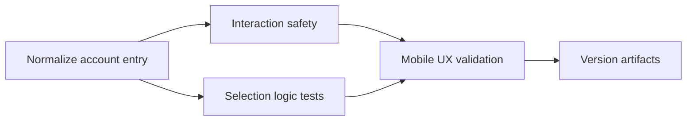

# 062 — Profile Menu Fix

| Field | Value |
|-------|-------|
| Plan ID | 062 |
| Target Release | v0.9.2 |
| Version Scope | Patch bugfix |
| Epic Alignment | Mobile navigation reliability; early-access to full-access UX continuity |
| Status | Committed for Release v0.9.2 |
| Related Issues | None (reported directly via chat in Session S060) |

## Changelog

| Date | Agent | Change |
|------|-------|--------|
| 2026-03-25T20:58Z | Planner | Promoted Analysis 062 into an implementation-ready plan focused on restoring reliable profile access from mobile bottom navigation without changing global app-launch semantics |
| 2026-03-25T22:20Z | Code Reviewer | APPROVED — CityEarlyAccessNavbar Profile icon addition passes all mandatory checklists; 1 LOW fix-in-review (unused import); 1 LOW visual note risk-accepted; 17 new tests GREEN |
| 2026-03-25T22:26Z | QA | QA Complete — focused regressions, full suite, and type-check passed; local runtime/mobile validation deferred due missing `.env.local` and requires UAT/browser evidence |
| 2026-03-25T22:30Z | UAT | UAT Complete — APPROVED FOR RELEASE; all automated gates pass; 2 MEDIUM deferred manual tap checks (D1/D2) required within 24h of UAT deployment |
| 2026-03-25T21:33Z | DevOps | Committed for Release v0.9.2 — version artifacts aligned from local 0.9.0 to v0.9.2 after Stage 1 pre-flight; deferred follow-ups tracked in `062-open-actions.md` |

## Release Strategy

Standalone (no other known plans for this version).

## Target Release and Versioning

Version pre-flight confirmed the latest released tags already include `v0.9.1`, and `origin/main` currently carries `0.9.1` in `package.json`. Per release discipline, Plan 062 is committed for the next available patch release: `v0.9.2`.

This work should be treated as a patch bugfix rather than a feature release because the requested outcome is to restore expected access to the profile surface from the existing mobile navigation experience, not to introduce a new product capability.

## Value Statement and Business Objective

As a mobile user, I want the profile entry in bottom navigation to respond reliably and remain available across onboarding stage variants, so that I can reach my account or login path without guessing whether the app is in early access or full launch mode.

This supports the roadmap’s master objective by reducing navigation friction in the primary mobile discovery experience; users should not lose a core account entry point simply because their city is still in an early-access stage.

## Objective

Deliver a focused mobile-navigation bugfix that:

1. Restores reliable profile access for all mobile users who are shown a bottom navigation surface.
2. Avoids using `isAppLaunched` as a shortcut bugfix, because changing launch state alters broader early-access behavior well beyond this defect.
3. Makes navigation-state behavior explicit and testable across Stage 1, Stage 2, and Stage 3.
4. Prevents hidden or inactive bottom-nav layers from interfering with taps on the active navigation surface.

## Background

Analysis 060 traced the issue to the current split between `MobileFooterBar` and `CityEarlyAccessNavbar`.

- `MobileFooterBar` includes a Profile destination.
- `CityEarlyAccessNavbar` does not expose Profile at all.
- The active bottom-nav surface depends on authentication state and app stage (`useAppStage`, `shouldShowMobileFooter`, `shouldShowCityEarlyAccessNavbar`).
- The current feature-flag default remains `isAppLaunched: false`, which means many users still flow through stage-based navigation selection.

The user hypothesis suggested globally treating the app as fully launched because the overall catalog size has grown. That would likely mask the bug, but it would also change unrelated stage-gating behavior for every user. The plan therefore treats the missing/unreliable profile access as a navigation contract bug, not as a release-toggle decision.

Plan 044 already hardened the mobile footer slot against invisible interaction blockers. This plan must preserve those guarantees and explicitly validate that only the intended bottom-nav surface is interactive.

## Assumptions

1. Mobile users should have a deterministic account-entry path even when they are unauthenticated and still within early-access stages.
2. Early-access stage behavior remains product-valid; this bugfix must not globally disable stage-based UX.
3. The correct user-facing behavior is “profile or login access is reachable from bottom navigation,” not “all users must always see the full Stage 3 footer.”
4. The underlying issue may include both missing-entry parity and interaction-layer ambiguity, so the fix must cover both logic selection and tap reliability.
5. No database migration or API contract expansion is required for this bugfix.

## Decision Record

- [RESOLVED] The fix will not set `isAppLaunched` to `true` as the primary remediation. Rationale: that would override broader early-access product behavior and hide the bug by changing global launch semantics rather than fixing the navigation contract.
- [RESOLVED] Every mobile bottom-navigation variant must expose a deterministic account-entry path appropriate to auth state. Rationale: profile/login access is a core navigation expectation, not a Stage 3-only enhancement.
- [RESOLVED] Stage-based nav selection logic remains in place, but its outcome must be explicit, singular, and regression-tested. Rationale: the current split footer architecture is acceptable only if exactly one active nav surface is interactable at a time.
- [RESOLVED] Hidden or inactive bottom-nav layers must remain completely inert to pointer/touch interaction. Rationale: Plan 044 already established this as a reliability requirement for mobile footer behavior.
- [RESOLVED] The bugfix will be limited to mobile navigation surfaces, their selection logic, and associated tests. Rationale: this keeps scope aligned to the reported defect and avoids unrelated onboarding redesign.
- [RESOLVED] Unauthenticated users may be routed to login from the bottom-nav account entry rather than directly to `/profile`. Rationale: this preserves existing auth boundaries while still satisfying the requirement that the entry be reachable and tappable.

## Scope

In scope:

- Mobile bottom-navigation surface parity for profile/account access
- Navigation visibility/selection logic for Stage 1, Stage 2, and Stage 3 mobile flows
- Interaction-safety hardening for active vs inactive mobile nav surfaces
- Regression coverage for the actual failing path
- Release artifact updates

Out of scope:

- Global launch-state policy changes
- Onboarding redesign or stage-threshold changes
- Desktop header/profile navigation changes
- New analytics platform work beyond minimal existing-infra instrumentation if already present in the touched surfaces

## Plan

### Milestone 1 — Normalize the Mobile Account Entry Contract

Objective: Ensure every mobile bottom-navigation mode gives users an obvious, tappable account entry destination.

Tasks:

1. Audit the current responsibility split between `MobileFooterBar` and `CityEarlyAccessNavbar` and define a single product rule for account entry across auth states and app stages.
2. Add or expose an account-entry action in the early-access navigation path so users in Stage 1/2 do not lose access to profile/login simply because they are not in the Stage 3 footer.
3. Keep the auth boundary explicit: authenticated users can reach profile; unauthenticated users can reach login or equivalent account entry.
4. Preserve existing early-access destinations that remain valid for Stage 1/2 so the fix extends navigation capability rather than replacing the entire early-access navbar contract.

Acceptance criteria:

- All mobile users with a visible bottom navigation have an account-entry destination.
- Authenticated users can reach profile from mobile bottom navigation.
- Unauthenticated users can reach login from the same mobile bottom-navigation affordance.
- The fix does not require globally forcing Stage 3 or changing `isAppLaunched` defaults.

### Milestone 2 — Make Active Navigation State Interaction-Safe

Objective: Guarantee that the visible bottom-nav surface is the only one able to receive taps.

Tasks:

1. Review the `RootClientLayout` bottom-nav slot contract and make the active/inactive state explicit at the DOM/CSS boundary.
2. Ensure inactive wrappers and inactive nav surfaces cannot intercept taps, focus, or hit-testing.
3. Verify the active nav surface restores interaction correctly when visible, including the profile/account destination.
4. Preserve the Plan 044 interaction-layer guarantees while aligning them to the current navigation-state behavior.

Acceptance criteria:

- Only the active mobile bottom-nav surface can receive pointer/touch events.
- Hidden nav layers remain non-interactive.
- The account-entry icon/button is tappable on the affected mobile route where the user reported the issue.
- No regression is introduced to existing Home/Create/Saved navigation behavior.

### Milestone 3 — Make Stage/Auth Navigation Selection Explicit and Testable

Objective: Remove ambiguity from the stage/auth logic that decides which mobile nav appears.

Tasks:

1. Refine the navigation utility logic so the expected mobile bottom-nav outcome is clear for authenticated vs unauthenticated users and for Stage 1/2/3.
2. Document and codify the intended precedence between feature flag, provider-count stage, onboarding completion, and auth state.
3. Add focused regression coverage around the exact pre-fix failure path instead of relying only on broad layout rendering tests.
4. Keep the bug visible in test naming and assertions so future regressions are easy to diagnose.

Acceptance criteria:

- Navigation selection logic has deterministic outputs for Stage 1/2/3 and auth/no-auth combinations.
- Focused regression tests cover the failing profile/account entry path.
- Existing layout tests remain consistent with the updated bottom-nav contract.

### Milestone 4 — Validate Mobile UX Integrity Across Early-Access and Full-Access States

Objective: Confirm the fix behaves coherently on the actual mobile surfaces affected by the report.

Tasks:

1. Validate the root/home mobile experience in early-access stage flows where `CityEarlyAccessNavbar` appears.
2. Validate the full mobile footer flow where `MobileFooterBar` appears, ensuring the profile icon remains interactive.
3. Confirm no stale visibility or pointer-event state persists during client mount, stage transitions, or auth changes.
4. Confirm the fix preserves safe-area spacing and does not reintroduce footer-overlap regressions.

Acceptance criteria:

- Early-access mobile navigation exposes a working account-entry path.
- Full-access mobile navigation exposes a working profile entry.
- No new overlap, hidden-layer, or hydration-state regression appears in the bottom-nav area.

### Milestone 5 — Update Version and Release Artifacts

Objective: Keep version metadata and release notes aligned with the shipped bugfix.

Tasks:

1. Update `package.json` for the confirmed release version at DevOps Stage 1.
2. Update `package-lock.json` to keep version metadata aligned.
3. Add a changelog entry describing the mobile profile menu bugfix and the chosen remediation.

Acceptance criteria:

- Version artifacts reflect the confirmed release version.
- Changelog documents the bugfix in user-facing terms.

## Milestone Dependencies

Sequencing rule: account-entry behavior must be defined first, then interaction and logic changes can be validated together before release metadata is updated.

## Testing Strategy

Expected test coverage:

- Focused logic tests for stage/auth-to-nav selection behavior
- Component or rendering tests covering the mobile nav surface that owns the account-entry action
- Regression tests for the specific failing path where the account entry is missing or non-interactive
- Relevant layout-level tests to confirm the bottom-nav slot still exposes only one active interactive surface

Coverage expectations:

- Tests must exercise the exact pre-fix expression/path that currently excludes or blocks the profile/account entry.
- Tests must verify both unauthenticated early-access behavior and authenticated/full-footer behavior.
- Browser-only validation is supplementary; it cannot replace focused regression coverage for this bug class.

## Validation

Implementation should complete, at minimum:

1. Type-check validation
2. Lint validation for changed files
3. Focused automated regression tests for bottom-nav selection and interaction behavior
4. Broader affected-suite test pass for layout/navigation surfaces
5. Manual mobile verification on the reported route/state, including the profile/account entry tap path

## Risks

| Risk | Likelihood | Impact | Mitigation |
|------|------------|--------|------------|
| The bug is masked by city-stage variance rather than reproduced in the default dev state | Medium | Medium | Force explicit coverage of Stage 1/2/3 selection logic and manual verification using controlled state combinations |
| Adding account entry to early-access nav crowds the mobile footer layout | Medium | Medium | Keep scope focused on restoring core access and validate mobile spacing/responsiveness on narrow widths |
| Hidden-layer interaction bugs recur because the slot architecture remains split | Low | High | Retain explicit inert-state guarantees and regression coverage tied to Plan 044 failure mode |
| Implementers are tempted to flip `isAppLaunched` as a quick fix | Medium | High | Lock the decision record against using global launch-state change as remediation |

## Duration Estimates

| Phase | Estimate | Uncertainty Drivers |
|-------|----------|---------------------|
| Analysis | Complete | Root cause already narrowed by Analysis 060 |
| Planning | 30-45 min | Low |
| Implementation | 2-4 hours | Exact nav composition choice and affected test updates |
| QA | 45-75 min | Mobile-state combination coverage |
| UAT | 20-40 min | Live mobile reproduction of the originally reported route/state |
| DevOps | 15-30 min | Version confirmation and normal release artifact updates |

## Handoff Notes

- Prefer fixing the navigation contract directly over changing the feature-flag default.
- Treat the early-access navbar and the full footer as two variants of one mobile-navigation contract, not as unrelated components.
- Reuse the existing bugfix testing pattern from the repo instructions: focused logic coverage for client-side precedence/selection bugs, with the pre-fix and post-fix behavior made explicit.
- Preserve Plan 044’s interaction-layer expectations while validating the profile/account entry specifically.

## Open Questions

None. The plan resolves the fix direction by explicitly rejecting a global launch-state toggle and requiring the mobile nav contract itself to be repaired.