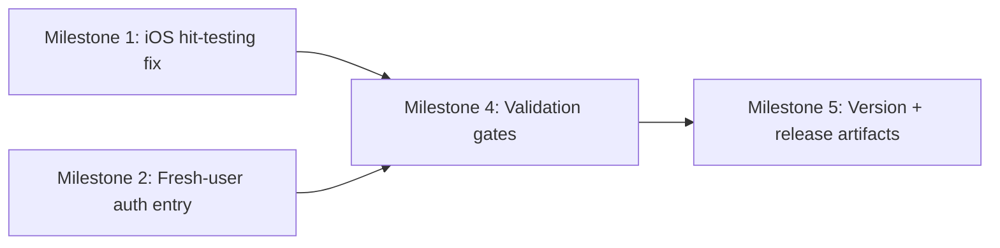

# Plan 063 — Restore Mobile Profile Entry When Logged Out

## Plan Header

- Target Release: next available patch after current `origin/main` version (`0.9.5`); confirm at DevOps Stage 1
- Epic Alignment: Mobile Navigation Reliability (Early Access / onboarding stages)
- Status: Released
- Related Issues: None
- Input Analysis: `agent-output/analysis/closed/063-profile-menu-stage-gating-analysis.md`

## Changelog

| Version | Timestamp (UTC) | Author | Notes |
|---|---|---|---|
| 1.0 | 2026-03-26T21:30Z | Planner | Plan created from Analysis 063 |
| 1.1 | 2026-03-26T21:41Z | Implementer | Status → In Progress |
| 1.2 | 2026-03-26T21:45Z | Code Reviewer | Status → Code Review Approved |
| 1.3 | 2026-03-26T21:52Z | QA | Status → QA Complete |
| 1.4 | 2026-03-26T21:55Z | UAT | Status → UAT Approved |

---

## Value Statement and Business Objective

As a new or returning mobile user, I want a visible, tappable Profile entry point on the landing experience, so that I can always log in / sign up (or reach my profile) regardless of device (real iOS Safari), onboarding state, or authentication status.

Business objective: remove mobile auth-entry drop-off on iOS and ensure UAT can validate profile access while logged out.

---

## Problem Summary (What’s Broken)

There are two related failures that present similarly (“Profile icon doesn’t work”), but affect different user populations:

- **Bug A (iOS hit-testing / CSS):** Returning users who are logged out can see the early-access navbar, but taps do not register on real iOS devices due to `pointer-events` behavior in WebKit.
- **Bug B (navigation gating):** Fresh users with no storage state do not see any bottom navigation at `/` because the early-access navbar is gated behind onboarding completion.

---

## Scope

### In scope

1. Ensure the early-access mobile bottom navigation is tappable on real iOS when it is visible (Bug A).
2. Ensure logged-out fresh users on mobile have a visible Profile/login entry point on `/` (Bug B).
3. Add regression tests for the navigation decision logic so the “logged-out fresh user” path cannot regress.
4. Update release artifacts and documentation for the patch release.

### Out of scope (explicit)

- Redesigning the onboarding flow UX beyond what is required to restore the auth-entry path.
- Changing stage thresholds, provider-count RPC behavior, or Supabase data.
- Adding new pages or new navigation surfaces.

---

## Assumptions

- UAT deploys from `main` (so branch-only fixes must be merged to affect UAT).
- Real iOS Safari is a required validation target; Chrome DevTools mobile emulation is insufficient for hit-testing behavior.
- `/` must serve as a safe mobile entrypoint for authentication even when onboarding is incomplete.

---

## Decision Record

1. **[RESOLVED]** Treat “Profile entry path” as a must-have on `/` for mobile users, regardless of onboarding completion.
   - Rationale: otherwise fresh users (or users who cleared storage) have no deterministic way to log in.
2. **[RESOLVED]** Fix iOS tap behavior by removing the `pointer-events:none` blocking ancestor chain when a nav is active.
   - Rationale: WebKit hit-testing differs from Chrome and has already caused UAT failures.
3. **[RESOLVED]** Preserve Stage 3 behavior: do not show `CityEarlyAccessNavbar` in Stage 3.
   - Rationale: Stage 3 uses the full-access footer; avoid expanding surfaces.
4. **[DEFERRED: Product + reason: UX tradeoff]** Whether `/about` and `/welcome` should expose Profile entry before onboarding completion.
   - Rationale: current requirement is restoring access on `/`; expanding to other onboarding pages may have UX implications.
   - Target: follow-up plan if needed.

---

## Release Strategy

Standalone (no other known active plans targeting this patch release version).

---

## Milestones

### Milestone 0 — DevOps Stage 1 (Version Pre-Flight + Branch Readiness)

Objective: confirm the patch version and ensure the change set is mergeable.

Acceptance criteria:
- `git fetch origin --tags` completed and version collision check performed.
- Target patch version recorded as “next available patch after `origin/main` version `0.9.5`”.
- Branch is rebased/mergeable onto `main` with no conflicts.

---

### Milestone 1 — Fix Bug A (iOS hit-testing) for early-access navbar/footer

Objective: on real iOS Safari, tapping Profile while logged out must work when the early-access navbar is visible.

Implementation surface area (expected):
- CSS for the mobile bottom UI slot and its active modes.

Acceptance criteria:
- On real iOS device in UAT, when the early-access navbar is shown, tapping Profile navigates to `/login` when logged out.
- No regression for logged-in behavior (footer mode remains tappable).

---

### Milestone 2 — Fix Bug B (fresh user auth entry on `/`)

Objective: fresh, logged-out users (no localStorage) must see a Profile entry point on `/`.

Implementation surface area (expected):
- Navigation decision logic for when to show the early-access navbar.
- Root layout mode selection (`mobileUiMode`) must result in a visible nav on `/`.

Acceptance criteria:
- In a fresh browser session (cleared storage), visiting `/` on mobile shows a Profile icon and it routes to `/login`.
- Stage 3 remains unchanged (no early-access navbar).

---

### Milestone 3 — Regression Tests (Logic)

Objective: prevent future regressions in “fresh logged-out user on `/`” nav visibility.

Testing strategy (high level, non-QA):
- Unit tests for navigation utility logic, with storage mocked to represent fresh vs returning users.

Acceptance criteria:
- Test coverage exists for the nav decision logic around `/` and onboarding-complete gating.

---

### Milestone 4 — Validation Gates

Acceptance criteria:
- `npm run type-check` passes.
- `npm test` passes.
- `npm run lint` passes (or `lint-staged` equivalent in CI).

---

### Milestone 5 — Update Version and Release Artifacts

Objective: align versioning and release notes for the patch.

Acceptance criteria:
- Version bump and `CHANGELOG.md` entry reflect the two bug fixes.
- Release artifacts updated consistently (package lockfile if applicable).

---

## Milestone Dependencies

Sequencing rule: complete Milestones 1–2 before validation and release artifacts.

---

## Risks and Mitigations

- Risk: `/` currently plays a dual role (landing + onboarding). Changing nav visibility could affect onboarding UX.
  - Mitigation: constrain visibility changes to `/` only unless a follow-up explicitly expands scope.
- Risk: iOS hit-testing behavior varies across iOS versions.
  - Mitigation: validate on at least one real device/browser (iOS Safari) as part of UAT.

---

## Rollback Strategy

- Rollback is a straightforward revert of the patch commit(s).
- Primary rollback risk: reintroducing a mobile auth-entry dead end for logged-out users.

---

## Duration Estimates

- Analysis: 0.5–1.0h (already completed; validate any remaining unknowns)
- Planning: 0.5–1.0h
- Implementation: 2–6h (CSS + navigation logic + tests)
- Validation: 1–2h (local gates)
- UAT: 0.5–2h (real iOS verification)
- DevOps: 0.5–1.5h (merge + tag + release notes)

Uncertainty drivers: iOS device variability; product decision on whether to expose nav on additional onboarding pages beyond `/`.
