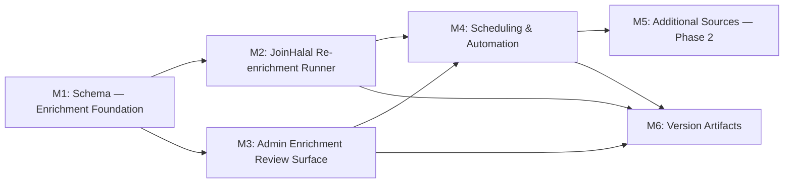

# Plan 065 — Automated Provider Enrichment Pipeline

**Target Release**: v0.10.0 (confirmed at DevOps Stage 1 from latest tag `v0.9.10` and `origin/main:package.json` version `0.9.10`).
**Epic Alignment**: Provider Data Quality & Freshness — automate enrichment of approved, unclaimed providers (`provider_owner_id IS NULL`) with offers and supporting data; eliminate manual browsing of external sources for that operator-managed subset.
**Related Issues**: None (originated from product owner requirement, session S065).

---

## Changelog

| Date (UTC)       | Agent   | Change                                     |
| ---------------- | ------- | ------------------------------------------ |
| 2026-03-29T10:00Z | planner | Plan created from user request (session S065) |
| 2026-03-29T13:19Z | planner | Scope narrowed to approved providers with `provider_owner_id IS NULL` only |
| 2026-03-29T16:45Z | uat | UAT Complete — APPROVED FOR RELEASE (conditional on DF-2 migration smoke test) |
| 2026-03-29T14:50Z | devops | Stage 1 local commit prepared for `v0.10.0`; plan chain moved to `closed/`; deferred validations tracked in `agent-output/planning/065-open-actions.md` |

---

## Value Statement and Business Objective

> **As a product owner**, I want UFlow to automatically enrich approved providers with `provider_owner_id IS NULL` using relevant data fetched from external sources, **so that** consumers see more helpful and up-to-date data for the operator-managed provider set — without requiring manual browsing of external sources every week.

**North-star metric**: Time to enrich one approved, ownerless provider (`provider_owner_id IS NULL`) from zero to populated offers reduced from >10 minutes (manual) to <1 minute (automated pipeline, zero human effort for routine re-enrichment).

---

## Decision Record

1. **[RESOLVED]** _Postgres-first_: The enrichment pipeline uses Supabase (Edge Functions, pg_cron, Postgres staging table) before adding any external services. Redis, queues, and third-party scraping-as-a-service are out of scope until DAU > 5,000 and Postgres proves insufficient.

2. **[RESOLVED]** _Incremental source rollout_: Phase 1 targets JoinHalal only — all infrastructure already exists (parser, import_source_id, import_source_url). Additional sources (Lieferando, TripAdvisor, Instagram, provider websites) are deferred to Phase 2 and gated on Analyst findings. One source proven end-to-end before expanding.

3. **[RESOLVED]** _Admin review gate_: All proposed enrichments stage in an `enrichment_candidates` table and are visible to admins before application. Auto-apply is permitted only for additive, non-conflicting enrichments from the provider's own known import source (same `import_source` + `import_source_id`). Any conflict with existing admin-set values requires explicit admin approval.

4. **[RESOLVED]** _Admin-field preservation_: The enrichment pipeline must never overwrite fields classified as admin-controlled in Plan 052 (review_status, review_feedback, provider_owner_id, created_at, provider_images, barakah_effects, needs_ids, show_address). Only source-data fields are eligible for enrichment proposals (offers_ids, contact_phone, social_website, social_instagram, address fields — with conflict-check).

5. **[RESOLVED]** _Eligibility anchor_: Phase 1 enrichment is limited to approved providers where `provider_owner_id IS NULL`. `import_source_url` (added in migration 065) is the only trusted anchor for re-fetching a provider's source page. Providers with a non-NULL `provider_owner_id` or a NULL `import_source_url` are ineligible for automated enrichment in Phase 1 and are excluded from candidate generation.

6. **[RESOLVED]** _Scheduling approach_: Phase 1 delivers a manual admin-triggered CLI script and admin UI button (consistent with the JoinHalal and MuslimBusiness import pattern). Automated scheduling (pg_cron or Supabase Edge Function scheduled trigger) is Milestone 4 and is gated on Analyst research confirming the mechanism is available in the managed Supabase instance.

7. **[DEFERRED: Analyst / Phase 2]** _Source viability for Lieferando, TripAdvisor, and Instagram_: robots.txt compliance, API availability vs. scraping feasibility, terms of service, rate limits, and data field availability must be confirmed by the Analyst before any implementation work begins for these sources. Until Analyst findings are available, these sources are EXCLUDED from implementation scope.

8. **[RESOLVED]** _Enrichment scope — Phase 1_: The enrichment pipeline enriches `offers_ids` from the JoinHalal listing page (Speisen / offers). `needs_ids` enrichment from external sources is out of scope (providers' needs are self-declared, not inferrable from public listing pages).

---

## Release Strategy

This plan is standalone for its target release. No other known active plans target the same version at time of writing.

---

## Assumptions

1. `import_source_url` is populated for all ownerless JoinHalal providers that were ingested via the v0.8.15 import pipeline. Providers ingested earlier (NULL `import_source_url`) will be identifiable via the existing `import_source = 'joinhalal'` column and recoverable by re-fetching from the JoinHalal sitemap using their `import_source_id`, but only if `provider_owner_id IS NULL`.
2. The JoinHalal listing pages remain server-side rendered with Rank Math JSON-LD (established in Plan 047); no JavaScript rendering required. This assumption should be spot-checked by the Analyst at the start of Phase 2.
3. The existing `upsert_joinhalal_providers` RPC (migration 064) can be extended or supplemented with a new enrichment-specific RPC without schema-breaking changes.
4. Supabase's managed Postgres instance has read access to `pg_cron` extension or an equivalent scheduling mechanism (Analyst to confirm).
5. The existing `IMPORT_BOT_UUID` sentinel user can be reused as the actor for enrichment writes.
6. The admin moderation UI (built in Plans 058 and 061) provides sufficient extension points for an enrichment review panel.

---

## Milestone Dependencies

**Sequencing rule**: M3 (Admin Review Surface) may begin development in parallel with M2 once M1 migrations are applied. M4 (Scheduling) is blocked on both M2 and M3 being functional. M5 (Additional Sources) is gated on Analyst findings AND M4 being stable in UAT. M6 is the final release prep milestone.

**Analyst gate (REQUIRED BEFORE M4)**: The Analyst must deliver findings on scheduling mechanism availability and source viability for Lieferando/TripAdvisor/Instagram before M4 and M5 can begin.

---

## Plan

### Milestone 1 — Schema: Enrichment Foundation

**Objective**: Introduce the database infrastructure needed to stage enrichment proposals for ownerless providers only, without modifying the live `providers` table prematurely.

**Deliverables**:
- New `enrichment_candidates` table in `supabase/migrations/`. The table must capture: candidate ID, target provider ID, source identifier, source URL, field being proposed, proposed value (JSONB), current snapshotted value at time of enrichment (JSONB), enrichment status (`pending` / `approved` / `rejected` / `applied`), timestamps (`enriched_at`, `reviewed_at`), reviewer identity.
- A `last_enriched_at` column added to `providers` to track when each provider was last subject to an enrichment run, enabling staleness detection.
- An `enrichment_eligible` boolean (or derivable condition) on `providers` to allow operators to opt specific providers out of automated enrichment, while still enforcing `provider_owner_id IS NULL` as a hard eligibility condition.
- GIN or BTREE indexes on `enrichment_candidates` as appropriate for the expected query patterns (provider ID lookup, status filter, source filter).
- RLS policies: admins can read/update all candidates; anon and authenticated users have no access to this table.
- The migration must be idempotent (safe to re-run on a clean or existing DB).

**Acceptance Criteria**:
- Migration applies cleanly locally (`supabase db reset --debug`).
- All existing tests continue to pass (`vitest`).
- New tables and columns are visible in the Supabase schema with correct types and constraints.
- RLS denies non-admin reads in a test scenario.
- Eligibility queries and supporting indexes demonstrably exclude providers with non-NULL `provider_owner_id` from automated enrichment selection.

---

### Milestone 2 — JoinHalal Re-enrichment Runner

**Objective**: Build a CLI script (following the pattern of `scripts/import-joinhalal.ts`) that takes approved JoinHalal providers where `provider_owner_id IS NULL`, re-fetches their source pages, extracts current offers data, and writes enrichment candidates into the `enrichment_candidates` table.

**Prior art**: `scripts/import-joinhalal.ts`, `src/lib/import/joinhalal.ts`, `src/utils/joinhalal-parser.ts`. The runner builds on these without modifying them (favor extension or lightweight duplication to avoid regression risk).

**Deliverables**:
- `scripts/enrich-providers.ts` — main enrichment CLI. Flags: `--dry-run` (default), `--source joinhalal`, `--limit N`, `--write`. The `--write` flag writes to `enrichment_candidates`; dry-run prints a preview report only.
- A new `src/lib/enrichment/joinhalal-enricher.ts` module (or similar path) containing the side-effect-free enrichment logic — mirrors the `src/lib/import/joinhalal.ts` pattern for testability.
- Support for fetching providers from the DB by `import_source = 'joinhalal'` and `provider_owner_id IS NULL`, and resolving their fetch URL from `import_source_url` (preferred) or by sitemap re-crawl for providers with NULL `import_source_url`.
- Conflict detection: before writing a candidate, compare the proposed `offers_ids` against the current value in `providers`. If identical, skip (no-op). If different, write a `pending` candidate with both values recorded.
- Rate limiting: maintain the existing ~200ms inter-page delay established in `import-joinhalal.ts`.
- Dry-run output: total providers eligible, fetched, enriched (changed), skipped (no change), skipped (claimed / owner assigned), failed; sample candidate records for human review.

**Acceptance Criteria**:
- `npx tsx scripts/enrich-providers.ts --dry-run --source joinhalal --limit 10` runs without error and prints a meaningful report (even if all providers are no-change).
- `--write` flag creates rows in `enrichment_candidates` with `status = 'pending'`.
- Re-running `--write` is idempotent: does not create duplicate candidates for the same provider+field+source within a short window (define dedup window in implementation).
- Existing import tests continue to pass.
- New unit tests cover the enricher's conflict detection and dedup logic.
- Providers with non-NULL `provider_owner_id` never produce enrichment candidates and are reported as excluded rather than silently processed.

---

### Milestone 3 — Admin Enrichment Review Surface

**Objective**: Give admin operators a UI surface to inspect, approve, and reject enrichment candidates for ownerless providers before they are applied to the live `providers` table.

**Deliverables**:
- A new admin route or tab within the existing admin moderation flow (established in Plans 058, 061) listing `enrichment_candidates` with status `pending`, grouped by provider.
- For each candidate: display the provider name, the field being changed, current value, proposed value, source, and enrichment date.
- Approve action: marks candidate `approved` and applies the proposed value to the `providers` table for the relevant field. Triggers `last_enriched_at` update on the provider row.
- Reject action: marks candidate `rejected` with no change to the provider.
- Bulk approve (admin convenience): approve all pending candidates for a specific provider at once.
- If a provider receives an owner assignment after candidate generation but before review, approve and bulk-approve actions must fail closed with a clear error and leave the candidate pending or explicitly marked non-actionable until re-triaged.
- The apply operation must use a server-side Route Handler (not client-side) with service-role Supabase client to ensure RLS is not the gating mechanism for writes.
- Existing admin-field preservation rules from Plan 052 apply: admin-controlled fields cannot be overwritten by an enrichment apply, even if a candidate for such a field were somehow created.

**Acceptance Criteria**:
- Admin can see all `pending` candidates with before/after field comparison.
- Approving a candidate updates the correct field in `providers` and marks the candidate `applied`.
- Rejecting a candidate marks it `rejected` without modifying `providers`.
- Non-admin users receive 403 / no data (RLS + server-side enforcement).
- Admin-field preservation: attempting to apply a candidate targeting `review_status` or `barakah_effects` via the approve route returns an error.
- Attempting to approve a candidate for a provider whose `provider_owner_id` is no longer NULL returns a guarded error and does not update the provider row.

---

### Milestone 4 — Scheduling and Automation

**REQUIRES ANALYSIS** (before implementation begins): The Analyst must confirm:
1. Whether `pg_cron` is available and configurable in the Supabase managed instance.
2. Whether a Supabase Edge Function can be triggered on a schedule (Supabase scheduled Functions or pg_cron HTTP trigger).
3. The appropriate run frequency given provider count and source rate limits.

**Objective**: Replace the manual CLI trigger with an automated scheduled enrichment run (daily or weekly) that populates `enrichment_candidates` for providers where `provider_owner_id IS NULL`, without operator intervention.

**Deliverables** (scope subject to Analyst findings):
- A Supabase Edge Function (`supabase/functions/enrich-providers/`) containing the enrichment logic (or calling the existing enrichment module as a library). Deno-compatible.
- A scheduling mechanism (pg_cron job or Supabase native schedule) that invokes the Edge Function on a configurable cadence.
- Run-log persistence: the Edge Function writes a summary row to a new `enrichment_run_log` table (or uses the existing admin audit log mechanism) after each run: source, providers processed, candidates created, errors.
- Circuit-breaker / error budget: if >20% of fetches fail in a single run, abort and log for admin review rather than generating degraded candidates.
- Admin visibility: run logs visible in admin panel, with last-run timestamp and candidate count.
- Scheduled selection logic must enforce `provider_owner_id IS NULL` at query time so claimed providers are excluded even if they were previously eligible.

**Acceptance Criteria**:
- [ANALYST-DEPENDENT — to be filled in after Analyst research]
- Edge Function deploys via `supabase functions deploy enrich-providers` without errors.
- Schedule fires correctly (verified via run-log row in DB).
- Run log correctly captures pass/fail counts.
- Existing import scripts remain unaffected.

---

### Milestone 5 — Additional Sources (Phase 2)

**REQUIRES ANALYST FINDINGS** before any implementation work may begin.

**Objective**: Extend the enrichment pipeline to additional sources beyond JoinHalal, prioritized by value/feasibility per Analyst research.

**Candidate sources** (priority and feasibility to be confirmed by Analyst):
- **Lieferando** (German food delivery, structured menu data — high value for restaurant/Imbiss/Imbiss categories)
- **TripAdvisor** (reviews and attributes — higher legal complexity, likely requires API approach)
- **Instagram** (business profile data: opening hours, offers, website link — requires Instagram Graph API)
- **Provider own website** (low-structure, high cost, low priority) — out of scope until Phase 3 or later

**Per-source deliverables** (once Analyst confirms feasibility):
- Source-specific parser module (following joinhalal-parser.ts / muslimbusiness-parser.ts pattern)
- Source-specific enricher module integrated into the `enrich-providers` CLI and Edge Function
- robots.txt compliance verification documented in implementation notes
- Rate limit configuration appropriate to source ToS

**Phase 2 gate**: Analyst must deliver a source viability report as a named analysis document (`agent-output/analysis/065-enrichment-source-analysis.md` or sequenced ID) before Phase 2 implementation begins. The report must address: reachable URL, server vs client rendering, available data fields, ToS and robots.txt status, recommended access pattern.

---

### Milestone 6 — Version Artifacts

**Objective**: Update release artifacts to match the target release version.

**Deliverables**:
- `package.json`: bump `version` to target release (confirmed at DevOps Stage 1; likely next minor version after v0.9.8 given feature scope).
- `CHANGELOG.md`: add entry documenting the enrichment pipeline deliverables (M1–M4 minimum for release; M5 if completed).
- README or docs: update to reflect new `scripts/enrich-providers.ts` usage and admin enrichment review surface.

**Acceptance Criteria**:
- Version in `package.json` matches roadmap target release.
- CHANGELOG entry lists all delivered milestones.
- `npm run build` passes with updated version.

---

## Testing Strategy

Expected test types (QA agent defines specific cases and strategies in `agent-output/qa/`):

- **Unit tests**: Enricher conflict detection logic, dedup logic, field-classification (source fields vs admin fields), candidate writer. Pure functions testing — no real HTTP or Supabase needed. Follow the established `src/__tests__/scripts/` pattern.
- **Integration tests**: End-to-end dry-run of enricher against a test fixture HTML page (similar to `import-joinhalal` tests); verify correct candidate generation.
- **Regression tests**: All existing import-joinhalal and import-muslimbusiness tests must continue to pass. The enrichment runner must not interfere with the existing import paths.
- **Admin API tests**: Approve and reject route handlers — confirm field preservation rules, confirm 403 for non-admin, confirm idempotency of approve (re-approving an already-applied candidate is a no-op or error).

Critical scenarios:
- Enrichment produces no false-positive candidates (same-value fields do not create candidates).
- Admin-field preservation is enforced at the DB/server layer, not only UI.
- Scheduling does not create duplicate candidates when run twice in a window.
- Providers with non-NULL `provider_owner_id` are excluded from candidate generation and cannot be approved if ownership changes after staging.

---

## Baseline & Measurements

**What**: Time to enrich one approved, ownerless provider (`provider_owner_id IS NULL`) from zero to populated offers_ids, measured manually before and after pipeline delivery.

**Where**: Local dev environment against a staging Supabase instance with representative approved-provider dataset.

**Pre-fix baseline to capture**: Operator logs 10 manually enriched providers and records average time (expected: 8–15 min per provider from manual browsing).

**Post-pipeline measurement**: Full enrichment run time for 20 providers via `scripts/enrich-providers.ts --dry-run` (expected: <30 seconds).

**Deferral condition**: Baseline measurement may be deferred to UAT if a staging Supabase instance is not available during implementation. Owner: DevOps. Deferral must be documented in implementation notes with rationale.

---

## Deployment Path Audit

No changes to `Dockerfile`, `deploy/nginx`, or `.github/workflows/deploy-*` are expected. The enrichment script is a developer/operator CLI tool (Node.js, same pattern as existing import scripts). The Edge Function (Milestone 4) introduces a new file under `supabase/functions/` but deployment follows the existing `supabase functions deploy` flow. DevOps Stage 1 must verify the Edge Function deploy path when M4 is reached.

---

## Analyst Consultation

**REQUIRED before M4 and M5 implementation begins.**

Analyst investigation items (designated for `agent-output/analysis/065-enrichment-source-analysis.md`):

| Item | Required Before | Question |
| ---- | --------------- | -------- |
| **ANALYST-1** (REQUIRED) | M4 implementation | Is `pg_cron` available in the Supabase managed instance? What is the recommended scheduling pattern for Edge Functions (native schedule vs pg_cron HTTP trigger)? |
| **ANALYST-2** (REQUIRED) | M5 implementation | Lieferando: fetch `https://lieferando.de/` robots.txt, confirm data structure (structured API vs HTML), identify relevant fields (menu items → offers), assess ToS compliance risk. |
| **ANALYST-3** (REQUIRED) | M5 implementation | TripAdvisor: verify `https://tripadvisor.com/robots.txt`, assess Cloudflare/bot protection, determine if a content API is available, assess legal risk. |
| **ANALYST-4** (OPTIONAL) | M5 Phase 2 | Instagram Graph API: confirm availability of business profile data (opening hours, website, bio/offers) via public Graph API or business content API without requiring account authentication. |
| **ANALYST-5** (OPTIONAL) | M5 Phase 2 | Provider own website: assess feasibility of structured-data extraction (Schema.org, OpenGraph) as a low-effort enrichment signal for providers with `social_website` populated. |

Analyst should run lightweight live spot-checks (curl / page fetch / API probe) and record findings in the analysis document before handoff to Implementer for M4/M5.

---

## Risks and Mitigations

| Risk | Severity | Mitigation |
| ---- | -------- | ---------- |
| JoinHalal changes its HTML structure (Rank Math JSON-LD removed or moved) | HIGH | Parser is isolated in `joinhalal-parser.ts`; failure is detectable and localised. Enricher dry-run will show high `failed` count as early warning. |
| Automated enrichment creates noise in admin review queue | MEDIUM | Conflict detection suppresses no-op candidates. Admin can batch-approve. Long term: auto-apply additive changes from trusted sources. |
| Rate limiting or IP block from external sources | MEDIUM | Polite delay already implemented (200ms). Edge Function respects same limits. Circuit-breaker on error rate > 20%. |
| Admin-field data loss (overwrite) | HIGH | Admin-field preservation enforced at server/DB layer (not UI-only). Tested explicitly in QA. |
| pg_cron unavailable in Supabase managed plan | MEDIUM | Analyst confirms before M4; fallback is manual CLI trigger or Supabase native schedule if available. M4 scope adjusts per findings. |
| TripAdvisor / Lieferando ToS violation | HIGH | Analyst must confirm before any scraping implementation. "When in doubt, don't" — drop source if ToS prohibits automated access. |
| Schema migration conflicts with existing import flow | LOW | Migrations are additive only (new table, new columns). Existing upsert RPC is unchanged in M1–M3. |

---

## Duration Estimates

| Phase | Range | Uncertainty Drivers |
|-------|-------|---------------------|
| Analysis (M4/M5 inputs only) | 0.5–1 day | Source availability checks, pg_cron research |
| M1 — Schema | 0.5 day | Additive migration only, well-understood pattern |
| M2 — JoinHalal Enricher | 1–2 days | Re-uses existing parser; conflict detection is new logic |
| M3 — Admin Review Surface | 1–2 days | Extends existing admin UI; Route Handlers are established pattern |
| M4 — Scheduling | 1–2 days | Depends heavily on Analyst findings; Edge Function Deno port of enricher may add time |
| M5 — Additional Sources | 2–5 days per source | Highly variable; TripAdvisor is the most uncertain |
| QA | 1 day | Standard regression + new scenarios |
| UAT | 0.5 day | Admin enrichment workflow is straightforward to validate |
| DevOps / Release | 0.5 day | Standard; add Edge Function deploy step for M4 |
| **Total (M1–M4 + QA + UAT + DevOps)** | **5–9 days** | **Main uncertainty: scheduling mechanism discovery** |

---

## Shared Results Actionability Check

The enrichment system operates on providers only. Community services are out of scope for this plan. The admin enrichment review surface must filter `enrichment_candidates` by `providers.provider_id` only, and the underlying selection/apply logic must further restrict actions to providers where `provider_owner_id IS NULL`. If the admin surface reuses any shared provider/community-service listing component, it must apply entity-type filtering at the service layer (not UI-only) to ensure enrichment actions never target community service records.

---

## Open Questions at Handoff

All decisions are either RESOLVED or DEFERRED with owner and rationale. No OPEN items remain.
