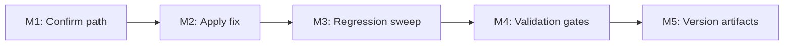

# Plan 067 — Splash Screen Vertical Centering (Mobile)

## Plan Header

- **Target Release**: v0.9.8
- **Epic Alignment**: Landing / Onboarding entry experience — first impression and friction reduction for new mobile visitors
- **Status**: Released in v0.9.8
- **Related Issues**: None

### Changelog

| Date (UTC)        | Author  | Change                    | Rationale                            |
| ----------------- | ------- | ------------------------- | ------------------------------------ |
| 2026-03-28T00:00Z | planner | Created from Analysis 067 | Root cause identified; plan authored |
| 2026-03-28T22:06Z | devops | Status → Committed | Bundled with Plan 060 for release v0.9.8; downstream value validation covered in Plan 060 UAT |

---

## Value Statement and Business Objective

As a **first-time mobile visitor** arriving on the UFlow splash/onboarding screen,
I want the **primary content (Bismillah illustration, heading, subtitle, and CTA button) to be vertically centered** in the visible viewport,
so that my **first impression is balanced and intentional**, and I can immediately understand the value proposition and move forward without visual friction.

---

## Objective

Apply a small, targeted layout fix that corrects vertical centering of the splash content on mobile browsers (including iOS Safari and Android Chrome PWA), without affecting desktop layout, without regressions to other onboarding flow screens, and without changes to content or visual design.

---

## Context

Plan 028 (commit `6bec1122`, v0.6.10) previously fixed this exact issue and was UAT-approved on iPhone Safari. By 028's own record, the correction added `flex-1` to motion.div wrappers in `MobileSplashScreen`, SplashLayout's outer div, and the mobile wrapper in `RootPageContent`.

Analysis 067 reveals that the splashscreen content is still top-aligned. Static trace of the flex-1 chain shows a persistent structural gap:

The two `motion.div` wrappers (for `currentState === 'loading'` and `currentState === 'splash'`) carry `className="flex flex-1 w-full"` — making them **flex-row** containers. In a flex-row parent, `flex-1` expands along the horizontal axis, not the vertical. The `SplashLayout` child must rely on implicit `align-items: stretch` (cross-axis) for height, which is fragile in a deeply-nested flex context (6+ levels with a scroll container ancestor), particularly on iOS Safari and MIUI WebView.

In contrast, the pre-mount SSR render places `SplashLayout` directly inside the flex-col mobile wrapper, giving it proper explicit column-axis `flex-1` expansion. The user sees the post-mount render — which relies on the weaker cross-axis mechanism.

The fix is: add `flex-col` to both motion.div wrappers, converting them from flex-row to flex-col, so that SplashLayout's `flex-1` again expands vertically (main-axis of a column flex parent). This makes the height propagation mechanism explicit and consistent with the pre-mount render.

---

## Assumptions

1. The root cause is the missing `flex-col` on the `loading` and `splash` state motion.div wrappers in `MobileSplashScreen.tsx`. This is the highest-confidence inference from static analysis.
2. Adding `flex-col` will not affect `w-full` behaviour (width is always full in a column flex regardless of direction).
3. Other AnimatePresence states (`about`, `waitlist`, `success`, `earlyAccess`, `aboutFromEarlyAccess`) use plain `motion.div` with no flex classes — they are structurally independent and not affected.
4. The pre-mount (SSR) render path is unaffected by this change.
5. No content, visual design, or animation changes are in scope.
6. Safe-area offset and footer offset (~22px) are secondary contributors and are out of scope for this plan.

---

## Decision Record

| #   | Decision                                                                 | Resolution                                                                                                                      |
| --- | ------------------------------------------------------------------------ | ------------------------------------------------------------------------------------------------------------------------------- |
| D1  | Add `flex-col` to splash/loading motion.div wrappers as primary fix      | [RESOLVED] Directly converts cross-axis stretch dependency to explicit column-axis expansion; minimum viable, reversible change |
| D2  | Keep `min-h-full` on SplashLayout unchanged                              | [RESOLVED] It is harmless with `flex-col` in place and removing it would be a separate refactor out of scope                    |
| D3  | Do not add safe-area padding or adjust footer offset in this plan        | [RESOLVED] Secondary contributors; accepted as YAGNI for this patch; can be addressed separately                                |
| D4  | Do not change pre-mount (SSR) render path                                | [RESOLVED] Pre-mount already uses correct flex-col parent; no change needed                                                     |
| D5  | Regression check covers all `currentState` branches of `AnimatePresence` | [RESOLVED] Other branches use plain block-level motion.div; no flex classes to misalign                                         |
| D6  | Target release is next available patch after v0.9.7                      | [RESOLVED] Standalone patch fix; no other active plans targeting same release found in agent-output/planning/                   |

---

## Release Strategy

**Bundled with Plan 060** — the original splash/loading fix remains a valid subset of the onboarding-centering regression, but Stage 1 release packaging commits it together with Plan 060 because Plan 060 completes the remaining state coverage and its UAT explicitly evaluates the combined 7-state onboarding chain.

---

## Plan

### Milestone 1: Confirm Affected Rendering Path

**Objective**: Verify the motion.div wrappers on `loading` and `splash` states are the source of the centering failure by inspecting the current class strings in `MobileSplashScreen.tsx`.

**Tasks**:

1. Open `src/components/shared/MobileSplashScreen.tsx` and locate both motion.div wrappers (`currentState === 'loading'` and `currentState === 'splash'`).
2. Confirm the class string is `"flex flex-1 w-full"` (no `flex-col`).
3. Cross-check: confirm `SplashLayout`'s outer div class includes `flex-1 flex-col` (the flex-col is present at the layout level but not at the wrapper level).

**Acceptance**:

- Both motion.div wrappers confirmed to be flex-row (no `flex-col`).
- No other layout class or inline style on these wrappers that could restore vertical expansion.

**Dependencies**: Analysis 067 (complete).

---

### Milestone 2: Apply Fix — Add `flex-col` to Splash State Wrappers

**Objective**: Update the two motion.div wrappers for `loading` and `splash` states to include `flex-col`, making vertical expansion explicit.

**File**: `src/components/shared/MobileSplashScreen.tsx`

**Change**: Both motion.div wrappers should change from `className="flex flex-1 w-full"` to `className="flex flex-1 flex-col w-full"`.

**Scope**: Exactly two lines changed. No other files modified in this milestone.

**Acceptance**:

- Both motion.div wrappers include `flex-col`.
- No other classes added, removed, or reordered.
- Chrome mobile emulation (responsive mode, iPhone 14 Pro) shows content vertically centered.
- Pre-mount / SSR render path is functionally unchanged.

**Implementer note**: If local browser testing is available, open the splash screen (clear localStorage `hasSeenSplashScreen` and `splashAnimationUsed`) and verify content is centered at 375×812 and 390×844 viewport sizes.

---

### Milestone 3: Regression Sweep — All AnimatePresence Branches

**Objective**: Confirm that no other screen in the waitlist/onboarding flow is broken by the change or exhibits the same structural problem.

**Tasks**:

1. Review all `AnimatePresence` children in `MobileSplashScreen` (`loading`, `splash`, `about`, `waitlist`, `success`, `earlyAccess`, `aboutFromEarlyAccess`).
2. Confirm `about`, `waitlist`, `success`, `earlyAccess`, `aboutFromEarlyAccess` motion.divs do **not** have conflicting flex classes that could cause regressions.
3. Verify `SplashContent` component renders identically at different viewport sizes (320px–430px width) — no content clipping, no overflow, CTA button accessible.
4. Check RTL languages (Arabic, Urdu) — no layout break under `dir="rtl"`.

**Acceptance**:

- No screen in the onboarding flow is clipped, misaligned, or inaccessible after the fix.
- SplashContent renders correctly for at least: German, English, Arabic.
- CTA button is reachable without scrolling on iPhone SE viewport (375×667).

---

### Milestone 4: Validation Gates

**Objective**: All engineering quality gates pass.

**Tasks**:

1. `npm run type-check` — 0 new errors.
2. `npm run lint` — 0 new errors (pre-existing warnings are acceptable if documented).
3. `npm test -- --run` — all tests pass (or pre-existing failures documented).
4. `npm run build` — build completes successfully.

**TDD Note**: This is a CSS class addition (layout-only bugfix). Visual layout correctness cannot be unit-tested in jsdom. Focus on confirming no TypeScript or lint regressions. Note the TDD exception in the implementation doc.

**Acceptance**: All four gates pass. Evidence recorded in implementation doc.

---

### Milestone 5: Version and Release Artifacts

**Objective**: Ensure version files and changelog are updated for the patch release.

**Scope**: DevOps agent responsibility. Not implemented by the code Implementer.

**Tasks**:

1. Confirm the next available patch version after `git tag --list | sort -V | tail -1` (currently v0.9.7 → target v0.9.8).
2. Update `package.json` `"version"` to the confirmed patch version.
3. Add `CHANGELOG.md` entry for the patch.

**Acceptance**:

- `package.json` version matches tag.
- `CHANGELOG.md` documents the fix with plain-English description.
- No unrelated version bumps.

---

## Milestone Dependencies

Sequencing rule: M2 must not begin until M1 confirms the motion.div class strings match the analysis expectation. M3 and M4 can overlap after M2 is complete. M5 is DevOps-phase only, runs after QA approval.

---

## Testing Strategy

**Expected test types**:

- **Unit/integration**: TypeScript type-check and lint gates as proof of no regressions; existing test suite validates no functional regressions.
- **Visual (manual)**: Chrome DevTools mobile emulation (375×667 iPhone SE, 390×844 iPhone 14 Pro) to visually confirm vertical centering after fix.
- **Device validation (UAT)**: Real iOS Safari device required to confirm centering — this was the gap in Plan 028's first iteration and must be explicitly validated.

**Critical scenarios**:

- First-time visitor on iPhone SE (small viewport, largest risk of misalignment).
- First-time visitor with Arabic/RTL language active.
- Returning visitor refreshing the splash (splash-animated sessionStorage flag set, but splashAnimationUsed cleared).
- Slow device: content visible before/after AnimatePresence enter animation.

**QA note**: QA agent defines the detailed test cases in `agent-output/qa/`. Implementer is responsible only for the engineering gate evidence in Milestone 4.

---

## Validation Signals (Non-QA)

| Signal                                         | Tool                     | Expected                                                         |
| ---------------------------------------------- | ------------------------ | ---------------------------------------------------------------- |
| Content vertically centered in responsive mode | Chrome DevTools          | Splash content bounding box center within ±5% of viewport center |
| No height collapse on SplashLayout             | Chrome DevTools computed | SplashLayout height == motion.div height ≈ viewport height       |
| No new TypeScript errors                       | `npm run type-check`     | 0 new errors                                                     |
| No new lint errors                             | `npm run lint`           | 0 new errors                                                     |
| All existing tests pass                        | `npm test -- --run`      | Match pre-change baseline                                        |

---

## Risks

| Risk                                                                                                     | Likelihood | Impact | Mitigation                                                                                                                                     |
| -------------------------------------------------------------------------------------------------------- | ---------- | ------ | ---------------------------------------------------------------------------------------------------------------------------------------------- |
| Cross-browser stretch behaviour differs (Android Chrome PWA)                                             | Medium     | Medium | Explicit flex-col removes the dependence on stretch — fix should be universally correct                                                        |
| motion library (v12.23.23) overrides flex-col with inline styles during animation                        | Low        | High   | Inspect DOM in DevTools after animation completes; motion's opacity animation should not affect layout direction                               |
| SplashLayout `min-h-full` still fails in some browsers without an explicit height on the flex-col parent | Low        | Medium | SplashLayout's parent (motion.div) gets its height from flex-1 in a column parent, making it CSS-definite; min-h-full should resolve correctly |
| Regression to About/Waitlist/Success screens                                                             | Low        | High   | Milestone 3 regression sweep covers all AnimatePresence branches before QA                                                                     |

---

## Rollback

The change is 2-character additions on 2 lines in a single file. Rollback is a simple revert of the `flex-col` addition. No database, no API, no migration.

---

## Duration Estimates

| Phase          | Range               | Uncertainty Drivers                                          |
| -------------- | ------------------- | ------------------------------------------------------------ |
| Analysis       | Complete (067)      | —                                                            |
| Planning       | Complete (this doc) | —                                                            |
| Implementation | 15–30 min           | Trivial 2-line change; most time is local validation         |
| QA             | 1–2 hours           | Requires mobile emulation + real-device validation           |
| UAT            | 30 min–1 hour       | Single device class required; depends on device availability |
| DevOps         | 30 min              | Standard patch release procedure                             |

---

## Open Questions

All questions resolved. No blocking open questions at handoff.

---

**Scope guidance**: < 1 file, < 3 changes, < 30 min implementation. This is the minimum viable targeted fix.
