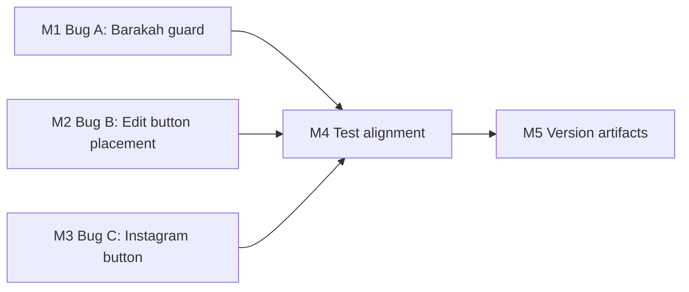

# 076 — Provider Detail UAT Bug Fixes

**Target Release:** Next available patch after `v0.10.3` (current `origin/main`); confirm as `v0.10.4` at DevOps Stage 1 once `git fetch --tags` confirms no collision.  
**Epic Alignment:** UAT stability — desktop provider detail page (conversion surface quality)  
**Related Issues:** None (UAT field observation; no GitHub issue assigned)  
**Bundled Plans:** Release Strategy: Standalone (no other known plans targeting this patch version)

---

## Changelog

| Date | Author | Event |
|---|---|---|
| 2026-04-03T09:30Z | Planner (@S76) | Plan created from analysis 076 (L1 confirmed root causes, 1 file, 3 bugs) |
| 2026-04-03T12:00Z | Code Reviewer (@S76) | Code Review: APPROVED — Zero blocking findings |
| 2026-04-03T16:08Z | QA (@S76) | QA FAILED — blocking TypeScript errors in ProviderDetailModal tests (CommunityService shape mismatch) |
| 2026-04-03T16:14Z | QA (@S76) | QA PASSED — fixture fix applied, all gates green (type-check EXIT 0, 43/43 tests) |
| 2026-04-03T16:16Z (approx.) | UAT (@S76) | UAT Complete — APPROVED FOR RELEASE with DF-1 deferred visual evidence gate |
| 2026-04-03T16:25Z | DevOps (@S76) | Stage 1 complete — committed locally for v0.10.4 |

---

## Value Statement and Business Objective

> As a user visiting a provider detail page on desktop, I want to see accurate, data-driven content with fully functional contact actions, so that I can make an informed decision to engage with the provider — without being confused by phantom placeholder cards or missing contact buttons.

> As an admin, I want the "Service bearbeiten" edit button to appear in a predictable, intentional position within the modal's visual hierarchy, so that I can edit provider data without the action feeling awkward or detached.

Each of the three defects degrades the quality of UFlow's primary conversion surface. All three are isolated to a single file and have no cross-cutting dependencies.

---

## Decision Record

| # | Decision | Status |
|---|---|---|
| 1 | All three bugs are desktop-only (`ProviderDetailModal.tsx`); mobile path is correct | `[RESOLVED]` — L1 code inspection by Analyst |
| 2 | Minimal fix surface: 1 file only, no schema/service changes | `[RESOLVED]` — All bugs are rendering/import gaps |
| 3 | **Bug A visibility guard**: Wrap the Barakah section with `communityServices.length > 0` | `[RESOLVED]` — Mirror the mobile path pattern (proven correct) |
| 4 | **Bug B edit button placement**: Move `customActionButtons` from `absolute bottom-24` to inside the right panel, below the close button row — anchored `absolute right-12 top-20` | `[RESOLVED]` — Top-right placement (Option C) aligns with close button's visual zone and gives the edit action clear spatial context without competing with the actions bar |
| 5 | **Bug C Instagram pattern**: Instagram button follows the same expand-on-click pill pattern as Phone/Website buttons | `[RESOLVED]` — Consistent with existing actions bar UX; deviation would require design review |
| 6 | Existing test `should render barakah effects section heading` asserts the heading always renders. After Bug A fix (heading only renders when data present), this test must be updated to only pass when `initialCommunityServices` is non-empty | `[RESOLVED]` — Test update is in scope as a required implementation task |
| 7 | TypeScript strict mode: `expandedAction` state type union must include `'instagram'`; `handleExpand` function signature must be extended | `[RESOLVED]` — Required for type safety; extend both together |
| 8 | `normalizeInstagramUrl` is already exported from `src/utils/navigationUtils.ts` — no new utility function needed | `[RESOLVED]` — Import the existing utility |

---

## Assumptions

1. The `initialCommunityServices` prop to `ProviderDetailModal` is the correct mechanism for SSR-seeded data; no change to data flow needed.
2. The `social_instagram` field name on the `Provider` type is confirmed (`src/services/providers.ts` line 17; type is `string | null`).
3. `normalizeInstagramUrl` in `src/utils/navigationUtils.ts` handles both `@handle`, bare username, and full URL forms — this is unchanged.
4. The `AdminProviderDetailButtons` component with `variant="desktop"` renders a green pill button — no changes to that component are required.

---

## Milestones

### M1 — Bug A: Conditional Barakah Section Guard

**Objective:** The Barakah Effect section in `ProviderDetailModal` is hidden when `communityServices` is empty or loading, and visible only when at least one community service is linked.

**Scope:**
- In `ProviderDetailModal.tsx`, locate the Barakah section (currently lines ~512–573 in the right panel)
- Wrap the entire section with a `communityServices.length > 0` conditional render guard
- Optionally (non-blocking): also skip rendering while `isLoadingCommunityServices` is true (prevent flash of placeholder card during initial fetch). The Analyst noted this as a UX improvement; it is within scope because the fix is in the same location.

**Acceptance Criteria:**
- Provider with linked community services: Barakah section renders normally ✓
- Provider with NO linked community services: Barakah section renders nothing (no placeholder, no card outline, no heading) ✓
- Provider still loading community services: no phantom card visible ✓

**State/Branch paths covered:**
| Branch | Expected behaviour |
|---|---|
| `isLoadingCommunityServices = true, communityServices = []` | Nothing renders (or optional loading skeleton) |
| `communityServices.length === 0, not loading` | Nothing renders |
| `communityServices.length > 0, not loading` | Full Barakah section renders |

---

### M2 — Bug B: Reposition "Service bearbeiten" Button

**Objective:** The `customActionButtons` slot in `ProviderDetailModal` is moved from the current `absolute bottom-24 left-1/2` position to the right panel header area, giving the admin edit action a natural visual home near the close button.

**Scope:**
- In `ProviderDetailModal.tsx`, locate the `customActionButtons` render block (currently lines ~766–771)
- Remove the current `absolute bottom-24 left-1/2 -translate-x-1/2` container
- Re-render `customActionButtons` inside the right panel, anchored near the close button — place it using `absolute right-12 top-20` (just below the existing close button at `top-9`) so it sits in the same top-right zone without overlapping the `X` button
- The `customActionButtons` container should not overlay the content panel scroll area; position it so it sits cleanly in the header whitespace of the right panel

**Acceptance Criteria:**
- "Service bearbeiten" button appears in the top-right area of the modal, visually near the close button ✓
- "Service bearbeiten" does not overlap the close button ✓
- "Service bearbeiten" does not float over content panels on either side ✓
- When no admin (`customActionButtons = undefined`): no layout shift, no empty space ✓
- Non-admin users: right panel renders identically to pre-fix (no regression) ✓

---

### M3 — Bug C: Instagram Social Button in Actions Bar

**Objective:** The desktop modal actions bar gains an Instagram button that renders conditionally based on `provider.social_instagram` presence and follows the existing expand-on-click pill pattern.

**Scope — all changes in `ProviderDetailModal.tsx`:**

1. **Import** — Add `normalizeInstagramUrl` to the existing `@/utils/navigationUtils` import
2. **State type** — Extend `expandedAction` state type: `'save' | 'share' | 'call' | 'website' | 'instagram'`
3. **Handler** — Add a case inside `handleExpand` for `'instagram'`: use `normalizeInstagramUrl(provider.social_instagram)` and open in new tab (same pattern as `'website'`)
4. **JSX** — Inside the actions bar, after the Website button, add an Instagram button that:
   - Is conditionally rendered: only when `provider.social_instagram` is non-null/non-empty
   - Follows the same expand-on-click pattern: icon-only when not active, expands to show "Instagram" label when active
   - Uses icon `mdi:instagram`
   - Has `aria-expanded` and `aria-label` attributes consistent with sibling buttons

**Acceptance Criteria:**
- Provider with `social_instagram` set: Instagram button appears in the actions bar ✓
- Provider without `social_instagram`: Instagram button absent (no dead space) ✓
- Clicking Instagram when expanded: opens the normalized Instagram URL in a new tab ✓
- TypeScript: no type errors; `expandedAction` state is strongly typed ✓
- Pill expand/collapse animation is visually consistent with Phone/Website buttons ✓

---

### M4 — Test Alignment

**Objective:** Update the single existing test that will fail due to the Bug A fix, and add regression tests that confirm the correct behaviour for all three bugs.

**Scope (tests only — no source code in this milestone):**

**Test file to update:**
- `src/__tests__/components/ProviderDetailModal.test.tsx` — line 45–57:  
  The test `'should render barakah effects section heading'` currently asserts the heading always renders. This test relies on `mockProvider` which has no `initialCommunityServices`. After the Bug A fix, the heading must only render when community services are present. Update the test so:
  - `[pre-fix FAILS]` scenario: `initialCommunityServices = []` — heading must NOT be in the document
  - `[post-fix PASSES]` scenario: `initialCommunityServices = [mockCommunityService]` — heading IS in the document

**Regression tests to add (in `ProviderDetailModal.test.tsx` or a new `076-*.regression.test.tsx`):**

| Test | Inputs | Expected |
|---|---|---|
| Bug A regression: no community services → no Barakah section | `initialCommunityServices = []` | `ourBarakahEffect` heading not in document |
| Bug A regression: with community services → Barakah section present | `initialCommunityServices = [mockService]` | `ourBarakahEffect` heading in document |
| Bug C regression: `social_instagram` set → Instagram button visible | `provider.social_instagram = 'https://instagram.com/test'` | Instagram button in document |
| Bug C regression: `social_instagram` null → Instagram button absent | `provider.social_instagram = null` | Instagram button not in document |
| Bug B regression: admin buttons render in top-right zone, not bottom-center | `customActionButtons = <button>Edit</button>` | Button not positioned at bottom |

**Note for Implementer:** The Bug B regression is primarily a visual/positional concern. A DOM-based test checking that `customActionButtons` content is rendered inside the right panel `div` (not inside a `bottom-24` container) is sufficient. Pixel-exact layout testing is not required.

---

### M5 — Version Artifacts

**Objective:** Update `package.json` and `CHANGELOG.md` to reflect the patch release.

**Scope:**
- Bump `package.json` version from `0.10.3` → `0.10.4` (or next available — confirm at DevOps Stage 1)
- Add `CHANGELOG.md` entry for the three bug fixes:
  - Bug A: Barakah Effect section now hidden when no community service linked
  - Bug B: "Service bearbeiten" button repositioned to top-right panel area
  - Bug C: Instagram social button added to desktop provider detail modal

---

## Milestone Dependencies

**Sequencing rule:** M1, M2, and M3 are independent of each other and can be implemented in any order or in parallel within the same file edit session. M4 must begin after M1–M3 are complete. M5 is the final step.

---

## Testing Strategy

- **Unit/component tests**: Primary coverage vehicle. The `ProviderDetailModal` test file already exists and is the correct home for new assertions.
- **Regression focus**: Bug A requires the "pre-fix FAILS/post-fix PASSES" pattern per the client-state precedence regression convention in copilot-instructions. Use descriptive test names.
- **TypeScript gate**: `npm run type-check` must pass before handoff. No TS errors introduced.
- **No integration or e2e tests required** for these changes — all bugs are isolated to rendering logic with no API calls involved.

---

## Validation Steps (Implementer)

After completing M1–M3, before M4:
1. `npm run type-check` — must exit 0
2. `npm run lint` — must exit 0
3. Component renders correctly in a local dev environment against a UAT provider with `social_instagram` set and one with `social_instagram = null`

After M4:
4. `npm test` — target: all tests in `ProviderDetailModal.test.tsx` pass (no regressions)

---

## Risks

| Risk | Likelihood | Impact | Mitigation |
|---|---|---|---|
| Bug B: Re-positioning breaks z-index layering with the close button | Low | Low | Test locally with admin account; both elements are in the same stacking context |
| Bug C: `normalizeInstagramUrl` has edge cases that cause blank URL | Low | Low | The function already exists and is used on the mobile path — behavior is proven |
| M4: Updating existing test to `[pre-fix FAILS]` pattern reveals additional unguarded test scenarios | Low | Medium | Scope the test update precisely; do not refactor other tests in scope |

---

## Duration Estimates

| Phase | Estimate | Notes |
|---|---|---|
| Analysis (done) | — | L1 root causes confirmed |
| Planning (done) | — | This document |
| Implementation (M1–M3) | 1–2h | Single file, straightforward conditional/import changes |
| Test alignment (M4) | 1–2h | 1 test update + 4–5 new regression assertions |
| Version artifacts (M5) | 15min | Changelog + version bump |
| **Total** | **2.5–4h** | Uncertainty driver: Bug B positioning may need 1–2 iteration cycles to get right visually |

---

## Rollback Considerations

All changes are confined to a single component file and a test file. Rollback is a simple git revert. No migrations, no API changes, no database changes.

---
