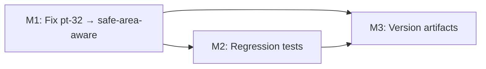

# Plan 077 — Mobile Header Overlap Bugfix (Providers Page)

## Plan Header

| Field              | Value                                                                                              |
| ------------------ | -------------------------------------------------------------------------------------------------- |
| **Plan ID**        | 077                                                                                                |
| **Target Release** | Next available patch after `v0.10.5`; confirm as `v0.10.6` at DevOps Stage 1                      |
| **Epic Alignment** | Mobile UX reliability / provider discovery browse quality                                          |
| **Status**         | Released (`v0.10.6`)                                                                                |
| **Related Issues** | None                                                                                               |
| **Analysis Doc**   | `agent-output/analysis/077-mobile-header-overlap.md`                                              |

## Changelog

| Timestamp           | Agent   | Event                                         |
| ------------------- | ------- | --------------------------------------------- |
| 2026-04-04T07:55Z   | Analyst | Analysis complete; root cause (L1 Proven)     |
| 2026-04-04T08:00Z   | Planner | Plan created; inheriting analysis ID/UUID     |
| 2026-04-04T07:58Z   | Critic  | Review complete; APPROVED WITH COMMENTS (1 MEDIUM finding: epic alignment mismatch) |
| 2026-04-04T08:05Z   | Planner | Revised per M-1: corrected Epic Alignment to descriptive label (no epic number) |
| 2026-04-04T08:10Z   | Implementer | Status → In Progress; beginning implementation |
| 2026-04-04T08:25Z   | Code Reviewer | Review complete; APPROVED (zero findings) → QA |
| 2026-04-04T08:31Z   | QA | Validation complete; Status → QA Complete (manual iOS runtime checks deferred to UAT/QA operator) |
| 2026-04-04T08:35Z   | UAT | Value delivery validated; conditional approval issued (pending manual device visual verification) → UAT Approved |
| 2026-04-04T08:39Z   | DevOps | Stage 1 local commit preparation complete; Status → Committed for Release `v0.10.6` |
| 2026-04-04T08:44Z   | DevOps | Stage 2 completed; branch pushed and tag `v0.10.6` prepared; Status → Released |

---

## Release Strategy

Standalone (no other known active plans targeting `v0.10.6`). This is a focused single-file bugfix and version bump only.

---

## Value Statement and Business Objective

> **As a UFlow mobile user on an iPhone with a notch or Dynamic Island, I want the provider search results to be fully visible and tappable below the fixed header, so that I can browse and interact with all providers without content being obscured or touch targets being blocked.**

The `/providers` discovery page is the primary browse surface. On iOS devices with `safe-area-inset-top > 0` (iPhone X through iPhone 16), the fixed glassmorphic search/category header overlaps the top ~45 px of content, hiding provider card images and creating a dead-tap zone. Admin users additionally lose the `AdminStatusFilter` tabs entirely behind the header. This fix directly unblocks the most critical mobile browse path on the most common device class.

---

## Objective

Replace the static `pt-32` (128 px) top padding on the `<main>` content container in `ProvidersContent` with a safe-area-aware equivalent that dynamically adds `env(safe-area-inset-top)` to the base offset, using the same `max()` CSS pattern already established in the city page.

**North-star metric**: On an iPhone with notch, no provider card image is obscured behind the header on page load.

---

## Assumptions

1. `env(safe-area-inset-top)` is correctly set by the iOS WebKit engine in standalone PWA mode and in Safari (already proven in production via other uses throughout the app).
2. The device classes are: non-notch (SE, older), notch (~59 px), Dynamic Island (~59 px). The `max()` pattern handles all three without device-specific branching.
3. The `sm:pt-8 md:pt-28` breakpoint overrides are correct on non-mobile viewports and must not be changed.
4. The `showGreeting=true` branch (`pt-0`) is used only on city pages via `CityCard pb-8` spacing and is not affected.

---

## Decision Record

| # | Decision | Resolution |
|---|----------|------------|
| D1 | Fix location: `pt-32` string in `ProvidersContent.tsx:525` (single file, single line) | `[RESOLVED]` Analysis F1 isolated the root cause to one Tailwind class in one file. All other components and pages are unaffected. |
| D2 | Fix approach: replace with arbitrary Tailwind value `pt-[max(128px,calc(env(safe-area-inset-top)+128px))]` | `[RESOLVED]` The `max()` CSS pattern is already used in city page Stage 3 and `RootPageContent`. Consistency with established codebase pattern. 128 px matches the current non-notch value so non-notch devices see no change. |
| D3 | Desktop breakpoints `sm:pt-8 md:pt-28` unchanged | `[RESOLVED]` Desktop uses a separate `Header.tsx` and has independent spacing. The mobile fix does not touch `sm:`/`md:` overrides. |
| D4 | No changes to `ProvidersPageHeader` structure or the `AdminStatusFilter` component | `[RESOLVED]` The header height is correct — only the content clearance is wrong. Fixing the padding is sufficient. |
| D5 | No new CSS custom property or utility class for this fix | `[RESOLVED]` YAGNI — this is a one-instance bugfix. A shared utility can be extracted later when 3+ sites use the same value. |
| D6 | Version bump: patch increment only (`v0.10.5 → v0.10.6`) | `[RESOLVED]` Single-line CSS quirk fix. No API change, no database change, no feature addition. |
| D7 | Regression test: pure logic test mirroring pre/post expressions | `[RESOLVED]` Follows the client-state precedence regression pattern from PI-045: write a focused logic test that makes the bug visible in the test name, not relying on SSR/integration tests alone. |

---

## State/Branch Coverage (Mandatory)

`ProvidersContent` renders two header variants via `showGreeting`:

| Branch | Header Component | Content padding | Status |
|--------|-----------------|----------------|--------|
| `showGreeting=false` (providers page) | `ProvidersPageHeader` (fixed, mobile) | `pt-32` → **BROKEN on notch** | **Fix in this plan** |
| `showGreeting=true` (city page Stage 2) | Inline `<header>` in ProvidersContent | `pt-0 sm:pt-8 md:pt-28` | Confirmed unaffected — uses `CityCard pb-8` gap |

Both branches confirmed by inspection. Only the `showGreeting=false` branch is broken.

---

## Plan

### Milestone 1 — Fix: Replace static `pt-32` with safe-area-aware padding

**Scope**: `src/app/(public)/providers/ProvidersContent.tsx` — single line change

**Objective**: Change the `<main>` top padding class from the static `pt-32` (128 px) to an arbitrary value that adds `env(safe-area-inset-top)` while preserving the 128 px baseline on non-notch devices.

**Tasks**:
1. In `ProvidersContent.tsx`, locate the ternary that produces `'pt-32 sm:pt-8 md:pt-28'` (line ~525).
2. Replace `pt-32` with `pt-[max(128px,calc(env(safe-area-inset-top)+128px))]`. The `sm:pt-8 md:pt-28` overrides remain unchanged.
3. Verify that Tailwind generates the class correctly (arbitrary values using `env()` and `calc()` are supported in Tailwind v3+).

**Acceptance Criteria**:
- [ ] On a non-notch device (or emulator with `safe-area-inset-top = 0`): gap between top of viewport and first card is visually identical to before (128 px).
- [ ] On a notch device (or emulator with `safe-area-inset-top ≈ 59 px`): the first provider card image is fully visible — no portion is hidden behind the header.
- [ ] Admin users: `AdminStatusFilter` tabs are fully visible on notch phones.
- [ ] Desktop (`sm:` and above): layout unchanged.
- [ ] `npm run type-check` exits 0.
- [ ] `npm run lint` exits 0.

---

### Milestone 2 — Tests: Regression coverage for the padding value

**Objective**: Add a focused logic test that makes the pre-fix bug visible in test naming and ensures the fix expression is correct, per the client-state precedence regression pattern (PI-045).

**Tasks**:
1. Create or update a test file under `tests/` or alongside the component (follow existing test placement conventions).
2. Write two test cases:
   - `[pre-fix FAILS] pt-32 (128px) is less than header height on notch device (173px)` — asserts that `128 < 128 + 59` (i.e., the pre-fix value is insufficient on notch phones).
   - `[post-fix PASSES] max(128px, safe-area + 128px) clears the header on notch device` — asserts that `Math.max(128, 59 + 128) === 187`, which is `> 173`.
3. The tests are pure arithmetic — no DOM rendering needed. Logic only.

**Acceptance Criteria**:
- [ ] Both test names reference `[pre-fix FAILS]` / `[post-fix PASSES]` per PI-045 pattern.
- [ ] `npm test` exits 0 with the new tests passing.

---

### Milestone 3 — Version and Release Artifacts

**Objective**: Bump version to `v0.10.6` (confirmed at DevOps Stage 1) and document the fix.

**Tasks**:
1. Update `package.json` `"version"` field to the confirmed next patch version.
2. Add a `CHANGELOG.md` entry summarising the fix.

**Acceptance Criteria**:
- [ ] `package.json` version matches confirmed release tag.
- [ ] `CHANGELOG.md` entry references Plan 077 and describes the mobile header overlap fix.

---

## Milestone Dependencies

Sequencing rule: M2 and M3 can proceed in parallel once M1 is complete. All three must be done before handoff to QA.

---

## Deployment Path Audit

This change touches no deployment surface area (no Dockerfile, no env vars, no nginx config, no workflow files). No deployment path audit milestone is required.

---

## Testing Strategy

- **Type**: Unit (pure logic) — padding arithmetic regression tests
- **Coverage expectation**: 2 named test cases per PI-045 client-state precedence pattern
- **Critical scenario**: Notch device with `safe-area-inset-top ≈ 59 px` where `pt-32` (128 px) < header height (~173 px)
- **QA responsibility**: Manual browser validation on physical iPhone with notch and iPhone SE (non-notch) to confirm visual fix; admin view verification on notch phone

---

## Validation

Pre-handoff gates (Implementer must confirm all):
1. `npm run type-check` — EXIT 0
2. `npm run lint` — EXIT 0
3. `npm test` — EXIT 0, new regression tests passing
4. No unintended changes outside `ProvidersContent.tsx` and the test file

---

## Risks

| Risk | Likelihood | Impact | Mitigation |
|------|------------|--------|------------|
| Tailwind doesn't generate the arbitrary class with `env()` | Low — Tailwind v3 supports `calc()` and CSS env variables in arbitrary values | Medium | Verify in build output; fallback to `style` prop with `env()` in JSX if needed |
| 128 px base offset was already too tight on some non-notch devices | Low — analysis shows 128–114 = +14 px slack on non-notch SE | Low | QA verifies on non-notch device; no regression |
| `showGreeting=true` branch inadvertently changed | None — the fix is in the else branch of the ternary | None | Code review confirms only the `pt-32` class string is modified |

---

## Duration Estimates

| Phase        | Range         | Uncertainty Drivers                              |
| ------------ | ------------- | ------------------------------------------------ |
| Analysis     | Done          | —                                                |
| Planning     | Done          | —                                                |
| Implementation | 15–30 min   | Single-line change + two arithmetic tests        |
| QA           | 30–60 min    | Physical iOS device access required for visual verification |
| UAT          | 15–30 min    | Screenshot comparison on notch device            |
| DevOps       | 15–20 min    | Standard patch release pipeline                  |

**Total estimate**: ~2–2.5 hours end-to-end.

---

## Open Questions

None — root cause is fully determined (L1 Proven). No deferred questions.

---

## Rollback Consideration

Reverting the single-line change restores the pre-fix behaviour. No database migrations, no API changes, no infrastructure changes.
