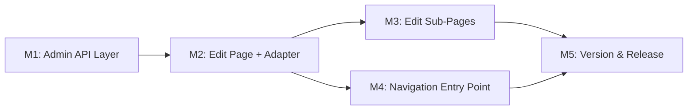

# 083 — Community Services Edit UI Plan

## Changelog

| Date                | Agent         | Summary                                                              |
|---------------------|---------------|----------------------------------------------------------------------|
| 2026-04-06T10:29Z   | Analyst       | Analysis complete: no CS edit page exists; ProviderEditForm reusable |
| 2026-04-06T10:50Z   | Planner       | Plan created: adapter-based CS edit using ProviderEditForm           |
| 2026-04-06T11:00Z   | Critic        | REVISION REQUESTED: F1 (sub-page hardcoded queries), F2 (Soziale Initiativen unconditional render) |
| 2026-04-06T11:15Z   | Planner       | Revision: corrected Assumption #2, updated M3 with per-sub-page adaptations, added D9 for hideSocialInitiatives prop, added F4 localStorage cleanup note |
| 2026-04-06T15:00Z   | Implementer   | All 5 milestones complete; 37 new tests; pre-handoff gate passed    |
| 2026-04-06T15:30Z   | Code Reviewer | APPROVED — 1 MEDIUM (optional), 4 LOW/INFO; no critical/high issues  |
| 2026-04-06T15:40Z   | QA            | QA Complete — all automated gates pass; ready for UAT visual validation |
| 2026-04-06T15:50Z   | UAT           | APPROVED FOR RELEASE — value delivered, 0 regressions, UAT visual validation pending |

**Target Release**: Next available patch after current `origin/main` version (v0.10.11); confirm at DevOps Stage 1.
**Epic Alignment**: Admin tooling — community services management parity with providers.
**Related Issues**: None (originated from user-reported UI gap in S83 session).

---

## Value Statement and Business Objective

> As an **admin/moderator**, I want to **edit community services using the same rich, sectioned form used for providers** (Basics accordion, Standort section, Kontakt section, Media section, Approve/Reject footer), so that **I can manage community service content with the same quality and consistency as provider content, without falling back to Supabase Studio**.

**Master Product Objective alignment**: Community services are first-class discoverables in UFlow. If they can only be edited via raw database tools, content quality suffers, moderation workflows break, and the "first thought" experience degrades for seekers.

---

## Decision Record

| # | Decision | Status |
|---|----------|--------|
| D1 | **Admin-only scope**: This plan covers the dashboard/admin edit flow only. Owner self-edit for community services is deferred to a future plan. | [RESOLVED] Rationale: The user request is admin-focused (navigating from profile → detail → edit). Owner CS edit requires additional routing under `/profile/community-services/` which is a separate scope. |
| D2 | **Adapter pattern over generalization**: Reuse `ProviderEditForm` via adapter wrapper + `onSubmitForm`, not by generalizing the form into an entity-agnostic component. | [RESOLVED] Rationale: Lowest risk; ProviderEditForm is 816 lines and already supports `onSubmitForm`, `subPageBaseUrl`, `reviewFooterActions`. Generalizing would touch every provider edit path. |
| D3 | **Image format conversion at adapter layer**: CS images (`TEXT[]`) are converted to/from the `{urls:[...]}` JSON string format that ProviderEditForm expects. | [RESOLVED] Rationale: Conversion is straightforward and isolates the format difference to a single transform. No schema migration needed. |
| D4 | **Exclude "Soziale Initiativen" sub-page**: Community services ARE the social initiatives. The Media section will show only "Bilder", not the social initiatives picker. | [RESOLVED] Rationale: A CS linking to other CSes is not a supported relationship in the data model. Implementable via D9 below. |
| D5 | **New admin API endpoints**: Create `/api/admin/community-services/[id]` (GET) and `/api/admin/edit-community-service` (PATCH), following the exact pattern of the provider equivalents. | [RESOLVED] Rationale: Reuses proven auth/audit/rate-limit patterns. Service-role client bypasses RLS for admin writes (same as Plan 061). |
| D6 | **No database migration needed**: RLS UPDATE policy already permits admin/moderator writes to `community_services` table (migration 034). The service-role approach bypasses RLS anyway. | [RESOLVED] Via direct inspection of migration 034. |
| D7 | **CS-specific fields (logo, verified, view count, donation count) are NOT editable**: These are system-managed metadata, not admin content fields. | [RESOLVED] Rationale: These have no provider equivalent and no established UI pattern. Exposing them adds scope without value. |
| D8 | **Navigation entry point**: Add "Service bearbeiten" button to community service detail view when user is admin, mirroring provider detail admin edit button. | [RESOLVED] Rationale: Without navigation entry, the edit page is unreachable (analysis F5). |
| D9 | **Add `hideSocialInitiatives` prop to ProviderEditForm**: A boolean prop (default `false`) that conditionally hides the "Soziale Initiativen" button in the Media section. This is the minimal, backward-compatible modification to support D4. Existing provider edit flows are unaffected (prop defaults to `false`). | [RESOLVED] Rationale: Critique F2 identified that the Soziale Initiativen field is unconditionally rendered. The adapter-only constraint is relaxed for this single backward-compatible prop addition. Alternatives considered: (B) stub `/social` sub-page that redirects — adds dead route clutter; (C) generalize form — too invasive. |

---

## Release Strategy

Release Strategy: Standalone (no other known plans for the current working version).

---

## Assumptions

1. The admin dashboard route group (`/dashboard/`) exists and is functional — confirmed by `src/app/(dashboard)/dashboard/providers/`.
2. ~~The `ProviderEditForm` sub-pages can operate with community service IDs without modification.~~ **CORRECTED (Critique F1)**: All four admin provider edit sub-pages hardcode `supabase.from('providers')` queries and `admin_edit_*` localStorage prefix. CS sub-pages must be adapted — see M3 for per-sub-page requirements.
3. The `RejectModal` component and review-provider pattern can be extended to community services with minimal changes.
4. The existing `CommunityService` TypeScript type in `src/services/communityServices.ts` is accurate and complete.

---

## Milestones

### M1 — Admin API Layer

**Objective**: Create backend endpoints for fetching and updating community services as admin.

**Deliverables**:
- `GET /api/admin/community-services/[id]` — fetch a single community service by ID (admin-only, service-role)
- `PATCH /api/admin/edit-community-service` — update community service fields (admin-only, service-role, audit-logged)
- `PATCH /api/admin/review-community-service` — set review_status on a community service (admin-only, service-role, audit-logged)
- Zod validation schema for community service edit fields (parallel to `providerEditUpdateSchema`)
- Service layer function `updateCommunityServiceFields` (parallel to `updateProviderFields`)
- Service layer function `getCommunityServiceForAdmin` (parallel to `getProviderForAdmin`)

**Acceptance Criteria**:
- All endpoints require admin/moderator auth (401/403 for unauthorized)
- Rate-limited via existing admin rate limiter
- Request bodies validated with Zod schemas
- Audit log entries created on edit and review actions
- Text fields sanitized via `sanitizeTextInput`
- Image field accepts TEXT array format (CS native), not JSON string
- Concurrency conflict detection via `updated_at` check (409 on conflict)

**Dependencies**: None (can start immediately).

### M2 — Admin Community Service Edit Page

**Objective**: Create the dashboard route and adapter component that renders `ProviderEditForm` for community services. Add `hideSocialInitiatives` prop to `ProviderEditForm` (D9).

**Deliverables**:
- **`ProviderEditForm` modification (D9)**: Add optional boolean prop `hideSocialInitiatives` (default `false`). When `true`, the "Soziale Initiativen" button in the Media section is not rendered. This is a single conditional wrapper around lines 725–745 of the form. Existing provider edit callers are unaffected.
- Route at `src/app/(dashboard)/dashboard/community-services/[id]/edit/page.tsx`
- Adapter component that:
  - Fetches CS via `GET /api/admin/community-services/[id]`
  - Transforms `CommunityService` → `Provider`-compatible shape for `ProviderEditForm`
  - Converts CS images (TEXT array) → JSON string `{urls:[...]}` for form input
  - Passes `onSubmitForm` that converts form data back and calls `PATCH /api/admin/edit-community-service`
  - Converts JSON string images back → TEXT array for API submission
  - Passes `subPageBaseUrl` as `/dashboard/community-services/${id}/edit`
  - Passes `reviewFooterActions` with Reject/Approve wired to `PATCH /api/admin/review-community-service`
  - Passes `enableLocalStorage={true}` with `localStoragePrefix="admin_cs_"`
  - Passes `hideSocialInitiatives={true}`
- `PageHeader` with "Service bearbeiten" title and back navigation
- Error and loading states matching the provider edit page pattern
- `RejectModal` integration for rejection with feedback

**Acceptance Criteria**:
- Edit page renders identically to provider edit page (same accordion sections, same field groupings, same visual pattern)
- Basics section shows: Titel*, Beschreibung, Kategorie*, Was biete ich?*, Was suche ich?
- Standort section shows: Online-Geschäft toggle, address fields
- Kontakt section shows: Website, Instagram, E-Mail, Telefon
- Media section shows: Bilder only (no Soziale Initiativen) — enabled by passing `hideSocialInitiatives={true}` prop (D9)
- Footer shows Reject + Approve buttons (admin context)
- Saving writes to `community_services` table via admin API
- Approval/rejection updates `review_status` on the community service
- Image round-trip: TEXT[] → JSON string → form → JSON string → TEXT[] without data loss

**Dependencies**: M1 (API endpoints must exist).

### M3 — Edit Sub-Pages for Community Services

**Objective**: Create sub-page routes under the community service edit path for category, offers, needs, and images selection.

**Deliverables**:
- `src/app/(dashboard)/dashboard/community-services/[id]/edit/category/page.tsx`
- `src/app/(dashboard)/dashboard/community-services/[id]/edit/offers/page.tsx`
- `src/app/(dashboard)/dashboard/community-services/[id]/edit/needs/page.tsx`
- `src/app/(dashboard)/dashboard/community-services/[id]/edit/images/page.tsx`

These sub-pages follow the provider edit sub-page pattern but require **per-sub-page adaptations** (Critique F1 — provider sub-pages hardcode `providers` table queries):

**Per-sub-page adaptation requirements**:

| Sub-page | Provider sub-page reads from | CS sub-page must read from | Additional notes |
|----------|------------------------------|----------------------------|------------------|
| **category** | `supabase.from('providers').select('category_id').eq('provider_id', id)` | `supabase.from('community_services').select('category_id').eq('community_service_id', id)` | Same column name, different table + ID column |
| **offers** | `supabase.from('providers').select('offers_ids, category_id').eq('provider_id', id)` | `supabase.from('community_services').select('offers_ids, category_id').eq('community_service_id', id)` | Same column names, different table + ID column |
| **needs** | `supabase.from('providers').select('needs_ids, category_id').eq('provider_id', id)` | `supabase.from('community_services').select('needs_ids, category_id').eq('community_service_id', id)` | Same column names, different table + ID column |
| **images** | `supabase.from('providers').select('provider_images').eq('provider_id', id)` then `JSON.parse(data.provider_images)` → `parsed.urls` | `supabase.from('community_services').select('community_service_images').eq('community_service_id', id)` — **no JSON parse needed** (already TEXT array) | Column name AND format differ. CS images are native Postgres TEXT array, not JSON string. |

**localStorage key adaptations**: All sub-pages must use `admin_cs_edit_*` prefix (matching parent form's `localStoragePrefix="admin_cs_"`), not `admin_edit_*`.

| Sub-page | Provider key pattern | CS key pattern |
|----------|---------------------|----------------|
| category | `admin_edit_category_${id}` | `admin_cs_edit_category_${id}` |
| offers | `admin_edit_offers_${id}` | `admin_cs_edit_offers_${id}` |
| needs | `admin_edit_needs_${id}` | `admin_cs_edit_needs_${id}` |
| images | `admin_edit_images_${id}` | `admin_cs_edit_images_${id}` |

**Acceptance Criteria**:
- Each sub-page renders the same UI as its provider counterpart
- Each sub-page queries `community_services` table (NOT `providers`) for initial data load
- localStorage keys use `admin_cs_edit_*` prefix for state isolation
- Images sub-page handles TEXT array format directly (no JSON.parse wrapper)
- Back navigation returns to `/dashboard/community-services/${id}/edit`
- Selected values persist across sub-page navigation
- Existing provider edit sub-pages are NOT modified

**Dependencies**: M2 (parent edit page must exist for navigation context).

### M4 — Navigation Entry Point

**Objective**: Add an admin "Service bearbeiten" button to the community service detail view.

**Deliverables**:
- Modify community service detail rendering to detect admin user and show an edit button
- Button navigates to `/dashboard/community-services/${community_service_id}/edit`
- Button placement and styling consistent with provider detail admin edit button (top-right area, per Plan 076)

**Acceptance Criteria**:
- Admin users see "Service bearbeiten" button on community service detail
- Non-admin users do NOT see the button
- Button navigates to the correct edit route
- Button does not appear when community service detail is viewed in non-admin context

**Dependencies**: M2 (edit page must exist as navigation target).

### M5 — Version and Release Artifacts

**Objective**: Update version and release artifacts to match target release.

**Deliverables**:
- Bump version in `package.json`
- Add CHANGELOG.md entry documenting community service edit UI feature
- Update README if applicable

**Acceptance Criteria**:
- Version in package.json matches target release
- CHANGELOG.md entry reflects all delivered milestones
- No version collision with existing tags

**Dependencies**: M1–M4 all complete.

---

## Milestone Dependencies

**Sequencing rule**: M1 must complete before M2 begins (API dependency). M3 and M4 can proceed in parallel after M2. M5 is the final gate.

---

## Entity Ownership Check

- This plan applies to **all community services regardless of ownership** (both those with `user_created_id` set and those without).
- Ownership is irrelevant for admin edit: admins can edit any community service.
- The admin auth boundary is enforced at the API route layer (`isAdminOrModerator` check), not via ownership filtering.
- If a community service's ownership status changes between page load and save, the `updated_at` concurrency check prevents stale writes (same pattern as provider edit).

---

## Shared Results Actionability Check

The community service detail view currently renders in a shared context that also shows providers. The admin edit button (M4) must:
- Only appear on community service detail views (entity-type filtered at UI level)
- Navigate to `/dashboard/community-services/...`, not `/dashboard/providers/...`
- If a provider entity is accidentally passed to the CS edit page, the API GET will return 404 (entity-type enforcement at API layer)

---

## Testing Strategy

**Expected test types**:
- Unit tests for adapter transform functions (CommunityService ↔ ProviderEditFormData, image format conversion)
- Unit tests for Zod validation schemas
- Integration tests for API endpoints (auth, validation, CRUD)
- Regression tests ensuring existing provider edit flow is unaffected

**Coverage expectations**: New adapter logic must have tests. API endpoints must have auth + validation + happy-path coverage.

**Critical scenarios**: Image round-trip without data loss, admin auth enforcement, concurrency conflict handling.

---

## Risks

| Risk | Likelihood | Impact | Mitigation |
|------|-----------|--------|------------|
| ProviderEditForm assumptions break with CS adapter | Low | Medium | The form already supports all needed extensibility props; adapter isolates differences. Test round-trip thoroughly. |
| Sub-page components have hidden provider-specific assumptions | Medium | Medium | Review each sub-page for hardcoded provider references before adapting. |
| Image format mismatch causes data corruption | Low | High | Explicit conversion functions with unit tests; no implicit format assumption. |
| Community service detail modal/page has no slot for admin button | Medium | Low | Analysis shows `ProviderDetailPage` has `customActionButtons` slot; use it for CS detail rendering. |
| RLS policies block admin service-role writes | Low | Low | Service-role bypasses RLS; confirmed by existing provider edit pattern. |

---

## Out of Scope

- Owner self-edit flow for community services (requires `/profile/community-services/[id]/edit` routing)
- CS-specific fields: logo, verified status, view count, donation count (system metadata)
- Community service creation flow changes
- Community service deletion
- Moderation queue for community services (Plan 058 explicitly excluded CS from moderation tabs)
- Mobile-specific community service edit optimizations beyond what ProviderEditForm already handles

---

## Duration Estimates

| Phase | Estimate | Uncertainty |
|-------|----------|-------------|
| Analysis | Complete | — |
| Planning | Complete | — |
| Implementation | 1–2 days | Low — well-defined adapter pattern over existing components |
| QA | 0.5 day | Low — focused scope with clear acceptance criteria |
| UAT | 0.5 day | Low — visual comparison against provider edit |
| DevOps | 0.5 day | Low — standard release process |

**Key uncertainty driver**: Sub-page adaptation may reveal hidden provider-specific assumptions that need fixes. This is the primary schedule risk.

---

## Validation Steps

1. Navigate to a community service detail as admin → "Service bearbeiten" button visible
2. Click edit → form renders with all 4 sections matching provider edit layout
3. Edit fields, navigate to category/offers/needs/images sub-pages → state persists
4. Approve → review_status updated to "approved"
5. Reject with feedback → review_status updated to "rejected", feedback saved
6. Verify image round-trip: upload images, save, reload → images intact
7. Verify non-admin user cannot see edit button or access edit route
8. Verify provider edit flow still works identically (regression)

---

## Handoff Notes

- **For Implementer**: The adapter pattern means you're writing a thin wrapper around `ProviderEditForm`. The form's `onSubmitForm`, `subPageBaseUrl`, `enableLocalStorage`, `localStoragePrefix`, `reviewFooterActions`, and the new `hideSocialInitiatives` props are your primary integration points. The **one modification to ProviderEditForm** is adding the `hideSocialInitiatives` prop (D9) — a single conditional around the Soziale Initiativen button. Focus the adapter on CommunityService ↔ Provider type transformation and image format conversion. **Critical for sub-pages (M3)**: each sub-page must query `community_services` table, not `providers`. See the per-sub-page adaptation table in M3.
- **For QA**: Primary verification is visual parity between provider edit and CS edit. Secondary is data integrity (especially image format round-trip). Verify sub-pages pre-populate with existing CS data, not empty state. Verify provider edit sub-pages still work unchanged (regression).
- **Known limitation**: localStorage draft state keys (`admin_cs_edit_*`) are not cleared on save/approve/reject. This matches the existing provider edit behavior (tracked as 060-OA-1). Not in scope for this plan.
- **Rollback**: All changes are additive (new routes, new API endpoints, new components, one backward-compatible prop). Rollback is safe — removing the new files and reverting the prop addition restores previous state with no regression to existing provider flows.
