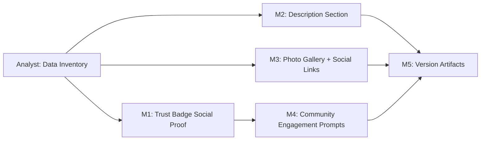

# Plan 087 — Provider Detail Page Content Enrichment

| Field          | Value                                                                  |
| -------------- | ---------------------------------------------------------------------- |
| Plan ID        | 087                                                                    |
| Target Release | next available patch after current origin/main v0.10.16; confirm at DevOps Stage 1 |
| Epic Alignment | Provider Content Depth & Community Trust — surface existing+enrichable data to make provider pages feel substantial and drive community engagement |
| Related Issues | None (originated from product owner competitive comparison, session S087) |
| Classification | Feature                                                                |
| Pipeline       | Full                                                                   |
| GitHub Issue   | https://github.com/abu-lina/uflow/issues/134                          |
| Created        | 2026-04-07T16:30Z                                                      |

## Changelog

| Date (UTC)          | Agent   | Change |
| ------------------- | ------- | ------ |
| 2026-04-07T16:30Z   | planner | Plan created from Orchestrator handoff. Competitive comparison with joinhalal.com drove scope. |

---

## Value Statement and Business Objective

> **As a Muslim community member browsing providers on UFlow**, I want to see rich, trust-building content on provider detail pages — including descriptions, photos, halal attributes, contact options, and social proof from community verifications — **so that** I can make informed decisions about visiting a provider and feel encouraged to engage with the community trust system.

**North-star metric**: Provider detail page engagement — measured by scroll depth, time-on-page, and trust badge confirmation rate. Target: increase average trust badge confirmations per provider view by 50% within 30 days of release.

---

## Differentiation Statement

**UFlow is not a halal directory. UFlow is a community trust platform.**

Joinhalal.com shows provider-claimed data: the provider fills in their description, uploads their certificate, declares their halal attributes. Trust is asserted.

UFlow's provider detail page must make **community verification the hero**. Every content section should either:
1. Show data that exists **and** surface how many community members have verified it, or
2. Invite the viewer to be the one who verifies it ("Be the first to confirm this")

The design principle: **"Information + Social Proof + Call to Action"** on every section, not just a data dump.

### What we will NOT copy from joinhalal:
- We will not create an "amenities checklist" where providers self-declare features without community validation
- We will not display data without a verification layer or engagement prompt
- We will not add sections purely for content density — every section must earn its place through user value or community engagement

### What we will uniquely add:
- **Trust badge confirmation counts + recency** ("12 community members confirmed HALAL — last confirmed 3 days ago")
- **Community engagement prompts** on empty/low-confirmation sections ("Be the first to confirm this provider offers prayer space")
- **Description section** with sourcing transparency (imported from joinhalal vs owner-written)
- **Photo gallery** that can grow via community contributions (future phase)

---

## Decision Record

1. **[RESOLVED]** _Community-first information hierarchy_: Content sections are ordered by community trust value, not by data completeness. Trust badges with confirmation counts appear above static informational sections (description, contact).
   - Rationale: UFlow's differentiator is community verification; the page layout must reinforce this.

2. **[RESOLVED]** _Description data source — existing DB column_: The `providers.provider_description` column already exists in the DB schema (migration 0000). The joinhalal Schema.org JSON-LD contains a `description` field. Plan 065's enrichment pipeline does NOT currently enrich `provider_description`. This plan requires the Analyst to confirm: (a) how many providers have a non-null `provider_description` today, (b) whether the joinhalal parser can extract `description` for enrichment. No new DB column needed for description.
   - Rationale: Column exists; data population is the gap, not schema.

3. **[RESOLVED]** _Scope boundary — Phase 1 vs deferred_: Phase 1 focuses on surfacing data that already exists or can be displayed with minimal schema changes. Complex new features (halal certificate upload/display, menu links, reservation/ordering, online ordering) are deferred to Phase 2.
   - Rationale: Ship user value quickly. Complex features need their own analysis + design.

4. **[RESOLVED]** _Halal attributes and amenities — deferred_: Joinhalal's halal attributes checklist and amenities checklist require new DB schema (structured attributes, not free-text). These are deferred until the Analyst investigates schema design for structured provider attributes.
   - Rationale: Adding a new attributes schema is a substantial investment; surface existing data first.

5. **[RESOLVED]** _Trust badge confirmation counts — UFlow-exclusive_: The existing `TrustBadgesSection` component shows badges and "Confirm" buttons but does NOT display how many community members have confirmed each badge or when the last confirmation occurred. Adding confirmation counts and recency is the highest-priority differentiation item.
   - Rationale: This is UFlow's unique value proposition. Joinhalal has no equivalent.

6. **[RESOLVED]** _Social links expansion_: The current UI shows web, phone, and Instagram icons. Adding Facebook is a low-effort parity item. The `providers` table does not have a `social_facebook` column — Analyst must confirm whether joinhalal Schema.org `sameAs` contains Facebook URLs that could populate this field.
   - Rationale: Low-effort win with visible impact.

7. **[RESOLVED]** _Nearby providers — deferred_: A "nearby providers" horizontal scroll section requires geospatial queries. This is a meaningful feature but out of scope for this plan. It deserves its own plan with proper geospatial design.
   - Rationale: Geospatial features add significant complexity; don't bundle with UI enrichment.

8. **[RESOLVED]** _Provider ownership scope_: This plan applies to ALL providers (both claimed and unclaimed). The UI changes are display-only — they show whatever data exists in the DB regardless of ownership. The Analyst must confirm data availability differs between claimed (owner-entered) vs unclaimed (import-sourced) providers.
   - Rationale: Users browsing providers don't care about ownership status; they want to see content.

---

## Release Strategy

Release Strategy: Standalone (no other known plans for this version).

---

## Prioritised Section List

### P1 — High Value, UFlow-Unique (must ship)

| Section | What | Why it's UFlow-unique |
| --- | --- | --- |
| **Trust badge confirmation counts + recency** | Show "N community members confirmed — last M days ago" on each trust badge | No competitor has this. Core UFlow differentiator. |
| **Community engagement prompts** | Show "Be the first to confirm [badge]" when count is 0; show encouraging prompt when count is low | Drives community participation — invites action, not just reading. |
| **Description section** | Display `provider_description` when available | Basic content depth. Even joinhalal has this. Existing DB column, just not surfaced. |

### P2 — Parity with Community Angle (should ship)

| Section | What | Community angle |
| --- | --- | --- |
| **Photo gallery** | Show multiple images from `provider_images` (JSONB) in a swipeable gallery | Already exists on the hero area; expand to show all available images in a dedicated gallery section below content. Future: accept community photo submissions. |
| **Expanded social links** | Surface Instagram, Facebook (if available), website, phone in a clear "Contact & Social" section | Move from small icon-only row to a labelled section with clearer tap targets. |

### P3 — Basic Parity (nice to have, ship if time allows)

| Section | What | Notes |
| --- | --- | --- |
| **Opening hours** | Display operating hours if available | Requires Analyst confirmation of data availability. joinhalal shows "Geöffnet 10:00 – 22:00". Schema.org has `openingHours`. |
| **Map snippet** | Show a static map image or link with provider location | Lat/lon already in DB. Can link to external maps app. |

### P4 — Out of Scope / Deferred

| Section | Reason for deferral |
| --- | --- |
| Halal certificate display | Requires new schema for certificate images, issuing body, dates. Separate plan. |
| Meat supplier info | Requires new schema. Low user value per effort. |
| Halal attributes checklist | Requires structured attributes schema design. Separate plan. |
| Amenities checklist | Same as above — needs structured attributes. |
| Menu/Speisekarte link | Requires new DB field. Low complexity but not core to trust differentiation. |
| Table reservation | Requires external booking integration or new link field. Separate plan. |
| Online ordering links | Requires Uber Eats / Lieferando integration. Separate plan. |
| Nearby providers | Requires geospatial queries. Separate plan. |
| Community-submitted photos | Requires moderation pipeline. Separate plan (Phase 2 of photo gallery). |

---

## Data Inventory — Questions for Analyst Phase

**REQUIRES ANALYSIS — REQUIRED before implementation:**

1. **Description population**: How many of the ~N approved providers have a non-null `provider_description`? What percentage of unclaimed joinhalal-imported providers have it? Does the joinhalal Schema.org `description` field contain usable content?

2. **Trust badge confirmation data**: What queries/views exist for counting badge confirmations per entity? Is there a `badge_confirmations` or `endorsements` table? What's the current data shape for confirmation timestamps (needed for recency display)?

3. **Photo gallery data shape**: What does `provider_images` JSONB actually contain for typical providers? Is it an array of URLs, an array of objects, or a single URL string? How many images do typical providers have?

4. **Social media URLs — Facebook**: Does the joinhalal Schema.org `sameAs` field contain Facebook URLs? How many imported providers have a Facebook URL available? Would we need a new `social_facebook` column on `providers` or store it differently?

5. **Opening hours**: Is there an `opening_hours` or similar field in the DB? Does the joinhalal Schema.org contain `openingHoursSpecification`? Would this require a new column?

6. **Description enrichment feasibility**: Can `provider_description` be added to Plan 065's `SOURCE_ENRICHABLE_FIELDS` and `ParsedEnrichmentData` type so the enrichment pipeline populates it during re-runs?

---

## Milestone Dependencies

**Sequencing rule**: M1 (trust badge counts) may begin as soon as Analyst confirms the confirmation data shape. M2 and M3 are independent and can proceed in parallel. M4 depends on M1 (engagement prompts need the confirmation count infrastructure). M5 is final release prep.

---

## Plan

### Pre-Implementation: Analyst Data Inventory

**Objective**: Answer the 6 data inventory questions above before any implementation begins.

**Deliverable**: Analysis document at `agent-output/analysis/087-provider-detail-data-inventory.md` covering data availability findings for each question.

**Acceptance Criteria**:
- Each of the 6 questions answered with evidence (query results, code inspection)
- Clear recommendation on which P1/P2/P3 sections have sufficient data to implement now
- Description enrichment feasibility confirmed or flagged as requiring a separate enrichment pipeline update

---

### Milestone 1 — Trust Badge Social Proof (P1)

**Objective**: Transform the existing trust badge section from showing static badges into a community social proof engine.

**Deliverables**:
- Enhance the `TrustBadgesSection` component to display confirmation count per badge
- Show recency indicator ("last confirmed X days ago") when confirmations exist
- Display total unique confirmers prominently ("Verified by N community members")
- Ensure the data fetching (existing `getBadgesForEntityWithConfirmationStatus`) provides the needed counts

**Acceptance Criteria**:
- Each trust badge shows its confirmation count (e.g., "HALAL ✅ 12")
- Most-recently-confirmed timestamp is visible per badge or per section
- Zero-confirmation badges are visually distinguishable from confirmed ones
- Performance: no additional database round-trips beyond what's already fetched

---

### Milestone 2 — Description Section (P1)

**Objective**: Surface the provider description that already exists in the database but is not displayed.

**Deliverables**:
- Add a collapsible "Beschreibung" / "Description" section to both mobile (`ProviderDetailPage`) and desktop (`ProviderDetailModal`) views
- Display `provider_description` when available; hide section when null/empty
- Position below the info card and above trust badges (information before action)
- If Analyst confirms enrichment feasibility: update Plan 065's `SOURCE_ENRICHABLE_FIELDS` to include `provider_description` (separate small enrichment pipeline update, scoped as a sub-task)

**Acceptance Criteria**:
- Provider detail page shows description text when `provider_description` is non-null
- Section is hidden (not collapsed) when description is absent — no empty states for informational sections
- Both mobile and desktop layouts render the description consistently
- Description text is properly sanitised (no raw HTML injection)

---

### Milestone 3 — Photo Gallery & Social Links Expansion (P2)

**Objective**: Make the provider page feel more visually substantive by expanding the image display and making social/contact links more prominent.

**Deliverables**:
- **Photo gallery**: If `provider_images` contains multiple images, show a dedicated "Fotos" section below the hero with a grid/scroll layout. The hero already shows images via swipe — this section makes all images visible and browseable.
- **Social links expansion**: Replace the current small icon row with a labelled "Kontakt & Social Media" section showing: Website, Phone, Instagram, and Facebook (if available) with clear labels and tap targets.
- Analyst findings will determine whether a `social_facebook` column is needed or if Facebook URLs can be extracted from existing data.

**Acceptance Criteria**:
- Multiple images are visible without swiping through the hero
- Social links section shows all available contact methods with labels (not just icons)
- Instagram and Facebook links open correctly in-app or in browser
- Section gracefully handles missing data (e.g., no Facebook available)

---

### Milestone 4 — Community Engagement Prompts (P1)

**Objective**: Turn empty/low-engagement states into invitations, not dead ends.

**Deliverables**:
- When a trust badge has 0 confirmations: show "Be the first to confirm [badge name]" with a prominent CTA
- When a badge has low confirmations (1–3): show encouraging text ("You and N others confirmed this — help build community trust")
- When description is absent: consider showing a subtle prompt for providers or community members (design decision for Implementer)
- These prompts must respect authentication state (unauthenticated users see prompts directing to login)

**Acceptance Criteria**:
- Zero-confirmation badges show engagement prompt instead of just a "Confirm" button
- Engagement prompts are culturally appropriate and motivating (German + English i18n)
- Prompts do not appear for already-confirmed badges (user has already confirmed)
- Authentication-gated: unauthenticated users are directed to login when tapping engagement prompts

---

### Milestone 5 — Version Artifacts

**Objective**: Update version and release documentation.

**Tasks**:
- Update `package.json` version to target release
- Add CHANGELOG entry documenting all deliverables
- Verify no regressions in existing provider detail functionality
- Commit all changes

**Acceptance Criteria**:
- Version artifacts updated and consistent
- CHANGELOG reflects all shipped sections
- All existing tests pass (`vitest`, `tsc`, `npm run lint`)

---

## Testing Strategy

**Expected test types**:
- **Unit tests**: Trust badge confirmation count display logic, description sanitisation, social link normalisation
- **Component tests**: TrustBadgesSection with various confirmation count states (0, 1, 5, 100+), description section visibility toggle, photo gallery rendering
- **Integration tests**: Provider detail page renders all new sections with realistic data fixtures
- **Regression tests**: Existing bookmark, share, navigation functionality unaffected

**Coverage expectations**: New components/sections should have ≥80% coverage. Existing code changes should not decrease coverage.

**Critical scenarios**: Empty states (no description, no photos, 0 confirmations), responsive layout (mobile 320px through desktop 1920px), i18n (German and English), authentication states (logged in vs anonymous for engagement prompts).

---

## Risks

| Risk | Severity | Mitigation |
| --- | --- | --- |
| Description data is empty for most providers | Medium | Analyst phase will quantify. If <10% have descriptions, Description section (M2) may be deprioritised. Plan 065 enrichment update can backfill. |
| Trust badge confirmation data shape is insufficient | Medium | Analyst must confirm the endorsement/confirmation schema supports counts + timestamps. If not, M1 scope may require a lightweight schema enhancement. |
| Provider detail page is already 1064 lines (mobile) | Low | New sections should be extracted into sub-components, not inline. Implementer to decide component boundaries. |
| `provider_images` JSONB shape varies | Low | Analyst to document the actual shape. Parser utility already exists (`getAllTrustedImageUrlsWithFallback`). |

---

## Duration Estimates

| Phase | Estimate | Key Uncertainty |
| --- | --- | --- |
| Analysis | 1–2 hours | Depends on data availability in DB |
| Planning | Complete (this document) | — |
| Implementation | 2–3 days | Trust badge social proof (M1+M4) is the most complex; M2+M3 are straightforward UI |
| QA | 0.5–1 day | Automated tests + visual regression |
| UAT | 0.5 day | User验证 on UAT environment |
| DevOps | 0.5 day | Standard release pipeline |

**Total estimated**: 4–7 days end-to-end.
**Key uncertainty driver**: Analyst findings on data availability may reduce or expand implementation scope.

---

## Dependencies

- **Plan 065 (Enrichment Pipeline)**: If description enrichment is feasible, a small update to Plan 065's enrichment field list is needed. This is scoped as a sub-task of M2, not a blocking dependency. Plan 065's open actions DF-3 (atomic approve RPC) and DF-4 (stale candidate filter) do NOT block this plan — they are scheduling-phase items, and this plan only reads existing data.

- **Existing badge/endorsement system**: M1 and M4 depend on the current badge confirmation infrastructure (the `getBadgesForEntityWithConfirmationStatus` service function and underlying DB tables). Analyst must confirm this provides confirmation counts.

---

## Out of Scope

- **New structured attribute schemas** (halal attributes, amenities, meat suppliers) — these need their own plan with proper DB design
- **Halal certificate display** — requires image storage, issuing body metadata, expiration tracking
- **Reservation/ordering integrations** — requires external service integration
- **Nearby providers geospatial feature** — significant standalone feature
- **Community photo submissions** — requires moderation pipeline (Phase 2)
- **Joinhalal data re-import or backfill** — this plan displays existing data; enrichment pipeline updates are scoped as sub-tasks only for description field
- **QA processes and test cases** — QA agent's exclusive responsibility
