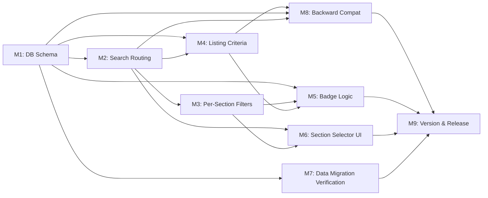

# Plan 089 — Three-Section Search & Listing Redesign (FOOD / UMMAH / BUSINESS)

| Field          | Value                                                                                     |
| -------------- | ----------------------------------------------------------------------------------------- |
| Plan ID        | 089                                                                                       |
| Target Release | next available minor after current origin/main v0.10.17; confirm at DevOps Stage 1        |
| Epic Alignment | Epic 2.2 (City Community Pages & Discovery) + new Epic: Section-Based Discovery           |
| Related Issues | None                                                                                      |
| Classification | Feature                                                                                   |
| Pipeline       | Full                                                                                      |
| GitHub Issue   | https://github.com/abu-lina/uflow/issues/137                                             |
| Created        | 2026-04-09T11:54Z                                                                         |

## Changelog

| Date               | Author  | Change                          | Rationale                        |
| ------------------ | ------- | ------------------------------- | -------------------------------- |
| 2026-04-09T11:54Z  | planner | Plan created                    | Initial draft from S89 session   |
| 2026-04-09T13:32Z  | planner | Rev 1: Critique findings addressed | F1 (data model authority), F2 (JoinHalal pipeline), F3 (enrichment deferred), F4 (category reclassification), F5 (default section D9), F6 (Who field clarified), F7 (Gemeinschaft providers), F9 (i18n), Q3 (legacy URLs) |
| 2026-04-11T18:15Z  | code-reviewer | Status updated to Code Review Approved | Round 2 review passed (APPROVED_WITH_COMMENTS) |
| 2026-04-11T18:55Z  | uat | Status updated to UAT Approved | UAT Complete — value statement delivered, approved for release |

---

## Value Statement and Business Objective

**As a** Muslim seeking services or businesses on UFlow,
**I want to** browse and search within purpose-built sections — **FOOD** (halal dining), **UMMAH** (community services), and **BUSINESS** (Muslim-owned businesses) — each with its own listing criteria, default filters, and trust badges,
**So that** I immediately find what I need without wading through irrelevant results, I trust the listings because each section enforces clear standards (halal for food, Muslim-owned for business, community-serving for Ummah), and UFlow becomes my instinctive first choice for category-specific Muslim service discovery.

### Alignment with Master Product Objective

> "Make UFlow the first thought when any Muslim seeks a service or business."

The current single-list search conflates restaurants, mosques, and businesses into one undifferentiated stream. Splitting into three purpose-built sections:

- **Reduces friction**: Users pick a section matching their intent, not a generic "All"
- **Increases trust**: Each section enforces its own listing criteria (e.g., FOOD excludes non-halal, BUSINESS enforces Muslim-owned)
- **Enables section-specific badges**: Halal star levels (1–3) for FOOD; Ummah Boost/Barakah for FOOD+BUSINESS
- **Foundation for growth**: Each section can evolve independently (FOOD → restaurant menus; UMMAH → events calendar; BUSINESS → professional directories)

---

## Release Strategy

Standalone (no other known non-closed plans targeting the same version). This is a minor version bump due to the scope of the architectural change (new DB columns, new enum type, new search routing, new UI section selector).

---

## Decision Record

| #  | Decision                                                        | Status                                                                          |
| -- | --------------------------------------------------------------- | ------------------------------------------------------------------------------- |
| D1 | **FOOD/BUSINESS split lives on `providers.listing_type`**, not separate tables | [RESOLVED] Single table avoids data duplication, schema proliferation, and migration complexity. Classification is a discriminator column, not a structural boundary. |
| D2 | **UMMAH section maps directly to the existing `community_services` table** | [RESOLVED] Community services are already physically separated; no schema change needed for UMMAH entities. |
| D3 | **Category → listing_type mapping is the classification source** | [RESOLVED] "Essen & Trinken" category → FOOD; "Gemeinschaft & Spenden" → UMMAH (via community_services table); all other categories → BUSINESS. The migration seeds `listing_type` based on `category_id`. |
| D4 | **`listing_type` is nullable with default NULL for backward compatibility** | [RESOLVED] Existing providers get backfilled in the migration. New providers get `listing_type` set at creation time based on category. NULL is treated as BUSINESS at query time (fail-safe). |
| D5 | **Halal level (1–3 stars) is a new integer column on `providers`**, not a badge_types extension | [RESOLVED] Star-level granularity (1=halal meat, 2=halal meat+no alcohol, 3=halal meat+no alcohol+no pork) is a scored attribute, not a boolean badge. A column is simpler and queryable via index. |
| D6 | **`muslim_owned` is a boolean column on `providers`**, not only a badge | [RESOLVED] BUSINESS section default filter requires fast boolean filtering. Existing MUSLIM_OWNED badge remains for display; the column is the query-time filter source. |
| D7 | **Section selector replaces the current "All" category default** | [RESOLVED] The top-level navigation becomes FOOD / UMMAH / BUSINESS tabs/selector. Within each section, categories filter further (e.g., FOOD → Essen & Trinken sub-categories). |
| D8 | **Out of scope: Muslim-owned verification mechanism** | [RESOLVED] The `muslim_owned` column is self-declared or admin-set. Verification (document upload, community confirmation) is a future epic. |
| D9 | **Default section is FOOD** | [RESOLVED] Halal dining discovery is the primary use case and JoinHalal data makes FOOD the richest dataset. First-load UX shows FOOD section. URL without `?section=` defaults to FOOD. |
| D10 | **Boolean columns are the authoritative filter source; `barakah_effects` is deprecated for structured attributes** | [RESOLVED] See "Data Model Authority" section below. New boolean columns replace `barakah_effects` for filterable attributes. Existing `badge_types` remain for display/trust semantics only. |
| D11 | **Legacy Gemeinschaft & Spenden providers in `providers` table are excluded from section assignment** | [RESOLVED] M1 migration sets `listing_type = NULL` for providers with `category_id = '4470c3e0-...'`. M8 NULL fallback renders them in BUSINESS but M7 verification flags them for manual migration to `community_services`. |
| D12 | **"Who" search dimension is conceptual, not a separate input field** | [RESOLVED] The current unified text search already queries provider names via `search_provider_ids_by_name` tsvector RPC alongside offers/needs. "Who" in the attachment digest is satisfied by the existing search. No separate input field or RPC needed. |

---

## Data Model Authority (Rev 1 — addresses F1)

The plan introduces boolean columns that overlap with two existing attribute sources. This section clarifies the authoritative source for each concern:

| Attribute Concern | Authoritative Source (post-migration) | Legacy Source(s) | Migration Strategy |
|---|---|---|---|
| **Filtering** (query-time: "show only family-friendly") | New boolean columns (`family_friendly`, `women_friendly`, `has_prayer_space`, etc.) | `barakah_effects TEXT[]` | M1 migration backfills booleans from `barakah_effects` string matching. After migration, booleans are the filter source. |
| **Display / Trust** (UI badges with trust levels) | `provider_badges` table + `badge_types` (`FAMILY_FRIENDLY`, `WOMEN_FRIENDLY`, `PRAYER_FRIENDLY`) | — (no change) | Badge system unchanged. Badges show trust level (self-declared → community-confirmed → verified). Booleans do not replace badges. |
| **Free-form tags** | `barakah_effects TEXT[]` (deprecated for structured attributes) | — | `barakah_effects` continues to exist for non-structured tags (e.g., custom provider-specific tags). Structured attributes (`family_friendly`, `women_friendly`, etc.) are no longer written to `barakah_effects` by creation/edit flows — they use the boolean columns instead. |

**Migration path for `barakah_effects`**:
- M1 migration scans `barakah_effects` for known German strings (e.g., `'familienfreundlich'`, `'gebetsfreundlich'`, `'frauenfreundlich'`) and sets corresponding boolean columns
- After backfill, provider creation/edit flows write to boolean columns, NOT `barakah_effects`, for structured attributes
- `barakah_effects` is NOT dropped — it remains for free-form/custom tags
- Future cleanup: a follow-up plan removes structured attribute strings from `barakah_effects` arrays

**Relationship summary**: Booleans = fast filtering. Badges = trust display. `barakah_effects` = free-form only.

---

## Assumptions

1. The existing `categories` table continues to exist; `listing_type` is a higher-level grouping above categories.
2. The "Essen & Trinken" category is the sole FOOD-section category in the current data. If new food sub-categories are added later, they will also be tagged FOOD.
3. The `community_services` table is the canonical UMMAH entity source; providers with category "Gemeinschaft & Spenden" are legacy and should not appear in the FOOD or BUSINESS sections.
4. Badge computation (halal stars, ummah boost) is derived from DB attributes at query time or via a lightweight computed column / view; no new badge_types rows needed for halal stars.
5. The existing `SearchProvider` context can be extended with a `section` field without breaking current consumers.
6. The existing tsvector RPC functions (`search_offers`, `search_needs`, `search_provider_ids_by_name`) continue to work within section-filtered queries.

---

## Milestones

### M1 — Database Schema: `listing_type` Discriminator + Section Attributes

**Objective**: Add the `listing_type` column to `providers`, add `halal_level` and `muslim_owned` columns, and backfill existing rows.

**Deliverables**:

1. New migration file in `supabase/migrations/` that:
   - Creates enum type `listing_type_enum` with values `'food'`, `'business'`
   - Adds `listing_type listing_type_enum` column to `providers` (nullable, no default yet)
   - Adds `halal_level SMALLINT` column to `providers` (nullable, CHECK 1–3)
   - Adds `muslim_owned BOOLEAN DEFAULT false` column to `providers`
   - Adds section-relevant filter attribute columns to `providers`: `no_alcohol BOOLEAN DEFAULT false`, `no_pork BOOLEAN DEFAULT false`, `no_gambling BOOLEAN DEFAULT false`, `has_prayer_space BOOLEAN DEFAULT false`, `family_friendly BOOLEAN DEFAULT false`, `women_friendly BOOLEAN DEFAULT false`, `children_friendly BOOLEAN DEFAULT false`, `accepts_donations BOOLEAN DEFAULT false`, `has_parking BOOLEAN DEFAULT false`, `solidarity_pricing BOOLEAN DEFAULT false`
   - Backfills `listing_type`: providers with "Essen & Trinken" category → `'food'`; providers with "Gemeinschaft & Spenden" category (`4470c3e0-458f-40a6-a96e-ca0fbdf145d7`) → `NULL` (excluded from section assignment per D11); all others → `'business'`
   - Backfills `muslim_owned` from existing `MUSLIM_OWNED` badge: `UPDATE providers SET muslim_owned = true WHERE provider_id IN (SELECT entity_id FROM provider_badges pb JOIN badge_types bt ON pb.badge_type_id = bt.id WHERE bt.badge_key = 'MUSLIM_OWNED' AND pb.entity_type = 'provider')`
   - Backfills boolean columns from `barakah_effects` string matching (per Data Model Authority section): scan for known German strings and set corresponding booleans
   - Creates index: `CREATE INDEX idx_providers_listing_type ON providers (listing_type)`
   - Creates index: `CREATE INDEX idx_providers_muslim_owned ON providers (muslim_owned) WHERE muslim_owned = true`
   - Creates index: `CREATE INDEX idx_providers_halal_level ON providers (halal_level) WHERE halal_level IS NOT NULL`
2. Update the `review_status` enum extension migration (060) compatibility: the new columns must not conflict with existing `removed_by_owner` status

**Acceptance Criteria**:

- Migration runs idempotently on local and staging
- All existing providers have a non-NULL `listing_type` after backfill
- `muslim_owned` is backfilled from badge data
- Indexes exist and are used (verify with `EXPLAIN ANALYZE` on a sample query)
- No existing RLS policies broken

**Owner**: Implementer
**Dependencies**: None (first milestone)

---

### M2 — Section-Aware Search Context & Routing

**Objective**: Extend the search context and service layer to route queries through a section filter.

**Deliverables**:

1. Extend `SearchProvider` (`src/providers/search-provider.tsx`) with:
   - `selectedSection: 'food' | 'ummah' | 'business'` state (default: `'food'` per D9 — halal dining is the primary use case and richest dataset)
   - `setSelectedSection` setter
2. Update `searchProvidersAndCommunityServices()` in `src/services/providers.ts`:
   - Accept a `section` parameter
   - When `section === 'ummah'`: delegate entirely to `searchCommunityServicesOnly()`
   - When `section === 'food'`: call `searchProviders()` with `listing_type = 'food'` filter
   - When `section === 'business'`: call `searchProviders()` with `listing_type = 'business'` filter
   - Remove the current `getSearchStrategy()` function that relies on category-based routing (replaced by section-based routing)
3. Update `searchProviders()` to accept and apply a `listing_type` filter:
   - Add `.eq('listing_type', listingType)` to the Supabase query
4. Update the `SearchResult` type to include `section` information
5. Update callers of `searchProvidersAndCommunityServices()` to pass the section

**Acceptance Criteria**:

- Searching in FOOD section returns only `listing_type = 'food'` providers
- Searching in UMMAH section returns only community services
- Searching in BUSINESS section returns only `listing_type = 'business'` providers
- No cross-section leakage in results
- Admin search (Plan 058) continues to work within the section context

**Owner**: Implementer
**Dependencies**: M1

---

### M3 — Per-Section Default & Optional Filters

**Objective**: Each section applies its own default filters and exposes section-specific optional filters.

**Deliverables**:

1. Define a section filter configuration (in a new file, e.g., `src/config/sectionFilters.ts`) that declares per section:
   - **FOOD defaults**: `muslim_owned = true` (ON by default, toggleable)
   - **FOOD optional filters**: `accepts_donations`, `has_parking`, `solidarity_pricing`, `family_friendly`, `children_friendly`, `women_friendly`, `has_prayer_space`
   - **UMMAH defaults**: (community-serving is implicit by table selection; no additional boolean defaults)
   - **UMMAH optional filters**: determined by community service attributes (future; initially none)
   - **BUSINESS defaults**: `muslim_owned = true` (ON by default — primary differentiator)
   - **BUSINESS optional filters**: `accepts_donations`, `solidarity_pricing`
2. Extend `searchProviders()` to accept a `filters: Record<string, boolean>` parameter and apply `.eq()` for each truthy filter
3. Expose filter controls in the SearchBar or a dedicated FilterBar component per section
4. Persist active filters in URL search params (e.g., `?section=food&muslim_owned=true&has_parking=true`) for shareability

**Acceptance Criteria**:

- On first visit, FOOD section shows only results where `muslim_owned = true` (user can toggle off)
- On first visit, BUSINESS section shows only results where `muslim_owned = true` (user can toggle off)
- Optional filters are only visible for the active section (e.g., `has_prayer_space` not shown in BUSINESS)
- Filter state is reflected in URL params and restored on page load

**Owner**: Implementer
**Dependencies**: M1, M2

---

### M4 — Listing Criteria Enforcement

**Objective**: Ensure each section only shows providers meeting its listing criteria.

**Deliverables**:

1. **FOOD listing criteria** (enforced at query time):
   - Provider must be `listing_type = 'food'`
   - Provider's offers must include halal food (validated via offer tags / category)
   - Exclude providers flagged with `no_alcohol = false` AND `no_pork = false` AND `no_gambling = false` — this is NOT exclusion; these columns express "this provider conforms to the constraint." A FOOD provider with `no_alcohol = true` means the provider does NOT serve alcohol. The filter logic is: FOOD default view shows all FOOD providers; listing criteria at data-entry time determines `listing_type` classification.
2. **BUSINESS listing criteria** (enforced at query time):
   - Provider must be `listing_type = 'business'`
   - Provider must have `no_gambling = true` (cannot be a gambling venue)
3. **UMMAH listing criteria** (already enforced by `community_services` table):
   - Entity is in the `community_services` table
4. Update provider creation flow (`src/services/providerService.ts`, `src/features/providers/StreamlinedImportForm.tsx`, `src/features/providers/StreamlinedRecommendForm.tsx`) to:
   - Set `listing_type` automatically based on selected category
   - For FOOD category creation: pre-set `halal_level`, `no_alcohol`, `no_pork`, `no_gambling` toggles
5. Update admin provider editing to allow `listing_type` override and section attribute editing
6. **JoinHalal import pipeline update (Rev 1 — addresses F2)**:
   - Update the import record builder (`src/lib/import/joinhalal.ts:~490`) to set `listing_type = 'food'` for all JoinHalal imports (they are all food providers)
   - Set `no_alcohol = true` for records that pass the `hasAlkoholverkauf()` check (i.e., records NOT rejected for alcohol)
   - Set `muslim_owned = false` (JoinHalal does not provide ownership data — admin/enrichment sets later)
   - Set `halal_level = 1` as default for JoinHalal imports (halal meat available; higher levels require manual assessment)
   - Update the upsert RPC in `supabase/migrations/` to include `listing_type`, `no_alcohol`, `halal_level` in the INSERT/UPDATE column lists
   - Ensure existing `hasAlkoholverkauf()` auto-rejection logic continues to work (records with alcohol are rejected, not imported with `no_alcohol = false`)

**Acceptance Criteria**:

- A provider in "Essen & Trinken" category is automatically classified as FOOD
- A provider in any other non-community category is automatically classified as BUSINESS
- New providers created via recommend/import forms get correct `listing_type`
- Admin can reclassify a provider's `listing_type`
- FOOD listing criteria prevents non-halal venues from appearing in FOOD results
- JoinHalal-imported providers have `listing_type = 'food'`, `no_alcohol = true`, and `halal_level = 1` set automatically (Rev 1 — F2)
- JoinHalal upsert RPC includes the new columns

**Owner**: Implementer
**Dependencies**: M1, M2

---

### M5 — Badge Logic: Halal Stars + Ummah Boost

**Objective**: Implement computed badge display logic for halal star levels and Ummah Boost/Barakah badges.

**Deliverables**:

1. **Halal Star Level (FOOD only)**:
   - Display 1–3 stars on FOOD provider cards based on `providers.halal_level`:
     - ★ (1): Halal meat available
     - ★★ (2): Halal meat + no alcohol served
     - ★★★ (3): Halal meat + no alcohol + no pork on premises
   - `halal_level` is set at provider creation/editing time and is an aggregate of `no_alcohol` and `no_pork` booleans (implementer computes: level = 1 + (no_alcohol ? 1 : 0) + (no_pork ? 1 : 0))
   - Only displayed for `listing_type = 'food'` providers
2. **Ummah Boost / Barakah Badge (FOOD + BUSINESS)**:
   - Computed from: `muslim_owned = true` AND at least 2 of (`accepts_donations`, `solidarity_pricing`, `has_prayer_space`, `family_friendly`, `women_friendly`) are true
   - Displayed as a single "Barakah" badge with optional star level (future)
   - Applicable to FOOD and BUSINESS sections only
3. Both badge computations happen at the service/UI layer from existing DB columns — no new badge_types rows needed for halal stars
4. Extend `ProviderBadgeWithType` or create a `ComputedBadge` type to represent these derived badges alongside existing DB badges
5. Update provider card components to render halal stars and Barakah badge when applicable

**Acceptance Criteria**:

- FOOD provider cards display 1–3 halal stars based on `halal_level`
- Barakah badge appears on qualifying FOOD and BUSINESS providers
- Badges do NOT appear in the wrong section (no halal stars in BUSINESS)
- Badge rendering is consistent with existing badge UI (trust level display, tooltips)

**Owner**: Implementer
**Dependencies**: M1, M3, M4

---

### M6 — Section Selector UI + Per-Section SearchBar Adaptation

**Objective**: Replace the current unified search with a section-aware navigation and per-section search experience.

**Deliverables**:

1. **Section Selector**: A tab bar, pill selector, or navigation component at the top of the discovery page with FOOD / UMMAH / BUSINESS options
   - Visually distinct (icons + labels)
   - Updates URL: `/providers?section=food`, `/providers?section=ummah`, `/providers?section=business`
   - Persists section in URL for shareable links
2. **Per-section SearchBar fields** (Rev 1 — F6 resolved via D12: "Who" is conceptual, not a separate field):
   - **FOOD**: What (text search — already includes provider name via tsvector) + Where (city) — two input fields
   - **UMMAH**: Simple text search (What)
   - **BUSINESS**: What (text search) + Where (city) — two input fields
3. **Category dropdown scoped to section**: When in FOOD, only show food-related categories; in BUSINESS, only show business categories
4. **Filter chip bar**: Show default + optional filters as toggleable chips below the search bar, section-specific
5. Responsive design: mobile-first, section selector swipeable on mobile

**Acceptance Criteria**:

- Section selector is visible and interactive on all viewport sizes (320px–1920px)
- Switching sections updates search context, clears previous results, shows section-appropriate filters
- Search fields adapt to section (all sections have What+Where; UMMAH has What only)
- URL reflects section state and can be shared
- Keyboard navigation and ARIA labels on section selector
- Section labels are translated in all supported locales (de, en, ar, tr, ur, ps) via `next-intl` translation files (Rev 1 — F9)

**Owner**: Implementer
**Dependencies**: M2, M3

---

### M7 — Data Migration & Classification of Existing Providers

**Objective**: Ensure all existing providers are correctly classified into FOOD or BUSINESS.

**Deliverables**:

1. The M1 migration handles the initial backfill via category mapping
2. Create a verification query (in `sql/` for reference/debug) that reports:
   - Count of providers per `listing_type`
   - Any providers with `listing_type IS NULL` (should be zero)
   - Food providers without `halal_level` set (expected initially — admin/enrichment sets this later)
   - Providers with `muslim_owned = true` cross-checked against MUSLIM_OWNED badge
   - **Providers with `category_id = '4470c3e0-...'` (Gemeinschaft & Spenden) in the `providers` table** — count and flag for manual migration to `community_services` (Rev 1 — F7)
3. Document classification rules so operators understand how new categories map to sections

**Acceptance Criteria**:

- Zero providers with `NULL listing_type` after migration
- Category-to-section mapping is documented
- Verification query runs cleanly on staging

**Owner**: Implementer
**Dependencies**: M1

---

### M8 — Backward Compatibility & Migration Safety

**Objective**: Ensure the transition does not break any existing functionality.

**Deliverables**:

1. **Fallback behavior**: If `listing_type` is NULL (defensive), treat as BUSINESS (fail-safe documented in D4)
2. **Admin search**: Existing admin moderation flow (Plan 058) must work within the new section context. Admin can filter by section OR see all providers regardless of section
3. **Bookmarks/Saved**: Saved providers retain their bookmarks across the section transition; the `/saved` page groups by section or shows all
4. **Provider detail page**: No section-gating on detail view — any provider is viewable via direct link `/providers/:id` regardless of which section it belongs to
5. **Recommend/Import forms**: Updated to set `listing_type` (M4) but remain backward-compatible if called without section context
6. **Existing tsvector RPC functions**: Continue to work; section filtering is applied at the application layer via PostgREST `.eq('listing_type', ...)`, not inside the RPC
7. **Legacy URL handling (Rev 1 — addresses Q3)**: Existing `/providers?category=...` URLs without `?section=` must continue to work:
   - If `section` param is missing, infer section from `category` param: if category is "Essen & Trinken" UUID → `section=food`; if "Gemeinschaft & Spenden" UUID → `section=ummah`; otherwise → `section=business`
   - If neither `section` nor `category` is present, default to `section=food` per D9
   - This inference happens in the SearchBar URL-sync logic (already reads `searchParams`)
8. **Category reclassification sync (Rev 1 — addresses F4)**: When admin changes a provider's `category_id` via the edit flow, the admin edit UI MUST prominently surface the `listing_type` field alongside category. The implementer should add a client-side helper that suggests the correct `listing_type` when category changes (e.g., changing to Essen & Trinken → suggest FOOD). A DB trigger is NOT added (YAGNI — admin edits are low-volume and the UI guardrail is sufficient).

**Acceptance Criteria**:

- All existing bookmarks still visible in `/saved`
- Direct links to providers work regardless of section
- Admin moderation is not broken
- No degradation in search performance (EXPLAIN ANALYZE evidence)
- Existing test suite passes (0 new failures from schema change)
- Legacy `/providers?category=...` URLs without `?section=` continue to work by inferring section from category (Rev 1 — Q3)
- Admin edit UI surfaces `listing_type` alongside category with suggestion helper (Rev 1 — F4)

**Owner**: Implementer
**Dependencies**: M1, M2, M4

---

### M9 — Version Management & Release Artifacts

**Objective**: Update version artifacts to match the target release.

**Deliverables**:

1. Update `package.json` version
2. Add CHANGELOG.md entry documenting the three-section search redesign
3. Update README if needed (search architecture section)
4. Commit all changes

**Acceptance Criteria**:

- `package.json` version matches target release
- CHANGELOG reflects all milestones delivered
- Version matches roadmap entry

**Owner**: DevOps
**Dependencies**: M1–M8

---

## Milestone Dependencies

**Sequencing rule**: M1 (schema) must complete first. M2 (search routing) and M7 (data verification) can begin immediately after M1. M3 (filters), M4 (listing criteria), and M5 (badges) are parallelizable after their deps. M6 (UI) requires M2+M3. M8 (backward compat) is a cross-cutting validation milestone. M9 (release) is terminal.

---

## Entity Ownership Check

This plan applies to **both claimed and unclaimed providers**:

- `listing_type` classification applies to ALL providers regardless of `provider_owner_id` status
- `muslim_owned` backfill from badges applies to all providers
- Filter enforcement at query time applies universally
- The `listing_type` column is set by category mapping, not by ownership. Ownership status does not affect section classification.

No fail-closed behavior is required for ownership status changes, since `listing_type` is category-derived, not owner-derived.

---

## Shared Results Actionability Check

With three sections, the search result list is scoped to a single entity type per section:

| Section  | Entity Types Returned        | Actions Available                          |
| -------- | ---------------------------- | ------------------------------------------ |
| FOOD     | `provider` (listing_type=food) | Bookmark, View Detail, Endorse, Confirm Badge |
| UMMAH    | `community_service`          | Bookmark, View Detail                      |
| BUSINESS | `provider` (listing_type=business) | Bookmark, View Detail, Endorse, Confirm Badge |

- Admin actions (approve/reject) apply to providers only (FOOD + BUSINESS), NOT community services — consistent with Plan 058
- Switching sections clears results; no mixed-type result lists within a section
- The current `SearchResult.type` field (`'provider' | 'community_service'`) remains valid and serves as an additional safeguard

---

## Testing Strategy

- **Unit tests**: Section filter configuration, halal level computation, listing_type-to-section mapping, computed badge logic
- **Integration tests**: Search routing per section (FOOD/UMMAH/BUSINESS returns correct entity types), filter application, URL param serialization/deserialization
- **Migration tests**: Verify backfill correctness on local Supabase, NULL-check assertions, index existence
- **Regression tests**: Existing search, bookmarks, admin moderation, provider detail page, recommend/import forms
- **Accessibility tests**: Section selector keyboard navigation, ARIA labels, screen reader behavior

---

## Risks

| Risk | Severity | Mitigation |
|------|----------|------------|
| Existing providers misclassified by category mapping | Medium | M7 verification query; admin can reclassify via M4 |
| Performance regression from added filters | Low | Indexed columns (M1); EXPLAIN ANALYZE evidence required (M8) |
| Section selector confusing for existing users | Medium | Consider "All" fallback or progressive disclosure; UX review in UAT |
| `halal_level` data quality (most will be NULL initially) | Medium | Treat NULL as "not assessed yet"; display "Halal level pending" rather than hiding |
| Breaking admin moderation flow | High | M8 explicit backward-compat testing; admin can optionally see cross-section |

---

## Duration Estimates

| Phase            | Estimate   | Uncertainty Drivers                                        |
| ---------------- | ---------- | ---------------------------------------------------------- |
| Analysis         | 0.5 day    | Scope is well-defined from session handoff                 |
| Planning         | 0.5 day    | This document                                              |
| Implementation   | 5–8 days   | DB migration + search refactor + UI section selector + badges; main risk is UI polish and filter UX |
| QA               | 2–3 days   | Cross-section search validation, regression, accessibility  |
| UAT              | 1–2 days   | Mobile + desktop section navigation, badge display, filter behavior |
| DevOps           | 0.5 day    | Migration deployment, version bump                          |
| **Total**        | **10–15 days** | Uncertainty: UI polish, edge cases in category→section mapping, halal_level data quality |

---

## Out of Scope

1. **Muslim-owned verification mechanism** — `muslim_owned` is self-declared or admin-set; document verification is a future epic
2. **UMMAH sub-type navigation** (mosques vs charities vs events) — community_services remain a flat list
3. **Bulk reclassification tool** for operators — admin can reclassify one-by-one in M4; bulk tool is future
4. **Filter preference persistence** — filters reset on page load (URL params provide one-time shareability)
5. **New search ranking algorithm** — ranking remains by `created_at` descending within each section
6. **Section-specific landing pages** with curated content — sections are search/filter surfaces only
7. **Badge confirmation/verification flow changes** — existing badge trust system unchanged
8. **Enrichment pipeline update for new columns** (Rev 1 — F3 deferred) — Adding `halal_level`, `muslim_owned`, `listing_type` etc. to `enrichment-fields.ts` allow-list is deferred to Plan 065 M4/M5. Owner: Implementer of Plan 065. Trigger: when enrichment pipeline is next touched. The new columns exist and enrichment can propose values once the allow-list is updated, but this is not blocking for the three-section search launch.

---

## Validation & Rollback

- **Validation**: Section selector renders correctly; search returns only section-appropriate results; badges display correctly; all existing tests pass; EXPLAIN ANALYZE shows no regressions
- **Rollback**: The `listing_type` column is additive and nullable. If the feature needs rollback:
  1. Revert the UI to the pre-section search (single list)
  2. The column remains in the DB (harmless) and can be dropped in a follow-up migration
  3. No data loss scenario — the column is metadata, not structural

---

## Handoff Notes

- **For Critic**: Rev 1 addresses all 3 HIGH findings (F1, F2, F3-deferred) and all 4 MEDIUM findings (F4, F5, F6, F7) plus Q3 from the initial critique. D9–D12 added. Data Model Authority section added.
- **For Implementer**: The current `getSearchStrategy()` function in `src/services/providers.ts` (line ~95) is the main refactor target — replace category-based routing with section-based routing. The `entityTypeUtils.ts` hardcoded category check should also be updated to respect `listing_type`. The JoinHalal import record builder (~line 490 in `joinhalal.ts`) must set `listing_type = 'food'` and `no_alcohol = true`. Boolean columns are the authoritative filter source (not `barakah_effects` — see Data Model Authority).
- **For QA**: Focus on cross-section leakage (FOOD result appearing in BUSINESS), admin moderation within sections, the UMMAH section correctly delegating to community_services only, legacy URL backward compatibility (`/providers?category=...` without `?section=`), and JoinHalal-imported providers having correct `listing_type`.
