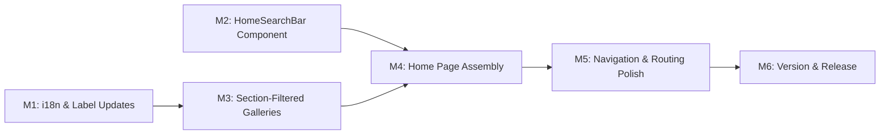

# Plan 090 — Home & Navigation Redesign: Merged Discovery Surface

| Field          | Value                                                                  |
| -------------- | ---------------------------------------------------------------------- |
| Plan ID        | 090                                                                    |
| Target Release | Next available patch after current origin/main v0.10.18; confirm at DevOps Stage 1 |
| Epic Alignment | Discovery UX — Unified Home Screen                                     |
| Related Issues | None                                                                   |
| Classification | Feature                                                                |
| Pipeline       | Full                                                                   |
| GitHub Issue   | https://github.com/abu-lina/uflow/issues/144                          |
| Created        | 2026-04-15T10:00Z                                                      |

## Changelog

| Date               | Author  | Change                          | Rationale                           |
| ------------------ | ------- | ------------------------------- | ----------------------------------- |
| 2026-04-15T10:00Z  | planner | Plan created                    | S090 session kickoff                |
| 2026-04-15T11:30Z  | planner | Revised per Critique F1–F3      | F1: category mapping gap surfaced; F2: MobileGreetingHeader removal documented; F3: D7 milestone ref fixed |
| 2026-04-16T09:00Z  | uat     | UAT Approved                    | All 8 success criteria delivered; value statement fulfilled; code review passed with 1 MEDIUM fixed-in-review |

---

## Value Statement and Business Objective

**As a** UFlow mobile user, **I want to** land on a single unified home screen that combines search and category browsing with section tabs (Food / Ummah / Stores), **so that** I can discover halal businesses and community services immediately without navigating to a separate search page.

---

## Success Criteria

1. Mobile root page (`/`) shows: search bar → section tab bar → section-specific category galleries — in that vertical order.
2. Section tab bar displays three tabs: **Food**, **Ummah**, **Stores** (renamed from "Business").
3. Tapping a tab changes the visible category galleries without a page navigation (client-side state swap).
4. Search bar displays placeholder text "Suche starten" (German) / localized equivalent, with **no city filter dropdown**.
5. Tapping into the search bar navigates to `/providers` (existing search results page) with the active section pre-selected.
6. Bottom navigation bar (MobileFooterBar) is unchanged — Home / Explore / Create / Saved / Profile icons and behavior preserved.
7. Desktop view (`md:` and above) is unaffected — existing landing page (LandingHero, AboutSection, etc.) remains.
8. Deep links to `/providers?section=food&category=...` continue to work (backward-compatible).

---

## Decision Record

| # | Decision | Status |
|---|----------|--------|
| D1 | **Tab label rename**: "Business" → "Stores" (section value stays `business` internally) | [RESOLVED] User-specified in task brief; only the UI label changes, not the data model |
| D2 | **City filter removed from home search bar**: Search bar is a simple text input + tap-to-navigate affordance, no city dropdown | [RESOLVED] Task brief specifies "no city filter"; city filtering remains available on `/providers` |
| D3 | **Search bar is a navigation affordance, not an inline search**: Tapping the search bar on home navigates to `/providers` rather than executing search in-place | [RESOLVED] Keeps the existing search infrastructure on `/providers` intact; home screen is a discovery surface, not a search results page |
| D4 | **Category galleries are section-aware**: Each tab shows categories relevant to that section (food categories for Food, community service categories for Ummah, business categories for Stores) | [RESOLVED] Extends the Plan 089 section concept to the home screen gallery |
| D5 | **Stage-based rendering retained**: The new merged home only applies to Stage 3 (≥15 providers). Stage 1 and Stage 2 content unchanged | [RESOLVED] Only Stage 3 is production-relevant; Stages 1/2 are early-access states that will be deprecated when the app launches |
| D6 | **`/providers` (Explore) route unchanged**: The existing search results page remains the full search experience; home search bar navigates there | [RESOLVED] Minimizes blast radius; `/providers` retains section tabs, category filter, search results list |
| D7 | **Category-to-section mapping**: CategoryGallerySection currently shows all categories in a flat list; the redesign groups categories by section using a section→categories mapping. **Known gap**: `inferSectionFromCategory()` only maps 2 UUIDs (Essen & Trinken → food, Gemeinschaft & Spenden → ummah; everything else → business). The `categories` table has no `section` column. Candidate strategies: (a) build a client-side UUID→section map covering all known categories, (b) query categories via providers/community_services joined by `listing_type`, (c) use `applicable_to` field heuristic (`community_service` → ummah). See Assumption 5. | [DEFERRED: Implementer — to be resolved during M3 implementation] |
| D8 | **"Stores" rename is global**: The "Business" → "Stores" label change applies everywhere the `SectionSelector` appears, including the `/providers` page tab bar — not just the new home page | [RESOLVED] Consistent UX across all section selectors; confirmed by user |

---

## Assumptions

1. The existing `CategoryGallerySection` component and `UnifiedGallery` can be extended to accept a section filter prop.
2. The `SectionSelector` component (Plan 089) can be reused on the home page with minimal modification (label rename for "Stores").
3. Category data from `fetchUsedCategories()` can be filtered client-side by section using the existing `inferSectionFromCategory()` utility or a new section-aware query.
4. The "Suche starten" placeholder is a new i18n key; it does not conflict with the existing `search.placeholder` key ("In deiner Ummah suchen").
5. **Category-to-section mapping requires extension** (Critique F1): The current `inferSectionFromCategory()` only maps 2 of ~12+ category UUIDs. The `categories` table has no `section` or `listing_type` column; the `applicable_to` field stores entity types (`'provider'`, `'community_service'`) not sections. The implementer must build or extend a mapping that covers all production categories. Three candidate strategies are documented in D7.

---

## Scope Boundaries

### In Scope

- Mobile root page (`/`) Stage 3 rendering overhaul
- New `HomeSearchBar` component (tap-to-navigate affordance)
- Section tab bar on home page (reusing/adapting `SectionSelector`)
- Section-filtered category galleries on home
- "Business" → "Stores" label rename (UI only, all 6 translation files)
- i18n keys for "Suche starten" and section labels
- Preserving all existing `/providers` functionality

### Out of Scope

- Desktop landing page changes
- Bottom navigation bar changes (explicitly unchanged per task brief)
- Stage 1 / Stage 2 mobile content changes
- `/providers` page redesign or removal
- Search-as-you-type or inline search on home page
- City selection or location filtering on home page
- New backend APIs or database schema changes
- Category image assets — reuses existing `UnifiedGallery` image pipeline

---

## Release Strategy

Release Strategy: Standalone (no other known plans for v0.10.19+). Plan 089 (v0.10.18) must be merged to main before this work begins, as it provides the section infrastructure this plan depends on.

---

## Milestone Dependencies

Sequencing rule: M1 (i18n) and M2 (search bar) can proceed in parallel; M3 (galleries) depends on M1 for labels; M4 (assembly) requires M2 + M3.

---

## Plan

### Milestone 1 — i18n & Label Updates

**Objective**: Add new translation keys and rename "Business" → "Stores" across all languages.

**Tasks**:
1. Add `home.searchPlaceholder` key ("Suche starten" / "Start searching" / localized) to all 6 translation files (`de.ts`, `en.ts`, `ar.ts`, `tr.ts`, `ur.ts`, `ps.ts`)
2. Add `sections.food`, `sections.ummah`, `sections.stores` keys for localizable section tab labels
3. Update `SectionSelector` component to use i18n keys instead of hardcoded "Food" / "Ummah" / "Business" labels
4. Rename the displayed label from "Business" to "Stores" in all languages (internal `Section` type value `'business'` is unchanged)

**Acceptance Criteria**:
- All 6 translation files contain the new keys
- `SectionSelector` renders localized tab labels
- The "Stores" label appears where "Business" previously appeared
- No changes to the `Section` type or `sectionFilters.ts` data model

### Milestone 2 — HomeSearchBar Component

**Objective**: Create a lightweight search bar component for the home page that acts as a navigation affordance (tap → navigate to `/providers`).

**Tasks**:
1. Create `HomeSearchBar` in `src/features/search/components/HomeSearchBar.tsx`
2. Component renders a styled input-like element with the "Suche starten" placeholder and search icon
3. On tap/focus, navigate to `/providers` with the currently active section pre-selected as a URL param (`?section=food`)
4. No city filter dropdown, no category dropdown — just the search affordance
5. Ensure proper ARIA: `role="search"`, `aria-label`, keyboard-accessible

**Acceptance Criteria**:
- Tapping the search bar navigates to `/providers?section={activeSection}`
- Visual appearance matches the screenshot: rounded input with placeholder text and search icon
- Accessible via keyboard (Enter key triggers navigation)
- No functional search execution on the home page

### Milestone 3 — Section-Filtered Category Galleries

**Objective**: Extend the category gallery to show categories grouped by the active section tab.

**Tasks**:
1. **Resolve D7**: Investigate and implement category-to-section classification. The current `inferSectionFromCategory()` only maps 2 UUIDs — it is insufficient for the home gallery. Candidate approaches: (a) build a comprehensive UUID→section map extending the existing pattern in `sectionFilters.ts` and `entityTypeUtils.ts`, (b) query categories through their related providers/community_services filtering by `listing_type`, (c) use the `applicable_to` field heuristic (`'community_service'` → ummah, all others → check provider `listing_type`). Validate with production data.
2. Create a filtering layer (or extend `CategoryGallerySection`) that accepts a `section` prop and only renders categories belonging to that section
3. Each section shows its own set of categories with the existing `UnifiedGallery` image triptych
4. Handle the empty state: if a section has no categories yet, show a localized "Coming soon" or equivalent message

**Acceptance Criteria**:
- Switching tabs changes the visible category list
- Food tab shows food/restaurant categories (e.g., Türkisch, Arabisch, Pakistanisch)
- Ummah tab shows community service categories
- Stores tab shows business/retail categories
- Categories that cannot be mapped to a section fall back to "Stores" (consistent with `inferSectionFromCategory` default)

### Milestone 4 — Home Page Assembly

**Objective**: Wire up all components into the root page's Stage 3 mobile rendering path.

**Tasks**:
1. Replace the current Stage 3 block in `RootPageContent` with the new layout:
   - `HomeSearchBar` at top (below safe-area header)
   - `SectionSelector` tab bar below search
   - Section-filtered `CategoryGallerySection` below tabs
2. **Remove `MobileGreetingHeader` from Stage 3 rendering path** (replaced by HomeSearchBar + SectionSelector). Note: `MobileGreetingHeader` remains used in Stage 2 — only its Stage 3 invocation is removed.
3. Manage the active section state locally (useState) — default to `'food'` per D9 convention
4. Maintain the existing fixed glassmorphism header styling for the search bar + tab area
5. Ensure proper scroll behavior: header fixed, galleries scroll beneath
6. Maintain `mobile-nav-spacing` / `pb-mobile-nav` for bottom footer clearance

**Acceptance Criteria**:
- Stage 3 mobile home page renders: search bar → tabs → category galleries
- Switching tabs updates galleries without page navigation
- Scroll position resets to top when switching sections
- No visual regression on the glassmorphism header
- Bottom nav bar is fully visible and interactive below gallery content

### Milestone 5 — Navigation & Routing Polish

**Objective**: Ensure navigation between home and explore is seamless and backward-compatible.

**Tasks**:
1. Verify `MobileFooterBar` "Home" (/) and "Explore" (/providers) nav items work correctly with the new home layout
2. Ensure `HomeSearchBar` passes the active section to `/providers` via URL param so the user lands on the correct section tab
3. Verify deep links: `/providers?section=food&category=...` still work
4. Verify back navigation: `/providers` → browser back → home (section state preserved or reset to default)
5. Verify PWA `start_url` (/) continues to load the home page correctly

**Acceptance Criteria**:
- Navigation flow: Home → tap search → `/providers` with correct section → back → home
- All existing `/providers` URLs continue to work
- PWA start_url loads home correctly
- No double-render or flash when navigating between home and explore

### Milestone 6 — Version & Release Artifacts

**Objective**: Update version artifacts to match the target release.

**Tasks**:
1. Bump `package.json` version to target release version (confirmed at DevOps Stage 1)
2. Add CHANGELOG.md entry documenting the home screen redesign
3. Update README.md if any user-facing navigation documentation exists

**Acceptance Criteria**:
- `package.json` version matches target release
- CHANGELOG entry describes the merged home/search surface
- Version is consistent across all artifacts

---

## Testing Strategy

**Expected test types**: Unit tests for `HomeSearchBar`, `SectionSelector` label rendering, section-filtered category logic. Integration tests for the full Stage 3 rendering path.

**Critical scenarios**:
- Section tab switching renders correct categories
- Search bar navigates to `/providers` with correct params
- Stage 1/2 rendering paths are unaffected (regression)
- Desktop rendering path is unaffected (regression)
- i18n: all 6 languages render correct labels
- Empty section state (section with no categories) handled gracefully

**Coverage expectations**: New components should have ≥80% line coverage. Existing component modifications require regression tests covering pre-existing behavior.

---

## Affected Files & Routes (Estimated)

| Area | Files | Nature |
|------|-------|--------|
| New component | `src/features/search/components/HomeSearchBar.tsx` | Create |
| Existing component | `src/features/search/components/SectionSelector.tsx` | Modify (i18n labels) |
| Existing component | `src/components/shared/CategoryGallerySection.tsx` | Modify (section filter prop) |
| Existing component | `src/components/shared/RootPageContent.tsx` | Modify (Stage 3 block; remove MobileGreetingHeader invocation) |
| Existing component | `src/components/shared/MobileGreetingHeader.tsx` | Unchanged (Stage 2 still uses it; Stage 3 invocation removed in RootPageContent) |
| Translations | `src/translations/{de,en,ar,tr,ur,ps}.ts` | Modify (new keys) |
| Route | `/` (root) | Modified rendering |
| Route | `/providers` | Unchanged (receives section param) |

---

## Risks

| Risk | Likelihood | Impact | Mitigation |
|------|-----------|--------|------------|
| Category-to-section mapping is incomplete or incorrect | Medium | **High** | `inferSectionFromCategory` maps only 2 of ~12+ UUIDs; Food tab would be empty without a broader mapping. M3 Task 1 requires resolving D7 before galleries render correctly. Validate with production category data during implementation. |
| Stage 3 detection conflicts with existing logic | Low | High | Only modify the `stage === 'stage3'` branch; leave Stage 1/2 branches untouched |
| Performance regression from filtering categories client-side | Low | Low | Categories list is small (<20 items); no visible performance impact |
| Search bar tap handler conflicts with iOS PWA input focus behavior | Medium | Medium | Use a `div[role="search"]` styled as an input rather than an actual `<input>` to avoid iOS keyboard pop-up |

---

## Duration Estimates

| Phase | Estimate | Uncertainty |
|-------|----------|-------------|
| Planning | 1–2 hours | Low — scope is well-understood |
| Implementation (M1–M5) | 4–8 hours | Medium — category-to-section mapping complexity |
| QA | 2–3 hours | Low — limited surface area |
| UAT | 1–2 hours | Medium — mobile-only visual testing required |
| DevOps | 1 hour | Low — standard release |
| **Total** | **9–16 hours** | |

Key uncertainty driver: M3 (section-filtered galleries) depends on how cleanly categories map to sections in the existing data.

---

## Rollback Considerations

- Revert the `RootPageContent` Stage 3 block to the previous `CategoryGallerySection` (no section filter) + `MobileGreetingHeader` layout.
- New components (`HomeSearchBar`) can simply be deleted.
- i18n keys are additive (no existing keys removed), so rollback only requires reverting the `SectionSelector` label change.
- `/providers` is untouched, so no rollback needed there.

---

## Handoff Notes

- **Prerequisite**: Plan 089 (v0.10.18) must be merged to `main` before implementation begins, as this plan depends on the `Section` type, `SectionSelector`, and `inferSectionFromCategory` infrastructure.
- **Implementer freedom**: The exact component decomposition and state management approach (e.g., whether to lift section state into SearchProvider or keep it local) is at the implementer's discretion.
- **Category-section mapping**: The implementer should investigate whether the existing `categories` table has a field or convention that maps to sections, or whether a client-side mapping function is needed. The `ESSEN_TRINKEN_CATEGORY_ID` and `GEMEINSCHAFT_SPENDEN_CATEGORY_ID` constants in `sectionFilters.ts` provide a starting point.
- **Visual reference**: The target UI is provided as a screenshot attachment in the session context — search bar at top with "Suche starten", Food/Ummah/Stores tabs, category image galleries per section, bottom nav with existing icons.
