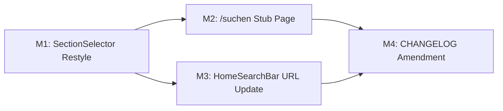

# Plan 091 — Home Redesign Increment 2: SectionSelector Visual + /suchen Stub

| Field          | Value                                                                  |
| -------------- | ---------------------------------------------------------------------- |
| Plan ID        | 091                                                                    |
| Target Release | Bundled with Plan 090 at v0.10.19 (session branch); no additional bump |
| Epic Alignment | Discovery UX — Unified Home Screen                                     |
| Related Issues | Continues #144 (Plan 090)                                             |
| Classification | Feature                                                                |
| Pipeline       | Full                                                                   |
| GitHub Issue   | https://github.com/abu-lina/uflow/issues/145                          |
| Created        | 2026-04-17T14:00Z                                                      |

## Changelog

| Date               | Author  | Change                              | Rationale                                          |
| ------------------ | ------- | ----------------------------------- | -------------------------------------------------- |
| 2026-04-17T14:00Z  | planner | Plan created                        | S090 session inc. 2                                |
| 2026-04-17T16:00Z  | planner | Revised per Critic (F1/F2/F3)       | F1 required (Suspense + back fallback); F2+F3 LOW  |
| 2026-04-17T18:05Z  | code-reviewer | Re-review approved            | Prior HIGH/MEDIUM findings resolved and verified   |
| 2026-04-17T18:20Z  | code-reviewer | Cycle 5 re-review approved     | Route-migration blockers closed; ready for QA      |

---

## Value Statement and Business Objective

**As a** UFlow mobile user browsing the home screen, **I want** the section tabs (Food / Ummah / Stores) to have a polished, on-brand teal-pill design and be able to tap the search bar to land on a dedicated search page, **so that** the discovery surface feels complete, professional, and clearly navigable — matching the approved Figma design.

---

## Success Criteria

1. SectionSelector renders with a white rounded-pill container, teal-filled active tab, and grey inactive tabs — matching Figma tokens from nodes 209:313/386/454.
2. SectionSelector visual change applies globally: home Stage 3, `/providers`, and `/suchen`.
3. Tapping the HomeSearchBar on the home screen navigates to `/suchen?section=X` (not `/providers`).
4. `/suchen` page renders: back header ("← Suchen"), SectionSelector, 4 accordion sections (Was?/Wo:/Wer:/Filter), and a fixed bottom bar ("Clear all" + "♡ Suchen").
5. Accordions expand/collapse on tap; "Was?" is open by default; accordion bodies are empty stubs.
6. Bottom bar buttons are styled but non-functional (no search execution this increment).
7. All existing tests continue to pass; no type-check or lint regressions.
8. Desktop view unaffected (no md: breakpoint changes).

---

## Decision Record

| # | Decision | Status |
|---|----------|--------|
| D1 | **Layout mechanics**: Keep Plan 090's fixed glassmorphism header and existing Tailwind conventions. Do NOT replicate Figma's normal-flow layout or cameraNodge spacer. Use Figma **only** for visual tokens (colours, radii, heights). | [RESOLVED] User directive: "rely on our code base and Tailwind" |
| D2 | **Route path**: `/suchen` — German-first app, consistent with brand, clean App Router path (`src/app/(public)/suchen/page.tsx`). Chosen over `/search` for brand consistency. | [RESOLVED] User directive: "use what makes more sense" — German app, German route |
| D3 | **Was? input data**: DEFERRED to future plan. No search wiring, no suggestion rows, no data fetching in this increment. | [DEFERRED: User — explicit deferral; "keep the search out for now"] |
| D4 | **Search execution**: DEFERRED to future plan. "♡ Suchen" button is styled but non-functional. | [DEFERRED: User — explicit deferral; "do it later as this would be a subpage"] |
| D5 | **Colour mapping**: Figma `#589d96` (--uflowaccent) maps to `primary.DEFAULT` (CSS var `--color-primary: 180 24% 48%` → HSL ≈ #5D9E97). Use Tailwind aliases `bg-primary`, `text-primary-foreground`, `text-white` — not raw hex. | [RESOLVED] Verified against `tailwind.config.ts` and `globals.css` |
| D6 | **Font**: Figma specifies "Inter Tight Medium 16px". Tailwind config has `font-inter-tight` alias already. Use `font-inter-tight font-medium text-base`. | [RESOLVED] Verified alias exists in tailwind.config.ts |
| D7 | **HomeSearchBar target supersedes Plan 090 SC5**: SC5 in Plan 090's UAT report states HomeSearchBar navigates to `/providers`. Plan 091 M3 intentionally replaces this with `/suchen`. Plan 090's UAT report remains valid as a historical snapshot; SC5 no longer describes current behaviour as of this increment. | [RESOLVED] User directive confirmed /suchen as the correct tap destination |

---

## Assumptions

1. The `(public)` route group already exists and has no layout that would interfere with the `/suchen` page.
2. `accent` color in tailwind.config.ts resolves to the same `--color-primary` HSL that matches Figma's `#589d96`. No additional colour tokens needed.
3. Plan 090's `HomeSearchBar` test suite mocks `router.push` — changing the target URL from `/providers?section=X` to `/suchen?section=X` will require updating those test expectations.
4. The accordion UI can use simple `useState<boolean>` toggles — no external accordion library needed for 4 static items.

---

## Scope Boundaries

### In Scope

- SectionSelector Tailwind restyle (visual tokens from Figma)
- `/suchen` stub page (shell — accordion containers, bottom bar, header)
- HomeSearchBar onClick URL change (`/providers` → `/suchen`)
- Test updates for changed URL expectations
- i18n keys for new page text ("Suchen", "Was?", "Wo:", "Wer:", "Filter", "Clear all")

### Out of Scope

- Was? input wiring / search execution
- Suggestion rows (Döner, Pizza, etc.)
- Wo/Wer/Filter accordion body content
- ♡ Suchen button executing a query
- `/providers` page changes
- Desktop views
- Backend API or database changes
- Version bump (bundled with Plan 090 at v0.10.19)

---

## Release Strategy

Bundled with Plan 090 (v0.10.19). Both plans ship on the same session branch (`session/090-home-nav-redesign`). No additional version bump or CHANGELOG entry needed beyond Plan 090's existing entry — CHANGELOG will be amended to include Plan 091 deliverables before DevOps merge.

---

## Milestones

### M1: SectionSelector Visual Redesign

**Objective**: Restyle `SectionSelector` to match Figma's teal-pill tab design using existing Tailwind tokens.

**File**: `src/features/search/components/SectionSelector.tsx`

**What to change** (Tailwind classes only — no structural changes):

- **Container** (`
`): Replace `flex items-center gap-1 rounded-full bg-muted p-1` with Figma-aligned pill container:
  - Semantic white background, 1px grey border, 56px height, rounded ends, horizontal padding
  - Use semantic tokens: `bg-background` (not `bg-white` — Implementer to verify this renders as white in the current theme), `border border-border-light`, `h-14`, `rounded-[16.8px]` or `rounded-2xl`, `px-2`
- **Each tab** (`<button role="tab">`): Replace `flex items-center gap-1.5 rounded-full px-4 py-1.5 text-sm font-medium` with:
  - `flex-1 h-10 rounded-xl flex items-center justify-center gap-1.5 px-3 overflow-hidden font-inter-tight font-medium text-base`
- **Active state**: Replace `bg-background text-foreground shadow-sm` with:
  - `bg-primary text-white`
- **Inactive state**: Replace `text-muted-foreground hover:text-foreground` with:
  - `text-neutral-500` (maps to #777-ish) `hover:text-neutral-700`

**Acceptance criteria**:
- Visual appearance matches Figma screenshots (teal active pill, grey inactive text, white container)
- SectionSelector renders correctly on home Stage 3, `/providers`, and `/suchen`
- Existing SectionSelector tests pass (may need class assertion updates)
- Type-check clean

---

### M2: /suchen Stub Page

**Objective**: Create a new `/suchen` route with the shell layout (no search execution).

**New file**: `src/app/(public)/suchen/page.tsx` (client component — uses `useState`, `useRouter`, `useSearchParams`)

> **Next.js App Router requirement (F1-A)**: Because this page uses `useSearchParams()` to read the `?section=` query parameter, the component (or the subcomponent containing `useSearchParams()`) **must be wrapped in a `<Suspense fallback={null}>` boundary** within the page. Failing to do so will cause a build/runtime error in static generation contexts. Alternatively, the Implementer may pass `section` as a prop from a server component wrapper — but this conflicts with `useRouter()` being used in the same file, so the Suspense boundary approach is preferred.

**Page structure**:

1. **Header row**: Back chevron icon (ChevronLeft from lucide-react) + "Suchen" label. Click triggers `router.back()`. Because `router.back()` produces no navigation when the page is opened directly (empty history stack), the back button must use a `<Link href="/">` as the containing element **or** call `router.push('/')` as the fallback. Either approach ensures the user can always exit the page.
2. **SectionSelector**: Reads `?section=` from URL params as initial state via `useSearchParams()` (default: `food`). Tab changes update local state only — no navigation.
3. **Accordion body**: 4 collapsible sections:
   - "Was?" — open by default; body: empty placeholder
   - "Wo:  In meiner Nähe" — closed; body: empty
   - "Wer: Für mich" — closed; body: empty
   - "Filter" — closed; body: empty
   - Each accordion: header row (label + ChevronDown/ChevronUp icon), body div with show/hide toggle via `useState<boolean>`.
4. **Fixed bottom bar**: Sticky/fixed at bottom; left: "Clear all" text link (no-op); right: teal button "♡ Suchen" with Heart icon (no-op).

**i18n**: Add keys to all 6 translation files for new page strings.

**Acceptance criteria**:
- Page renders at `/suchen`
- Page renders without Suspense-related build/runtime warning; `?section=` initialises the active tab correctly
- Back button navigates correctly whether user arrived via HomeSearchBar or via direct URL (fallback to `/` when history stack is empty)
- Reading `?section=food` (or ummah/business) sets the initial tab
- 4 accordions render; Was? open by default; others closed
- Tapping an accordion header toggles its body visibility
- Bottom bar renders with correct styling
- No search logic wired — buttons are visual stubs
- Accessible: proper ARIA on accordions, semantic HTML
- Type-check clean

---

### M3: HomeSearchBar URL Update

**Objective**: Change HomeSearchBar's tap destination from `/providers` to `/suchen`.

**File**: `src/features/search/components/HomeSearchBar.tsx`

**What to change**: In the `navigate()` function, replace:
- `/providers?section=${activeSection}` → `/suchen?section=${activeSection}`

**Test file**: `src/__tests__/features/search/HomeSearchBar.test.tsx`
- Update all assertions that check `router.push` was called with `/providers?section=...` to expect `/suchen?section=...`

**Acceptance criteria**:
- Tapping HomeSearchBar on home → navigates to `/suchen?section=food` (or active section)
- All 9 HomeSearchBar tests pass with updated URL expectations
- No changes to CategoryGallerySection's category-click URLs (those still go to `/providers`)
- Type-check clean

---

### M4: CHANGELOG Amendment

**Objective**: Amend Plan 090's `[0.10.19]` CHANGELOG entry to include Plan 091 deliverables.

**File**: `CHANGELOG.md`

**What to add** (under existing `[0.10.19]` section):
- SectionSelector restyled to teal-pill design (Figma-aligned)
- New `/suchen` search page stub (accordion shell, no execution)
- HomeSearchBar now navigates to `/suchen` instead of `/providers`

**Acceptance criteria**:
- CHANGELOG accurately describes combined 090+091 deliverables for v0.10.19
- No version number change

---

## Milestone Dependencies

Sequencing: M1 first (SectionSelector used by M2). M2 and M3 can proceed in parallel after M1. M4 last.

---

## Testing Strategy

Expected test types (high-level — QA agent defines specifics):

- **Unit**: SectionSelector visual assertions (if existing tests check class names); HomeSearchBar URL expectations; /suchen page render tests
- **Integration**: Navigation flow from HomeSearchBar → `/suchen`; accordion expand/collapse; section param preservation
- **No E2E** this increment (shell page with no data flow)
- Coverage expectation: all new page logic covered; regression on existing 1002 tests

---

## Affected Files

| File | Change Type | Milestone |
|------|-------------|-----------|
| `src/features/search/components/SectionSelector.tsx` | Modify (Tailwind classes) | M1 |
| `src/__tests__/components/SectionSelector.test.tsx` | Modify (class assertions if any) | M1 |
| `src/app/(public)/suchen/page.tsx` | **Create** | M2 |
| `src/translations/{de,en,ar,tr,ur,ps}.ts` | Modify (add suchen.* keys) | M2 |
| `src/features/search/components/HomeSearchBar.tsx` | Modify (URL change) | M3 |
| `src/__tests__/features/search/HomeSearchBar.test.tsx` | Modify (URL assertions) | M3 |
| `CHANGELOG.md` | Modify (amend 0.10.19 entry) | M4 |

---

## Risks

| Risk | Severity | Mitigation |
|------|----------|------------|
| SectionSelector restyle breaks `/providers` page layout | MEDIUM | Existing SectionSelector tests + visual inspection on both pages |
| `bg-primary` HSL doesn't exactly match Figma `#589d96` | LOW | HSL(180,24%,48%) = #5D9E97 vs #589d96 — 3 units hue difference, imperceptible. Design system token is authoritative. |
| `/suchen` route conflicts with existing routes | LOW | Verified: no `/suchen` route exists in `src/app/(public)/` |
| HomeSearchBar URL change breaks deep links | LOW | Only the home screen search bar changes; CategoryGallerySection still navigates to `/providers?category=...&section=...` |

---

## Duration Estimates

| Phase | Estimate | Uncertainty |
|-------|----------|-------------|
| Planning | 30 min | Low (this doc) |
| Critic | 15 min | Low (small scope) |
| Implementation | 2–3 hours | Low (Tailwind restyle + new page shell) |
| Code Review | 30 min | Low |
| QA | 30 min | Low (no data wiring) |
| UAT | 15 min | Low (visual check) |

Total: ~4–5 hours

---

## Validation

- `npm run type-check` exits 0
- `npm run lint` — 0 new errors
- `vitest run` — all tests pass (1002+ incl. new/updated)
- Visual: SectionSelector teal-pill renders on home, `/providers`, `/suchen`
- Navigation: HomeSearchBar → `/suchen?section=food` works
- Accordion: 4 sections toggle correctly; Was? open by default

---

## Rollback Considerations

- SectionSelector restyle is Tailwind-only — revert CSS classes to restore Plan 090 appearance
- `/suchen` is a new route — delete the file to remove entirely
- HomeSearchBar URL — single-line revert from `/suchen` back to `/providers`
- All changes are additive or class-level; no database/API impact

---

## Handoff Notes

**For @Implementer**:
- M1 is purely a Tailwind class change on SectionSelector. No structural/prop changes. Read the current classes in the file and map them to the Figma-token equivalents documented in D5/D6.
- M2: Use simple `useState<boolean>` for accordion state — no external library. The four accordion sections are static for this increment.
- M3: Single-line URL change + test updates.
- Check `bg-primary` renders as teal on the actual page (confirm CSS variable chain works). If it doesn't, fall back to the closest Tailwind utility class.

**For @Critic**:
- Scope is tight: 2 deliverables (restyle + stub page) + 1 URL change.
- D3/D4 are user-deferred — don't flag as missing.
- Version bundling with Plan 090 is intentional — no separate bump.
