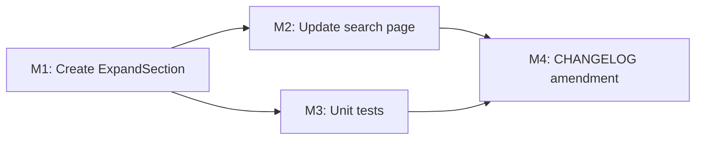

# Plan 092 — Search Page: Replace Accordions with ExpandSection Component

| Field          | Value                                                                  |
| -------------- | ---------------------------------------------------------------------- |
| Plan ID        | 092                                                                    |
| Target Release | Bundled with Plans 090 + 091 at v0.10.19 (session branch); no additional bump |
| Epic Alignment | Discovery UX — Unified Home Screen                                     |
| Related Issues | Continues Plan 091 (Issue #145) — pre-QA adjustment to `/search` page |
| Classification | Feature                                                                |
| Pipeline       | Abbreviated                                                            |
| GitHub Issue   | https://github.com/abu-lina/uflow/issues/146                          |
| Created        | 2026-04-17T19:00Z                                                      |

## Changelog

| Date               | Author  | Change                              | Rationale                                          |
| ------------------ | ------- | ----------------------------------- | -------------------------------------------------- |
| 2026-04-17T19:00Z  | planner | Plan created                        | Pre-QA UI consistency fix for `/search` page       |
| 2026-04-17T19:45Z  | planner | Revision R1: address Critic F1/F2/F3 | F1 (MEDIUM) SC2 reworded; F2 D4 tracking target added; F3 border-t noted as intentional |
| 2026-04-17T20:15Z  | code-reviewer | Code Review Approved         | Implementation aligned with plan; 1 MEDIUM changelog structure issue fixed-in-review |

---

## Value Statement and Business Objective

**As a** UFlow mobile user browsing the `/search` page, **I want** the accordion expand/collapse sections (Was?, Wo, Wer, Filter) to use the same visual component and interaction pattern as the offers/needs sections on provider detail pages, **so that** the search discovery surface feels visually consistent and familiar — reusing a pattern the user has already encountered throughout the app.

---

## Context

### Current state

`src/app/(public)/search/page.tsx` has 4 accordion items implemented with:
- A per-item `div` with `bg-surface rounded-2xl border border-border-light shadow-sm`
- A `button` element that swaps between `<ChevronUp>` and `<ChevronDown>` icons based on state
- No shared component — it is entirely inline

### Provider detail page pattern

`src/components/providers/ProviderDetailPage.tsx` (and also `ProfileProviderDetailPage.tsx`, `ProviderDetailModal.tsx`) implement expand/collapse inline with:
- Container: `div` with `rounded-2xl bg-white shadow-sm` (no border, card-style shadow)
- Header: `button` with `flex w-full items-center justify-between`
- Title: `h3` with `font-inter-tight text-lg font-semibold text-content-heading`
- Icon: single `ChevronDown` that **rotates 180°** on expand (`transition-transform` + `rotate-180` class)
- No shared component — the same pattern is duplicated across 3 provider components

### Gap

The search page uses a visually inconsistent pattern: border-outlined cards with an Up/Down icon swap. The provider detail pages use border-less cards with a rotating-chevron pattern. These need to match.

### Opportunity

Since no shared component exists and the same pattern appears in 3+ provider components, extracting a `ExpandSection` UI component is the right call. It:
- Eliminates the inconsistency on the search page (immediate value)
- Creates a single source of truth for this interaction pattern (DRY)
- Reduces future divergence risk

---

## Success Criteria

1. `/search?section=food` renders accordions (Was?, Wo, Wer, Filter) using the same visual card style as the provider detail expand sections: borderless `rounded-2xl` white card with `shadow-sm`, rotating ChevronDown, `font-inter-tight font-semibold` title.
2. A reusable `ExpandSection` component is created in `src/components/ui/ExpandSection.tsx` as the **canonical shared component** for this interaction pattern; new and updated usages (including the search page) use this component. (Note: existing inline implementations in provider detail components remain deferred per D4 — this does not block QA acceptance.)
3. The search page uses `ExpandSection` for all 4 accordion rows — no bespoke accordion markup remains in `search/page.tsx`.
4. All existing tests continue to pass; no type-check or lint regressions.
5. The new component has at least basic unit test coverage (renders, toggles open/close).

---

## Decision Record

| # | Decision | Status |
|---|----------|--------|
| D1 | **Component location**: `src/components/ui/ExpandSection.tsx` — this is a shared, generic UI primitive (open/close card with title + children), not domain-specific. Correct placement per placement rubric. | [RESOLVED] Consistent with `Button`, `Card`, etc. in `src/components/ui/` |
| D2 | **API design**: `ExpandSection` accepts `title: string`, `defaultOpen?: boolean` (default `false`), and `children: ReactNode`. No callback props needed at this stage — caller renders children with access to its own state. | [RESOLVED] Minimal API; YAGNI. Can be extended later. |
| D3 | **Icon**: Use a single `ChevronDown` from `lucide-react` that rotates 180° on expand — matching the provider detail pattern exactly. Do NOT use ChevronUp/Down swap. | [RESOLVED] Matches existing pattern to ensure visual consistency. |
| D4 | **Provider component DRY cleanup**: `ProviderDetailPage.tsx`, `ProfileProviderDetailPage.tsx`, and `ProviderDetailModal.tsx` all have the same expand pattern inline. Refactoring them to use `ExpandSection` is the correct long-term move. | [DEFERRED: Track as low-priority tech debt in `agent-output/planning/open-actions.md`; trigger: next touch to any of the 3 provider detail components (or a dedicated maintenance plan). Implementer to add the entry in M4 alongside the CHANGELOG amendment.] |
| D5 | **Version**: No version bump. This is a pre-QA visual adjustment bundled with Plans 090+091 at v0.10.19. | [RESOLVED] Confirmed: session branch, no separate version bump. |
| D6 | **Container styling**: Use semantic token `bg-background` rather than hardcoded `bg-white` per Plan 091 F2 guidance, while matching the card-style `shadow-sm` from the provider detail pattern. Implementer to verify the token renders as white in the current theme. | [RESOLVED] Follows F2 RESOLVED decision from Critique 091. |

---

## Assumptions

1. `ChevronDown` from `lucide-react` is already in the dependency tree (confirmed — used in `ProviderDetailPage.tsx`).
2. The `font-inter-tight` Tailwind alias is available (confirmed — defined in `tailwind.config.ts`, used in Plan 090/091).
3. The search page's `Was?` accordion currently has bespoke content (a search input field inside the expanded body). `ExpandSection` wraps `children`, so the search input remains as a child — no data contract change needed.
4. No test file currently exists for `src/app/(public)/search/page.tsx`; a test for the new `ExpandSection` component will be the new test coverage.

---

## Scope Boundaries

### In Scope

- Create `src/components/ui/ExpandSection.tsx` — reusable expand/collapse card component
- Update `src/app/(public)/search/page.tsx` to use `ExpandSection` for all 4 accordion rows
- Remove bespoke per-item accordion markup from `search/page.tsx`
- Create `src/__tests__/components/ui/ExpandSection.test.tsx` — unit tests for the new component
- CHANGELOG amendment (add ExpandSection note under v0.10.19 entry)

### Out of Scope

- Refactoring `ProviderDetailPage.tsx`, `ProfileProviderDetailPage.tsx`, `ProviderDetailModal.tsx` to use `ExpandSection` (D4 deferred)
- Search execution logic (already deferred in Plans 091 D3/D4)
- Any changes to Wo/Wer/Filter accordion body content
- Changes to `SectionSelector`, `HomeSearchBar`, or any other component

---

## Release Strategy

Bundled with Plans 090 + 091 (v0.10.19). Same session branch (`session/090-home-nav-redesign`). CHANGELOG will be amended to add a line under the existing Plan 091 entry — no separate version block needed.

---

## Milestones

### M1: Create `ExpandSection` UI Component

**Objective**: Create the shared expand/collapse card component that matches the provider detail offers/needs visual pattern.

**New file**: `src/components/ui/ExpandSection.tsx`

**Structure** (ILLUSTRATIVE ONLY — Implementer owns the code):
- Props: `title`, `defaultOpen` (optional, default `false`), `children`
- Container: `rounded-2xl bg-background shadow-sm` outer `div`
- Header `div` (inside): `p-4` padding, `flex w-full items-center justify-between` layout
- Title: `font-inter-tight text-lg font-semibold text-content-heading` (matches ProviderDetailPage exactly)
- Icon: `ChevronDown` from `lucide-react` with `transition-transform` and conditional `rotate-180` class when open
- Body: conditional render when open, with `px-4 pb-4` padding; optionally a `border-t border-border-light` separator between header and content as a deliberate UX improvement (not present in the provider detail source pattern — this is an intentional enhancement for readability in the search context; Implementer to verify visually and omit if it feels inconsistent)
- Internal state: `useState` initialized from `defaultOpen` prop

**Acceptance criteria**:
- Component renders a title row with a rotating chevron
- Clicking the title row toggles the body open/closed
- `defaultOpen={true}` initialises the component in the open state
- `children` render inside the body when open, do not render when closed
- Visual style matches the provider detail expand pattern (no border on the outer container, shadow-sm, white/background card)
- Type-check clean

---

### M2: Update `/search` Page to Use `ExpandSection`

**Objective**: Replace the 4 bespoke accordion divs in `search/page.tsx` with `ExpandSection` usage.

**File**: `src/app/(public)/search/page.tsx`

**What changes**:
- Import `ExpandSection` from `@/components/ui/ExpandSection`
- Replace the `open` state object (`{ was, wo, wer, filter }`) with no state — `ExpandSection` manages its own open/close state internally
- Remove the `toggle` function
- Remove the `renderLabel` helper (no longer needed — plain string title passed to `ExpandSection`)
- Remove the `rows` array + `rows.map(...)` for the collapsed accordion items
- For `Was?`: render `<ExpandSection title="..." defaultOpen>` wrapping the existing search input content
- For `Wo`, `Wer`, `Filter`: render `<ExpandSection title="...">` with empty/stub body
- The `ChevronUp`/`ChevronDown` imports from `lucide-react` become unused — remove them
- `Search` import from `lucide-react` is retained (used inside the Was? body)

**Acceptance criteria**:
- All 4 accordion items render using `ExpandSection`
- Was? is open by default (`defaultOpen` prop set)
- Wo / Wer / Filter are closed by default
- Clicking any accordion header toggles its body
- Search input inside Was? body still works
- No bespoke `open` state object or `toggle` function remains in the page component
- Visual appearance matches provider detail offers/needs sections
- Type-check clean

---

### M3: Unit Tests for `ExpandSection`

**Objective**: Add basic test coverage for the new shared component.

**New file**: `src/__tests__/components/ui/ExpandSection.test.tsx`

**Coverage expected** (high-level — QA owns specifics):
- Renders title text
- Body is hidden by default (when `defaultOpen` not set)
- Body is visible by default when `defaultOpen={true}`
- Clicking the header toggles the body open/closed
- Children render inside body when open

**Acceptance criteria**:
- All new tests pass
- No existing tests broken

---

### M4: CHANGELOG Amendment

**Objective**: Record the `ExpandSection` extraction and search page update under the existing `[0.10.19]` CHANGELOG entry.

**File**: `CHANGELOG.md`

**What to add** (under the Plan 091 section in `[0.10.19]`):
- Note that `ExpandSection` is a new shared UI primitive extracted from the provider detail expand pattern
- Note that the search page now uses it for consistency

**Acceptance criteria**:
- CHANGELOG updated without version number change

---

## Milestone Dependencies

Sequencing: M1 must complete first (dependency for M2 and M3). M2 and M3 can proceed in parallel after M1. M4 last.

---

## Affected Files

| File | Change Type | Milestone |
|------|-------------|-----------|
| `src/components/ui/ExpandSection.tsx` | **Create** | M1 |
| `src/app/(public)/search/page.tsx` | Modify (replace accordion markup) | M2 |
| `src/__tests__/components/ui/ExpandSection.test.tsx` | **Create** | M3 |
| `CHANGELOG.md` | Modify (amend 0.10.19 entry) | M4 |

---

## Testing Strategy

- **Unit**: `ExpandSection` component — render, default state, toggle behavior, `defaultOpen` prop
- **Regression**: Full suite must continue to pass; no existing search/HomeSearchBar/SectionSelector tests should be affected (this plan only modifies `search/page.tsx` internals)
- **Visual**: Quick visual check on `/search?section=food` that accordions now match the provider detail card style

---

## Risks

| Risk | Severity | Mitigation |
|------|----------|------------|
| `bg-background` token doesn't render as white | LOW | Implementer to verify in browser; fallback to explicit white if needed |
| `defaultOpen` on Was? accordion causes layout jump | LOW | Inspect with initial render in browser; `defaultOpen` should set state at mount, not via transition |
| Removing `open` state from search page breaks other logic | LOW | The only state consumers were the accordion toggles; search input `wasQuery` state is separate and unaffected |
| Provider components diverge further from `ExpandSection` | LOW (deferred) | D4 is tracked; future plan can clean up the 3 provider components |

---

## Duration Estimates

| Phase | Estimate | Uncertainty |
|-------|----------|-------------|
| Planning | 30 min | Low (this doc) |
| Critic | 10 min | Low (small, clear scope) |
| Implementation | 1–2 hours | Low (extract + replace; minimal risk) |
| QA | 20 min | Low (focused on new component + visual check) |

Total: ~2–3 hours

---

## Rollback Considerations

- `ExpandSection` is a new file — deletion removes the component; no side effects
- `search/page.tsx` changes are isolated — revert restores the old ChevronUp/Down accordion pattern
- No database, API, or navigation changes

---

## Handoff Notes

**For @Implementer**:
- M1 — Read the inline expand pattern from `src/components/providers/ProviderDetailPage.tsx` lines ~516–550 before writing `ExpandSection`. Match the visual pattern exactly (rotating ChevronDown, `font-inter-tight font-semibold text-content-heading`, `rounded-2xl shadow-sm` card). The component is a pure UI primitive — no context providers, no side effects.
- M2 — The `open` state object and `toggle` function can be removed entirely from `search/page.tsx`. `ExpandSection` manages its own state. The `wasQuery` / `selectedSection` states are unrelated and stay in the page component.
- Do NOT refactor the provider detail files (`ProviderDetailPage.tsx`, `ProfileProviderDetailPage.tsx`, `ProviderDetailModal.tsx`) in this plan — D4 is explicitly deferred.
- TDD: write the `ExpandSection.test.tsx` before creating the component.

**For @Critic**:
- Scope is minimal: 1 new component + 1 page update + tests + changelog.
- D4 deferral is intentional and correct — provider component refactor is a separate maintenance task.
- Version bundling with 090+091 is intentional.
