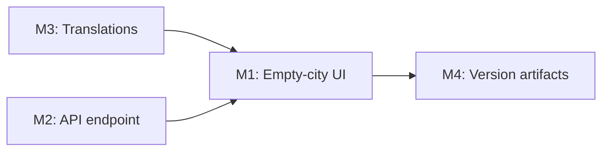

# Plan 093 — City Interest: "Notify Me" for Unavailable Cities

| Field          | Value                                                                                   |
| -------------- | --------------------------------------------------------------------------------------- |
| Plan ID        | 093                                                                                     |
| Target Release | v0.10.20 |
| Epic Alignment | Epic 2.2 — City Community Pages & Discovery ("Coming Soon cities show waitlist/interest capture") |
| Related Issues | None (create after plan finalization)                                                  |
| Classification | Feature                                                                                 |
| Pipeline       | Full                                                                                    |
| GitHub Issue   | https://github.com/abu-lina/uflow/issues/147                                            |
| Created        | 2026-04-19T00:00Z                                                                       |

## Changelog

| Date/Time           | Author  | Change                         |
| ------------------- | ------- | ------------------------------ |
| 2026-04-19T00:00Z   | planner | Plan created (Active)          |
| 2026-04-19T14:30Z   | planner | R1: Resolved critique findings F1/F2/F3 — M2 implementation approach updated to use `getSupabaseAdmin()` upsert (RPC confirmed update-only+token-required); session auth pattern and provider CTA route specified |
| 2026-04-19T20:45Z   | code-reviewer | Re-review approved — prior HIGH/MEDIUM findings resolved; handed off to QA |
| 2026-04-19T20:46Z   | qa | QA Complete — All 25 unit tests passing, type-check clean, build successful, full suite 1047/1065 passing (no regressions) |
| 2026-04-19T20:47Z   | uat | UAT Approved — Value statement delivered; all doc predecessors passing; release decision APPROVED FOR RELEASE; ready for DevOps |

---

## Value Statement and Business Objective

> As a **demand-side user searching for services in a city with no providers yet**,  
> I want to **register my interest and be notified when providers become available**,  
> so that **I'm not left at a dead-end, I feel heard, and the platform captures real demand signals to prioritise city expansion**.

**Business impact**: Every "no results" moment is a growth signal. Converting dead-ends into interest registrations turns discovery gaps into actionable expansion data (e.g., 40 users signalling Frankfurt → justifies onboarding outreach there).

---

## Release Strategy

Standalone — no other known open plans targeting the same patch at time of writing. Can be bundled with Plans 090+091+092 at v0.10.19 if implementation completes within the same sprint; otherwise targets v0.10.20 as the next available patch. Confirm at DevOps Stage 1.

---

## Decision Record

| # | Decision | Status |
|---|----------|--------|
| D1 | Empty-city state primary CTA is "Notify me", not "Be the first provider" | `[RESOLVED]` — user intent in search context is demand-side; provider CTA is secondary/subtle text link |
| D2 | Reuse `waitlist.selected_city` for interest storage — no new table | `[RESOLVED]` — `get_city_interest_counts()` already aggregates this; YAGNI |
| D3 | A new `/api/city-interest/subscribe` endpoint is created (not repurposing `/api/waitlist/subscribe-city`) | `[RESOLVED]` — existing endpoint requires waitlistToken; new endpoint handles auth session + anonymous paths cleanly without coupling concerns |
| D4 | Authenticated users get one-tap "Notify me" (email from session); anonymous users see inline email capture | `[RESOLVED]` — reduces friction for logged-in users; maintains accessibility for anonymous users |
| D5 | The "Be the first provider" link is retained as a secondary text link, not a primary button | `[RESOLVED]` — keeps discovery surface for supply-side users without dominating demand-side context |
| D6 | No new DB migration required — city interest stored via `getSupabaseAdmin()` upsert (service role) | `[RESOLVED]` — `update_waitlist_entry_with_token` RPC is update-only and requires token; verified. M2 uses `getSupabaseAdmin()` (`src/lib/supabase/admin.ts`) to upsert `waitlist` row directly, bypassing RLS. This is the established admin pattern in the codebase. |
| D7 | The placeholder "noCitiesFound" translation added in previous session is replaced by proper messaging introduced in this plan | `[RESOLVED]` — previous translation was placeholder-quality; M1 defines the correct copy |

---

## Context & Constraints

### Existing Infrastructure (Proven — can be reused)

- `/api/waitlist/subscribe-city` — updates `waitlist.selected_city` via `update_waitlist_entry_with_token` RPC; requires `email + waitlistToken`
- `get_city_interest_counts()` — aggregates interest by city for admin/analytics; already deployed
- `cities` table — tracks `is_unlocked`, `provider_count`, `trust_level` per city
- `supabase/migrations/017_create_cities_table.sql` + `018_fix_waitlist_rls_policies.sql`

### User Categories on Search Page

| User type | Email available? | Token? | Path |
|-----------|-----------------|--------|------|
| Authenticated (Supabase session) | ✅ From session | Not needed | One-tap "Notify me" |
| Waitlisted (cookie token) | ❌ Must supply | ✅ Cookie | Inline email field + CTA |
| Fully anonymous | ❌ Must supply | ❌ | Inline email field + CTA (creates waitlist entry) |

### Constraints
- No PII must be logged (email handled server-side only)
- Rate limiting consistent with existing `/api/waitlist` pattern (20 req/hr per IP)
- Zod validation on new endpoint
- All 6 languages: de, en, ar, tr, ur, ps

---

## Milestones

### M1 — Empty-City UI Component

**Objective**: Replace the current placeholder `noCitiesFound` translation and text-only empty state with an engaging inline card in the Wo section that clearly communicates city unavailability and offers the notify-me CTA.

**Scope**:
- Update `noCitiesFound` translations across all 6 language files to a warm, honest message (no "Sei der Erste")
- Add new translation keys: `suchen.notifyMe`, `suchen.notifyMeSuccess`, `suchen.notifyMeError`, `suchen.notifyMeEmailPlaceholder`, `suchen.notifyMeCityUnavailable`
- In `src/app/(public)/search/page.tsx`: replace the plain "noCitiesFound" paragraph with a structured empty-state card:
  - City name displayed (the typed query, formatted)
  - Warm unavailability message
  - For **authenticated users**: single "Notify me" button (no email input needed)
  - For **anonymous users**: compact email input + "Notify me" button
  - Subtle secondary text link: "Bist du Anbieter? Jetzt eintragen →" (links to provider onboarding)
- Success/error feedback inline (no toast required; simple inline state swap)

**Acceptance Criteria**:
- No empty state shows "Sei der Erste!" or `common.noResults`
- Authenticated users see one-tap notify button when city has no providers
- Anonymous users see email capture + button
- Success state shows confirmation message without full page reload
- Accessibility: all interactive elements have aria-labels; error state is announced via aria-live
- Component renders correctly in all 6 languages (RTL: ar, ur, ps)

---

### M2 — `/api/city-interest/subscribe` Endpoint

**Objective**: New server-side POST endpoint that captures city interest registrations for both authenticated and anonymous users, storing the signal in `waitlist.selected_city`.

**Scope**:
- Create `src/app/api/city-interest/subscribe/route.ts`
- Zod schema: `{ cityName: string (min 1), email?: string (email format if provided) }`
- Logic:
  1. Rate limit: 20 req/hr per IP (consistent with waitlist pattern)
  2. For **authenticated requests**: use `createSupabaseServerClient()` (`src/lib/supabase/server.ts`) to get the session via `supabase.auth.getUser()`, extract `user.email`; skip email body param
  3. For **anonymous requests**: require `email` in body; validate format
  4. Use `getSupabaseAdmin()` (`src/lib/supabase/admin.ts`) to upsert into `waitlist` table: `INSERT INTO waitlist (email, selected_city) ... ON CONFLICT (email) DO UPDATE SET selected_city = excluded.selected_city` — this bypasses RLS and handles both new and existing rows cleanly. **Do NOT use `update_waitlist_entry_with_token` RPC** — verified update-only, requires token.
  5. Return `{ success: true, city: cityName }` or structured error
- No waitlistToken required
- Input sanitisation: cityName trimmed, max 100 chars; email normalised to lowercase

**Acceptance Criteria**:
- POST with valid session → updates city interest, no email body needed
- POST with email body → upserts waitlist entry with city interest
- POST with invalid email → 400 with validation message
- Duplicate subscription → idempotent success (no error thrown)
- Rate limit exceeded → 429 response
- No PII in server logs

---

### M3 — Translations (All 6 Languages)

**Objective**: Full i18n coverage for all new UI strings introduced in M1.

**Keys to add under `suchen.*`**:

| Key | DE | EN |
|-----|----|----|
| `notifyMe` | "Benachrichtige mich" | "Notify me" |
| `notifyMeSuccess` | "Super! Wir melden uns, sobald {{city}} verfügbar ist." | "Done! We'll let you know when {{city}} goes live." |
| `notifyMeError` | "Etwas ist schiefgelaufen. Bitte erneut versuchen." | "Something went wrong. Please try again." |
| `notifyMeEmailPlaceholder` | "Deine E-Mail-Adresse" | "Your email address" |
| `notifyMeCityUnavailable` | "In {{city}} sind noch keine Anbieter – wir arbeiten daran." | "No providers in {{city}} yet – we're working on it." |
| `providerCTA` | "Bist du Anbieter? Jetzt eintragen →" | "Are you a provider? Add your listing →" |
| `noCitiesFound` (update existing) | "Noch keine Anbieter in dieser Stadt." | "No providers in this city yet." |

**Scope**: All 6 translation files (de, en, ar, tr, ur, ps) — Arabic/Urdu/Pashto translations should be accurate equivalents, not literal character-for-character transliterations. Use the established translation style in the codebase.

**Acceptance Criteria**:
- All 6 language files updated
- No missing translation keys (TypeScript type-check must pass)
- RTL languages (ar, ur, ps) render notification card correctly

---

### M4 — Version and Release Artifacts

**Objective**: Update version artifacts to reflect this feature delivery.

**Tasks**:
- Update `package.json` `version` field to next available patch (confirm at DevOps Stage 1)
- Add CHANGELOG entry under the new version header documenting M1–M3
- Update plan status to `Committed` on successful git commit

---

## Milestone Dependencies

**Sequencing rule**: Translations (M3) and the API endpoint (M2) are prerequisites for M1 UI integration; M4 is always last.

---

## Testing Strategy

**Expected test types**:
- **Unit**: New API route — success/error/auth/anonymous/rate-limit paths; translation key completeness check
- **Integration**: Authenticated session flow; anonymous email capture; idempotent re-subscription
- **UI component**: Empty-state card renders for auth vs anonymous; success state; error state; RTL layout (snapshot or interaction test)

**Critical scenarios**:
- Authenticated user taps "Notify me" → success with no email form visible
- Anonymous user submits invalid email → inline error shown, no API call
- Anonymous user submits valid email for unknown city → success state
- User submits same city twice → idempotent response, no duplicate error shown

**Coverage expectation**: All new API routes ≥80% branch coverage; UI component: all interactive branches tested.

QA agent owns test case definition. Implementation owns writing tests before or alongside code.

---

## Risks

| Risk | Likelihood | Impact | Mitigation |
|------|-----------|--------|------------|
| `getSupabaseAdmin()` missing `SUPABASE_SERVICE_ROLE_KEY` in a deployment | Low | Medium | Key already required by existing admin routes; deployment would already be broken without it |
| RTL layout for notification card | Low | Medium | Test in ar/ur/ps locale early; use `dir="auto"` on card container |
| City name entered by user doesn't match any `cities.city_name` | Low | Low | Store as-is; interest signal is still valuable for admin |
| Email uniqueness — anonymous user submitting the same email for different cities | Low | Low | Admin upsert updates `selected_city` (last-write wins); acceptable for v1 |

---

## Duration Estimates

| Phase | Estimate | Uncertainty driver |
|-------|----------|-------------------|
| Analysis (optional RPC check) | 0–1h | Low |
| Implementation (M1–M3) | 3–5h | RTL layout + 6 translation files |
| QA | 1–2h | Relatively contained surface area |
| UAT | 0.5h | Visual validation only (no backend data verification needed in UAT) |
| DevOps | 0.5h | Patch version bump only |

**Total estimate**: 5–9h end-to-end. No blocking unknowns — all infrastructure exists.

---

## Handoff Notes

- The "quick pragmatic fix" (option 1) was **not applied** — the existing `suchen.noCitiesFound` placeholder text remains in the codebase until M1 ships. This is intentional to avoid two separate changes.
- The existing `/api/waitlist/subscribe-city` endpoint is **not modified** — a new sibling endpoint isolates concerns.
- No DB migration required — `getSupabaseAdmin()` upsert handles both new and existing waitlist rows without touching RLS.
- **F1 RESOLVED** (pre-implementation): `update_waitlist_entry_with_token` RPC confirmed update-only + requires `waitlist_token` match. M2 uses `getSupabaseAdmin()` upsert instead. This is consistent with how other admin API routes (`/api/admin/*`, provider enrichment pipeline) operate.
- **F2 RESOLVED**: Session auth pattern confirmed as `createSupabaseServerClient()` → `supabase.auth.getUser()` → `user.email`. Consistent with existing API route patterns.
- **F3 RESOLVED**: Provider CTA links to `/recommend` (standard provider onboarding entry point).
