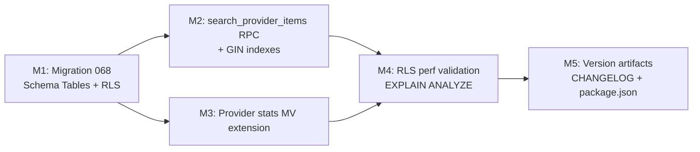

# Plan 094: Provider Catalog Schema Evolution (Menu Items + Service Offers)

| Field          | Value |
| -------------- | ----- |
| Plan ID        | 094 |
| Target Release | v0.10.21 (v0.10.19 and v0.10.20 already tagged on origin; resolved per Stage 1 version collision protocol) |
| Epic Alignment | Epic 2.3 — Enhanced Provider Profiles with Rich Media (schema foundation for catalog items); Epic 4.2 — Simple Booking System (ordering prerequisite) |
| Related Issues | None |
| Classification | Feature |
| Pipeline       | Full |
| GitHub Issue   | https://github.com/abu-lina/uflow/issues/148 |
| Created        | 2026-04-19T18:40Z |

## Changelog

| Date | Agent | Change | Status |
|------|-------|--------|--------|
| 2026-04-19T18:40Z | Planner | Initial draft — from ADR-094 (Architect) | Active |
| 2026-04-19T20:52Z | Implementer | Implementation started (TDD red gate opened, migration 068 in progress) | In Progress |
| 2026-04-19T21:20Z | Code Reviewer | Code review complete — APPROVED; 2 fix-in-review corrections applied | Code Review Approved |
| 2026-04-19T21:45Z | QA | QA testing complete — all automated gates pass; integration tests deferred (closure path defined) | QA Complete (RLS/RPC Deferred) |
| 2026-04-19T22:00Z | UAT | Value delivery validated — schema enables catalog publication + ordering foundation | UAT Approved |

---

## Value Statement and Business Objective

> As a **food provider (restaurant/kebab shop)** or **business service provider (barber, lawyer)** on UFlow, I want to **publish a provider-specific catalog of my items and services with prices, photos, and availability**, so that **seekers can browse exactly what I offer before visiting or booking — without navigating away from my UFlow profile**.

Secondary story:
> As a **UFlow platform engineer**, I want a **type-safe, searchable, ordering-ready schema** for per-provider catalog items, so that **future consumer ordering (Epic 4.2) can be added without a destructive schema migration**.

---

## Objective

Introduce `provider_menu_items` (food) and `provider_service_offers` (business services) as new typed catalog tables, per ADR-094. Preserve the existing `offers` vocabulary model and all live search paths. Deliver a new `search_provider_items` RPC enabling item-level full-text search. Extend the provider stats materialized view with item counts.

This plan delivers the **schema and data layer only** (migration + RLS + RPC + stats extension). The Implementer MUST NOT create UI or API route changes unless explicitly added to a milestone.

**Design authority**: `agent-output/architecture/094-offers-schema-adr.md` (ADR-094 — APPROVED_WITH_CHANGES)

---

## Assumptions

1. Migration numbering: the last applied migration in production is `067_three_section_search_schema.sql`. The next migration file must be numbered `068` to maintain sequential ordering.
2. `providers.listing_type` (`food | business` enum, migration 067) is stable and in production — used to determine which catalog table is relevant per provider.
3. The Supabase `german` text search configuration is available (proven in migration 014 GIN indexes).
4. `GENERATED ALWAYS AS ... STORED` tsvector columns are supported in the Supabase Postgres version (requires PG 12+; Supabase projects are PG 15+).
5. `provider_stats` materialized view (migration 055) currently counts some provider-level statistics; adding item counts is backward-compatible.
6. No UI or API route changes are in scope for this plan — schema migration only.

**OPEN QUESTION [RESOLVED]**: Should food ordering support be partially scaffolded now?  
→ **No.** ADR-094 D7 defers ordering FK design to a separate Ordering ADR (~ADR-097). This plan creates the catalog tables with `price_cents` and `is_available` typed columns — sufficient for ordering to be bolted on without a structural migration.

---

## Decision Record

| # | Decision | Status |
|---|----------|--------|
| D1 | Separate typed tables (`provider_menu_items` + `provider_service_offers`) rather than STI or JSONB | [RESOLVED] ADR-094 Pattern C — avoids sparse NULLable columns, ordering-safe typed fields |
| D2 | `GENERATED ALWAYS AS ... STORED` tsvector column on both new tables | [RESOLVED] Avoids per-query vector recomputation; compatible with Supabase RPC approach |
| D3 | `offer_tag_id` nullable bridge FK to global `offers` vocabulary | [RESOLVED] Preserves backward-compat vocabulary search while allowing bespoke items |
| D4 | `price_cents INTEGER` (not JSONB) for ordering-critical fields | [RESOLVED] Must be queryable typed column; JSONB unacceptable for cart/order logic |
| D5 | Global `offers` table is NOT modified; `providers.offers_ids[]` preserved | [RESOLVED] Zero-impact preservation of all live vocabulary search paths |
| D6 | RLS pattern: `provider_id IN (SELECT provider_id FROM providers WHERE provider_owner_id = auth.uid())` | [RESOLVED] Mirrors existing provider RLS; no new SECURITY DEFINER function needed |
| D7 | `search_provider_items` RPC uses `UNION ALL` across both tables with `item_type` discriminator | [RESOLVED] Single searchable surface for item-level search; no separate RPCs per type |
| D8 | `provider_stats` materialized view extended with item counts (`menu_item_count`, `service_offer_count`) | [RESOLVED] Required for provider profile display and admin tooling |

---

## Release Strategy

**Standalone** — no other known plans targeting the same version. Plan 085 open-actions targets v0.10.16 (already released). This plan is the first active feature plan post-v0.10.18.

---

## Milestone Dependencies



**Sequencing rule**: M2 and M3 can proceed in parallel once M1 is applied. M4 is the QA gate and cannot begin until M2 and M3 are complete. M5 is the final DevOps milestone.

---

## Milestones

### Milestone 1 — Database Migration 068: Catalog Tables + RLS

**Objective**: Introduce `provider_menu_items` and `provider_service_offers` tables with all typed columns, GIN indexes for full-text search, and row-level security policies — in a single idempotent migration.

**File**: `supabase/migrations/068_provider_catalog_tables.sql`

**What to create**:

1. **`public.provider_menu_items`** table with the following typed columns:
   - Primary key, `provider_id` FK → `providers(provider_id) ON DELETE CASCADE`
   - `offer_tag_id` FK → `offers(offer_id) ON DELETE SET NULL` (nullable vocabulary bridge)
   - `name_de TEXT NOT NULL`, `name_en TEXT`, `description_de TEXT`
   - `price_cents INTEGER` (NULL = price on request; no JSONB for price)
   - `price_currency TEXT DEFAULT 'EUR'`
   - `is_available BOOLEAN NOT NULL DEFAULT true`
   - `image_path TEXT` (Supabase Storage path, not URL)
   - `allergens TEXT[]` (food-specific, e.g. `['gluten', 'lactose']`)
   - `is_halal BOOLEAN NOT NULL DEFAULT false`
   - `sort_order INTEGER DEFAULT 0`
   - `created_at`, `updated_at` TIMESTAMPTZ
   - `search_vector TSVECTOR` — `GENERATED ALWAYS AS (to_tsvector('german', ...)) STORED`
     - Concatenate: `name_de`, `name_en`, `description_de` (with `COALESCE` guards)

2. **`public.provider_service_offers`** table with the following typed columns:
   - Primary key, `provider_id` FK → `providers(provider_id) ON DELETE CASCADE`
   - `offer_tag_id` FK → `offers(offer_id) ON DELETE SET NULL` (nullable vocabulary bridge)
   - `name_de TEXT NOT NULL`, `name_en TEXT`, `description_de TEXT`
   - `price_cents INTEGER` (NULL = free or price on request)
   - `price_currency TEXT DEFAULT 'EUR'`
   - `duration_minutes INTEGER` (NULL = variable)
   - `booking_url TEXT` (external link for now; internal booking future)
   - `is_available BOOLEAN NOT NULL DEFAULT true`
   - `sort_order INTEGER DEFAULT 0`
   - `created_at`, `updated_at` TIMESTAMPTZ
   - `search_vector TSVECTOR` — `GENERATED ALWAYS AS (to_tsvector('german', ...)) STORED`

3. **Indexes** on both tables:
   - B-tree on `provider_id` (most common filter)
   - GIN on `search_vector`
   - Partial index on `(provider_id) WHERE is_available = true` (hot path for menu display)

4. **RLS policies** on both tables:
   - `SELECT`: `USING (true)` — public read, consistent with providers table
   - `INSERT`: `WITH CHECK (provider_id IN (SELECT provider_id FROM public.providers WHERE provider_owner_id = auth.uid()))`
   - `UPDATE`: same owner check
   - `DELETE`: same owner check
   - **Note**: Admin bypass via `service_role` client (same pattern as providers table)

5. **Migration must be idempotent** — use `IF NOT EXISTS` throughout; safe to re-run.

**Acceptance criteria**:
- [ ] Both tables exist with all typed columns after migration
- [ ] `search_vector` is a stored generated tsvector column (confirm with `\d provider_menu_items`)
- [ ] GIN indexes present on both `search_vector` columns
- [ ] RLS enabled on both tables (`ALTER TABLE ... ENABLE ROW LEVEL SECURITY`)
- [ ] All 4 RLS policies created per table (SELECT/INSERT/UPDATE/DELETE)
- [ ] Migration is idempotent (can be re-run without error)
- [ ] `price_cents` and `is_available` are typed columns — **no JSONB for these fields** (Critic hard gate)

---

### Milestone 2 — `search_provider_items` RPC

**Objective**: Add a new Postgres function (in the same migration file 068 or as an additional `CREATE OR REPLACE FUNCTION`) that enables unified full-text search across both catalog tables.

**Function signature** (illustrative — IMPLEMENTER determines exact SQL):

**ILLUSTRATIVE ONLY**:
```
search_provider_items(
  search_query TEXT DEFAULT '',
  listing_type_filter TEXT DEFAULT NULL,   -- 'food' | 'business' | NULL (both)
  provider_id_filter UUID DEFAULT NULL,    -- filter to a single provider
  limit_count INTEGER DEFAULT 50,
  offset_count INTEGER DEFAULT 0
)
RETURNS TABLE (
  item_id UUID,
  provider_id UUID,
  item_type TEXT,          -- 'menu_item' | 'service_offer'
  name_de TEXT,
  name_en TEXT,
  price_cents INTEGER,
  is_available BOOLEAN,
  rank REAL
)
```

**What the function must do**:
- `UNION ALL` across `provider_menu_items` and `provider_service_offers`
- Include `item_type` discriminator (`'menu_item'` vs `'service_offer'`) in the result set
- Apply tsvector GIN search using `search_vector @@ plainto_tsquery('german', search_query)` with `ts_rank` for ranking
- Support empty `search_query` (returns all available items, ordered by `sort_order` then `name_de`)
- Support optional `listing_type_filter` via a JOIN to `providers.listing_type`
- Support optional `provider_id_filter` for single-provider item listing
- Filter `is_available = true` unless an explicit override parameter is added later
- `SECURITY INVOKER` (not DEFINER) — RLS must remain active for the caller

**Acceptance criteria**:
- [ ] Function exists in the database after migration
- [ ] `SELECT * FROM search_provider_items('Döner')` returns rows with correct `item_type` discriminator
- [ ] Empty query returns all available items ordered by `sort_order, name_de`
- [ ] `listing_type_filter = 'food'` returns only menu items
- [ ] `listing_type_filter = 'business'` returns only service offers
- [ ] `EXPLAIN (ANALYZE, BUFFERS)` shows index scan on `search_vector` GIN index (not sequential scan)

---

### Milestone 3 — Provider Stats Materialized View Extension

**Objective**: Extend `provider_stats` materialized view (migration 055) to include per-provider catalog item counts, so provider profile pages and admin tooling can display item counts without runtime aggregation.

**What to add** (in migration 068 or a new migration 069 if the materialized view refresh is complex):
- `menu_item_count BIGINT` — count of `provider_menu_items` rows per `provider_id` WHERE `is_available = true`
- `service_offer_count BIGINT` — count of `provider_service_offers` rows per `provider_id` WHERE `is_available = true`
- Refresh trigger: if `provider_stats` has an existing refresh trigger or scheduled refresh, ensure the new columns are included in the view definition

**Decision on migration vs separate file**:
- If `provider_stats` refresh involves complex logic (e.g., a `CONCURRENTLY` refresh trigger), place this in a new migration `069` to isolate risk.
- If the view can be `CREATE OR REPLACE`-d safely, include it in migration 068.
- Implementer must inspect migration 055 and choose the lower-risk path.

**Acceptance criteria**:
- [ ] `provider_stats` materialized view includes `menu_item_count` and `service_offer_count` columns
- [ ] Refreshing the view (manually or via trigger) populates both columns correctly
- [ ] Providers with 0 catalog items show `0` (not NULL) in both columns

---

### Milestone 4 — RLS Performance Validation (QA Gate)

**Objective**: Confirm that the `provider_id IN (SELECT ...)` subquery RLS policies on both tables do not cause sequential scans or query plan regressions under realistic data.

**What the Implementer must provide** (captured in implementation notes, not in a migration):
- `EXPLAIN (ANALYZE, BUFFERS)` output for an INSERT policy evaluation on `provider_menu_items` with a realistic providers table row count (seed at least 100 provider rows in local Supabase)
- If the plan shows a sequential scan on `providers` for the subquery, the Implementer must add an index on `providers(provider_owner_id)` or refactor the RLS policy to use a `SECURITY DEFINER` helper function returning `provider_ids[]` for the session user
- The index `providers(provider_owner_id)` should already exist (migration 011); confirm it is present before deciding on the helper function approach

**Acceptance criteria**:
- [ ] `EXPLAIN (ANALYZE, BUFFERS)` output attached in implementation notes
- [ ] INSERT/UPDATE RLS policy uses index scan (not seq scan) on `providers` table
- [ ] If seq scan found, a remediation (index or helper function) is applied before QA sign-off

---

### Milestone 5 — Version Artifacts Update

**Objective**: Bump version and document this release in CHANGELOG and package.json.

**Tasks**:
- Increment `package.json` `"version"` to the next available patch after `v0.10.18` (confirm no tag collision via `git tag --list "v*" | sort -V | tail -3`)
- Add CHANGELOG entry under the new version documenting:
  - `provider_menu_items` table (food catalog)
  - `provider_service_offers` table (business service catalog)
  - `search_provider_items` RPC with `UNION ALL` tsvector search
  - Provider stats MV extended with item counts
  - RLS policies on both new tables

**Acceptance criteria**:
- [ ] `package.json` version matches the git tag
- [ ] CHANGELOG entry present and accurate
- [ ] No version mismatch between `package.json`, git tag, and CHANGELOG

---

## Testing Strategy

**Scope**: Schema verification, RPC correctness, RLS enforcement, and stats view accuracy. No UI tests in scope.

**Expected test types**:
- **SQL integration tests** (Supabase local instance via `supabase test db` or migration dry-run):
  - Verify both tables exist with correct column types after migration
  - Verify `search_vector` is populated on INSERT (generated column behavior)
  - Verify `search_provider_items` RPC returns correct rows with correct discriminator
- **RLS enforcement tests** (using separate anon/authed/owner roles in local Supabase):
  - Anon can SELECT from both tables
  - Authenticated non-owner cannot INSERT into another provider's catalog
  - Provider owner CAN INSERT/UPDATE/DELETE their own items
  - `service_role` bypasses RLS (admin operations)
- **Performance gate** (Milestone 4): `EXPLAIN ANALYZE` evidence required; no automated test needed — evidence in implementation notes is sufficient for this gate
- **Materialized view test**: After REFRESH, `menu_item_count` and `service_offer_count` match live counts

**Coverage expectations**: Every new RLS policy must have at least one positive (allowed) and one negative (denied) test case. `search_provider_items` must be exercised with empty query, German keyword, and `listing_type_filter` cases.

**Out of scope**: Browser E2E, UI rendering, API route tests — these are deferred until UI milestones land in a later plan.

---

## Validation Checklist

Before handoff to QA:
- [ ] Migration file named `068_provider_catalog_tables.sql` (or split into 068 + 069 if stats MV requires it)
- [ ] `price_cents` and `is_available` are typed columns — **no JSONB** (hard gate from ADR-094)
- [ ] `search_vector` is `GENERATED ALWAYS AS ... STORED` (not a functional index)
- [ ] RLS `EXPLAIN (ANALYZE, BUFFERS)` output attached in implementation artifact
- [ ] Provider stats MV includes both item count columns
- [ ] `search_provider_items('')` returns items in `sort_order, name_de` order
- [ ] All migrations idempotent (IF NOT EXISTS)

---

## Risks

| Risk | Severity | Mitigation |
|------|----------|-----------|
| `provider_stats` MV refresh complexity causes downtime | Medium | Use `REFRESH MATERIALIZED VIEW CONCURRENTLY`; isolate to migration 069 if needed |
| RLS subquery causes seq scan on `providers` (policy perf regression) | Medium | M4 gate explicitly checks this; index `providers(provider_owner_id)` likely exists from migration 011 |
| `GENERATED ALWAYS AS STORED` tsvector not supported in project PG version | Low | Supabase projects use PG 15+; STORED generated columns available since PG 12 |
| `UNION ALL` RPC returns mixed item_type rows confusing consumers | Low | `item_type` discriminator column in result; API layer must handle both types before UI work begins |
| Migration 068 numbering conflict if another migration was applied in parallel | Low | Implementer must `git pull` latest migration state before numbering; if 068 exists, use 069 |

---

## Baseline and Measurements

**What to measure**: Row counts and query latency before and after migration.

**Before migration** (record in implementation notes):
- `SELECT COUNT(*) FROM public.providers` (row count baseline)
- `SELECT COUNT(*) FROM public.offers` (vocabulary table baseline)
- `EXPLAIN (ANALYZE, BUFFERS) SELECT * FROM search_offers('Döner')` (baseline for existing RPC — must not regress)

**After migration** (record in implementation notes):
- `EXPLAIN (ANALYZE, BUFFERS) SELECT * FROM search_provider_items('Döner')` — confirm GIN index hit
- Migration duration (for ops runbook awareness)

**Success thresholds**:
- `search_provider_items` index scan latency: ≤ 5ms on ≥1000 seeded catalog rows (local Supabase)
- Existing `search_offers` RPC latency unchanged (no regression)
- `provider_stats` MV refresh completes without error

**Deferral condition**: Baseline capture may be skipped if local Supabase is not available; in that case, the Implementer must document the deferral with reason in the implementation artifact.

---

## Search Integration — Was? Input

**Current status**: The Was? search input is **already fully wired** end-to-end through the vocabulary path:

```
SearchBar (Was? input)
  → URL param ?q
  → /api/providers/search
  → services/providers.ts getProviders(query)
  → searchOffers(query) [parallel]
  → supabase.rpc('search_offers', …)   ← live tsvector GIN
  → filter providers.offers_ids.cs.{ids}
```

**No code change needed** to ship vocabulary Was? search. This plan does not modify that path.

**Item-level Was? search** (e.g., searching "Döner €5" or "30 min Haarschnitt") requires:
1. `search_provider_items` RPC (this plan, Milestone 2)
2. A UI/API update to include item-level results — **deferred to a separate plan** (not in scope here)

The `search_offers` RPC and GIN indexes are **explicitly preserved** by this plan (ADR-094 D5).

---

## Duration Estimates

| Phase | Estimate | Uncertainty drivers |
|-------|----------|---------------------|
| Analysis | 0 (done — ADR-094 complete) | — |
| Planner | 0.5h (this document) | — |
| Critic review | 1–2h | ADR alignment check, JSONB hard gate |
| Implementation | 3–5h | Migration complexity depends on provider_stats MV structure |
| QA (schema + RLS tests) | 2–3h | RLS negative test cases require local role switching |
| UAT | 1h | Schema verification only; no UI |
| DevOps | 1–2h | Standard migration deploy; confirm tag collision |

**Total estimate**: ~8–13h elapsed (sequential pipeline).

**Primary uncertainty**: `provider_stats` MV (migration 055) may require `CONCURRENTLY` refresh isolation, adding 1–2h to Implementation.

---

## Handoff Notes

**For Implementer**:
- Read `agent-output/architecture/094-offers-schema-adr.md` in full before writing any SQL
- Inspect `supabase/migrations/055_create_provider_stats_materialized_view.sql` before touching the stats view — determine if a separate migration 069 is safer
- Inspect `supabase/migrations/011_add_providers_performance_indexes.sql` to confirm `providers(provider_owner_id)` index exists before proceeding with RLS policies
- The migration must be a single transaction where possible; if `CONCURRENTLY` is needed for MV refresh, note that it cannot run inside a transaction block
- The `search_provider_items` function must use `SECURITY INVOKER`, not `SECURITY DEFINER`

**For QA**:
- The primary test surface is the Supabase local instance — use `supabase start` and seed at least 10 providers (5 food, 5 business) with catalog items
- RLS tests require switching roles: `SET ROLE authenticated; SET LOCAL jwt.claims.sub = '<uuid>';`
- The `EXPLAIN ANALYZE` gate (M4) output should be attached to the QA artifact

**Rollback**:
- Both new tables have `ON DELETE CASCADE` from `providers` — dropping the tables is safe and does not affect providers
- Migration rollback: `DROP TABLE IF EXISTS public.provider_menu_items; DROP TABLE IF EXISTS public.provider_service_offers;` then `DROP FUNCTION IF EXISTS search_provider_items;` then revert the provider_stats MV to pre-migration definition
- Rollback DOES NOT affect the existing `offers` table, `search_offers` RPC, or `providers.offers_ids[]` — these are untouched

---

## OPEN QUESTIONS

All open questions resolved. No unresolved items at handoff.

| # | Question | Resolution |
|---|----------|-----------|
| OQ1 | Should ordering scaffolding (cart, order tables) be included? | **[RESOLVED]** No — ADR-094 D7 defers to ordering ADR-097. `price_cents` column is sufficient prerequisite. |
| OQ2 | One migration (068) or split (068 + 069)? | **[RESOLVED]** Implementer decides based on `provider_stats` MV complexity; both options acceptable. |
| OQ3 | `search_provider_items` — same migration or separate? | **[RESOLVED]** Same migration (or same PR); must be consistent with tables it references. |
