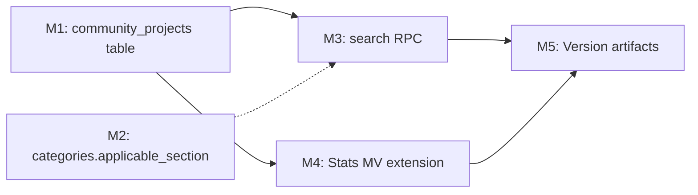

# Plan 095 — Unified Catalog Architecture: Community Projects + Category Scoping

| Field          | Value                                                                  |
| -------------- | ---------------------------------------------------------------------- |
| Plan ID        | 095                                                                    |
| Target Release | Next available patch after v0.10.21; confirm at DevOps Stage 1         |
| Epic Alignment | Epic 2.3 (Enhanced Provider Profiles — extended to cover ummah org activity publishing) + Epic 4.2 (Booking System foundation) |
| Related Issues | None                                                                   |
| Classification | Feature                                                                |
| Pipeline       | Full                                                                   |
| GitHub Issue   | https://github.com/abu-lina/uflow/issues/151                          |
| Created        | 2026-04-20T14:00Z                                                      |

## Changelog

| Date               | Author  | Change                                | Notes                                                  |
| ------------------ | ------- | ------------------------------------- | ------------------------------------------------------ |
| 2026-04-20T14:00Z  | planner | Created plan                          | From architecture discussion in session S094            |
| 2026-04-20T15:00Z  | planner | Revised per Critic findings M-1..M-3, L-1..L-5 | APPROVED_WITH_RECOMMENDATIONS — all 8 findings addressed |
| 2026-04-20T15:40Z  | implementer | Implementation started                | TDD red gate opened for migration 069 + ADR-095 deliverables |
| 2026-04-20T16:00Z  | code-reviewer | Code review APPROVED                | No blocking findings. 1 LOW doc note, 2 INFO. All M1-M4 ACs satisfied. |
| 2026-04-20T16:50Z  | qa | QA testing COMPLETE               | All automated gates pass (tests 2/2, type-check, lint, build). DB tests deferred (migration 061 blocker). |
| 2026-04-20T16:55Z  | uat | UAT APPROVED FOR RELEASE          | Value statement delivered. Schema complete with ordering-ready pattern. DF-1: migration 061 resolution 24h window. |

---

## Value Statement and Business Objective

> As a **UFlow platform engineer**, I want to **complete the three-section catalog architecture by adding `community_projects` for ummah activities and scoping categories to their applicable section**, so that **all three sections (FOOD / UMMAH / STORES) have consistent org→item hierarchies and a clean ordering-FK path — enabling future consumer ordering (Epic 4.2) without destructive schema migration**.

> As a **community service organiser** (mosque, charity, Verein), I want to **publish events, donation campaigns, classes, and volunteer opportunities under my ummah organisation**, so that **seekers can discover and eventually register for or contribute to specific activities**.

## Success Criteria

- `community_projects` table exists with RLS, indexes, tsvector search, and `updated_at` trigger — structurally parallel to `provider_menu_items` and `provider_service_offers`
- `categories.applicable_section` column exists with CHECK constraint and index
- A search RPC exists that can query community projects by text, community service ID, and project type
- `provider_stats` MV is extended (not replaced) with `community_project_count` column — Option A confirmed (see D8)
- All three item tables follow the same structural pattern: FK to parent org, `name_de`/`name_en`, `description_de`, `price_currency`, `sort_order`, `search_vector STORED`, `created_at`, `updated_at` — `community_projects` uses `is_active` (project lifecycle) where 068 tables use `is_available` (toggle), per D9
- Zero data loss — `community_services` table is not modified destructively
- Migration is idempotent (`IF NOT EXISTS` / `CREATE OR REPLACE` / `DROP ... IF EXISTS`)

## Assumptions

1. `community_services` has production data — structure must not be altered destructively
2. Tables from migration 068 (`provider_menu_items`, `provider_service_offers`) are **empty** — zero-cost structural alignment window
3. The existing `search_community_services_enhanced` RPC (migration 014) searches at the **org level** (`community_services`) — the new RPC is for the **item level** (`community_projects`)
4. The `update_updated_at_column()` trigger function already exists (used in 068 and earlier migrations)
5. `review_status` type and `listing_type_enum` type already exist
6. RLS pattern follows the established `community_services` ownership model (the `provider_id` FK on `community_services` links to the org's owner)
7. Migration 061 local DB reset blocker exists — integration testing against local Supabase may require workaround or UAT-only validation
8. **Pre-QA hard gate**: A migration-time `DO $$ ... $$` block in 069 will log any `community_services` rows with `provider_id IS NULL`. If unlinked orgs exist in production, an admin linking step is required before QA sign-off on ummah write policies.

## Decision Record

| ID  | Decision                                                             | Status                          |
| --- | -------------------------------------------------------------------- | ------------------------------- |
| D1  | Add `community_projects` table as the ummah item-level entity, referencing `community_services(community_service_id)` | [RESOLVED] Parallel to how `provider_menu_items` references `providers(provider_id)` — maintains consistent org→item hierarchy across all three sections |
| D2  | Do NOT split `providers` table into separate food/business tables    | [RESOLVED] 95% column overlap; splitting doubles RLS policies, API surfaces, admin screens; `bookmarks.bookmarkable_type='provider'` would break; divergence is at item level only (already handled by 068) |
| D3  | Add `applicable_section` column to `categories` table               | [RESOLVED] Enables section-scoped category dropdowns without separate category tables; NULL = unscoped legacy category (backfill gradually) |
| D4  | Three separate item tables for ordering FKs — no CTI base table     | [RESOLVED] Food cart checkout, service booking, and event ticket/donation are semantically distinct commerce verbs; a polymorphic `catalog_items` base would add complexity without value |
| D5  | `community_projects.project_type` discriminator: `event`, `donation`, `class`, `volunteer` | [RESOLVED] Covers all ummah activity types identified in architecture discussion; extensible via ALTER TYPE if new types emerge |
| D6  | Ordering system implementation is OUT OF SCOPE for this plan         | [RESOLVED] This plan establishes the FK-ready schema pattern; actual `order_line_items` table is Epic 4.2 work |
| D7  | Entity ownership scope: `community_services` with non-null `provider_id` (owned orgs) for RLS write policies; read is public | [RESOLVED] Mirrors the `providers.provider_owner_id` pattern from 068 |
| D8  | M4 Stats MV: extend existing `provider_stats` MV (Option A), not a separate `community_stats` MV (Option B) | [RESOLVED] Plan 094 already established `provider_stats` as a platform-wide aggregation point (not provider-only) by adding `menu_item_count` and `service_offer_count` from both item tables. Extending to `community_project_count` is consistent. Long-term rename to `platform_stats` is LOW tech debt, deferred. |
| D9  | `community_projects` uses `is_active` (not `is_available`) for the availability flag | [RESOLVED] Semantic distinction: `is_active` = project currently accepting registrations/donations (lifecycle state); `is_available` = item on/off toggle for menu/service items. The two are functionally equivalent but the names better reflect each domain's intent. |
| D10 | `community_projects` includes `price_currency TEXT NOT NULL DEFAULT 'EUR'` to match 068 pattern | [RESOLVED] Maintains structural parity; enables multi-currency support without a future destructive migration even though EUR-only today. |
| D11 | `raised_cents` is a schema placeholder — read-only until Epic 4.2 implements increment logic | [RESOLVED] Column exists to complete the ordering-FK schema pattern; display layers must treat 0 as "not yet tracked" until the ordering system lands. No mechanism in migration 069 writes to this column beyond DEFAULT 0. |
| D12 | ADR-095 is a required deliverable — to be produced by Implementer alongside migration 069 | [RESOLVED] Follows Plan 094 convention (ADR-094 produced alongside migration 068). ADR-095 will codify: three-section org→item hierarchy, separate-FK ordering pattern, CTI base table rejection rationale. |

## Release Strategy

Standalone (no other known plans targeting the same version).

---

## Architecture Context

### Current State (post-Plan 094, v0.10.21)

```
FOOD
  providers (listing_type = 'food')
    └── provider_menu_items (068)
           price_cents, is_available, allergens, is_halal

STORES
  providers (listing_type = 'business')
    └── provider_service_offers (068)
           price_cents, is_available, duration_minutes, booking_url

UMMAH
  community_services  ← org level (mosque, charity, Verein)
    └── (NO ITEM TABLE)  ← GAP
```

### Target State (post-Plan 095)

```
FOOD
  providers (listing_type = 'food')
    └── provider_menu_items (068)

STORES
  providers (listing_type = 'business')
    └── provider_service_offers (068)

UMMAH
  community_services  ← org level
    └── community_projects  ← NEW (069)
           project_type (event|donation|class|volunteer)
           start_date, end_date
           ticket_price_cents, donation_goal_cents, raised_cents, max_attendees

CROSS-CUTTING
  categories.applicable_section  ← NEW column (069)
    'food' | 'business' | 'ummah' | 'all'
```

### Future Ordering FK Pattern (NOT implemented in this plan — documented for context)

```
order_line_items
  → provider_menu_items.id      (food cart)
  → provider_service_offers.id  (service booking)
  → community_projects.id       (event ticket / donation)
```

---

## Milestone Dependencies



One-sentence sequencing: M1 and M2 are independent DDL milestones that can be implemented in the same migration file; M3 and M4 depend on M1; M5 is the final gate.

---

## Milestones

### M1: `community_projects` Table + Indexes + RLS + Triggers

**Objective**: Create the ummah item-level table that completes the three-section catalog pattern.

**Deliverables** (migration 069):

1. **Table `community_projects`** with columns:
   - `id` UUID PK
   - `community_service_id` UUID FK → `community_services(community_service_id)` ON DELETE CASCADE
   - `project_type` TEXT with CHECK constraint (`event`, `donation`, `class`, `volunteer`)
   - `name_de` TEXT NOT NULL, `name_en` TEXT, `description_de` TEXT
   - `ticket_price_cents` INTEGER (nullable, non-negative CHECK)
   - `donation_goal_cents` INTEGER (nullable, non-negative CHECK)
   - `raised_cents` INTEGER DEFAULT 0 (non-negative CHECK) — **schema placeholder; read-only until Epic 4.2 (D11)**
   - `max_attendees` INTEGER (nullable, positive CHECK)
   - `price_currency` TEXT NOT NULL DEFAULT 'EUR' — **matches 068 pattern (D10)**
   - `start_date` TIMESTAMPTZ (nullable)
   - `end_date` TIMESTAMPTZ (nullable)
   - `is_active` BOOLEAN NOT NULL DEFAULT true — **lifecycle flag, not toggle (D9)**
   - `image_path` TEXT (nullable)
   - `sort_order` INTEGER NOT NULL DEFAULT 0
   - `search_vector` TSVECTOR GENERATED ALWAYS AS STORED (german, name_de + name_en + description_de)
   - `created_at`, `updated_at` TIMESTAMPTZ defaults
   - CHECK: `end_date IS NULL OR start_date IS NULL OR end_date >= start_date`

2. **Indexes**:
   - B-tree on `community_service_id` (FK lookup)
   - GIN on `search_vector` (full-text search)
   - Partial B-tree on `community_service_id WHERE is_active = true` (active items query)
   - B-tree on `project_type` (type-filtered queries)

3. **RLS** (mirror 068 pattern):
   - Public SELECT (anyone can browse projects)
   - Owner INSERT/UPDATE/DELETE — owner determined via `community_services.provider_id → providers.provider_owner_id = auth.uid()`
   - **Note**: this is a two-join subquery vs 068's single join. An index on `community_services.provider_id` (already exists from migration 002) covers the intermediate join.

4. **Trigger**: `update_updated_at_column()` on BEFORE UPDATE

5. **Migration-time ownership diagnostic** (Assumption 8 / M-2 mitigation): a `DO $$ ... $$` block that logs (via `RAISE NOTICE`) any `community_services` rows where `provider_id IS NULL`. This gives operators visibility before QA tests write policies. Does not block migration execution.

**Acceptance Criteria**:
- Table is idempotent (`CREATE TABLE IF NOT EXISTS`)
- RLS is enabled and all four policies exist
- Indexes match the pattern established in 068
- `search_vector` is STORED (not computed at query time)
- FK cascade on delete matches 068 pattern
- Migration-time diagnostic block present and logs any unlinked community_services

---

### M2: `categories.applicable_section` Column

**Objective**: Enable section-scoped category dropdowns so food, business, and ummah categories don't leak across sections.

**Deliverables** (same migration 069):

1. **ALTER TABLE** `categories` ADD COLUMN `applicable_section` TEXT with CHECK constraint: `('food', 'business', 'ummah', 'all')`
   - NULL allowed (legacy unscoped categories)
2. **Index**: B-tree on `applicable_section` WHERE `applicable_section IS NOT NULL`
3. **COMMENT** explaining the column purpose and NULL semantics

**Acceptance Criteria**:
- Column is nullable (no backfill required in this plan — existing categories remain NULL)
- CHECK constraint prevents invalid values
- No existing data is modified

**NOTE**: Backfill of existing categories to their applicable section is a follow-up task (can be done via admin UI or future migration). This plan only adds the column.

---

### M3: `search_community_projects` RPC

**Objective**: Provide a tsvector search function for community projects, parallel to `search_provider_items` from 068.

**Deliverables** (same migration 069):

1. **Function `search_community_projects`** with parameters:
   - `search_query TEXT DEFAULT ''`
   - `community_service_id_filter UUID DEFAULT NULL`
   - `project_type_filter TEXT DEFAULT NULL`
   - `active_only BOOLEAN DEFAULT true`
   - `limit_count INTEGER DEFAULT 50`
   - `offset_count INTEGER DEFAULT 0`

2. **Return type**: `TABLE (project_id UUID, community_service_id UUID, project_type TEXT, name_de TEXT, name_en TEXT, ticket_price_cents INTEGER, donation_goal_cents INTEGER, is_active BOOLEAN, start_date TIMESTAMPTZ, end_date TIMESTAMPTZ, image_path TEXT, rank REAL)`

3. **Pattern**: SECURITY INVOKER, German tsvector, `plainto_tsquery`, `ts_rank`, ordered by rank (when searching) or sort_order+name_de (when browsing)

**Acceptance Criteria**:
- Empty search_query returns all (active) projects ordered by sort_order
- Text search uses GIN index on search_vector
- `SECURITY INVOKER` (RLS applies)
- Filters compose correctly (type + service + text)

---

### M4: Stats Extension — Community Project Counts

**Objective**: Extend `provider_stats` MV with ummah project counts, parallel to `menu_item_count` and `service_offer_count` (D8: Option A confirmed).

**Deliverables** (same migration 069):

1. **Extend `provider_stats` MV** with `community_project_count` column:
   - DROP and re-CREATE the MV (same idempotent pattern as 068)
   - Add sub-select: `(SELECT COALESCE(COUNT(*), 0)::bigint FROM public.community_projects WHERE is_active = true) AS community_project_count`
   - Re-create the singleton unique index `idx_provider_stats_singleton`
   - All existing columns (`total_providers`, `approved_count`, `menu_item_count`, `service_offer_count`, etc.) must be preserved exactly

**Acceptance Criteria**:
- `community_project_count` column exists on `provider_stats`
- MV can be refreshed CONCURRENTLY (singleton unique index exists)
- All pre-existing `provider_stats` columns are preserved unchanged
- Refresh query completes without error after migration

---

### M5: Version Artifacts

**Objective**: Bump version and document the release.

**Deliverables**:

1. Update `package.json` version to the confirmed target release
2. Add CHANGELOG.md entry documenting:
   - `community_projects` table
   - `categories.applicable_section` column
   - `search_community_projects` RPC
   - Stats MV extension
3. Update README.md if database section references catalog tables
4. Produce **ADR-095** at `agent-output/architecture/095-unified-catalog-adr.md` (D12) documenting:
   - Three-section org→item hierarchy pattern
   - Separate-FK ordering pattern (three tables, not CTI)
   - CTI base table rejection rationale
   - `provider_stats` MV as platform-wide aggregation point

**Acceptance Criteria**:
- Version in `package.json` matches git tag at release
- CHANGELOG entry covers all schema changes in this plan
- ADR-095 file exists and is referenced in `system-architecture.md` changelog

---

## Risks and Mitigations

| Risk                                                        | Likelihood | Impact | Mitigation                                                          |
| ----------------------------------------------------------- | ---------- | ------ | ------------------------------------------------------------------- |
| Migration 061 local DB blocker prevents integration testing | High       | Medium | Validate against UAT Supabase instance; document workaround         |
| `community_services.provider_id` is NULL for some orgs (unlinked) | Medium | Medium | RLS write policies only match orgs with a linked provider; unlinked orgs cannot have projects until claimed |
| Future `project_type` values needed beyond initial four     | Low        | Low    | CHECK constraint uses explicit list; extend via ALTER migration      |
| Category backfill scope unclear                             | Low        | Low    | Deferred to follow-up; column is nullable so no urgency             |

## Testing Strategy

**Expected test types**:
- Unit tests for migration SQL (CREATE IF NOT EXISTS idempotency, CHECK constraints, RLS policy correctness)
- Integration tests for `search_community_projects` RPC (text match, filter composition, empty results, pagination)
- Regression tests confirming existing `search_provider_items` and `search_community_services_enhanced` are unaffected
- Stats MV refresh test (CONCURRENTLY works, counts are accurate)

**Coverage expectations**: All new DDL objects (table, indexes, RLS policies, RPC, MV extension) have at least one positive and one negative test path.

**Critical scenarios**: RLS owner-only write access, tsvector German tokenization, CHECK constraint enforcement, FK cascade on community_service deletion.

*(Specific test cases are QA agent's responsibility — documented in `agent-output/qa/`.)*

---

## Duration Estimates

| Phase          | Estimate   | Uncertainty Drivers                                                 |
| -------------- | ---------- | ------------------------------------------------------------------- |
| Analysis       | 0h         | Already completed in session S094 architecture discussion            |
| Planning       | 1–2h       | This document                                                        |
| Implementation | 3–5h       | Single migration file; complexity in RLS ownership chain for community_services |
| QA             | 2–3h       | Migration 061 blocker may force UAT-only testing                     |
| UAT            | 1–2h       | Schema-only — no UI changes to validate                              |
| DevOps         | 1h         | Standard Stage 1 + Stage 2 release pipeline                          |
| **Total**      | **8–13h**  | Primary driver: migration 061 local testing blocker                  |

---

## Handoff Notes

**For Critic**:
- This is a schema-only plan (single migration file) — no UI, no API route, no service-layer changes
- Pattern exactly follows 068 (attached as context) — community_projects mirrors provider_menu_items/provider_service_offers
- The RLS ownership chain is slightly different: `community_projects → community_services.provider_id → providers.provider_owner_id = auth.uid()` (one extra join vs 068's direct `provider_id → providers.provider_owner_id`)
- Category backfill is intentionally deferred — column is nullable

**For Implementer**:
- Reference migration 068 as the structural template
- Single migration file `069_community_projects_category_scoping.sql` is recommended
- The `search_community_projects` RPC should follow the same CTE + ORDER BY pattern as `search_provider_items`
- `provider_stats` MV must preserve all existing columns when re-created

**Rollback**:
- All objects are new (no existing data modified) — rollback is `DROP TABLE`, `DROP FUNCTION`, `ALTER TABLE DROP COLUMN`
- No data migration to reverse
