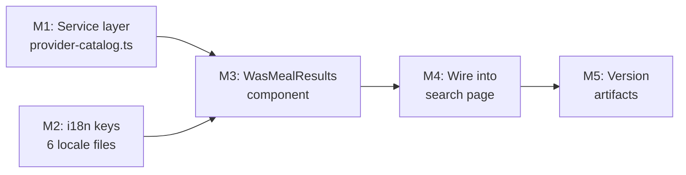

# Plan 096 — Wire Up Meal Search in "Was?" Accordion

| Field          | Value |
|----------------|-------|
| Plan ID        | 096 |
| Target Release | v0.10.23 (next available patch after `origin/main` v0.10.22; confirm at DevOps Stage 1) |
| Epic Alignment | Meal Search — Food Discovery (search/food section) |
| Related Issues | None (GitHub issue to be created below) |
| Classification | Feature |
| Pipeline       | Full |
| GitHub Issue   | https://github.com/abu-lina/uflow/issues/153 |
| Created        | 2026-04-21T09:00Z |

---

## Changelog

| Date | Author | Status | Notes |
|------|--------|--------|-------|
| 2026-04-21T09:00Z | planner | Active | Initial plan created from worktree session S96 |
| 2026-04-21T09:20Z | Critic | Active | Critique 096 APPROVED; 2 MEDIUM findings (F1, F2) incorporated as plan revisions |
| 2026-04-21T09:25Z | planner | Active | Revised per Critic: D4 amended (frontend-only, client-side map mandated); M1 interface corrected; M2 adds `searchError` key; M3 adds 5th error state + `isError` prop; M4 adds ≥2 char guard + provider name map + `isError` state |
| 2026-04-21T09:35Z | Implementer | In Progress | Implementation started (TDD-first): service + component + page wiring + i18n + v0.10.23 artifacts |
| 2026-04-21T12:30Z | Code Reviewer | Code Review Approved | APPROVED_WITH_COMMENTS: 1 fix-in-review applied (placeholder path); 2 LOW non-blocking findings tracked |
| 2026-04-21T12:40Z | QA | QA Complete | All test gates passed (type-check, lint, 1059 tests); build blocked DF-4 exception; ready for UAT |
| 2026-04-21T12:50Z | UAT | UAT Complete | Value statement delivered; all workflows validated; APPROVED FOR RELEASE to DevOps |

---

## Value Statement and Business Objective

> As a **user browsing /search?section=food**, I want to **type a meal name and see live results from providers' menus**, so that **I can discover which local restaurants or food providers offer a specific dish**.

---

## Objective

Connect the existing "Was?" text input (already rendered in the search page) to the `search_provider_items` Supabase RPC introduced in Plan 094. Render results per the Figma design (node 219:3100) with a debounced query, section-scoped filtering, and encouraging empty states across all six supported languages.

---

## Context & Constraints

### What Already Exists (Do NOT re-implement)

| Asset | Location | Notes |
|-------|----------|-------|
| `provider_menu_items` table | DB (migration 068) | Backing store |
| `search_provider_items` RPC | Supabase | Returns `item_id`, `provider_id`, `item_type`, `name_de`, `name_en`, `price_cents`, `is_available`, `rank` |
| `wasQuery` state | `src/app/(public)/search/page.tsx` | Already declared; onChange wired |
| `selectedSection` state | `src/app/(public)/search/page.tsx` | `'food' \| 'ummah' \| 'business'` |
| Empty placeholder `"Was suchst du?"` | page.tsx lines 160-163 | To be replaced by this plan's output |
| Section selector + ExpandSection | page.tsx | Already in place |

### Architecture Context

- `/search` page is a `'use client'` component (full client-side interactivity required)
- Service layer imports `supabase` from `@/lib/supabase/client` (browser client)
- Domain-specific UI lives in `src/features/search/components/`
- Full-text search via RPC — **no `ILIKE`**
- i18n via `useLanguage` / translation files in `src/translations/{de,en,tr,ar,ps,ur}.ts`

---

## Figma Design Reference

**Node 219:3100** (`Search-Results`, 345×176) — screenshot captured:

```
Was?                                           ^
  [ 🔍 Döner                                   ]
  ┌──────────────────────────────────────────┐
  │ [img 48×48]  Döner              (semibold)│
  │              Türkisch           (light)   │
  └──────────────────────────────────────────┘
```

**Result row anatomy** (per Figma node 219:3107, `Frame 286`, 313×48):

| Zone | Description |
|------|-------------|
| Left 48×48 | Provider avatar/thumbnail image (rounded corners) |
| Right text block | Line 1: `name_de` or `name_en` — semibold 16px (`Inter Tight SemiBold`) |
| | Line 2: Provider name — light 16px (`Inter Tight Light`) |

> **Note**: Provider name is **not** a column in the `search_provider_items` RPC return (verified: migration 068). The implementer must map `provider_id → provider_name` client-side from a provider list. See Decision Record D4 (revised).

---

## Assumptions

1. The `search_provider_items` RPC returns `provider_id` and item fields sufficient to render results; a provider name lookup mechanism exists (see D4).
2. All six translation locales (`de`, `en`, `tr`, `ar`, `ps`, `ur`) have the same `suchen.*` key structure.
3. Provider avatar images can be fetched via the existing provider image pattern already used elsewhere in the codebase.
4. The 300 ms debounce is an explicit product requirement from the task brief.
5. `listing_type_filter` should be `'food'` when `selectedSection === 'food'` and `null` otherwise (allowing item search across all types when not in food section).
6. The page is already a `'use client'` component, so `useEffect` + `useState` are available without restructuring.

---

## Decision Record

| ID | Decision | Status |
|----|----------|--------|
| D1 | Use Supabase `search_provider_items` RPC directly (no REST fallback) | [RESOLVED] — consistent with codebase tsvector search pattern |
| D2 | Debounce set to 300ms using `setTimeout`/`clearTimeout` pattern matching existing `woQuery` debounce | [RESOLVED] — avoids adding third-party debounce lib per YAGNI |
| D3 | New service file `src/services/provider-catalog.ts` (not appended to existing `providers.ts`) | [RESOLVED] — catalog/menu items are a distinct domain from provider metadata |
| D4 | `WasMealResults` needs `provider_name` per row, but it is absent from the `search_provider_items` RPC RETURNS TABLE (confirmed in migration 068) | [RESOLVED] — **Extending the RPC is prohibited under this plan's frontend-only scope.** Implementer MUST use a client-side `provider_id → provider_name` map built from provider data already available on the page (or a minimal secondary lookup via the existing `fetchProviderCities`/providers service). No DB migration permitted. |
| D5 | New i18n keys added under `suchen.was.*` namespace in all 6 locale files | [RESOLVED] — namespace aligns with existing `suchen.*` structure |
| D6 | `listing_type_filter = selectedSection === 'food' ? 'food' : null` | [RESOLVED] — from task brief |
| D7 | Tapping a result sets `wasQuery` to `item.name_de` (or locale-appropriate name) | [RESOLVED] — from acceptance criterion 5 |
| D8 | `WasMealResults` component is a client component, co-located in `src/features/search/components/` | [RESOLVED] — domain-specific UI rule from ARCHITECTURE.md |

---

## Milestone Dependencies



**Sequencing rule**: M1 and M2 are independent and can be worked in parallel. M3 depends on M1 and M2. M4 depends on M3. M5 is always last.

---

## Plan

### Milestone 1 — Service Layer: `provider-catalog.ts`

**Objective**: Create a typed Supabase service calling the `search_provider_items` RPC.

**Location**: `src/services/provider-catalog.ts` (new file)

**Pattern reference**: `src/services/categories.ts` — import `supabase` from `@/lib/supabase/client`, define typed interfaces, export named async functions.

**Tasks**:

1. Define two TypeScript types:

   **`ProviderMenuItemRaw`** — exact RPC return shape (do not add fields not in the RPC):
   - `item_id: string`
   - `provider_id: string`
   - `item_type: string`
   - `name_de: string`
   - `name_en: string | null`
   - `price_cents: number | null`
   - `is_available: boolean` *(note: RPC WHERE clause pre-filters `is_available = true`; this field is always `true` in results — do not re-filter in the component)*
   - `rank: number`

   **`ProviderMenuItem`** — client-augmented type used by the component (extends raw):
   - All fields from `ProviderMenuItemRaw`
   - `provider_name: string` — populated client-side via `provider_id → name` map per D4

2. Export `searchProviderItems(params: SearchProviderItemsParams): Promise<ProviderMenuItem[]>` calling `supabase.rpc('search_provider_items', {...})`.

3. Parameters type:
   - `search_query: string`
   - `listing_type_filter: 'food' | 'business' | 'ummah' | null`
   - `provider_id_filter?: string | null`
   - `limit_count?: number` (default 20)
   - `offset_count?: number` (default 0)

4. Handle Supabase error by throwing (consistent with categories.ts pattern).

**Acceptance Criteria**:
- [ ] TypeScript compiles without errors (`npm run type-check`)
- [ ] Function calls `search_provider_items` RPC — no `ILIKE` usage
- [ ] Typed return matches RPC columns exactly

---

### Milestone 2 — i18n Keys: 6 Locale Files

**Objective**: Add encouraging empty-state and placeholder strings under `suchen.was.*` in all six translation files.

**Files to update** (all under `src/translations/`):
- `de.ts` (German — primary)
- `en.ts`
- `tr.ts`
- `ar.ts`
- `ps.ts`
- `ur.ts`

**Keys to add inside the `suchen:` block** (new `was:` sub-key):

```
suchen.was.searchPlaceholder     — input placeholder, e.g. "Was suchst du?"
suchen.was.loading               — loading indicator text
suchen.was.noResults             — friendly no-results message (not "Nothing found")
suchen.was.notFoundEncouragement — secondary encouragement line when no results
suchen.was.searchError           — inline error message when RPC call fails
```

**German values (reference)**:
- `searchPlaceholder`: `"Was suchst du?"`
- `loading`: `"Suche läuft…"`
- `noResults`: `"Noch nichts gefunden – aber wir wachsen!"`
- `notFoundEncouragement`: `"Vielleicht bald verfügbar. Schau später nochmal rein."`
- `searchError`: `"Suche nicht verfügbar. Bitte versuche es erneut."`

> Translators for non-German locales should follow the same encouraging (not discouraging) tone.

**Acceptance Criteria**:
- [ ] All 6 locale files contain `suchen.was.searchPlaceholder`, `suchen.was.loading`, `suchen.was.noResults`, `suchen.was.notFoundEncouragement`, `suchen.was.searchError`
- [ ] TypeScript compiles (`npm run type-check`) — translation type inference passes
- [ ] No keys missing or misspelled relative to the German reference

---

### Milestone 3 — `WasMealResults` Component

**Objective**: Create the results-list component per Figma node 219:3100.

**Location**: `src/features/search/components/WasMealResults.tsx` (new file)

**Component props**:
- `items: ProviderMenuItem[]` — search result rows (already augmented with `provider_name` by the parent)
- `isLoading: boolean`
- `isError: boolean` — true when the RPC call threw or returned an error
- `query: string` — current query (used to decide what state to show)
- `onSelect: (itemName: string) => void` — called when user taps a result
- `t: ReturnType<typeof useLanguage>['t']` — translation function (or the component calls `useLanguage()` directly)

**Visual specification** (from Figma 219:3107):

| Element | Description |
|---------|-------------|
| Provider thumbnail | 48×48px, rounded corners, left-aligned; use provider avatar if available, fallback to a placeholder food icon |
| Item name | Semibold, `text-sm` or `text-base`, `text-text-primary` |
| Provider name | Light/regular weight, `text-text-muted`, same font size |
| Row layout | `flex flex-row items-center gap-4 px-0 py-2` per row |
| Tap target | Full-width `<button>` wrapping each row |

**States to render** (evaluate in this precedence order):

| Priority | State | Condition | UI |
|----------|-------|-----------|-----|
| 1 | Empty query | `query.length === 0` | `t('suchen.was.searchPlaceholder')` centered muted text |
| 2 | Loading | `isLoading === true` | `t('suchen.was.loading')` centered muted text |
| 3 | Error | `isError === true` | `t('suchen.was.searchError')` inline error message; short, non-alarming (follows `EmptyCityCard.tsx` error pattern) |
| 4 | Results | `items.length > 0` | Scrollable list of result rows (max 5-6 visible without scroll) |
| 5 | No results | `!isLoading && !isError && query.length > 0 && items.length === 0` | `t('suchen.was.noResults')` + `t('suchen.was.notFoundEncouragement')` |

**Interaction**:
- Tapping a result row calls `onSelect(item.name_de)` (or locale-aware name)
- No navigation — result selection fills the input only (acceptance criterion 5)

**React best practices to apply** (from `react-best-practices` skill):
- Use `rerender-memo` only if profiling shows need — do not prematurely memoize
- `rendering-conditional-render`: use ternary, not `&&` for conditional JSX
- `js-early-exit`: return early for empty/loading states
- State and data are passed as props — no internal data fetching (single-responsibility)

**Acceptance Criteria**:
- [ ] Renders correctly for all 5 states (empty, loading, error, results, no-results)
- [ ] Result row matches Figma 219:3107: thumbnail left, name bold, provider name light
- [ ] Provider name renders correctly from `item.provider_name` (client-augmented field per D4)
- [ ] Tapping a row calls `onSelect` with the item name
- [ ] No TypeScript errors
- [ ] Component is `'use client'` (interactive)
- [ ] Accessible: each result row is a `<button>` with appropriate `aria-label`
- [ ] No component-level `is_available` filtering (RPC pre-filters this)

---

### Milestone 4 — Wire Into Search Page

**Objective**: Connect `WasMealResults` and the debounced service call into `src/app/(public)/search/page.tsx`.

**Changes required** (describe what, not how):

1. **Import** `WasMealResults` from `@/features/search/components/WasMealResults`
2. **Import** `searchProviderItems` from `@/services/provider-catalog`
3. **Add state**: `wasResults` (`ProviderMenuItem[]`), `isLoadingWas` (`boolean`), `isErrorWas` (`boolean`)
4. **Build a `provider_id → provider_name` map** from provider data available on the page (per D4). The map should be constructed once (e.g. derived from the providers service or cities data already in scope) and used to augment each raw RPC result into a `ProviderMenuItem` before storing in `wasResults`.
5. **Add debounced effect** (300ms) that:
   - Fires when `wasQuery` or `selectedSection` changes
   - **Guard**: skips fetch if `wasQuery.trim().length < 2` (clears results, returns early)
   - Sets `listing_type_filter` from D6: `selectedSection === 'food' ? 'food' : null`
   - Calls `searchProviderItems` with current `wasQuery`, `listing_type_filter`, `limit_count: 20`
   - On success: augments raw results with `provider_name` via the map (step 4), sets `wasResults`, clears `isErrorWas`
   - On error (catch): sets `isErrorWas = true`, clears `wasResults`
   - Clears results and skips fetch when query guard fails
   - Cancels in-flight timeout on cleanup (mirrors the existing `woQuery` debounce pattern)
6. **Replace** the existing placeholder block (lines 160-163) with `<WasMealResults>` receiving the new state
7. **`onSelect` handler**: sets `wasQuery` to the selected item name

**Debounce pattern** (ILLUSTRATIVE ONLY):
```
// Use the exact same setTimeout/clearTimeout cleanup pattern 
// already used for woQuery city validation on this page
```

**App Router patterns to apply** (from `nextjs-app-router-patterns` skill):
- Component is already `'use client'` — no Server Component conversion needed
- `useEffect` cleanup prevents stale results from previous queries
- `startTransition` is optional here (300ms debounce is sufficient as a non-urgent deferral marker)

**Acceptance Criteria**:
- [ ] Single-character query → no fetch (guard ≥ 2 chars)
- [ ] 2+ character query → debounce fires at 300ms → RPC called → results rendered with provider names
- [ ] Changing `selectedSection` resets results and re-fetches
- [ ] `listing_type_filter='food'` when section is `food`; `null` otherwise
- [ ] RPC error → `isError=true` → error state rendered (not silent failure)
- [ ] Tapping a result fills the input with the item name
- [ ] No memory leaks (effect cleanup cancels pending timeout)
- [ ] Provider name rendered on each row (client-side map per D4)
- [ ] `npm run type-check` passes
- [ ] `npm run lint` passes (no new lint violations)

---

### Milestone 5 — Version and Release Artifacts

**Objective**: Bump version to `v0.10.23` and document deliverables in CHANGELOG.

**Tasks**:
1. Update `package.json` → `"version": "0.10.23"`
2. Add CHANGELOG entry under `[0.10.23]` section:
   - Feature: Meal search live results in "Was?" accordion (`/search?section=food`)
   - Feature: `WasMealResults` component with Figma-aligned result rows (5 states: empty, loading, error, results, no-results)
   - Feature: `provider-catalog.ts` service wrapping `search_provider_items` RPC
   - Feature: New i18n keys `suchen.was.*` (5 keys including `searchError`) across all 6 locales
3. Commit message convention: `feat(search): wire meal search in Was? accordion (#096)`

**Acceptance Criteria**:
- [ ] `package.json` version = `0.10.23`
- [ ] CHANGELOG entry present and accurate
- [ ] All changes committed on branch `session/96-meal-search-was`

---

## Testing Strategy

Expected test coverage (QA agent's responsibility to specify — this section is high-level only):

- **Unit**: `searchProviderItems` service — mock Supabase RPC, verify correct parameter passing including `listing_type_filter`
- **Unit**: `WasMealResults` — render each of the 5 states (empty query, loading, error, results, no-results); verify `onSelect` fires; verify error state does not call `onSelect`
- **Integration**: Debounced effect in search page — verify RPC is not called within 300ms, is called after 300ms; verify cleanup on unmount
- **Regression**: Ensure existing `woQuery`/city search behaviour is unaffected
- **Known skip**: Migration 061 local bootstrap drift — DB tests must run against UAT DB or be explicitly deferred (per Plans 094+095 pattern)

---

## Known Risks

| Risk | Severity | Mitigation |
|------|----------|------------|
| `search_provider_items` RPC does not return `provider_name` | Low | ~~Resolved~~: Critic confirmed via migration 068. Client-side map mandated per D4 (revised). RPC extension prohibited under frontend-only scope. |
| Migration 061 local bootstrap drift — `supabase db reset` fails | Low | Validate on UAT DB only; document as deferred per Plans 094+095 open-actions pattern |
| Provider avatar image URL pattern may differ from `provider_menu_items` table | Low | Implementer to check existing provider image URL construction; fallback to food placeholder icon |
| `listing_type_filter = null` on Ummah section returns food+business items, not Ummah community services | Low | Acknowledged out-of-scope for v0.10.23. Was? search is primarily meaningful on the food section. Follow-up tracked in 096 open-actions. |
| Debounce + `selectedSection` change could trigger double fetch | Low | Effect deps array must include `selectedSection`; single cleanup pattern prevents double fire |

---

## Release Strategy

Standalone — no other known plans targeting v0.10.23 at plan creation time. Confirm at DevOps Stage 1 before tagging.

---

## Duration Estimates

| Phase | Estimate | Uncertainty |
|-------|----------|-------------|
| Analysis | Done (context in plan) | Low |
| Implementation | 2–4 hours | Low — scope is narrow, all patterns established |
| QA / Testing | 1–2 hours | Low |
| UAT | 1 hour | Low — validate on UAT DB |
| DevOps | 30 min | Low |
| **Total** | **~5–8 hours** | Low |

---

## Open Questions

All open questions resolved before handoff. No blocking items.

---

## Handoff Notes

- **Implementer note on D4 (REVISED)**: `search_provider_items` RPC does **not** return `provider_name` — confirmed in migration 068. Do NOT extend the RPC (DB change is out of this plan's frontend-only scope). Use a client-side `provider_id → provider_name` map sourced from existing provider data on the page.
- **No new DB migrations required** for this plan — all DB work was delivered in Plan 094.
- **Critic findings addressed**: F1 (D4 revised, client-side map mandated), F2 (error state added to M3 + `searchError` i18n key in M2), F3 (`is_available` interface comment), F4 (Ummah section limitation noted in risks), F5 (≥2 char guard in M4).
- **Worktree constraint**: All file writes must stay within `/Users/NARAFIQ/Projects/uflow-wt/S96-meal-search-was/`.

---

*Session: S96-meal-search-was | Root: /Users/NARAFIQ/Projects/uflow-wt/S96-meal-search-was | Branch: session/96-meal-search-was*
