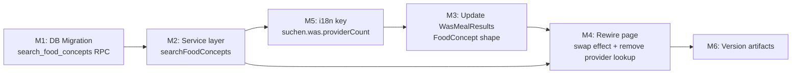

# Plan 097 — Food Concept Search (Vocabulary-Backed Was? Search)

| Field          | Value |
|----------------|-------|
| Plan ID        | 097 |
| Target Release | next available patch after current worktree v0.10.23; confirm at DevOps Stage 1 |
| Epic Alignment | Food Discovery — Was? Search (search/food section) |
| Related Issues | Discovered during Plan 096 UAT (root-cause: `provider_menu_items` table empty) |
| Classification | Bugfix + Feature |
| Pipeline       | Full |
| GitHub Issue   | https://github.com/abu-lina/uflow/issues/154 |
| Created        | 2026-04-21T13:00Z |

---

## Changelog

| Date | Author | Status | Notes |
|------|--------|--------|-------|
| 2026-04-21T13:00Z | planner | Active | Plan created; structural gap diagnosed post-Plan 096 UAT |
| 2026-04-21T13:10Z | architect | Active | Architecture review complete — see `agent-output/architecture/097-food-concept-search-arch-review.md` |
| 2026-04-21T13:35Z | planner | Active | Applied architect findings F1/F2/F3: dual-language tsvector (M1), D12 onSelect decision, React key note (M3) |
| 2026-04-21T13:45Z | critic | Active | Fixed mermaid graph (Critique M-1): M5 now correctly precedes M3; M4→M5 edge removed |
| 2026-04-21T13:50Z | implementer | In Progress | Implementation started; GitHub issue #154 created; TDD gate initiated |
| 2026-04-21T17:20Z | Code Reviewer | Code Review Approved | APPROVED_WITH_COMMENTS: no blocking defects; 2 LOW + 1 INFO follow-up notes |
| 2026-04-21T17:40Z | QA | QA Complete | All test gates passed (type-check, lint, 1062 tests, build); TDD compliance verified; ready for UAT |
| 2026-04-21T18:40Z | UAT | UAT Approved | Production validation complete: Döner/Burger searches work; deduplication verified; value statement delivered; ready for DevOps release |

---

## Value Statement and Business Objective

> As a **user browsing /search?section=food**, I want to **type a meal name and see a deduplicated list of food concepts** (e.g. "Döner" once, regardless of how many restaurants offer it or how they name their variant), **so that I can discover which dish types are available locally and tap to explore providers**.

---

## Problem Statement

Plan 096 wired the Was? input to the `search_provider_items` RPC, targeting the `provider_menu_items` table. That table is **empty** — no import pipeline populates it. The result: Was? search returns 0 results in production.

The populated data lives one layer up:

```
public.offers                     ← FOOD VOCABULARY (populated by JoinHalal)
  offer_id, name_de, name_en

public.providers
  offers_ids UUID[]               ← BRIDGE: which offers each provider has (GIN-indexed)
  listing_type = 'food'           ← which providers are food restaurants
  review_status = 'approved'
```

Providers already have `offers_ids` filled by the JoinHalal importer. The `offers` vocabulary table already contains the canonical food concept names. This plan wires Was? search to that existing data.

---

## Objective

1. Add a new Postgres RPC `search_food_concepts` that searches the `offers` vocabulary, filtered to food providers, returning deduplicated concepts with a provider count.
2. Add a typed service wrapper in `src/services/offers.ts`.
3. Replace the `searchProviderItems` call in `src/app/(public)/search/page.tsx` with `searchFoodConcepts`.
4. Update `WasMealResults` to accept and render `FoodConcept` result shape (line 2: provider count, not individual restaurant name).
5. Remove the now-unnecessary provider lookup effect from the page.

---

## Architecture Context

### What Already Exists (Do NOT re-implement)

| Asset | Location | Notes |
|-------|----------|-------|
| `public.offers` | DB | Vocabulary table; `offer_id`, `name_de`, `name_en` |
| `public.providers.offers_ids` | DB | UUID[] of offer_ids per provider; GIN-indexed (migration 001) |
| `public.providers.listing_type` | DB | `'food'` \| `'business'` enum (migration 067) |
| `public.providers.review_status` | DB | `'approved'` for live providers |
| `search_offers()` | DB RPC | Existing vocabulary search — no provider filter |
| `WasMealResults` | `src/features/search/components/WasMealResults.tsx` | Plan 096 component; needs type/prop update |
| `src/services/offers.ts` | Service | Has `searchOffers()`; extend with `searchFoodConcepts()` |
| GIN index on `providers(offers_ids)` | DB | `idx_providers_offers_ids` — enables `@>` containment queries |

### What Plan 096 Introduced (Do NOT remove — preserve for future per-provider use)

| Asset | Notes |
|-------|-------|
| `src/services/provider-catalog.ts` | Keep; future per-provider menu page will use it |
| `search_provider_items` RPC | Keep; scoped to restaurant detail views |
| `provider_menu_items` / `provider_service_offers` tables | Keep; future provider content entry will fill them |

---

## Decision Record

| ID | Decision | Status |
|----|----------|--------|
| D1 | New migration `070_search_food_concepts_rpc.sql` adds `search_food_concepts` RPC | [RESOLVED] — idempotent `CREATE OR REPLACE FUNCTION`; no table changes |
| D2 | Filter in RPC: `providers.listing_type = 'food'` AND `providers.review_status = 'approved'` | [RESOLVED] — guarantees only live food restaurants contribute |
| D3 | GIN index traversal: use `p.offers_ids @> ARRAY[o.offer_id]` containment form (not `ANY`) for guaranteed GIN plan | [RESOLVED] — `@>` operator is the GIN-native form for array containment |
| D4 | Return shape: `(offer_id, name_de, name_en, provider_count)` | [RESOLVED] — `provider_count` enables display text "X restaurants"; no individual provider names needed in this view |
| D5 | Display text for result row line 2: `"{N} Restaurants"` (locale key `suchen.was.providerCount`) | [RESOLVED] — vocabulary results represent a concept, not a single restaurant; showing count is accurate and useful |
| D6 | `searchFoodConcepts()` added to `src/services/offers.ts` (not a new file) | [RESOLVED] — food concepts are vocabulary-level items; same domain as existing `searchOffers` |
| D7 | `WasMealResults` props updated: replace `items: ProviderMenuItem[]` with `items: FoodConcept[]` | [RESOLVED] — breaking prop change is acceptable; Plan 096 introduced this component; no external consumers yet |
| D8 | Provider lookup `useEffect` in page removed (no longer needed; concept results carry `provider_count`) | [RESOLVED] — reduces one Supabase query per page load |
| D9 | `search_provider_items` RPC and `provider-catalog.ts` service remain untouched | [RESOLVED] — preserve for future provider profile / menu-page features |
| D10 | One new i18n key added: `suchen.was.providerCount` (e.g. `"{{count}} Restaurants"`) in all 6 locales | [RESOLVED] — line 2 of result row needs locale-aware provider count text |
| D11 | `listing_type_filter` param retained in spirit: RPC hardcodes `food` filter; separate RPCs for other section types in future | [RESOLVED] — YAGNI; Was? search is food-only per product brief |
| D12 | `onSelect` user journey: tapping a food concept result populates the Was? input with `name_de` and leaves the result list visible (identical to Plan 096 behaviour); no navigation to a concept detail page | [RESOLVED] — lowest-change option for v1; concept detail page deferred to future plan |

---

## Milestone Dependencies



**Sequencing rule**: M1 must deploy or be mocked before M2. M5 (i18n key) is a prerequisite for M3 (component uses `t('suchen.was.providerCount')`). M3 and M4 depend on M2. M6 is always last.

---

## Plan

### Milestone 1 — DB Migration: `search_food_concepts` RPC

**File**: `supabase/migrations/070_search_food_concepts_rpc.sql`

**Objective**: Add a Postgres function that searches the `offers` vocabulary, scoped to food providers, returning one row per distinct concept with a provider count.

**RPC contract** (ILLUSTRATIVE ONLY — implementer determines exact SQL):

```
FUNCTION search_food_concepts(
  search_query TEXT DEFAULT '',
  limit_count  INTEGER DEFAULT 10
)
RETURNS TABLE (
  offer_id       UUID,
  name_de        TEXT,
  name_en        TEXT,
  provider_count BIGINT
)
```

**Logic requirements**:
- Search `public.offers` by `name_de`/`name_en` using **both German and English** tsvector configurations, matching on either (consistent with `search_offers` in migration 014):
  - German: `to_tsvector('german', COALESCE(o.name_de, '') || ' ' || COALESCE(o.name_en, ''))` — covered by `idx_offers_combined_search` GIN index
  - English: `to_tsvector('english', COALESCE(o.name_en, '') || ' ' || COALESCE(o.name_de, ''))` — no pre-existing GIN index (sequential scan acceptable; pre-existing gap from migration 014)
  - A result matches if either language branch matches (`OR`)
- Filter to concepts offered by ≥1 approved food provider: join via `p.offers_ids @> ARRAY[o.offer_id]` (GIN-compatible containment form) where `p.listing_type = 'food'` and `p.review_status = 'approved'`
- GROUP BY `offer_id` to deduplicate; `COUNT(DISTINCT p.provider_id)` for provider count
- Order: by tsvector rank DESC, then `provider_count` DESC, then `name_de` ASC
- Empty query (`''`): return most-stocked concepts (order by `provider_count DESC`)
- Migration must be idempotent: `CREATE OR REPLACE FUNCTION`
- `SECURITY INVOKER` (consistent with migration 068 pattern)
- Add function comment

**Acceptance Criteria**:
- [ ] Migration applies without error
- [ ] "Döner" entered by two food providers with different item names returns exactly 1 row
- [ ] Offers from providers where `listing_type != 'food'` or `review_status != 'approved'` are excluded
- [ ] Empty `search_query` returns top concepts by provider count
- [ ] TDD: migration-level test in `src/__tests__/migrations/070-food-concept-search-tdd.test.ts` (pattern: migration 068 and 069 TDD tests)

---

### Milestone 2 — Service Layer: `searchFoodConcepts`

**File**: `src/services/offers.ts` (extend; do not create a new file)

**Objective**: Typed service wrapper for the new RPC.

**Tasks**:
1. Export `FoodConcept` interface: `{ offer_id: string; name_de: string; name_en: string | null; provider_count: number }`
2. Export `searchFoodConcepts(params: { search_query: string; limit_count?: number }): Promise<FoodConcept[]>` calling `supabase.rpc('search_food_concepts', {...})`
3. On Supabase error, throw (consistent with `searchProviderItems` pattern from Plan 096)
4. Default `limit_count = 10` (concepts, not rows — smaller set appropriate)

**Acceptance Criteria**:
- [ ] `FoodConcept` type exported
- [ ] Function calls correct RPC name; default limit applied
- [ ] Error thrown on Supabase error
- [ ] TDD: tests in `src/__tests__/services/offers.test.ts` (extend existing file)

---

### Milestone 3 — Update `WasMealResults` Component

**File**: `src/features/search/components/WasMealResults.tsx`

**Objective**: Replace `ProviderMenuItem[]` prop with `FoodConcept[]`. Update result row line 2 from provider name to provider count string.

**Changes**:
- Replace `items: ProviderMenuItem[]` prop with `items: FoodConcept[]`
- Remove `provider_image` rendering (vocabulary entries have no image; use a generic food icon or remove thumbnail entirely per Figma guidance)
- Line 1: `item.name_de` (unchanged)
- Line 2: `t('suchen.was.providerCount', { count: item.provider_count })` — e.g. "3 Restaurants"
- `onSelect` callback: pass `item.name_de` (unchanged, per D12)
- Remove `provider_image` / `imageSrc` logic (no longer applicable)
- React `key` prop: change from `item.item_id` to `item.offer_id`
- All 5 states (empty/loading/error/results/no-results) remain structurally unchanged

**Acceptance Criteria**:
- [ ] Component renders `FoodConcept` rows with concept name + provider count
- [ ] `onSelect(item.name_de)` fires on tap (unchanged behaviour)
- [ ] No broken references to `ProviderMenuItem` type
- [ ] All 5 states still render correctly
- [ ] Updated tests in `src/features/search/components/WasMealResults.test.tsx`

---

### Milestone 4 — Rewire Search Page

**File**: `src/app/(public)/search/page.tsx`

**Objective**: Replace `searchProviderItems` call with `searchFoodConcepts`; remove provider lookup effect; update state types.

**Changes**:
1. Remove import of `searchProviderItems`, `ProviderMenuItem`, `ProviderMenuItemRaw` from `@/services/provider-catalog`
2. Add import of `searchFoodConcepts`, `FoodConcept` from `@/services/offers`
3. Remove `providerLookup` state and its `useEffect` (the provider lookup is no longer needed)
4. Change `wasResults` type from `ProviderMenuItem[]` to `FoodConcept[]`
5. In the debounce effect: call `searchFoodConcepts({ search_query: normalizedQuery, limit_count: 10 })` instead of `searchProviderItems`; remove the augmentation step (no longer needed — RPC returns concepts directly)
6. `listing_type_filter` logic removed from the call (the new RPC hardcodes food filter internally per D11)
7. All state names (`isLoadingWas`, `isErrorWas`, `wasResults`) remain to minimise diff

**Acceptance Criteria**:
- [ ] No import of `provider-catalog` service remains in `page.tsx`
- [ ] Provider lookup effect removed; no stray `providerLookup` state
- [ ] Debounce guard (≥2 chars), 300ms timing, error handling, cancellation all preserved
- [ ] `WasMealResults` receives `FoodConcept[]` items
- [ ] Type-check passes
- [ ] Page integration tests updated

---

### Milestone 5 — i18n Key: `suchen.was.providerCount`

**Files**: `src/translations/{de,en,tr,ar,ps,ur}.ts`

**Objective**: Add a single new key with variable interpolation for provider count display in result row line 2.

**Key**: `suchen.was.providerCount`

**German reference value**: `"{{count}} Restaurants"`

Translations for other locales follow the same `{{count}} [word for restaurants]` pattern. The implementer should use appropriate locale-specific pluralisation if the translation system supports it; otherwise a simple "{{count}} Restaurants" form is acceptable for v1.

**Acceptance Criteria**:
- [ ] All 6 locale files updated
- [ ] `t('suchen.was.providerCount', { count: 3 })` returns `"3 Restaurants"` (or locale equivalent)

---

### Milestone 6 — Version and Release Artifacts

**Tasks**:
1. Bump `package.json` version to next patch after v0.10.23
2. Add CHANGELOG entry under the new version:
   - Fix: Was? search now returns results by searching food vocabulary (offers table) instead of empty `provider_menu_items` table
   - Fix: Deduplicated results — "Döner" appears once regardless of how many providers offer it
   - Chore: Provider lookup effect removed from `/search` page (one fewer Supabase query per load)
3. Sync `package-lock.json`

**Acceptance Criteria**:
- [ ] Version bumped and consistent across `package.json`, `package-lock.json`
- [ ] CHANGELOG entry present and accurate

---

## Testing Strategy

Expected test coverage (high-level; QA defines specifics):

- **Migration-level TDD**: `070-food-concept-search-tdd.test.ts` — verify schema/function contract (pattern from migrations 068, 069)
- **Service unit**: `searchFoodConcepts` in `src/__tests__/services/offers.test.ts` — mock RPC, assert correct params + return shape + error propagation
- **Component unit**: `WasMealResults` — re-run existing 5-state tests with `FoodConcept` fixtures; assert provider count renders; assert image removal does not break layout
- **Page integration**: Update `page-meal-search.test.tsx` — assert `searchFoodConcepts` called (not `searchProviderItems`); assert provider lookup effect mock removed; debounce and guard behaviour unchanged
- **Regression**: Full suite must pass; existing `search_offers` tests must be unaffected

---

## Known Risks

| Risk | Severity | Mitigation |
|------|----------|------------|
| GIN index `idx_providers_offers_ids` traversal direction | Medium | Use `@>` containment form in RPC (not `ANY`) to ensure GIN plan is chosen; verify with `EXPLAIN ANALYZE` on UAT DB |
| `offers` table has no `category_id` column filtering food-only concepts | Low | Provider `listing_type = 'food'` filter is sufficient; all JoinHalal-imported offers for food providers are already food-related |
| Large result set on empty query | Low | Default `limit_count = 10`; results ordered by `provider_count DESC` (most common dishes first) |
| Plan 096 `WasMealResults` tests must be updated | Low | Tests are authored in session S96 worktree; full diff visible before merge |
| `suchen.was.providerCount` plural edge case (`1 Restaurants`) | Low | Acceptable for v1; full i18n pluralisation is a follow-up |

---

## Release Strategy

Standalone for now. Bundles into next patch after v0.10.23. May ship in same release as Plan 096 if DevOps deems appropriate (Plan 096 UAT is approved; this plan fixes the core gap).

---

## Duration Estimates

| Phase | Estimate | Uncertainty |
|-------|----------|-------------|
| Analysis | Done (architecture reviewed) | Low |
| Implementation | 2–3 hours | Low — scope narrow, patterns established |
| QA | 1 hour | Low |
| UAT | 30 min | Low |
| DevOps | 30 min | Low |
| **Total** | **~4–5 hours** | Low |

---

## Handoff Notes

- **Implementer**: All predecessor tables, indexes, and data are already in place. This plan adds only an RPC function + service wrapper + component prop update. No schema changes, no new tables.
- **Implementer**: The `@>` containment form for GIN index use is architecturally required (see D3). Do not substitute `offer_id = ANY(p.offers_ids)`.
- **Implementer**: `provider-catalog.ts` and `search_provider_items` are NOT touched. They remain for future per-provider menu-page use.
- **Worktree constraint**: All file writes stay within `/Users/NARAFIQ/Projects/uflow-wt/S96-meal-search-was/`.

---

*Session: S96-meal-search-was | Root: /Users/NARAFIQ/Projects/uflow-wt/S96-meal-search-was | Branch: session/96-meal-search-was*
