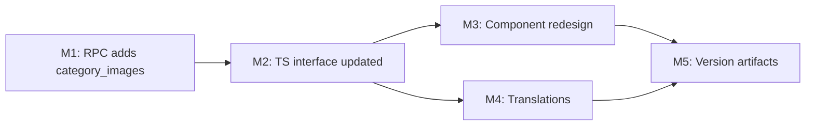

# Plan 098 — Was? Category Row Figma Redesign

| Field          | Value                                                                 |
| -------------- | --------------------------------------------------------------------- |
| Plan ID        | 098                                                                   |
| Target Release | Patch bump (0.x.y → 0.x.y+1) — purely additive UI/RPC change; confirm exact version at DevOps Stage 1 |
| Epic Alignment | Food Search — Was? UX                                                 |
| Related Issues | None                                                                  |
| Classification | Feature                                                               |
| Pipeline       | Focused                                                               |
| GitHub Issue   | https://github.com/abu-lina/uflow/issues/156                          |
| Created        | 2026-04-24T06:30Z                                                     |

## Changelog

| Date | Agent | Action | Summary |
|---|---|---|---|
| 2026-04-24T06:30Z | Planner | Created | Initial plan from Figma node 224:7190 |
| 2026-04-24T07:30Z | Critic | Approved | Critique 098; M1 semver type, M2 JSONB confirm, L1 diagram fixed inline. APPROVED. |
| 2026-04-24T07:40Z | Planner | Revised | Applied L2 (aria-label + removeSelection key) and L3 (Lucide placeholder replaces emoji) from critique. |
| 2026-04-24T07:55Z | Implementer | Started | Implementation started with TDD-first flow (migration + component tests before code changes). |
| 2026-04-24T09:50Z | Code Reviewer | Approved with comments | Code review passed with no blocking findings; optional low-severity test typing cleanup noted. |
| 2026-04-24T10:32Z | Implementer + Code Reviewer | Comment resolved | Replaced test `as never` casts with typed fixtures; code review verdict now fully approved for QA. |
| 2026-04-24T10:52Z | QA | Completed | Executed full test suite: all 1,068 tests pass (zero failures); guard script verified; PWA asset secured. QA COMPLETE. |
| 2026-04-24T18:00Z | UAT | Approved | Validated value delivery: selection row now visually consistent with category rows. APPROVED FOR RELEASE. |

---

## Value Statement and Business Objective

> As a user, I want to see my cuisine selection displayed with its icon, name, and restaurant count — just like the other category rows — so that the Was? section feels visually consistent and it is immediately clear what I've selected.

---

## Figma Reference

Node: [`224:7190` — what-search-section](https://www.figma.com/design/mH4p6c8GExOuLn65WdSPMb/playground?node-id=224-7190&m=dev)

### Design Tokens (extracted)

| Element | Figma value | Project token |
|---|---|---|
| AUSWAHL section label | 13px, uppercase, semibold, muted | `text-xs font-semibold uppercase tracking-wide text-text-muted` |
| Active row background | Teal light fill | `bg-primary/10` |
| Icon container | 48×48, squircle ~12px radius | `h-12 w-12 rounded-xl overflow-hidden shrink-0` |
| Row title | Inter Tight SemiBold 16px `#232323` | `font-inter-tight text-base font-semibold text-text-primary` |
| Row subtitle | Inter 14-16px muted | `font-inter text-sm text-text-muted` |
| Remove button | 24×24 filled circle, `#50a49d` (= `primary`) | `h-6 w-6 rounded-full bg-primary flex items-center justify-center shrink-0` |
| Remove icon | `lucide:x` 12×12 white | `<X className="h-3 w-3 text-white" />` |
| Regular row height | 48px | `py-2` (content drives height naturally) |
| Active row height | 64px | `py-3` |
| Divider | horizontal line between AUSWAHL and BELIEBT | `<hr className="my-2 border-border" />` |

---

## Assumptions

- `[RESOLVED]` Category images are stored in `categories.category_images` as `{"urls": [...]}` — same format as `provider_images`. Confirmed: `ProviderCard` uses this exact pattern.
- `[RESOLVED]` The `search_food_categories` RPC (migration 072) does not currently return `category_images`. A new migration (075) must add this column to the RPC return set.
- `[RESOLVED]` Recent search items (type = `dish`) have no image. The icon slot renders a fallback placeholder for dish-type selections.
- `[RESOLVED]` The icon container uses `rounded-xl` (12px) to approximate the Figma squircle shape without a custom CSS squircle. This matches the existing icon treatment in `ProviderCard` and badges.
- `[RESOLVED]` The `lucide` package (`lucide-react`) is already installed. Use `<X />` icon for the remove button.

---

## Decision Record

| Decision | Status | Rationale |
|---|---|---|
| Add `category_images` to RPC 072 via a new migration 075 | `[RESOLVED]` | The component needs images but modifying an existing migration is unsafe post-deployment |
| Use `bg-primary/10` for active-selection row background | `[RESOLVED]` | Matches Figma teal light fill; consistent with existing `bg-primary/5` patterns in codebase |
| Use `bg-primary` (filled) for remove button, not outline | `[RESOLVED]` | Figma shows `#50a49d` filled circle = breaker-bay/primary. Matches existing pill/badge treatment |
| Show `category_images[0]` as icon, fallback to Lucide `<UtensilsCrossed />` on a neutral teal-tinted square | `[RESOLVED]` | Emoji rendering is inconsistent across Android/iOS/desktop; a Lucide icon (already a dependency) is visually stable and design-system-consistent |
| Use `rounded-xl` (12px) not CSS squircle | `[RESOLVED]` | Squircle CSS requires custom clip-path not available in Tailwind; `rounded-xl` is close enough and consistent with existing iconography |
| No image for `dish`-type selections in AUSWAHL row | `[RESOLVED]` | Dish selections come from menu items, which have no image in the current schema |

---

## Scope

**In scope:**
- Migration 075: extend `search_food_categories` RPC to return `category_images`
- `FoodCategory` interface: add `category_images: string | null`
- `WasCategoryResults` component: full visual redesign to match Figma (see milestones below)

**Out of scope:**
- Recent-search dish rows: no image (confirmed above)
- Search-results state (query ≥ 2): same row design applies, no AUSWAHL section
- WasMealResults (dish rows): no Figma change, unchanged

---

## Milestones

### M1 — RPC Extension: add `category_images`

**Objective**: Return `category_images` from `search_food_categories` so the frontend can render the category icon.

**Tasks**:
- Create `supabase/migrations/075_search_food_categories_add_images.sql`
- Use `CREATE OR REPLACE FUNCTION` to update the return type to include `category_images TEXT`
- Select `c.category_images::TEXT` in the body (`categories.category_images` is JSONB — confirmed via migration 061 — so the cast to TEXT is required; front-end already knows how to parse the `{"urls":[...]}` format via `safeJsonParse`)

**Acceptance criteria**:
- The RPC returns a `category_images` column
- Empty categories (no images) return `NULL` without error
- No other columns removed or renamed

---

### M2 — Service: update `FoodCategory` interface

**Objective**: Extend the TypeScript interface to match the new RPC shape.

**Tasks** (in `src/services/offers.ts`):
- Add `category_images: string | null` to `FoodCategory`

**Acceptance criteria**:
- `npx tsc --noEmit` passes
- Existing call sites are unaffected (new field is additive)

---

### M3 — Component: redesign `WasCategoryResults` to Figma spec

**Objective**: Render each category row (AUSWAHL and BELIEBT/ZULETZT GESUCHT) with 48×48 icon, title, subtitle and — for the active-selection row only — a teal remove button. Match the Figma design exactly.

**Layout for every row (ILLUSTRATIVE ONLY)**:

```
[ 48×48 icon ]  [ Category Name (semibold)         ] [ ✕ (AUSWAHL only) ]
                [ 1 Restaurant (muted)              ]
```

**Active-selection row specifics**:
- Background: `bg-primary/10 rounded-xl`
- Icon: `h-12 w-12 rounded-xl overflow-hidden shrink-0` with `next/image` fill from `category_images`, fallback to `<UtensilsCrossed />` from `lucide-react` centred inside a `bg-primary/10` square (matches active-row tint)
- Name: `font-inter-tight text-base font-semibold text-text-primary`
- Subtitle: `font-inter text-sm text-text-muted` — shows `categoryCount` (e.g. "1 Restaurant") or omitted for dish-type
- Remove button: `h-6 w-6 rounded-full bg-primary flex items-center justify-center shrink-0` with `<X className="h-3 w-3 text-white" />` and `aria-label={t('suchen.was.removeSelection')}`

**Regular rows (BELIEBT / ZULETZT / KÜCHE)**:
- No background fill
- Same icon + text layout
- No remove button
- For dish-type recent searches: no image slot (renders name + muted type label instead)

**Divider**: render `<hr className="my-2 border-border" />` between AUSWAHL and the next section when a selection is active.

**Tasks** in `src/features/search/components/WasCategoryResults.tsx`:
- Add `next/image` import
- Add `UtensilsCrossed` import from `lucide-react` (for icon placeholder)
- Add `safeJsonParse` util import (already used in ProviderCard)
- Add helper `getCategoryImageUrl(category_images: string | null): string | null`
- Add `IconSlot` internal component (48×48, squircle): renders `next/image` when URL available, otherwise `<UtensilsCrossed />` centred in a `bg-primary/10` square
- Rewrite `CategoryRow` to use `IconSlot`
- Rewrite active-selection row to use `IconSlot` + teal remove button with `aria-label={t('suchen.was.removeSelection')}`
- Rewrite dish-type recent row: no `IconSlot`, just name + subtitle "Gericht" (use `suchen.was.dishLabel`)

**Acceptance criteria**:
- Active selection shows category icon (or placeholder), name, count, teal remove button with `bg-primary` fill
- BELIEBT rows show category icon, name, count — no remove button
- ZULETZT rows: category type shows icon; dish type shows no icon, shows label "Gericht"
- Divider renders between AUSWAHL and subsequent sections
- Remove button has `aria-label` set via `suchen.was.removeSelection` translation key
- Icon placeholder renders `<UtensilsCrossed />` (not an emoji) when no `category_images` URL is available
- `npx tsc --noEmit` passes
- No layout regressions on KÜCHE (search state) rows

---

### M4 — Translations: add `dishLabel` key

**Objective**: Add a translation key for the dish-type subtitle in recent-searches rows.

| Locale | Key | Value |
|---|---|---|
| de | `suchen.was.dishLabel` | `Gericht` |
| en | `suchen.was.dishLabel` | `Dish` |
| tr | `suchen.was.dishLabel` | `Yemek` |
| ar | `suchen.was.dishLabel` | `طبق` |
| ps | `suchen.was.dishLabel` | `خواړه` |
| ur | `suchen.was.dishLabel` | `ڈش` |

Also add `removeSelection` key for the AUSWAHL remove button `aria-label`:

| Locale | Key | Value |
|---|---|---|
| de | `suchen.was.removeSelection` | `Auswahl entfernen` |
| en | `suchen.was.removeSelection` | `Remove selection` |
| tr | `suchen.was.removeSelection` | `Seçimi kaldır` |
| ar | `suchen.was.removeSelection` | `إزالة التحديد` |
| ps | `suchen.was.removeSelection` | `ټاکنه لرې کول` |
| ur | `suchen.was.removeSelection` | `انتخاب ہٹائیں` |

---

### M5 — Version artifacts

**Objective**: Update CHANGELOG and `package.json` to reflect release delta.

**Tasks**:
- Add CHANGELOG entry for "Was? category row redesign (Figma 224:7190)"
- Bump patch version in `package.json` (confirm exact version at DevOps Stage 1)

---

## Milestone Dependencies



Sequencing rule: M3 cannot begin until M1 and M2 are complete (the component depends on the typed field). M4 (translations) is independent of M3 and can run in parallel with it.

---

## Testing Strategy

- Unit test: `WasCategoryResults` renders the active-selection row with `bg-primary/10` class when `selectedWas` is set
- Unit test: remove button calls `onClearSelection` when clicked
- Unit test: BELIEBT rows do not render a remove button
- Unit test: dish-type recent-search row renders the `dishLabel` translation key, not a category count
- Snapshot test: full component snapshot with and without `selectedWas` to catch layout regressions
- Manual: visually verify on mobile viewport (375px) that icons are 48×48, text doesn't truncate abnormally, and the teal remove button is easy to tap

---

## Risks

| Risk | Likelihood | Mitigation |
|---|---|---|
| Some categories have no `category_images` in DB | High | Graceful fallback (placeholder emoji/neutral square) required |
| `next/image` requires explicit `width`/`height` or `fill` prop — layout shift | Low | Use `fill` with a positioned parent (existing pattern from ProviderCard) |
| Migration 075 changes RPC signature — breaks existing TypeScript calls | Low | Additive column only; all existing callers destructure named fields |

---

## Duration Estimates

| Phase | Estimate | Uncertainty |
|---|---|---|
| M1 RPC migration | 15 min | Low — additive `CREATE OR REPLACE` |
| M2 Interface update | 5 min | Low |
| M3 Component redesign | 45–90 min | Medium — image handling edge cases |
| M4 Translations | 10 min | Low |
| M5 Version artifacts | 10 min | Low |
| **Total** | **~1.5–2 hrs** | — |

---

## Release Strategy

Standalone — no other known plans targeting the same version at time of writing.

---

## Validation / Gates

1. `npx tsc --noEmit` — zero errors
2. `npm test` — existing test suite passes (no regressions)
3. Manual: open Was? accordion → top 3 popular shows icons → tap item → AUSWAHL row matches Figma screenshot → tap ✕ → reverts to no-selection state
