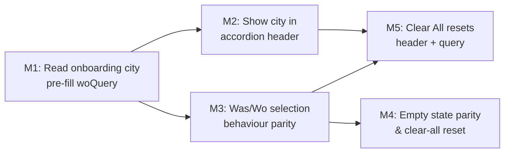

# Plan 101 — Search "Where" field: onboarding location default + Was/Wo UI parity

| Field          | Value |
|---|---|
| Plan ID        | 101 |
| Target Release | v0.10.25 (patch, preliminary); confirm final tag at DevOps Stage 1 |
| Epic Alignment | Epic 3 — Discovery & Search UX |
| Related Issues | https://github.com/abu-lina/uflow/issues/159 |
| Classification | Feature |
| Pipeline       | Abbreviated (small, self-contained UI change, no migrations) |
| GitHub Issue   | https://github.com/abu-lina/uflow/issues/159 |
| Created        | 2026-04-24T00:00Z |

---

## Changelog

| Date | Agent | Action | Detail |
|---|---|---|---|
| 2026-04-24T00:00Z | Planner | Created | Initial plan authored from session S101 |
| 2026-04-24T16:20Z | Implementer | Updated | Addressed critique findings F-MED-1 and F-MED-2 before implementation handoff |
| 2026-04-24T16:40Z | Code Reviewer | Updated | Code review approved; handing off to QA |
| 2026-04-24T20:35Z | QA | Updated | QA complete — all gates passed; ready for UAT |
| 2026-04-24T21:00Z | UAT | Updated | UAT complete — value statement delivered; APPROVED FOR RELEASE with post-release browser validation |
| 2026-04-24T23:30Z | DevOps | Updated | Stage 1 committed for v0.10.26 — docs moved to closed/ |

---

## Value Statement and Business Objective

> As a user who has already selected my city during onboarding, I want the "Where" search field to be pre-filled with my city when I open the search page, and I want the Where and What fields to look and feel consistent, so that I can start searching immediately without re-entering my location every time.

**North-star metric**: Reduction in searches submitted without a location filter (i.e., more searches scoped to a city by default).

---

## Context and Background

The `/search` page (introduced in Plan 092) presents four accordion sections: **Was?** (What), **Wo** (Where), **Wer** (Who), **Filter**.

- **Was?** — open by default, plain text input with Search icon, no current result rows (stub, deferred to backend wiring)
- **Wo** — collapsed by default, plain text input with MapPin icon, city filtering from DB, EmptyCityCard for valid cities with no providers

During onboarding the user picks a city on `/city-selection`. The city is persisted to **both `localStorage.selectedCity` and `sessionStorage.selectedCity`** (set in `src/app/city-selection/page.tsx`, lines ~259-260 and ~315-316). It is NOT in Supabase auth user_metadata or the `profiles` table based on code inspection.

When the user navigates to `/search?section=food`, `woQuery` state initialises to `''` — the onboarding city is never read. This is the gap to close.

### Key source files (verified)

| File | Relevance |
|---|---|
| `src/app/(public)/search/page.tsx` | `SearchPageContent` component — `wasQuery` / `woQuery` state, both accordions |
| `src/components/ui/ExpandSection.tsx` | Shared accordion shell — `title`, `defaultOpen`, `children` only |
| `src/app/city-selection/page.tsx` | Sets `localStorage.selectedCity` / `sessionStorage.selectedCity` |
| `src/lib/utils/onboarding-state.ts` | Onboarding state in localStorage (`ummahflow_onboarding` key) — does NOT include city directly |
| `src/providers/search-provider.tsx` | `SearchProvider` / `useSearch` — `selectedLocation` state (LOCATION_ALL sentinel = `''`) |
| `src/services/providers.ts` | `fetchProviderCities()`, `fetchFilteredCities()` |

> **Key insight**: The city is stored under `localStorage.selectedCity` (plain string, not embedded in `ummahflow_onboarding`). No Supabase profile column lookup is required.

---

## Was vs. Wo — Current UI Comparison

| Dimension | Was (What) — current | Wo (Where) — current |
|---|---|---|
| Input icon | `Search` | `MapPin` |
| Input style | `h-10 rounded-xl bg-neutral-muted` | Same |
| Empty state | "Was suchst du?" centred text | "searchCityPrompt" centred text |
| Result rows | None (stub, no backend wiring yet) | `<button>` rows with `MapPin` icon |
| Selection behaviour | N/A (nothing to select) | Sets `woQuery = city` — no dropdown close |
| After selection | N/A | Dropdown persists (filteredCities still includes the city name) |
| Input clearable | No | No |
| Selected value in accordion header | No | No |

**Gap**: After a city is selected in Wo, the dropdown list does not close (because `filteredCities` is derived purely from `woQuery` — an exact city name still matches). There is no visual distinction between "actively typing" and "city selected". The `ExpandSection` title never reflects the current value.

---

## Acceptance Criteria

### M1 — Default location from onboarding city

- [ ] On mount, `SearchPageContent` reads `localStorage.getItem('selectedCity') ?? sessionStorage.getItem('selectedCity')`
- [ ] If a city is found, `selectedWoCity` and `woInputQuery` are initialised to that city name
- [ ] No network call is required for this initialisation (localStorage only)
- [ ] If no city is stored (first-time or cleared), `selectedWoCity` remains `null` and `woInputQuery` remains `''` (no regression for new users)
- [ ] The "Wo" accordion title reflects the pre-filled city when collapsed (see M2)
- [ ] SSR-safe: localStorage read happens inside `useEffect` (preferred) with an `isBrowser()` guard to avoid hydration mismatch in App Router pre-render + client hydration

### M2 — Selected city visible in collapsed accordion header

- [ ] `ExpandSection` receives an optional `subtitle` prop (or the caller passes a dynamic `title` string)
- [ ] When a city is selected (non-empty `woQuery` committed as selection), the collapsed "Wo" header reads **"Wo · Berlin"** (or locale equivalent) rather than just "Wo"
- [ ] The subtitle is secondary/muted in visual weight relative to the title
- [ ] Was accordion follows same pattern when Was gains item selection (future-proof, not required now)

> **Implementation guidance**: The simplest approach is to pass a dynamic title from `SearchPageContent`: `t('suchen.accordions.wo') + (selectedWoCity ? ` · ${selectedWoCity}` : '')`. This avoids modifying `ExpandSection` props if the caller can compose the string. The implementer chooses.

### M3 — Was/Wo selection behaviour parity

The problem: after tapping a city in the Wo list, the dropdown does not close. Fix by separating two concerns:

- **`woInputQuery`** — the text the user is currently typing (controls input value, drives filtering)
- **`selectedWoCity`** — the committed selection (set on item tap, used for search execution)

On city tap:
- [ ] `selectedWoCity` is set to the city name
- [ ] `woInputQuery` is set to the city name (fills the input)
- [ ] The city results dropdown is hidden (no longer rendered)
- [ ] A clear (×) button appears next to the input; tapping it clears both `selectedWoCity` and `woInputQuery`

On input focus/edit after selection:
- [ ] `selectedWoCity` is cleared (user is re-typing)
- [ ] Dropdown reappears based on new `woInputQuery`

**Was parity** — When "Was" gains real result rows, it must implement the same two-state pattern (`wasInputQuery` / `selectedWasItem`). This plan does NOT implement Was result rows; it only ensures the pattern is documented so the Implementer applies consistent logic.

### M4 — Empty state parity

- [ ] Both Was and Wo show a centred muted-text prompt when no input and no selection (already nearly the same)
- [ ] Both show a spinner/loading indicator when data is being fetched
- [ ] The Wo "City not recognised" message remains (no change)
- [ ] The Wo `EmptyCityCard` remains (no change)

### M5 — "Clear All" resets both fields

- [ ] The existing "Alles löschen" footer button clears `selectedWoCity` + `woInputQuery` (in addition to clearing `wasQuery` / `woQuery` as before)
- [ ] After clear, the "Wo" accordion header reverts to plain "Wo"

---

## Out of Scope

- Was result rows / Was selection backend wiring (deferred, no plan yet)
- Wer / Filter accordion implementation
- Persisting search state across sessions (this plan only reads the onboarding city once; it does not write back after user changes)
- Authenticated user profile city (Supabase `profiles` table) — not currently in use; future plan if needed
- Admin/moderation surfaces
- Changes to `SearchBar.tsx` (used on `/providers`, `/saved` — separate component)
- `SearchProvider` context update to persist `selectedLocation` across pages (could be a future enhancement; out of scope here)

---

## Implementation Pointers

### Where to make changes

All changes are confined to two files:

1. **`src/app/(public)/search/page.tsx`** — `SearchPageContent` function  
   - Replace single `woQuery` state with two states: `woInputQuery` (typing) and `selectedWoCity` (committed)
   - Add `useEffect` (or lazy `useState` initialiser) to read `localStorage/sessionStorage.selectedCity` and populate `selectedWoCity` + `woInputQuery`
   - Derive `filteredCities` from `woInputQuery` only when `selectedWoCity` is not set
   - Derive accordion title string from `selectedWoCity`
   - Clear button (×) in the input row when `selectedWoCity` is set
   - Update the "Clear All" handler to reset both new states

2. **`src/components/ui/ExpandSection.tsx`** *(optional — only if Implementer prefers a subtitle prop over dynamic title string)*  
   - Add optional `subtitle?: string` prop rendered as muted small text after the title, inside the same header row

### Hydration safety

Use `useEffect` with a browser guard to read `localStorage`, not a top-level `localStorage.getItem()` call. Preferred pattern for this page: initial state as empty (`''`/`null`) and hydrate from storage in `useEffect` to avoid server/client render mismatch.

### State initialisation order

1. Mount → read `localStorage.selectedCity` → set `selectedWoCity` + `woInputQuery`
2. Component renders with pre-filled values immediately after mount (no flash)

### Regression guard

- The `woQuery.length === 0 ? [] : …` guard for city filtering must still work correctly when the user has a city pre-filled at mount (non-empty `woInputQuery` with a selected city should NOT show the dropdown).
- Specifically: the dropdown should only be visible when `!selectedWoCity && woInputQuery.length > 0`.

---

## Decision Record

| # | Decision | Status | Rationale |
|---|---|---|---|
| D1 | Read onboarding city from `localStorage.selectedCity` (not Supabase profile) | [RESOLVED] | Verified in city-selection/page.tsx: city is always written to localStorage; no profile column exists |
| D2 | Separate `woInputQuery` (typing) from `selectedWoCity` (committed) | [RESOLVED] | Required to close the dropdown on selection; mirrors standard typeahead UX pattern |
| D3 | ExpandSection title modification: pass dynamic string from caller, not a new prop | [RESOLVED] | Simpler, no API change to a shared component; implementer may override if subtitle prop cleaner |
| D4 | Do NOT write the selected city back to any global context or URL param in this plan | [RESOLVED] | Scope control; URL-param wiring belongs to the search execution plan (future) |
| D5 | Was result rows and Was selection logic: out of scope | [RESOLVED] | Was is a stub; parity applies to interaction pattern documented for future reference, not implemented now |
| D6 | No new DB migration required | [RESOLVED] | Feature is purely client-side localStorage read |

---

## Release Strategy

Standalone — no other known plans targeting the same patch after v0.10.24. Confirm at DevOps Stage 1 once git tags are checked.

---

## Milestone Dependencies

**Sequencing**: M1 is the foundation — all other milestones depend on the state split and localStorage read being in place. M2 and M3 can be developed in parallel after M1.

---

## Testing Strategy

- **Unit tests**: isolated logic for the `selectedWoCity` / `woInputQuery` state machine (set, clear, re-type)
- **SSR safety test**: verify no `window is not defined` errors during server render (mock `window` as undefined)
- **Regression tests**:
  - User with no `selectedCity` in localStorage → `woQuery` empty, dropdown hidden, no error
  - User with `selectedCity = 'Berlin'` → pre-filled input, header shows "Wo · Berlin", dropdown hidden
  - User clears city (×) → returns to empty state, header reverts to "Wo"
  - User types a new city after clearing → dropdown reappears
  - "Alles löschen" resets both Was and Wo fields
- **Integration**: visit `/search?section=food` with `localStorage.selectedCity` mocked to confirm the accordion header and input show the correct default

> QA agent owns test authorship and coverage analysis in `agent-output/qa/`.

---

## Remaining Gaps

| # | Unknown | Blocker | Required Action | Owner |
|---|---|---|---|---|
| G1 | Is `selectedCity` always a plain city name (no country suffix)? | No | Verify a sample from Nominatim results vs. top-3 entries | Implementer |
| G2 | Are there locale/language differences in the city name stored vs. displayed? | No | Inspect `city_name` field vs. Nominatim `display_name` — if mismatch, normalise at storage time (already done in city-selection page) | Implementer |

Both gaps are non-blocking; implementer should verify before final commit.

---

## Baseline & Measurements

No performance baseline required — this is a client-side state change with zero new network requests. The only latency impact is a single `localStorage.getItem()` call at mount, which is synchronous and sub-millisecond.

---

## Duration Estimates

| Phase | Estimate | Uncertainty Drivers |
|---|---|---|
| Analysis | 0h (done in plan) | — |
| Implementation | 2–4h | State refactor in a moderately complex page component |
| QA | 1–2h | Focused unit + regression tests |
| UAT | 0.5h | Manual verify: pre-fill visible on mount, clear works, accordion header updates |
| DevOps | 0.5h | Tag + push, no migration |
| **Total** | **4–7h** | Low uncertainty |

---

## Handoff Notes

- No migration. No new API routes. No Supabase schema changes.
- All changes are in `src/app/(public)/search/page.tsx` (and optionally `ExpandSection.tsx`).
- The Implementer should verify the `ExpandSection` `subtitle` prop approach vs. dynamic title string and pick the cleaner option.
- The `SearchBar.tsx` component (used on `/providers`, `/saved`) is **not touched** — it has its own location state via `SearchProvider`. The two are independent.
- "Was" result rows remain a stub; do not wire them in this plan.
