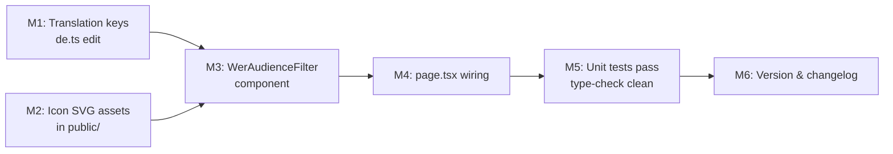

# Plan 103 — WerAudienceFilter Component

| Field          | Value                                                                                   |
| -------------- | --------------------------------------------------------------------------------------- |
| Plan ID        | 103                                                                                     |
| Target Release | next available patch after current origin/main version (0.10.26); confirm at DevOps Stage 1 |
| Epic Alignment | Search UX — "Wer?" audience filter section (Figma node 234:11451)                      |
| Related Issues | None                                                                                    |
| Classification | Feature                                                                                 |
| Pipeline       | Full (Analyst skipped — no unknowns)                                                   |
| GitHub Issue   | https://github.com/abu-lina/uflow/issues/164                                           |
| Created        | 2026-04-25T09:00Z                                                                       |

## Changelog

| Date                | Author  | Change                       |
| ------------------- | ------- | ---------------------------- |
| 2026-04-25T09:00Z   | Planner | Initial plan created         |
| 2026-04-25T18:00Z   | Planner | Revision 1: addressed Critic findings F1–F5 (open-action ref, ASCII key/filename, M2 instruction, token resolution) |
| 2026-04-25T18:10Z   | Implementer | Implementation started; plan status set to In Progress |

---

## Value Statement and Business Objective

> **As a search user on UFlow**, I want to filter service providers by target audience (Männer, Frauen, Kinder) so that I can find services that are relevant for specific members of my household or community in a single search interaction.

The "Wer?" accordion section has been a visible placeholder on the search page since launch. Completing it removes a broken UI impression and unlocks a meaningful dimension of search refinement aligned with the community-first ethos of UFlow.

---

## Objective

Implement the `WerAudienceFilter` component (UI only — no backend calls) that renders three audience rows — **Männer**, **Frauen**, **Kinder** — each with a colored 48×48 icon, bold label, "+10 km" subtitle, and a circular −/N/+ stepper counter. Wire the component into the existing `ExpandSection` placeholder in `search/page.tsx`. Add the required German translation keys.

---

## Release Strategy

Release Strategy: Standalone (no other known plans for this version). Target is the next available patch after 0.10.26 — exact value confirmed at DevOps Stage 1 via `git fetch --tags`.

---

## Decision Record

| # | Decision | Status |
|---|----------|--------|
| 1 | Component is client-only (`'use client'`); no server state or DB calls needed — audience types are static | [RESOLVED] Static audience types confirmed in task brief; no future DB need identified |
| 2 | Stepper state is local (`useState` per row); not hoisted to search context in this plan | [RESOLVED] Search context integration (submit/clear behaviour) is explicitly out of scope per task brief |
| 3 | "+10 km" subtitle is a static translation key (`suchen.wer.subtitle`) — not derived from WO filter state | [RESOLVED] No data binding to radius filter exists; static text matches Figma; runtime binding deferred to a follow-up plan if needed |
| 4 | Audience person icons are custom illustrated SVGs (vectorized figures from Figma) not Lucide icons; implementer must download and store as static assets in `public/icons/audience/` or inline SVGs | [RESOLVED] Figma asset URLs confirmed (expire in 7 days from 2026-04-25); Lucide has no suitable person-with-hijab or child-specific icons |
| 5 | Minimum stepper value is 0 (decrement disabled at 0); no maximum enforced in this plan | [RESOLVED] Figma shows 0 as default; no max specified; keeping unbounded is YAGNI-safe |
| 6 | `AudienceRow` is a co-located internal sub-component (not exported, not placed in `components/`), mirroring `CityRow` in `WoCityResults.tsx` | [RESOLVED] Single consumer; DRY via co-location consistent with WoCityResults pattern |
| 7 | No changes to TypeScript types in `src/types/` — no new shared types required | [RESOLVED] All types are component-local |
| 8 | `WerAudienceFilter` receives `t` as a prop (same pattern as `WasMealResults`, `WoCityResults`) | [RESOLVED] Consistent with established injection pattern in the feature; avoids direct `useLanguage()` hook in feature component |

---

## Scope & Objective

### In Scope

- New file: `src/features/search/components/WerAudienceFilter.tsx`
- New file: `src/features/search/components/WerAudienceFilter.test.tsx`
- Edit: `src/translations/de.ts` — add `suchen.wer.*` translation keys
- Edit: `src/app/(public)/search/page.tsx` — replace placeholder `ExpandSection` body with `<WerAudienceFilter t={t} />`
- Audience icon SVG assets stored in `public/icons/audience/` (maenner, frauen, kinder)

### Out of Scope

- Connecting stepper counts to the search query/API call (follow-up epic)
- Persisting audience filter selection across page loads
- Radius display derived from the WO city filter state
- "Filter" accordion (`suchen.accordions.filter`) — separate plan
- Any changes to `src/types/`, `src/services/`, or `supabase/migrations/`
- Clearing audience counts when "Alles löschen" is pressed (follow-up — requires state hoisting into `page.tsx`; tracked in `agent-output/planning/open-actions.md` → "Wer counter reset via clearAll (Plan 103)")

---

## Acceptance Criteria

All criteria are observable and testable. QA/UAT validates these; Implementer ensures the tests cover them.

| # | Criterion | How to verify |
|---|-----------|---------------|
| AC-1 | Navigating to `/search` and opening the "Wer: Für mich" accordion shows three audience rows | Visual / e2e |
| AC-2 | Each row renders: a 48×48 rounded icon with correct background colour (teal for Männer, pink for Frauen/Kinder), the translated label (Männer/Frauen/Kinder), the subtitle "+10 km", and a circular stepper | Visual / unit test |
| AC-3 | Pressing `+` on any row increments its counter from 0 → 1 → N; counter renders the updated number | Unit test + visual |
| AC-4 | Pressing `−` on any row at count > 0 decrements by 1 | Unit test + visual |
| AC-5 | Pressing `−` when count = 0 does nothing (button disabled or no-ops; counter stays at 0) | Unit test |
| AC-6 | All three stepper counters are independent — incrementing Männer does not affect Frauen or Kinder counts | Unit test |
| AC-7 | Translation keys `suchen.wer.maennerLabel`, `suchen.wer.frauenLabel`, `suchen.wer.kinderLabel`, `suchen.wer.subtitle`, `suchen.wer.decrementAriaLabel`, `suchen.wer.incrementAriaLabel` resolve correctly in the component | Unit test (via `t` stub) |
| AC-8 | Stepper `−` and `+` buttons have accessible `aria-label` attributes (via translation keys) | Unit test / axe |
| AC-9 | `npm run type-check` passes with no new errors | CI gate |
| AC-10 | `npm test` (Vitest) passes, including the new `WerAudienceFilter.test.tsx` | CI gate |

---

## Component Structure

### Overview

```
WerAudienceFilter                  (exported, 'use client')
  └── AudienceRow × 3             (internal sub-component, not exported)
        ├── icon container (48×48, rounded-xl, custom bg colour)
        │     └──  audience icon (32×32, static SVG asset)
        ├── context block
        │     ├── label  (Inter Tight SemiBold, text-base, text-text-primary)
        │     └── subtitle  (Inter Tight Light, text-base, text-text-muted)
        └── stepper
              ├── [−] circular button  (24×24, bg-neutral-muted, rounded-full)
              │       Lucide <Minus> 12×12
              ├── count display (text-base, font-medium, w-[12px], text-center)
              └── [+] circular button  (24×24, bg-neutral-muted, rounded-full)
                      Lucide <Plus> 12×12
```

### WerAudienceFilter — Props

| Prop | Type | Description |
|------|------|-------------|
| `t`  | `(key: string, variables?: Record<string, string \| number>) => string` | Translation function, injected from `search/page.tsx` (same as WasMealResults/WoCityResults) |

Internal state: `counts: { maenner: number; frauen: number; kinder: number }` — all initialised to `0`.

### AudienceRow — Props (internal)

| Prop | Type | Description |
|------|------|-------------|
| `audienceKey` | `'maenner' \| 'frauen' \| 'kinder'` | Stable key for React and aria labels |
| `label` | `string` | Translated display name (e.g. "Männer") |
| `iconSrc` | `string` | Path to the static SVG asset |
| `iconBgClass` | `string` | Tailwind class for icon container background |
| `count` | `number` | Current counter value (lifted state) |
| `onDecrement` | `() => void` | Called when `−` pressed; guarded at 0 by parent |
| `onIncrement` | `() => void` | Called when `+` pressed |
| `t` | `(key: string, variables?) => string` | Translation function |

### Audience Data Constant (ILLUSTRATIVE ONLY)

The three audience definitions are best expressed as a typed constant array at the top of the file, keeping the JSX clean and making additions trivial (YAGNI-safe extension point):

```
AUDIENCES = [
  { key: 'maenner', labelKey: 'suchen.wer.maennerLabel', iconSrc: '/icons/audience/maenner.svg', iconBgClass: 'bg-[#e3f2ef]' },
  { key: 'frauen',  labelKey: 'suchen.wer.frauenLabel',   iconSrc: '/icons/audience/frauen.svg',   iconBgClass: 'bg-[#fae6e6]' },
  { key: 'kinder',  labelKey: 'suchen.wer.kinderLabel',   iconSrc: '/icons/audience/kinder.svg',   iconBgClass: 'bg-[#fae6e6]' },
]
```

**ILLUSTRATIVE ONLY** — implementer may adjust.

### Figma Design Tokens

| Element | Figma value | Tailwind equivalent |
|---------|-------------|---------------------|
| Männer icon bg | `var(--breaker-bay/100, #e3f2ef)` | `bg-[#e3f2ef]` |
| Frauen/Kinder icon bg | `#fae6e6` | `bg-[#fae6e6]` |
| Stepper button bg | `var(--color/grey/91, #e9e9e9)` | `bg-[#e9e9e9]` — verified: `bg-neutral-muted` resolves to `#f5f5f5` (neutral-50), NOT `#e9e9e9`; use `bg-[#e9e9e9]` or `bg-neutral-100` (`hsl(0 0% 91%)` ≈ `#e8e8e8`) |
| Icon container size | 48×48 px | `size-[48px]` |
| Icon container radius | 10.56 px ≈ 0.66rem | `rounded-xl` (matches WoCityResults pattern) |
| Stepper button size | 24×24 px | `size-6` |
| Stepper button radius | 30.5 px (fully circular) | `rounded-full` |
| Icon image size | 32×32 px | `size-8` |
| Stepper icon size | 12×12 px | `size-3` |

### Icon Assets

The Figma vectorized audience icons must be saved as static SVG files before the Figma MCP asset URLs expire (7 days from 2026-04-25):

| Audience | Figma asset UUID | Destination path |
|----------|-----------------|-----------------|
| Männer | `34883bfc-9598-4de2-b543-68ac5e50e8f2` | `public/icons/audience/maenner.svg` |
| Frauen | `b3b46638-3e80-476f-bf41-d95d11bec5cc` | `public/icons/audience/frauen.svg` |
| Kinder | `04b2d623-004f-4ce7-b775-3c4c9bdc8249` | `public/icons/audience/kinder.svg` |

**Fetch workflow (MANDATORY):** Use the Figma MCP tool — call `get_design_context` with `fileKey: mH4p6c8GExOuLn65WdSPMb` and `nodeId: 234:11451` — to re-fetch the design context and download the vectorized icon images within the 7-day expiry window. The asset URLs (`https://www.figma.com/api/mcp/asset/<uuid>`) require an active MCP session context and **cannot be fetched via `curl` or direct HTTP** outside that context. If the Figma MCP is unavailable, use Lucide fallbacks (`User` / `User` / `Baby` icons) and add a `// TODO: replace with audience SVG asset` comment; note in the commit message.

---

## Translation Keys to Add

**File:** `src/translations/de.ts` — inside the `suchen:` object, alongside the existing `was:` and `wo:` blocks.

```
wer: {
  maennerLabel:        "Männer",
  frauenLabel:         "Frauen",
  kinderLabel:         "Kinder",
  subtitle:            "+10 km",
  decrementAriaLabel:  "{{audience}} verringern",
  incrementAriaLabel:  "{{audience}} erhöhen",
},
```

| Translation key | German value | Usage |
|-----------------|-------------|-------|
| `suchen.wer.maennerLabel` | `"Männer"` | AudienceRow label |
| `suchen.wer.frauenLabel` | `"Frauen"` | AudienceRow label |
| `suchen.wer.kinderLabel` | `"Kinder"` | AudienceRow label |
| `suchen.wer.subtitle` | `"+10 km"` | Subtitle text for all three rows |
| `suchen.wer.decrementAriaLabel` | `"{{audience}} verringern"` | `aria-label` on `−` button |
| `suchen.wer.incrementAriaLabel` | `"{{audience}} erhöhen"` | `aria-label` on `+` button |

No changes to other translation files (no English locale currently in scope).

---

## File Change Manifest

| Action | File path | Change description |
|--------|-----------|--------------------|
| **CREATE** | `src/features/search/components/WerAudienceFilter.tsx` | New component |
| **CREATE** | `src/features/search/components/WerAudienceFilter.test.tsx` | Unit tests (TDD) |
| **EDIT** | `src/translations/de.ts` | Add `suchen.wer.*` keys after the `wo:` block |
| **EDIT** | `src/app/(public)/search/page.tsx` | Import `WerAudienceFilter`; replace placeholder body inside `ExpandSection` for `suchen.accordions.wer` |
| **CREATE** | `public/icons/audience/maenner.svg` | Vectorized audience icon asset |
| **CREATE** | `public/icons/audience/frauen.svg` | Vectorized audience icon asset |
| **CREATE** | `public/icons/audience/kinder.svg` | Vectorized audience icon asset |

**Scope constraint:** All changes are within the `S103-search-wer-audience` worktree root. No files outside this list require modification.

---

## Milestone Dependencies



**Sequencing rule:** M1 and M2 are independent and can be done in parallel. M3 requires both M1 (for key paths) and M2 (for icon src paths). M4 is the final wiring and requires M3. Tests in M5 can be written (TDD — failing first) before M3 is complete.

---

## Milestones

### M1 — Add Translation Keys

**Objective:** Add `suchen.wer.*` keys to `src/translations/de.ts`.

**Tasks:**
1. Open `src/translations/de.ts`
2. After the closing `}` of the `wo:` block (approx. line 204), add the `wer:` block with all 6 keys listed in the Translation Keys section above
3. Verify `npm run type-check` passes (translation type inference)

**Acceptance:** `suchen.wer.männerLabel` resolves to `"Männer"` when called via `t()`; type-check clean.

---

### M2 — Fetch and Store Icon SVG Assets

**Objective:** Persist the three audience icons as static files before Figma asset URLs expire (deadline: 2026-05-02).

**Tasks:**
1. Fetch each Figma asset URL from the design context response (see Icon Assets table above)
2. Save to `public/icons/audience/maenner.svg`, `frauen.svg`, `kinder.svg`
3. If SVG cannot be cleanly extracted (PNG format), note in commit and substitute Lucide fallbacks with a `TODO` comment

**Acceptance:** Files exist at the correct paths and are referenced correctly in the component; no broken image in the browser.

---

### M3 — Implement WerAudienceFilter Component (TDD)

**Objective:** Create `WerAudienceFilter.tsx` matching the Figma design, following the structural patterns of `WoCityResults.tsx`.

**TDD sequence:**
1. Write `WerAudienceFilter.test.tsx` first — all tests **RED**
2. Implement `WerAudienceFilter.tsx` — tests go **GREEN**
3. Refactor for clarity — tests stay **GREEN**

**Implementation guidance:**
- Match structural pattern: `'use client'`; internal sub-component `AudienceRow`; `t` prop injected; no direct DB calls
- State: local `useState` for the three counters
- Stepper `−` button: `disabled` when `count === 0` (or guarded via `onClick` no-op — choose the disabled approach for accessibility)
- Use `Minus` and `Plus` from `lucide-react` for stepper icons (already a project dependency)
- Icon images: `` with `alt=""` (decorative) pointing to static paths from M2
- No `isLoading`, `isError`, or `isEmpty` states needed (component is always ready)
- Accessibility: `aria-label` on stepper buttons via `t('suchen.wer.decrementAriaLabel', { audience: label })`

**Acceptance:** Component renders without TypeScript errors; all unit tests green; visual output matches Figma screenshot for all three rows.

---

### M4 — Wire into search/page.tsx

**Objective:** Replace the placeholder `ExpandSection` body for `suchen.accordions.wer` with `<WerAudienceFilter t={t} />`.

**Tasks:**
1. Add import: `import { WerAudienceFilter } from '@/features/search/components/WerAudienceFilter';`
2. Replace the placeholder `<p>` block inside the `ExpandSection` for `suchen.accordions.wer` (currently lines 524–528) with `<WerAudienceFilter t={t} />`

**Reference (current placeholder):**
```
<ExpandSection title={t('suchen.accordions.wer')}>
  <p className="mt-3 text-sm text-text-muted">
    {/* Provider filter — to be implemented */}
  </p>
</ExpandSection>
```

**Replace with:**
```
<ExpandSection title={t('suchen.accordions.wer')}>
  <WerAudienceFilter t={t} />
</ExpandSection>
```

**ILLUSTRATIVE ONLY** — implementer applies the actual edit.

**Acceptance:** Opening "Wer: Für mich" accordion in the browser renders the three audience rows; no console errors; no TypeScript errors.

---

### M5 — Verification Gates

**Objective:** Confirm all CI gates pass before handoff to DevOps.

**Tasks:**
1. Run `npm run type-check` — zero new errors
2. Run `npm test` — all tests pass including new `WerAudienceFilter.test.tsx`
3. Run `npm run lint` — zero new lint errors
4. Local browser smoke test: open `/search`, open "Wer: Für mich" accordion, verify all three rows render, stepper increments/decrements correctly

**Evidence to capture in implementation doc:**
- Paste `vitest` output summary
- Paste `tsc` output (zero errors)

---

### M6 — Version and Release Artifacts

**Objective:** Update CHANGELOG and package.json to the confirmed patch version.

**Tasks:**
1. Confirm exact target version with DevOps Stage 1 (`git fetch --tags && git tag --list "v*" | sort -V | tail -5`)
2. Update `package.json` `"version"` field to the confirmed next patch
3. Add CHANGELOG entry:
   - **Added**: `WerAudienceFilter` component — audience filter UI (Männer/Frauen/Kinder) on search page
   - **Added**: Translation keys `suchen.wer.*`

---

## Testing Strategy

Following the **testing-patterns** skill (TDD — mandatory for new feature code):

### Test file: `WerAudienceFilter.test.tsx`

**Framework:** Vitest + React Testing Library (consistent with `WasMealResults.test.tsx`, `WoCityResults.test.tsx`)

**Test double pattern:** Inline `t` stub function (same pattern as existing tests) — no mocks needed for this component.

### Test cases (unit — fast, isolated)

| Test case | What it verifies | Priority |
|-----------|-----------------|----------|
| Renders all three audience rows | `Männer`, `Frauen`, `Kinder` all appear in the document | P0 |
| All steppers start at 0 | Three count displays each show `"0"` on initial render | P0 |
| Increment Männer increases its count | After clicking `+` for Männer, count becomes `"1"` | P0 |
| Decrement at count > 0 decreases count | After `+` then `−` for Frauen, count returns to `"0"` | P0 |
| Decrement at count 0 is no-op | Click `−` on Kinder at count=0 → count stays `"0"` (button disabled or handler guarded) | P0 |
| Counters are independent | Incrementing Männer does not change Frauen or Kinder counts | P1 |
| `aria-label` present on stepper buttons | `getByRole('button', { name: /Männer erhöhen/i })` resolves | P1 |
| Subtitle "+10 km" rendered for each row | Three `+10 km` text nodes appear | P2 |

**Test pyramid position:** All 8 cases are **unit tests** (no network, no router, no Supabase). Zero integration or e2e tests added in this plan — the accordion behaviour is covered by existing tests on `ExpandSection`.

**Coverage expectation:** 100% statement coverage for `WerAudienceFilter.tsx` via the above cases.

---

## Baseline & Measurements

No performance baselines required — this is a pure client-side UI component with no data fetching. Bundle size impact is negligible (stepper state + 3 `img` tags). If bundle analysis is run post-implementation, the implementer should note the delta in the implementation doc as informational.

---

## Duration Estimates

| Phase | Estimate | Uncertainty |
|-------|----------|-------------|
| Analysis | — | Skipped |
| Planning (this doc) | 0.5 h | Low |
| Implementation (M1–M4) | 2–3 h | Low — well-scoped, clear reference patterns |
| Icon asset extraction (M2) | 0.5–1 h | Medium — depends on Figma asset format |
| Testing (M5 — TDD included in M3) | 1 h | Low |
| UAT | 0.5 h | Low |
| DevOps | 0.5 h | Low |
| **Total** | **~5–6 h** | Low overall |

**Key uncertainty drivers:**
- Figma SVG asset extraction quality (PNG vs SVG; may require fallback to Lucide icons)
- If Lucide fallback is used, additional icon decision and accessibility note is needed

---

## Risks

| Risk | Likelihood | Impact | Mitigation |
|------|-----------|--------|-----------|
| Figma SVG assets expire before implementation | Low–Medium | Medium | Assets fetched during M2 immediately; Lucide fallback documented |
| Icon colour tokens (`bg-[#e3f2ef]`) not in project design system | Low | Low | Arbitrary Tailwind values are acceptable fallback; not a regression |
| Stepper count state not connected to search submit in this plan | Certain (by design) | Low | Explicit scope decision in Decision Record; follow-up plan required |
| `npm run type-check` fails if translation type is strictly inferred | Low | Low | Type-check confirmed as gate in M5; implementer resolves before handoff |

---

## Open Questions

None. All decisions resolved. No `OPEN QUESTION` items remain.

---

## Handoff Notes

- **@Critic**: Review against AC-1 through AC-10, Decision Record completeness, and file change manifest scope. Check that no files outside the listed manifest are required. Verify the translation key naming convention (`suchen.wer.*`) is consistent with `suchen.was.*` and `suchen.wo.*`.
- **@Implementer**: Start with M2 (fetch SVG assets — time-sensitive due to 7-day Figma expiry) and M1 (translation keys) in parallel, then M3 (TDD component), then M4 (wiring), then M5 (gates). Reference `WoCityResults.tsx` and `WoCityResults.test.tsx` as structural baseline. Do not hoist stepper state to search context — explicitly out of scope.
- **Rollback**: This plan adds a new component and 6 translation keys. Rollback is trivial — revert the `ExpandSection` wiring edit in `page.tsx` to restore the original placeholder. No DB migrations; no schema changes.
