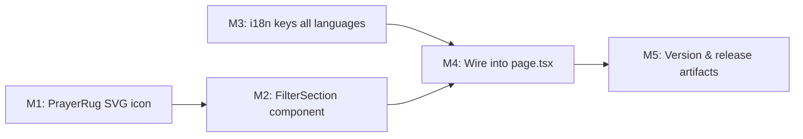

# Plan 104 — Filter Accordion UI Implementation

| Field          | Value                                                                                   |
| -------------- | --------------------------------------------------------------------------------------- |
| Plan ID        | 104                                                                                     |
| Target Release | next available patch after current origin/main version (v0.10.27); confirm at DevOps Stage 1 |
| Epic Alignment | Search UX — Filter accordion section (Figma node 245:11548)                            |
| Related Issues | None                                                                                    |
| Classification | Feature                                                                                 |
| Pipeline       | Abbreviated (Planner → Implementer → Code Reviewer → QA → DevOps)                     |
| GitHub Issue   | https://github.com/abu-lina/uflow/issues/166                                           |
| Created        | 2026-04-26T08:30Z                                                                       |

## Changelog

| Date                | Author  | Change                        | Notes                                     |
| ------------------- | ------- | ----------------------------- | ----------------------------------------- |
| 2026-04-26T08:30Z   | planner | Plan created, Status: Active  | Worker session S104; pre-assigned plan ID |
| 2026-04-26T15:05Z   | planner | Revision post-Critic review   | Resolved all 6 findings: Hugeicons license verified (MIT, commercial use free); filter count badge made required; non-functional filter risk accepted + CHANGELOG obligation; Figma spec accepted as stable; prescriptive code already labelled ILLUSTRATIVE ONLY |
| 2026-04-26T15:11Z   | implementer | Implementation started     | Status set to In Progress; entering mandatory TDD gate sequence (M1 -> M2 -> M3 -> M4 -> M5) |
| 2026-04-26T16:02Z   | code-reviewer | Code review completed     | Verdict APPROVED_WITH_COMMENTS; Status set to Code Review Approved; handoff to QA |
| 2026-04-26T18:52Z   | uat      | UAT validation complete      | Value statement delivered (users can see populated filter UI with 5 items). Status set to UAT Approved. Handoff to DevOps with mandatory closure gate DF-1 (manual visual verification on /search) |
| 2026-04-26T15:56Z   | devops   | Stage 1 committed locally    | Status set to Committed for v0.10.28. All docs closed. DF-1 open-actions tracker created. No push executed. |

---

## Value Statement and Business Objective

> As a user searching on the `/search` page, I want to see a populated "Filter" accordion with meaningful Islamic-context filter options (Muslim owner, charitable giving, solidarity, parking, prayer space), so that I can express my search intent more precisely before executing a search — even before backend wiring is complete.

---

## Objective

Replace the stub "Additional filters — to be implemented" placeholder in the Filter accordion (`src/app/(public)/search/page.tsx`) with a fully styled, interactive, and i18n-ready `FilterSection` component matching the Figma specification (node 245:11548, file `mH4p6c8GExOuLn65WdSPMb`).

This plan covers **UI state only**. No backend filter execution is wired in this plan. Selected filter keys are surfaced to the parent (stored in local state) for future wiring.

---

## Assumptions

1. `lucide-react` (v0.577.0) is installed and provides all required icons except `prayer-rug`.
2. `hugeicons` is **not installed** — the `prayer-rug` icon requires an inline SVG component.
3. The `ExpandSection` component (`src/components/ui/ExpandSection.tsx`) is used as-is; no modifications to it are needed.
4. The `useLanguage` hook with `t()` is the i18n mechanism; translations live in `src/translations/{de,en,ar,tr,ur,ps}.ts`.
5. The icon container background `bg-background-selection` (Tailwind semantic token, resolves to teal/breaker-bay tint) matches the Figma spec's `#e3f2ef`. No new color tokens are needed.
6. Filter items use `role="checkbox"` / `aria-checked` semantics for accessibility.
7. Selected filter state is held in `SearchPageContent` as a `Set<string>` or string array (by filter key), passed down to `FilterSection` as a controlled prop, and included in the `handleSearch` call signature — but not yet executed as a DB query.
8. The `clearAll` handler in `page.tsx` will be extended to reset selected filters.
9. **Hugeicons license verified (2026-04-26)**: Stroke-rounded icons (including `prayer-rug`) are free for unlimited personal and commercial use per https://hugeicons.com/icon/prayer-rug-stroke-rounded — FAQ states: "All stroke (rounded) icons from Hugeicons are free for unlimited use in both personal and commercial projects." The repository is MIT-licensed (© 2024 Halal Labs, https://github.com/hugeicons/hugeicons-react/blob/main/LICENSE.md). Attribution: one-line code comment in `PrayerRug.tsx` required per MIT conditions. SVG source: download from https://hugeicons.com/icon/prayer-rug-stroke-rounded (Download SVG button) or extract from npm `@hugeicons/core-free-icons` without installing.
10. **Figma design accepted as stable**: Node 245:11548 was provided with full field-level detail in the task brief by the product owner (task states "Figma Design (already fetched — use this as spec)"). Treated as a finalised specification for this plan.
11. **Non-functional filter UX**: The Search button (`Suchen`) is already `disabled={!selectedWas}` in `page.tsx`. Users cannot trigger a search without selecting a "Was" item first — filters cannot be silently applied on a triggered search. This is a standard MVP progressive-enhancement approach. Risk accepted; v0.10.28 CHANGELOG must explicitly state that filter selection is non-functional in this release (see Decision 9 and M5).

---

## Decision Record

| # | Status | Decision | Rationale |
|---|--------|----------|-----------|
| 1 | [RESOLVED] | `PrayerRug` icon as inline SVG in `src/components/icons/PrayerRug.tsx` | `hugeicons` is not installed; installing a new package for one icon is over-engineering (YAGNI). Inline SVG keeps zero runtime cost and full control. **License verified 2026-04-26**: Hugeicons stroke-rounded icons are MIT-licensed (© 2024 Halal Labs), free for commercial use. SVG path sourced from https://hugeicons.com/icon/prayer-rug-stroke-rounded or `@hugeicons/core-free-icons`. MIT attribution comment required in component. |
| 2 | [RESOLVED] | `FilterSection` component in `src/features/search/components/` | Domain-specific UI belongs in the feature module per architecture conventions. |
| 3 | [RESOLVED] | Filter items implemented as accessible toggle rows (aria-pressed or role="checkbox") | Checklist semantics match the multi-select filter UX pattern; standard ARIA pattern ensures screen reader compatibility. |
| 4 | [RESOLVED] | Controlled state: `selectedFilters: string[]` in `SearchPageContent`, passed to `FilterSection` | Keeps filter state at page level for future wiring to the search handler, consistent with how `selectedWas` and `selectedWoCity` work. |
| 5 | [RESOLVED] | i18n: filter item labels added to all 6 translation files (de, en, ar, tr, ur, ps) | Consistency with existing accordion labels. Non-German translations may use German strings as fallback initially; QA to flag mistranslations separately. |
| 6 | [RESOLVED] | Icon container background uses `bg-background-selection` semantic token | Exact match to existing `WasCategoryResults` icon slot pattern; resolves to the breaker-bay tint that matches Figma `#e3f2ef`. No new token needed. |
| 7 | [RESOLVED] | No backend wiring in this plan | Scope is UI-only per task brief. Filter keys are surfaced in state but the search execution (`handleSearch`) continues to navigate without them for now. |
| 8 | [RESOLVED] | Filter count badge on collapsed accordion title is REQUIRED | Consistent with the existing `Wo · Berlin` title pattern in `page.tsx`. When ≥1 filters are selected the title shows `Filter · N`. This is deterministic — "implementer decides" language removed; acceptance criteria updated in M4. |
| 9 | [RESOLVED] | Non-functional filter UI risk accepted (MVP progressive enhancement) | The Search button is already `disabled={!selectedWas}` — users cannot trigger a search without a "Was" selection, so filters cannot be silently applied. CHANGELOG must document this limitation clearly. No "coming soon" badge required — Figma spec shows none. |

---

## Figma Specification

**Node**: 245:11548 | **File**: `mH4p6c8GExOuLn65WdSPMb`

Filter section layout:
- White rounded card (matches existing `ExpandSection` — `rounded-2xl bg-background shadow-sm`)
- Title row: "Filter" (SemiBold, via `ExpandSection` title prop) + chevron (handled by `ExpandSection`)
- Filter items list, each item:
  - 48×48px icon container: `bg-background-selection`, `rounded-[10px]` (≈ `rounded-xl`)
  - Icon inside: 24px, centered
  - Two-line label: title (`font-semibold text-base`) + subtitle (`font-light text-base text-text-muted`)
  - Toggle/checkbox interaction

**Filter items** (key, German title, German subtitle, icon):

| # | Key | Title | Subtitle | Icon |
|---|-----|-------|----------|------|
| 1 | `muslim` | Inhaber ist Muslim | Muslimischer Inhaber | `lucide:Moon` |
| 2 | `spenden` | Spendet für Gute Zwecke | Spendet für Gute Zwecke | `lucide:HandHeart` |
| 3 | `solidaritaet` | Unterstützt Muslime | Solidarität mit der Ummah | `lucide:HeartHandshake` |
| 4 | `parken` | Bietet Parkmöglichkeiten | Parkplätze vorhanden | `lucide:CircleParking` |
| 5 | `gebet` | Bietet Gebetsmöglichkeiten | Gebetsraum vorhanden | `PrayerRug` (custom SVG) |

---

## Release Strategy

Standalone (no other known active plans targeting the same release version as of 2026-04-26T08:30Z).

---

## Milestone Dependencies



**Sequencing rule**: M2 is blocked on M1; M4 begins only after M2 and M3 are complete; M5 is the final gate.

---

## Milestones

### M1 — PrayerRug SVG Icon Component

**Objective**: Provide a React SVG component for the prayer-rug icon since `hugeicons` is not installed.

**Location**: `src/components/icons/PrayerRug.tsx` (create `src/components/icons/` directory)

**Tasks**:
1. Source the `hugeicons:prayer-rug` SVG path data — **license: MIT, verified 2026-04-26, free for commercial use** (https://hugeicons.com/icon/prayer-rug-stroke-rounded). Obtain the SVG via the Hugeicons website download button (Stroke Rounded style) or by inspecting the `@hugeicons/core-free-icons` npm package contents without installing it (e.g., via `npm pack` or unpkg). Target: viewBox 0 0 24 24, strokeWidth 1.5, stroke-rounded style.
2. Create `PrayerRug.tsx` as a functional React component accepting standard SVG props (`className`, `aria-hidden`, `width`, `height`). Defaults to 24×24px.
3. Keep the component minimal — no wrapper div, just an `<svg>` element with the paths from the Hugeicons source.
4. Include MIT attribution comment at the file top: `// Prayer Rug icon © 2024 Halal Labs (Hugeicons) — MIT License https://github.com/hugeicons/hugeicons-react/blob/main/LICENSE.md`

**Acceptance Criteria**:
- Component renders a 24×24 SVG visually matching the Hugeicons prayer-rug stroke-rounded icon.
- Accepts and forwards `className`, `width`, `height`, and `aria-hidden` props.
- MIT attribution comment is present in the file header.
- TypeScript strict mode passes (`npm run type-check`).
- No `hugeicons` or `@hugeicons/*` package added to `package.json`.

---

### M2 — FilterSection Component

**Objective**: Create the `FilterSection` React component encapsulating the 5 filter item rows.

**Location**: `src/features/search/components/FilterSection.tsx`

**Props interface** (ILLUSTRATIVE ONLY — implementer decides exact shape):
```
// Props shape:
// selectedFilters: string[]       — controlled array of selected filter keys
// onToggleFilter: (key: string) => void
// t: (key: string) => string
```

**Tasks**:
1. Create `FilterSection.tsx` as a client-safe component (it receives state as props; state lifting is in `page.tsx`).
2. Define the 5 filter items as a static constant array within the file (key, title i18n key, subtitle i18n key, icon component reference).
3. Render each item as a row with:
   - Icon container: `h-12 w-12` (48×48px), `rounded-xl` (≈ 10px), `bg-background-selection`, `flex items-center justify-center`
   - Icon inside: `h-6 w-6 text-primary`
   - Label block: title line (`text-base font-semibold text-content-heading`), subtitle line (`text-base font-light text-text-muted`)
   - Selection indicator: checkmark or teal fill on the icon container when selected; implementer to choose the clearest pattern matching Figma (teal ring, filled container, or leading checkbox)
4. Each row is a `<button>` (or `<div role="checkbox">`) with `aria-checked={selected}` / `aria-pressed` and keyboard-accessible focus styles.
5. Items are separated by a divider or spacing consistent with the Wo accordion's city rows.

**Spacing baseline**: Match the interior spacing of the WAS accordion section (`mt-3`, `gap-3` row spacing, `px-4 pb-4` outer padding inherited from `ExpandSection`).

**Acceptance Criteria**:
- Component renders 5 items in the correct Figma order.
- Clicking an item calls `onToggleFilter(key)` (toggle semantics — calling twice deselects).
- Selected items show a visual distinction (ring, background fill, checkmark, or icon color change).
- All icon containers match the 48×48 / rounded-xl / `bg-background-selection` spec.
- `PrayerRug` icon renders in the 5th row.
- TypeScript strict mode passes.
- Lint passes (`npm run lint`).

---

### M3 — i18n Translation Keys

**Objective**: Add filter item translation keys to all 6 language files so the component can use `t()` for every string.

**Files to update**:
- `src/translations/de.ts` — German (authoritative; all strings provided)
- `src/translations/en.ts` — English
- `src/translations/ar.ts` — Arabic
- `src/translations/tr.ts` — Turkish
- `src/translations/ur.ts` — Urdu
- `src/translations/ps.ts` — Pashto

**Key schema** (add inside the existing `suchen` object):
```
// ILLUSTRATIVE ONLY:
suchen: {
  // ... existing keys ...
  filter: {
    items: {
      muslim:        { title: "...", subtitle: "..." },
      spenden:       { title: "...", subtitle: "..." },
      solidaritaet:  { title: "...", subtitle: "..." },
      parken:        { title: "...", subtitle: "..." },
      gebet:         { title: "...", subtitle: "..." },
    }
  }
}
```

**German strings** (de.ts, canonical):

| Key | title | subtitle |
|-----|-------|----------|
| `muslim` | Inhaber ist Muslim | Muslimischer Inhaber |
| `spenden` | Spendet für Gute Zwecke | Spendet für Gute Zwecke |
| `solidaritaet` | Unterstützt Muslime | Solidarität mit der Ummah |
| `parken` | Bietet Parkmöglichkeiten | Parkplätze vorhanden |
| `gebet` | Bietet Gebetsmöglichkeiten | Gebetsraum vorhanden |

For non-German languages where translations are not yet available, the implementer may use the German strings as an initial placeholder. QA should flag any untranslated strings as a future improvement, not a blocker for this plan.

**Acceptance Criteria**:
- All 6 translation files compile without TypeScript errors.
- `t('suchen.filter.items.muslim.title')` and equivalent keys resolve correctly at runtime.
- No existing translation keys are modified or removed.

---

### M4 — Wire FilterSection into `search/page.tsx`

**Objective**: Replace the Filter accordion stub with the `FilterSection` component and plumb the state.

**File**: `src/app/(public)/search/page.tsx`

**Tasks**:

1. **Add filter state** to `SearchPageContent`:
   - `const [selectedFilters, setSelectedFilters] = useState<string[]>([]);`
   - `const [filterOpen, setFilterOpen] = useState(false);`

2. **Add toggle handler**:
   - `handleToggleFilter(key: string)` — toggles the key in/out of `selectedFilters`.

3. **Update Filter `ExpandSection`**: Replace the stub content with:
   ```
   // ILLUSTRATIVE ONLY:
   <ExpandSection isOpen={filterOpen} title={t('suchen.accordions.filter')} onToggle={setFilterOpen}>
     <FilterSection
       selectedFilters={selectedFilters}
       t={t}
       onToggleFilter={handleToggleFilter}
     />
   </ExpandSection>
   ```

4. **Extend `clearAll` handler**: Add `setSelectedFilters([])` and `setFilterOpen(false)` to the existing clear handler.

5. **Import `FilterSection`** at the top of the file (alongside existing feature component imports).

6. **Filter accordion title badge (REQUIRED)**: When ≥1 filters are selected, the collapsed title MUST show `Filter · N` (e.g., `Filter · 2`) — consistent with the existing `Wo · Berlin` pattern already implemented in `page.tsx`. Compute as: `selectedFilters.length > 0 ? \`${t('suchen.accordions.filter')} · ${selectedFilters.length}\` : t('suchen.accordions.filter')`. (ILLUSTRATIVE ONLY — implementer adapts to project i18n/string construction patterns.)

**Acceptance Criteria**:
- The Filter accordion opens/closes and shows all 5 filter items.
- Toggling a filter item updates `selectedFilters` state (visual feedback confirmed).
- Collapsed accordion title shows `Filter · N` when N ≥ 1 filters are selected; shows plain `Filter` when empty.
- "Alles löschen" resets `selectedFilters` to empty, `filterOpen` to false, and title reverts to plain `Filter`.
- No regression in Was, Wo, or Wer accordion behavior.
- `npm run type-check` passes.
- `npm run lint` passes.
- Existing tests in `src/app/(public)/search/page.test.tsx` continue to pass (or are updated minimally if new state causes test failures due to mock coverage).

---

### M5 — Version & Release Artifacts

**Objective**: Bump version and update CHANGELOG to reflect this feature delivery.

**Tasks**:
1. Update `package.json` `version` to the next patch after `origin/main` v0.10.27 (i.e., `0.10.28`; confirm at DevOps Stage 1 that no collision exists with `git tag --list "v*"`).
2. Add a `CHANGELOG.md` entry under the new version that **MUST** include:
   - Feature: Filter accordion UI — 5 interactive filter items with icons, i18n, and local state.
   - **Explicit note (required)**: "Filter UI is interactive (items toggle with visual feedback and the collapsed title shows the selected count) but does not execute backend queries yet. Selected filters are not applied to search results in this release. Full filter execution will be wired in a future plan."
3. No README changes required (internal UI change, no user-facing documentation update needed).

**Acceptance Criteria**:
- `package.json` version matches the confirmed release version.
- `CHANGELOG.md` entry is present and accurate.
- Git tag `vX.Y.Z` is applied by DevOps on release.

---

## Testing Strategy

Expected test types for QA to cover (not prescriptive — QA owns test design):

- **Unit/component tests**: `FilterSection` renders all 5 items; toggling a filter calls `onToggleFilter`; selected state is visually distinct.
- **Integration tests**: Filter accordion opens/closes in `SearchPageContent`; clearAll resets filter state; existing Was/Wo tests are not regressed.
- **Accessibility**: Each filter row meets ARIA checkbox/pressed semantics; keyboard navigation works (Tab, Space/Enter to toggle).
- **Visual regression**: Icon containers match 48×48 / `bg-background-selection` / rounded spec.
- **i18n**: All translation keys resolve without console warnings across supported languages.

---

## Baseline & Measurements

No performance targets are defined for this UI-only plan. No bundle size budget regression is expected from adding a single icon SVG and a small component. If bundle impact is a concern, QA may note it in the code review — no explicit measurement milestone required.

---

## Risks

| Risk | Likelihood | Impact | Mitigation |
|------|-----------|--------|------------|
| PrayerRug SVG paths differ visually from Figma | Medium | Low | Implementer should match Hugeicons open-source SVG exactly; visual QA comparison |
| Filter state conflict with existing page state (e.g., too many `useState` hooks) | Low | Low | State shape is simple (`string[]`); no complex effects needed |
| Non-German translations missing / incorrect | Medium | Low | Accepted: use German as placeholder, tracked as a separate translation improvement |
| `page.test.tsx` breaks due to new state | Low | Medium | Minimal fix: add `selectedFilters` mock defaults to existing test fixtures |

---

## Removal Surface Enumeration

Not applicable — this plan adds a new capability; it does not remove or deprecate any existing feature.

---

## Duration Estimates

| Phase | Estimate | Uncertainty Drivers |
|-------|----------|---------------------|
| Analysis | Complete (no analyst needed) | — |
| Planning | Complete | — |
| Implementation | 2–4 hours | SVG sourcing for prayer-rug; i18n for 6 languages |
| Code Review | 30–60 min | Focused scope, small diff |
| QA | 1–2 hours | Component + integration + a11y checks |
| DevOps | 30 min | Standard patch release process |

---

## Open Questions

No open questions. All decisions resolved in the Decision Record.
