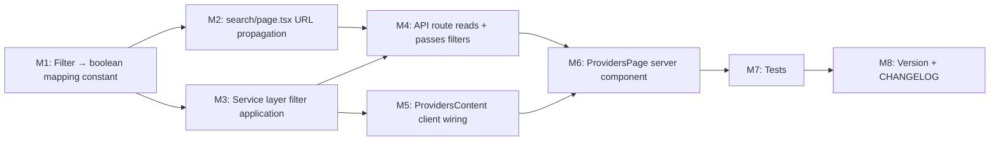

# Plan 105 — Wire Values & Amenities Filters to Provider Search

| Field          | Value                                                                          |
| -------------- | ------------------------------------------------------------------------------ |
| Plan ID        | 105                                                                            |
| Target Release | next available patch after current origin/main version (0.10.28); confirm at DevOps Stage 1 |
| Epic Alignment | Search UX — Filter wiring (follow-on to Plan 104 filter UI)                   |
| Related Issues | None                                                                           |
| Classification | Feature (data wiring)                                                          |
| Pipeline       | Focused (no new UI, no DB migration, TypeScript-only changes)                  |
| GitHub Issue   | https://github.com/abu-lina/uflow/issues/168                                  |
| Created        | 2026-04-26T12:00Z                                                              |

## Changelog

| Date (UTC)        | Agent   | Change                                        |
| ----------------- | ------- | --------------------------------------------- |
| 2026-04-26T12:00Z | planner | Initial draft                                 |
| 2026-04-26T19:45Z | implementer | Execution started; entering TDD Red phase |
| 2026-04-26T22:30Z | uat | UAT approved; APPROVED FOR RELEASE |
| 2026-04-26T22:45Z | devops | Committed for Release v0.10.29 |

---

## Value Statement and Business Objective

> As a user searching for providers on `/search`, I want the filter items I select (Muslim-owned, donations, solidarity pricing, parking, prayer space) to actually filter search results, so that I receive only providers matching my Values & Amenities criteria instead of the full unfiltered list.

**Current defect**: `selectedFilters` state is toggled correctly and drives the accordion badge count, but is silently ignored by `handleSearch()` — the URL pushed to `/providers` contains no filter params, and results are never filtered.

---

## Objective

Wire the five Values & Amenities filter keys through the full search stack, from the URL parameter produced by `/search` to the Supabase query applied in `searchProviders()`, with no new UI and no DB migration.

---

## Assumptions

1. **Boolean columns exist**: Migration `067_three_section_search_schema.sql` (Plan 089) already added `muslim_owned`, `accepts_donations`, `solidarity_pricing`, `has_parking`, `has_prayer_space` BOOLEAN columns to `providers`, backfilled from existing badge/`barakah_effects` data.
2. **No boolean columns on `community_services`**: The `ummah` section returns community services; these records do NOT have the five boolean columns. Filters will be skipped for the `ummah` section.
3. **The "Suchen" button remains gated on `selectedWas`**: Existing behaviour (button disabled without a "Was?" selection) is out of scope. Filters supplement a Was selection.
4. **No new RPC function needed**: Adding `.eq('column', true)` predicates to the existing Supabase client query in `searchProviders()` is sufficient. The `search_providers` Postgres RPC is not used by the current client code.
5. **No new filter UI needed**: Plan 104 delivered the complete UI including toggle state, badge counts, and clear-all reset.

---

## Decision Record

| # | Decision | Status | Rationale / Owner |
|---|----------|--------|--------------------|
| D1 | Use existing boolean columns (`muslim_owned` etc.) rather than `barakah_effects` TEXT[] array containment | `[RESOLVED]` | Boolean columns are indexed (GIN/btree from Plan 089), type-safe, and simpler than `@>` array containment. The task attachment's "barakah_effects filter" refers to the conceptual domain; the implementation target is the backfilled boolean columns. |
| D2 | Filters are applied with AND semantics (all selected filters must match) | `[RESOLVED]` | Most useful for users narrowing results (e.g., "must be Muslim-owned AND have parking"). OR semantics would widen results and defeat the purpose of multi-selection. |
| D3 | Community services (`ummah` section) receive no filter application | `[RESOLVED]` | `community_services` table lacks the five boolean columns. Applying filters to ummah section would require either a schema change or application-layer post-filter — both are out of scope for this plan. Filter state is preserved in the URL but silently ignored for ummah results. |
| D4 | Filter keys are validated against an allowlist on the API route boundary | `[RESOLVED]` | Prevents injection of arbitrary column names into the query. Only the five known keys are allowed through the service layer. |
| D5 | URL transport: comma-separated string in a single `filters` query param | `[RESOLVED]` | Compact, consistent with the pattern used by existing params (e.g., `section`). Simpler than repeated params (`filters[]=…`). Empty string or absent param = no filter applied. |
| D6 | `initialData` on `ProvidersContent` is invalidated when filters are present | `[RESOLVED]` | The server-rendered initial page and the React Query `initialData` option must include filter awareness. The server component reads filters and passes them to the initial fetch; React Query key includes filters for correct cache partitioning. |
| D7 | No `handleSearch()` guard change for filter-only searches | `[RESOLVED]` | The button remains `disabled={!selectedWas}`. This is a product decision from Plan 104, not in scope for Plan 105. |
| D8 | Filters are NOT persisted to localStorage (unlike recent searches) | `[RESOLVED]` | Filters are search-session state, not browsing history. Adding persistence is scope creep; the URL is the canonical state. |

---

## Release Strategy

Standalone (no other known active plans for the v0.10.29 patch window at time of writing).

---

## Milestone Dependencies



**Sequencing rule**: M1 is a pure constant/mapping; M2–M3 can proceed in parallel after M1. M4 and M5 require M3. M6 requires M4–M5. M7 and M8 are final.

---

## Plan

### M1 — Filter Key ↔ Boolean Column Mapping (shared constant)

**Objective**: Define a single canonical mapping between UI filter key strings and `providers` boolean column names.

**Location**: A new file `src/features/search/constants/filterKeyMap.ts` (or inline within `src/services/providers.ts` if the implementer judges a separate file unnecessary for a single mapping object).

**Content** (ILLUSTRATIVE ONLY):
```
FILTER_KEY_TO_COLUMN = {
  muslim:        'muslim_owned',
  spenden:       'accepts_donations',
  solidaritaet:  'solidarity_pricing',
  parken:        'has_parking',
  gebet:         'has_prayer_space',
}
```

**Acceptance criteria**:
- All five filter keys have a mapped column name
- An exported helper validates that an input key is a known filter key (used at API boundary)
- The mapping is the single source of truth — no duplication across files

---

### M2 — URL Propagation: search/page.tsx `handleSearch()`

**File**: `src/app/(public)/search/page.tsx`

**Objective**: Include the selected filter keys in the URL when navigating to `/providers`.

**Current state**: `handleSearch()` builds `URLSearchParams` with `section`, optionally `category` or `q`, and pushes to `/providers`. `selectedFilters` is never included.

**Change**:
- If `selectedFilters.length > 0`, serialize as `filters=key1,key2` and include in the params
- If `selectedFilters` is empty, omit the `filters` param entirely (no `?filters=` in URL)
- The clear-all handler already resets `selectedFilters` to `[]` — no change needed there

**Acceptance criteria**:
- Navigating after selecting 2 filters produces `/providers?section=food&q=…&filters=muslim,parken`
- Navigating with no filters produces `/providers?section=food&q=…` (no `filters` param)
- Clearing all and searching produces `/providers?section=food&q=…` (no `filters` param)

---

### M3 — Service Layer: Apply Boolean Filters in `searchProviders()`

**File**: `src/services/providers.ts`

**Objective**: Accept an array of validated filter keys and apply the corresponding `.eq('column', true)` predicates to the Supabase client query.

**Functions to update** (in dependency order):
1. `searchProvidersAndCommunityServices()` — add `barakahFilters?: string[]` parameter. Route to correct sub-function. For `ummah` section, pass an empty array (filters ignored).
2. `searchProvidersOnly()` — accept and forward `barakahFilters` to `searchProviders()`
3. `searchProviders()` — accept `barakahFilters?: string[]`; for each valid key in the array, apply `.eq(FILTER_KEY_TO_COLUMN[key], true)` to the query builder

**Filter application semantics (AND)**:
- Each selected filter adds one `.eq()` predicate
- All predicates must match (Supabase default: AND)
- Unknown keys are silently skipped (defensive, but allowlist validation at API boundary prevents this in practice)

**Acceptance criteria**:
- `searchProviders()` with `barakahFilters: ['muslim', 'parken']` emits a Supabase query that includes both `eq('muslim_owned', true)` AND `eq('has_parking', true)`
- Empty `barakahFilters` (`[]` or `undefined`) leaves the query unchanged
- The `ummah` section route always receives `[]` (no filter applied to community services)

---

### M4 — API Route: Read and Forward `filters` Param

**File**: `src/app/api/providers/search/route.ts`

**Objective**: Extract the `filters` query param, validate it against the allowlist, and pass it to `searchProvidersAndCommunityServices()`.

**Changes**:
- Parse `filters` param (comma-separated string)
- Split into array, trim whitespace
- Validate each element against the five allowed keys from M1 (reject unknown values with 400 or silently filter them out — implementer decision; the key constraint is no unknown keys reach the service layer)
- Pass validated filter array to `searchProvidersAndCommunityServices()`
- Update the cache-control logic: a request with `filters` present should be treated the same as a request with `q` present (no-store / short TTL) since it is a user-specific filter

**Acceptance criteria**:
- `GET /api/providers/search?filters=muslim,parken` routes filters to service layer
- `GET /api/providers/search?filters=INVALID_KEY` either returns 400 or strips the invalid key (0 filters reach DB)
- Cache-control header is not `public` when `filters` is non-empty

---

### M5 — ProvidersContent: Client-Side Wiring (Pagination)

**File**: `src/app/(public)/providers/ProvidersContent.tsx`

**Objective**: Ensure infinite-scroll pagination preserves the filter selection.

**Changes**:
1. `fetchProvidersFromAPI()` — add `filters?: string[]` parameter; serialize as `filters=key1,key2` in the API URL params when non-empty
2. URL param reading in `SearchPageContent` — read `searchParams.get('filters')`, split, validate
3. React Query `queryKey` — add `filters` array to the key `['providers', query, category, location, status, section, filters]`
4. `useInfiniteQuery` `queryFn` — pass `filters` to `fetchProvidersFromAPI()`
5. `initialData` usage — the existing `!status && initialData` guard should be extended to also exclude `initialData` when `filters` is non-empty (server-rendered initial data is already filter-aware via M6, so this exclusion may not be strictly needed — implementer to assess)

**Acceptance criteria**:
- Loading page 2 (`fetchNextPage`) includes the same `filters` param as page 1
- Changing section (via `SectionSelector` on `/providers`) preserves filters in the query
- React Query cache is correctly partitioned by filter combination (no stale cross-filter cache hits)

---

### M6 — ProvidersPage: Server Component Initial Fetch

**File**: `src/app/(public)/providers/page.tsx`

**Objective**: Read `filters` from server-side `searchParams` and pass to the initial `searchProvidersAndCommunityServices()` call.

**Changes**:
- Read `params.filters` from `searchParams`
- Parse and validate against the M1 allowlist
- Pass validated filter array to `searchProvidersAndCommunityServices()`
- Pass the filter array to `<ProvidersContent initialData={...} />` as a prop (so `ProvidersContent` can use it in the React Query `queryKey` and avoid a redundant re-fetch)

**Acceptance criteria**:
- SSR-rendered page at `/providers?q=pizza&filters=muslim` returns only Muslim-owned providers
- `ProvidersContent` receives `initialData` that is already filter-scoped
- No second fetch occurs immediately on page load when `initialData` matches the filter state

---

### M7 — Tests

**Objective**: Regression coverage for the filter wiring bug path and the new filter application logic.

**Expected test scope** (implementation detail is QA's domain — this is guidance only):

- **Filter key mapping** (unit): All five keys map to the correct column names; an unknown key is not present in the map
- **URL param serialization** (unit/logic test): `handleSearch()` with filters produces correct `filters=…` param; empty filters produces no param
- **`searchProviders()` filter application** (unit, mock Supabase): Calling with `barakahFilters: ['muslim']` causes the `.eq('muslim_owned', true)` predicate to appear in the query chain; calling with `[]` causes no extra predicates
- **API route validation** (unit): Invalid filter keys are rejected or stripped; valid keys pass through
- **Ummah section isolation** (unit): `searchProvidersAndCommunityServices()` with section `'ummah'` and non-empty `barakahFilters` does NOT apply filters to the community services query

**Note**: The pre-fix bug path should be demonstrated as a named test (e.g., `[pre-fix FAILS] filters not included in handleSearch URL`), per Client-State Precedence Regression Pattern in the engineering standards.

---

### M8 — Version and Release Artifacts

**Objective**: Bump version and record deliverables in CHANGELOG.

**Tasks**:
- `package.json`: bump `version` to the confirmed next patch (target: `0.10.29`, confirmed at DevOps Stage 1)
- `CHANGELOG.md`: add entry under new version header documenting filter wiring deliverables
- Commit message: `chore: bump version to 0.10.29 (Plan 105 filter wiring)`

**Acceptance criteria**:
- `package.json` version matches git tag created at release
- CHANGELOG entry references Plan 105 and lists all five filter keys and their mapped columns

---

## Testing Strategy

**Scope**: unit + integration at the service/route layer; no e2e browser automation required.

**Priority order**:
1. Unit tests for the filter key → column mapping constant (zero-risk, pure data)
2. Unit tests for `searchProviders()` with mocked Supabase client (verify `.eq()` calls)
3. Logic tests for `handleSearch()` URL construction (mimic the pre/post-fix pattern)
4. API route tests for input validation and cache-control header

**Coverage expectation**: The filter application path in `searchProviders()` must be covered for both the "filters selected" and "no filters" branches. Ummah isolation must be covered.

---

## Validation Checkpoints

| Checkpoint | Validator | Evidence |
|------------|-----------|----------|
| Build passes (`next build`) | Implementer | Zero TypeScript errors |
| Tests pass (`npm test`) | Implementer | All 1086 + new tests green |
| `/providers?q=pizza&filters=muslim` returns only `muslim_owned=true` rows | QA/UAT | Manual spot-check or Supabase query verification |
| `/providers?q=pizza&filters=muslim,parken` returns only rows where both conditions hold | QA/UAT | Manual spot-check |
| `/providers?section=ummah&q=mosque&filters=gebet` returns ummah results without error | QA/UAT | Community services not filtered |
| Pagination: page 2 request preserves `filters` param | QA/UAT | Network tab inspection |

---

## Risks

| Risk | Likelihood | Impact | Mitigation |
|------|-----------|--------|------------|
| Boolean columns have low data density (most providers have `false`) | Medium | Medium | No data risk; results may be sparse for some filters. Monitoring not in scope for Plan 105. |
| `initialData` mismatch (server-rendered page without filters handed to client that reads filters from URL) | Low | Low | M5 step 5 addresses this via query key partitioning; React Query will re-fetch if key mismatches. |
| `community_services` records unexpectedly appear with filter params active | Low | Low | D3 decision + M3 ummah guard prevent this. Test in M7 covers it. |
| Cache poisoning if filters leak into public cache | Low | Medium | M4 no-store rule when `filters` non-empty prevents this. |

---

## Duration Estimates

| Phase | Estimate | Uncertainty Drivers |
|-------|----------|---------------------|
| Analysis | Completed (in-plan) | — |
| Planning | 0.5h | — |
| Implementation | 2–4h | 5 files touch-points; no DB migration; risk of React Query cache key subtleties |
| QA | 1–2h | Primarily unit tests; manual spot-check is lightweight |
| UAT | 0.5h | Visual filter wiring check; no new UI |
| DevOps | 0.5h | Version bump + tag only |
| **Total** | **4.5–7.5h** | Low uncertainty overall |

---

## Files Touched (Implementation Guide)

| File | Change Type | Milestone |
|------|-------------|-----------|
| `src/features/search/constants/filterKeyMap.ts` (new) | New file | M1 |
| `src/app/(public)/search/page.tsx` | Modify `handleSearch()` | M2 |
| `src/services/providers.ts` | Add `barakahFilters` param to 3 functions | M3 |
| `src/app/api/providers/search/route.ts` | Read + validate `filters` param | M4 |
| `src/app/(public)/providers/ProvidersContent.tsx` | Update `fetchProvidersFromAPI` + query key | M5 |
| `src/app/(public)/providers/page.tsx` | Read `filters` from `searchParams` | M6 |
| `tests/` (new test files) | Unit tests | M7 |
| `package.json` + `CHANGELOG.md` | Version bump | M8 |

**Total**: 7 files modified + 1 new mapping constant file + new test file(s). Well within the <10 file scope guideline.

---

## Handoff Notes

- **No DB migration required**: All five boolean columns are live from Plan 089 (migration `067_three_section_search_schema.sql`).
- **No new UI required**: Plan 104 delivered `FilterSection.tsx` + accordion wiring. Only data plumbing is needed.
- **The `barakah_effects` TEXT[] column** mentioned in the task attachment is the *source* of the boolean columns (backfilled in migration 067); do NOT filter on the TEXT[] array — use the boolean columns.
- **Community services scope**: The `ummah` section is explicitly excluded from filter application (D3). If a future plan wants to filter community services, a schema addition is required.
- **Rollback**: All changes are pure application-layer. Rolling back means reverting the 6 modified files. No data changes.
