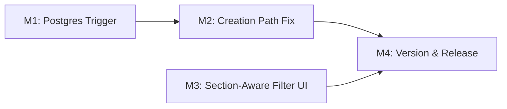

# Plan 106 — Badge/Boolean Data Coherence

| Field          | Value                                                                              |
| -------------- | ---------------------------------------------------------------------------------- |
| Plan ID        | 106                                                                                |
| Target Release | Next available patch after current origin/main v0.10.29; confirm at DevOps Stage 1 |
| Epic Alignment | Epic 2.1 — Provider Trust & Verification                                           |
| Related Issues | ADR-105 (system-architecture.md)                                                   |
| Classification | Feature                                                                            |
| Pipeline       | Full                                                                               |
| GitHub Issue   | https://github.com/abu-lina/uflow/issues/170                                      |
| Created        | 2026-04-27T16:30Z                                                                  |

## Changelog

| Date              | Author  | Change                       | Rationale                           |
| ----------------- | ------- | ---------------------------- | ----------------------------------- |
| 2026-04-27T16:30Z | Planner | Initial plan created         | ADR-105 identified data coherence gap |
| 2026-04-27T17:30Z | Planner | Revised per Critique findings | F-1: badge_type_id JOIN; F-2: entity_type guard; F-3: transaction strategy; F-5: D8 added |
| 2026-04-27T18:00Z | Implementer | Implementation started | Gate passed: critique APPROVED; entering TDD Red phase |
| 2026-04-27T20:05Z | QA | QA Complete — PASS | All 9 tests pass, 1101 regression tests pass, quality gates pass |
| 2026-04-27T20:15Z | UAT | UAT Approved — Ready for Release | Value statement delivered, no blockers, approved for DevOps stage 1 |

---

## Value Statement and Business Objective

**As a** Muslim seeking halal businesses and community services on UFlow,
**I want** the search filter results to reflect the actual attributes claimed by providers — both newly created and existing,
**so that** I can trust the filter results to show me all qualifying providers, not just those that happened to exist before a one-time migration backfill.

---

## Background & Problem Statement

Plan 105 wired 5 search filter keys to boolean columns on the `providers` table. Post-release architectural review (ADR-105) revealed three disconnected data systems:

1. **Creation path** (`providerService.ts`): writes `barakah_effects: formData.tags` (free-form string array) but **never** sets boolean columns (`muslim_owned`, `has_parking`, etc.) and **never** creates `provider_badges` rows. New providers default to `false` for all filter columns.

2. **Badge endorsement path** (`badges.ts`): existing Postgres triggers update `provider_badges.confirmation_count` and `trust_level`, but **never** propagate to `providers.*` boolean columns. Endorsed badges don't affect search filtering.

3. **One-time backfill** (migration 067): backfilled booleans from badges and `barakah_effects` strings, but created no ongoing sync trigger. Providers created after migration 067 are invisible to search filters.

4. **Section semantics**: STORES requires `muslim_owned = true` as a listing invariant (not a filter). FOOD treats it as an optional filter. UMMAH has no boolean columns. The filter UI currently shows all 5 toggles regardless of section.

### Coverage Asymmetry

| Filter key     | Boolean column      | Badge equivalent   |
| -------------- | ------------------- | ------------------ |
| muslim         | `muslim_owned`      | MUSLIM_OWNED ✓     |
| gebet          | `has_prayer_space`  | PRAYER_FRIENDLY ✓  |
| spenden        | `accepts_donations` | SUPPORTS_SADAQAH (partial) |
| parken         | `has_parking`       | ❌ No badge         |
| solidaritaet   | `solidarity_pricing`| ❌ No badge         |

`has_parking` and `solidarity_pricing` have no badge equivalents and must remain direct boolean attributes.

---

## Assumptions

1. The existing `provider_badges` and `badge_types` schema (migration 016) remains unchanged — we add a trigger, not restructure tables.
2. The `ProviderFormData.tags` field currently captures free-form strings. The form UI already presents these as selectable options — the implementation will map selected tag values to badge rows and/or direct booleans.
3. The 5 boolean columns from migration 067 remain the filter-time source of truth (no change to Plan 105's query path).
4. Community services (`community_services` table) are out of scope — they have no boolean filter columns and are served via a separate search path.
5. `barakah_effects` column is retained for backward compatibility but will no longer be the structured data source for filter-relevant attributes.
6. Existing providers backfilled by migration 067 are unaffected — only the ongoing sync and creation path are fixed.

---

## Decision Record

| # | Decision | Status |
|---|----------|--------|
| D1 | **Badges are the write model, booleans are the read model** for attributes with badge equivalents (`muslim_owned`, `has_prayer_space`, `accepts_donations`). | [RESOLVED] — Badges carry trust-level metadata; booleans are fast indexed predicates. Trigger sync avoids JOIN on every search query. |
| D2 | **Direct booleans for attributes without badge equivalents** (`has_parking`, `solidarity_pricing`). | [RESOLVED] — No badge type exists; creating badge types for non-trust-relevant amenities violates the badge system's purpose. |
| D3 | **Postgres trigger on `provider_badges` INSERT/DELETE** propagates to `providers.*` boolean columns. | [RESOLVED] — Trigger is simpler, more reliable, and lower latency than application-layer sync. Consistent with Postgres-first philosophy. |
| D4 | **Filter UI is section-aware**: STORES hides `muslim` toggle (invariant), UMMAH hides all provider-boolean filters. | [RESOLVED] — Showing `muslim_owned` filter for STORES implies non-Muslim-owned stores exist in that section, which is misleading. |
| D5 | **`barakah_effects` deprecated as structured source**; retained as free-form tags only. | [RESOLVED] — Migration 067 comment already declared this intent; this plan enforces it in the creation path. |
| D6 | **Ownership scope: unclaimed + claimed providers**. Both paths (recommendation and owner creation) must set booleans/badges at creation time. | [RESOLVED] — Anonymous recommendations also claim attributes via the form; all creation paths must be consistent. |
| D7 | **No backfill migration needed** for existing providers. | [RESOLVED] — Migration 067 already backfilled existing data. Only the ongoing sync (trigger) and creation path are missing. |
| D8 | **`SUPPORTS_SADAQAH` → `accepts_donations` mapping is intentional for filter purposes**. | [RESOLVED] — Sadaqah (voluntary charity) is semantically broader than "accepts donations", but for the purposes of search filtering the concepts are equivalent enough. The badge preserves the richer Islamic framing on the display layer; the boolean captures the filterable capability. No new badge type is warranted. |

---

## Release Strategy

Standalone (no other known active plans targeting the same release version).

---

## Plan

### Milestone 1: Postgres Trigger — Badge-to-Boolean Sync

**Objective**: When a `provider_badges` row is inserted or deleted, automatically update the corresponding boolean column on the `providers` table.

**Deliverables**:
- New migration file in `supabase/migrations/`
- Trigger function `sync_badge_to_boolean()` that:
  - Guards: exits immediately when `NEW.entity_type != 'provider'` (community service badges must not update `providers` table)
  - Resolves `badge_key` by JOINing `badge_types` on `badge_type_id` — `provider_badges` stores `badge_type_id` (UUID FK), not `badge_key` directly
  - Maps resolved `badge_key` → boolean column:
    - `MUSLIM_OWNED` → `muslim_owned`
    - `PRAYER_FRIENDLY` → `has_prayer_space`
    - `SUPPORTS_SADAQAH` → `accepts_donations`
  - Ignores all other badge keys (e.g., `HALAL`, `FAMILY_FRIENDLY`) — no-op
- Trigger on `provider_badges` for INSERT and DELETE events (AFTER)
- On INSERT: set the corresponding boolean to `true`
- On DELETE: set the corresponding boolean to `false` ONLY IF no other active badge row with the same `badge_type_id` exists for that entity (edge case: duplicate badge sources)

**Acceptance Criteria**:
- Inserting a `provider_badges` row with `badge_type_id` resolving to `badge_key = 'MUSLIM_OWNED'` sets `providers.muslim_owned = true`
- Deleting the last `MUSLIM_OWNED` badge for a provider sets `providers.muslim_owned = false`
- Trigger function exits early (no UPDATE) when `entity_type != 'provider'`
- Trigger handles all 3 badge-to-boolean mappings
- Trigger is idempotent (re-inserting same badge doesn't error)
- No impact on badge trust-level progression (existing triggers fire on different events and remain unchanged)

### Milestone 2: Creation Path — Write Badges and Booleans

**Objective**: When a provider is created via `providerService.ts`, the form's attribute selections produce both badge rows (where applicable) and direct boolean columns.

**Deliverables**:
- Update `createProviderOrService()` in `providerService.ts`:
  - For attributes with badge equivalents: after the provider INSERT succeeds, insert `provider_badges` rows with `trust_level = SELF_DECLARED` (M1 trigger then sets the corresponding boolean). Badge inserts are a separate step from the provider INSERT — the `provider_id` is needed first.
  - For attributes without badge equivalents (`has_parking`, `solidarity_pricing`): set the boolean column directly in the provider INSERT object.
  - Failure strategy: if a badge INSERT fails after the provider INSERT succeeded, fall back to setting the boolean column directly via a follow-up UPDATE. Do not throw or roll back the provider creation — the provider record is the primary artifact.
- Define an explicit mapping constant (`FORM_TAG_TO_BADGE_KEY`) to translate form tag strings to `BadgeKey` enum values; unmapped tags go to `barakah_effects` only.
- `barakah_effects` continues to receive `formData.tags` for backward compatibility but is no longer the authoritative structured source.

**Note on transaction scope**: The Supabase JS client does not support multi-statement transactions across separate HTTP calls. The sequence is therefore: (1) INSERT provider, (2) INSERT badge rows (triggers M1 boolean sync), (3) on badge failure, UPDATE boolean columns directly as fallback. This pattern matches the existing relationship-creation step at the end of `createProviderOrService()`.

**Acceptance Criteria**:
- Creating a provider with "Muslim-owned" selected → `provider_badges` row created → `providers.muslim_owned = true` (via trigger)
- Creating a provider with "Parking" selected → `providers.has_parking = true` (direct boolean)
- Creating a provider with "Prayer space" selected → `provider_badges` row created → `providers.has_prayer_space = true` (via trigger)
- `barakah_effects` still written (backward compat) but boolean columns are the filter source of truth
- Anonymous recommendations follow the same path as owner creations

### Milestone 3: Section-Aware Filter UI

**Objective**: The `FilterSection` component hides irrelevant filter toggles based on the active search section.

**Deliverables**:
- Pass `selectedSection` (or equivalent) prop to `FilterSection`
- Define per-section filter visibility rules:
  - **FOOD** (`listing_type = 'food'`): show all 5 filters
  - **STORES** (`listing_type = 'business'`): hide `muslim` (invariant); show remaining 4
  - **UMMAH** (community services): hide all provider-boolean filters
- `FILTER_ITEMS` array filtered by section before rendering

**Acceptance Criteria**:
- FOOD section: all 5 filter checkboxes visible
- STORES section: 4 filter checkboxes visible; `muslim` not rendered
- UMMAH section: no filter checkboxes rendered (or FilterSection not rendered at all)
- URL filter params for hidden filters are silently stripped (existing Plan 105 behavior handles this)

### Milestone 4: Update Version and Release Artifacts

**Objective**: Bump version, update CHANGELOG, and prepare release.

**Deliverables**:
- Increment version in `package.json`
- Add CHANGELOG.md entry documenting all milestones
- Update any README references if applicable

**Acceptance Criteria**:
- `package.json` version matches the release tag
- CHANGELOG entry covers trigger, creation path, section-aware UI
- Version matches roadmap target

---

## Milestone Dependencies

**Sequencing rule**: M1 must complete before M2 (creation path relies on the trigger for badge-to-boolean sync). M3 is independent and can proceed in parallel with M1/M2. M4 waits for both M2 and M3.

---

## Testing Strategy

- **Unit tests**: Trigger function behavior (badge insert → boolean set, badge delete → boolean unset, idempotency). Creation path logic (badge-eligible vs direct-boolean mapping). Section-aware filter visibility.
- **Integration tests**: End-to-end creation → filter discovery flow (create provider with attributes, verify it appears in filtered search results). Badge endorsement → boolean unchanged (trust level upgrade doesn't flip boolean off).
- **Regression**: Existing Plan 105 filter tests must continue passing. Existing badge endorsement tests must continue passing.

---

## Risks

| Risk | Likelihood | Impact | Mitigation |
|------|-----------|--------|------------|
| Trigger fires on unrelated badge operations (e.g., HALAL, FAMILY_FRIENDLY) | Low | Low | Trigger function explicitly maps only the 3 known badge-to-boolean pairs; ignores other badge keys |
| Badge INSERT in creation path fails but provider INSERT succeeds (partial state) | Medium | Medium | Supabase JS client has no multi-statement transactions; strategy is post-insert badge step with direct boolean UPDATE fallback on failure — matches existing relationship-creation pattern |
| Form `tags` values don't map cleanly to badge keys | Low | Medium | Define explicit mapping constant (tag string → BadgeKey); unmapped tags go to `barakah_effects` only |
| STORES section filtering: existing `muslim_owned = false` providers visible in STORES results | Low | High | Out of scope for this plan — STORES listing invariant enforcement is a separate concern (noted for future plan) |

---

## Duration Estimates

| Phase          | Estimate   | Uncertainty Driver                                    |
| -------------- | ---------- | ----------------------------------------------------- |
| Analysis       | 0 hours    | Already completed (ADR-105)                           |
| Planning       | 1 hour     | Scope is well-defined from ADR-105                    |
| Implementation | 4–6 hours  | M1 trigger is straightforward; M2 creation path has form-data mapping complexity; M3 is a small UI change |
| QA             | 2–3 hours  | Trigger tests + creation flow + section visibility    |
| UAT            | 1 hour     | Verify new provider appears in filter results         |
| DevOps         | 1 hour     | Standard 2-stage release                              |
| **Total**      | **9–12 hours** |                                                   |

---

## Validation

- Create a new provider via the form with "Muslim-owned" and "Parking" selected
- Verify the provider appears when filtering by `muslim` and by `parken` on the search page
- Verify badge endorsement on the detail page upgrades trust level without affecting boolean columns
- Verify STORES section does not show the `muslim` filter toggle
- Verify UMMAH section does not show any provider-boolean filter toggles
- Verify all existing Plan 105 tests continue passing

---

## Handoff Notes

- **For Implementer**: The trigger function in M1 requires a JOIN to resolve `badge_key` — the `provider_badges` table stores `badge_type_id` (UUID FK to `badge_types`), not `badge_key` directly. The trigger must JOIN `badge_types` on `badge_type_id` to get the key, then apply the CASE mapping. The trigger must also guard on `entity_type = 'provider'` and exit early for any other entity type (community service badges must not touch the `providers` table). The creation path (M2) is the most complex milestone — badge inserts must happen after the provider INSERT (needs the `provider_id`) as separate Supabase calls. On badge INSERT failure, fall back to a direct boolean UPDATE rather than propagating an error.
- **For QA**: Focus regression on the existing Plan 105 filter tests and badge endorsement flow. The trigger must not interfere with the existing `trigger_update_confirmation_count` and `trigger_update_badge_trust_level` triggers on `provider_badges`.
- **Rollback**: The migration can be rolled back by dropping the trigger. The creation path changes are application-level and can be reverted via code revert. No destructive schema changes.
