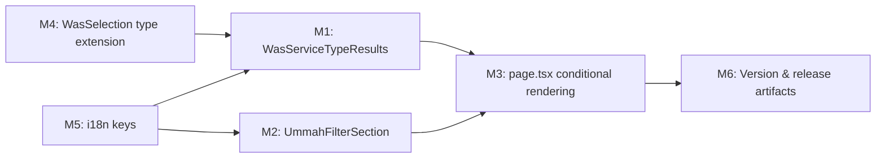

# Plan 107 — Ummah Tab Section-Conditional Search Options

| Field          | Value |
|----------------|-------|
| Plan ID        | 107 |
| Target Release | next available patch after current `origin/main` version (v0.10.30); confirm at DevOps Stage 1 |
| Epic Alignment | Three-Section Search (Plan 089) — Ummah tab parity |
| Related Issues | None (GitHub issue to be created after plan is written) |
| Classification | Feature |
| Pipeline       | Abbreviated |
| GitHub Issue   | https://github.com/abu-lina/uflow/issues/172 |
| Created        | 2026-04-27T09:00Z |
| Note           | Session was named S106; plan re-numbered to 107 after ID collision discovered on merge from origin/main (Plan 106 = Badge/Boolean Data Coherence, released v0.10.30) |

## Changelog

| Date | Author | Change | Status |
|------|--------|--------|--------|
| 2026-04-27T09:00Z | planner | Plan created | Active |
| 2026-04-27T09:45Z | critic | ID corrected 106→107 after merge pre-flight discovered collision on origin/main | Active |
| 2026-04-27T09:50Z | critic | Post-merge audit: FilterSection already section-aware (Plan 106 impl); file inventory and milestones updated | Active |
| 2026-04-27T10:00Z | planner | Revision 1: Addressed critique findings F1 (staged value delivery), F2 (WAS input shared above conditional), F4 (useEffect for state-clear), F5 (T12 added). F3 accepted as-is. | Active |
| 2026-04-27T10:20Z | implementer | Implementation started (TDD-first). Status set to In Progress. | In Progress |
| 2026-04-27T11:10Z | code-reviewer | Code review complete. Verdict: APPROVED_WITH_COMMENTS. Plan status updated to Code Review Approved. | Code Review Approved |
| 2026-04-27T11:40Z | qa | QA complete. All tests pass (7 unit, 6 integration, 129 full suite). Status: QA Complete. | QA Complete |
| 2026-04-27T11:50Z | uat | UAT complete. Value statement delivered; all objectives met. Status: UAT Approved. Ready for DevOps release. | UAT Approved |
| 2026-04-27T09:55Z | devops | Stage 1 commit: all changes staged and committed locally for v0.10.31. Docs moved to closed/. | Committed |

---

## Value Statement and Business Objective

> As an Ummah community member, I want the Ummah tab on the /search page to show
> community-service discovery options (service types, audience, location, and
> Ummah-relevant filters) rather than food-centric ones, so that I can browse and
> specify the kind of community service I need — Islamic education, counseling,
> legal aid, youth services, health support, marriage guidance, and funeral services.

**North-star metric**: Ummah tab is functionally meaningful on day one — a user clicking Ummah sees relevant search options, not restaurant categories.

**Staged value delivery (Critique F1)**: This plan delivers the search-intent UI — the user can browse, select, and filter Ummah service types. End-to-end results on the `/providers` page require a follow-up plan (Ummah provider results wiring). The `/providers` page will show best-effort results via the existing `q=` param but will not be purpose-built for Ummah queries until that follow-up is complete.

---

## Release Strategy

Standalone (no other known plans targeting the same version at time of writing).

---

## Objective

Implement section-conditional rendering on the `/search` page so that:
- The **Ummah tab** shows distinct WAS (community service types), WER (audience — reused), WO (city — reused), and Filter (Ummah service attributes).
- The **Food tab** remains 100% unchanged — no regressions.
- The **Business tab** is out of scope for this plan.

The change is **UI-only** — no database migrations, no new API routes, no backend changes.

---

## Post-Merge Reality Check (2026-04-27)

> **Origin/main merged cleanly (fast-forward to v0.10.30).** The merge brought Plan 106 (Badge/Boolean Data Coherence) which made the following changes directly relevant to Plan 107:
>
> 1. **`FilterSection.tsx`** — now accepts a `selectedSection: Section` prop. When `selectedSection === 'ummah'`, it shows an empty list (`visibleFilterItems = []`). The `page.tsx` call site already passes this prop.
> 2. **`filterKeys.ts`** — new constants file at `src/features/search/constants/filterKeys.ts` mapping food filter keys to provider columns. Sets the pattern for Ummah filter keys.
> 3. **`page.tsx`** — already passes `selectedSection` to `FilterSection`.
>
> **Impact on this plan**:
> - `FilterSection.tsx` is **already modified** — do not modify it again. M3's filter branch must swap in `UmmahFilterSection` rather than relying on the empty-list fallback in `FilterSection`.
> - The file inventory below reflects this updated reality.

---

1. Service types for the Ummah WAS accordion are a static curated list for the MVP. There is no `community_service_types` table or RPC to query; static filtering client-side is acceptable at current DAU.
2. `WasCategoryResults` (food) exports `WasSelection` type which will need a `'service-type'` union member added — this is additive and does not break the food path.
3. `WerAudienceFilter` is reused as-is with its existing three audiences (Männer, Frauen, Kinder). Familien/Senioren are a future enhancement (deferred, see Decision Record).
4. All six translation files (de, en, tr, ur, ps, ar) require i18n parity for new Ummah keys.
5. The `/providers` route receives the same URL params regardless of section. The Ummah WAS selection passes `q=<service-type-label>` to the providers page. No providers-page changes are required in this plan. **Note (Critique F1)**: This means the providers page will execute its existing search logic against the Ummah query term — results may be sparse or empty. A follow-up plan is needed to wire Ummah-specific provider results. This plan delivers the search-intent UI only.
6. The clear-all button currently resets `selectedSection` to `'food'`. This behavior is out of scope — do not change it.

---

## Decision Record

| # | Decision | Status | Rationale |
|---|----------|--------|-----------|
| D1 | Create new `WasServiceTypeResults` component rather than making `WasCategoryResults` polymorphic | [RESOLVED] | OCP: food path must not be touched. Parallel component is safe and testable independently. |
| D2 | Create new `UmmahFilterSection` component rather than passing a config prop to `FilterSection` | [RESOLVED] | SRP: `FilterSection` has one reason to change (food). Two separate components with same visual shape are cleaner than a conditional config switch inside one component. |
| D3 | Static service type list (no DB query for MVP) | [RESOLVED] | YAGNI: DAU does not warrant DB-backed service type search at this stage. Static list can be replaced later. |
| D4 | Branching logic lives in `page.tsx` JSX, not in a wrapper component | [RESOLVED] | KISS: The page already owns `selectedSection` state. A thin inline conditional is the minimum change. No new abstraction needed. |
| D5 | `WerAudienceFilter` reused unchanged | [RESOLVED] | DRY: Component is section-agnostic. Adding Familien/Senioren deferred to a follow-up enhancement. |
| D6 | Familien/Senioren audience types deferred | [DEFERRED: implementer / low priority / next ummah iteration plan] | Requires modifying `WerAudienceFilter` props and adding SVG assets. Out of scope for this plan. |
| D7 | `WasSelection` type extended with `'service-type'` union member | [RESOLVED] | Additive change. Implementer decides exact field naming (`serviceTypeId`). Existing food paths use `type: 'category'` and `type: 'dish'` — unaffected. |
| D8 | i18n parity across all 6 translation files | [RESOLVED] | All locales must have keys present, even if non-German locales are placeholder-translated for now. |

---

## File Inventory

### New Files (updated post-merge)

| File | Purpose |
|------|--------|
| `src/features/search/components/WasServiceTypeResults.tsx` | Ummah WAS component — static service type list, filtered by query |
| `src/features/search/components/WasServiceTypeResults.test.tsx` | Unit tests for above |
| `src/features/search/components/UmmahFilterSection.tsx` | Ummah filter component — Kostenlos, Online, Language, Zertifiziert, Geschlechtergetrennt |
| `src/features/search/components/UmmahFilterSection.test.tsx` | Unit tests for above |
| `src/features/search/constants/ummahFilterKeys.ts` | Ummah filter key constants (mirrors `filterKeys.ts` pattern) |

### Modified Files

| File | Change |
|------|--------|
| `src/app/(public)/search/page.tsx` | Section-conditional rendering for WAS accordion; import `WasServiceTypeResults` and `UmmahFilterSection`; swap Filter accordion to `UmmahFilterSection` when Ummah active; add state-clear on section change |
| `src/features/search/components/WasCategoryResults.tsx` | Add `'service-type'` to `WasSelection.type` union — additive only |
| `src/translations/de.ts` | Add `suchen.was.ummah.*` and `suchen.filter.ummahItems.*` keys |
| `src/translations/en.ts` | Same keys, English values |
| `src/translations/tr.ts` | Same keys, Turkish values (placeholder acceptable for MVP) |
| `src/translations/ur.ts` | Same keys, Urdu values (placeholder acceptable for MVP) |
| `src/translations/ps.ts` | Same keys, Pashto values (placeholder acceptable for MVP) |
| `src/translations/ar.ts` | Same keys, Arabic values (placeholder acceptable for MVP) |

> **Not in modified list (pre-modified by Plan 106 merge)**:
> - `src/features/search/components/FilterSection.tsx` — already accepts `selectedSection`; already passes it through; do not modify.
> - `src/features/search/constants/filterKeys.ts` — already exists; Ummah filter keys will be a new constant file `src/features/search/constants/ummahFilterKeys.ts` (see M2).

**Total files: 13** (5 new, 8 modified). The translation count (6) is driven by i18n parity requirements, not feature complexity. `FilterSection.tsx` removed from modified list — pre-modified by Plan 106 merge. `ummahFilterKeys.ts` added as new file (pattern-matches existing `filterKeys.ts`).

---

## Plan

### Milestone 1 — `WasServiceTypeResults` Component

**Objective**: A new client component that renders a static, filterable list of Ummah community service types, in the same visual style as `WasCategoryResults` but without food-specific data types.

**Service types to include (curated MVP list)**:
- Islamische Bildung (Islamic Education)
- Beratung (Counseling / Seelsorge)
- Rechtshilfe (Legal Aid)
- Jugenddienste (Youth Services)
- Gesundheitsversorgung (Health Services)
- Eheberatung (Marriage Guidance)
- Bestattungsdienste (Funeral Services)
- Soziale Hilfe (Social Support)
- Sprachkurse (Language Courses)
- Quran-Unterricht (Quran Education)

**Props shape** (mirrors `WasCategoryResults` where applicable):
- `query: string` — live filter string from WAS search input
- `selectedServiceType: WasSelection | null`
- `onSelect: (selection: WasSelection) => void`
- `onClearSelection: () => void`
- `t: TranslateFn`

**Behaviour**:
- With empty query: show full static list
- With query ≥ 2 chars: filter list by label match (case-insensitive, German-first)
- Selected state: shows a dismissible chip matching the WasCategoryResults visual pattern
- No loading/error states needed (static data)
- Uses a generic community/service icon (e.g. `HeartHandshake` from lucide-react, or similar) instead of `UtensilsCrossed`

**i18n keys needed** under `suchen.was.ummah`:
- `searchPlaceholder`
- `serviceTypeLabel` (e.g. "Dienst")
- `browseServiceTypes` (e.g. "Dienste durchsuchen")
- One key per service type label (e.g. `islamischeBildung`, `beratung`, etc.) — or implementer may hard-code German labels and use translation only for UI chrome

**Acceptance criteria**:
- [ ] Component renders all static service types when `query` is empty
- [ ] Typing a query filters visible items (case-insensitive)
- [ ] Clicking an item calls `onSelect` with `{ label, type: 'service-type', serviceTypeId }`
- [ ] Selected item renders a dismissible chip; clicking dismiss calls `onClearSelection`
- [ ] No food-specific imports (`FoodCategory`, `searchFoodCategories`, etc.) in this file

---

### Milestone 2 — `UmmahFilterSection` Component

**Objective**: A new client component rendering 5 Ummah-specific filter toggles with the same visual shape as `FilterSection`.

**Post-merge note**: `FilterSection` already shows an empty list for Ummah (`visibleFilterItems = []`). This plan replaces that empty state with a populated Ummah-specific filter list by swapping in `UmmahFilterSection` in `page.tsx`. The existing `FilterSection` behaviour for Ummah (empty list) acts as a safe fallback only — do not rely on it as the delivered UX.

**New companion constants file**: Create `src/features/search/constants/ummahFilterKeys.ts` (mirrors pattern of existing `filterKeys.ts`) to define Ummah filter keys for later wiring to the providers search API.

**Filter items**:

| Key | Title (DE) | Subtitle (DE) | Icon |
|-----|-----------|---------------|------|
| `kostenlos` | Kostenlos | Kostenfreies Angebot | `Gift` (lucide) |
| `online` | Online verfügbar | Fernberatung möglich | `Globe` (lucide) |
| `sprache` | Mehrsprachig | Arabisch, Türkisch, Urdu u.v.m. | `Languages` (lucide) |
| `zertifiziert` | Zertifiziert | Anerkannte Qualifikation | `BadgeCheck` (lucide) |
| `geschlechtergetrennt` | Geschlechtergetrennt | Separate Bereiche für Männer & Frauen | `Users` (lucide) |

**Props**: Identical shape to `FilterSection` — `selectedFilters`, `onToggleFilter`, `t`. **Do not add `selectedSection` prop** — `UmmahFilterSection` is Ummah-only and does not need section branching.

**i18n keys needed** under `suchen.filter.ummahItems`:
- `kostenlos.title`, `kostenlos.subtitle`
- `online.title`, `online.subtitle`
- `sprache.title`, `sprache.subtitle`
- `zertifiziert.title`, `zertifiziert.subtitle`
- `geschlechtergetrennt.title`, `geschlechtergetrennt.subtitle`

**Acceptance criteria**:
- [ ] Component renders exactly 5 filter rows
- [ ] Toggle behaviour identical to `FilterSection` (aria-checked, ring-2 ring-primary on selected)
- [ ] No food filter keys (`muslim`, `spenden`, `solidaritaet`, `parken`, `gebet`) used in this component
- [ ] Props interface is identical to `FilterSection` (drop-in substitutable)

---

### Milestone 3 — Section-Conditional Rendering in `page.tsx`

**Objective**: Introduce two conditional branches in `SearchPageContent` so the Ummah tab renders M1 and M2 components, while the food tab is unchanged.

**WAS accordion change**:
- When `selectedSection === 'ummah'`: render `WasServiceTypeResults` inside the existing `ExpandSection` for "Was?"
- When `selectedSection !== 'ummah'`: render existing `WasCategoryResults` + `WasMealResults` (unchanged)
- **WAS search input (Critique F2)**: The search input `<div>` (containing `<Search>` icon and `<input>`) is rendered **once**, above the conditional branch, shared between both food and Ummah paths. Only the results component below the input is wrapped in the `selectedSection` conditional. This avoids duplicating the 10+ JSX lines of the input block.

**Filter accordion change**:
- When `selectedSection === 'ummah'`: render `UmmahFilterSection` instead of `FilterSection`
- When `selectedSection !== 'ummah'`: render existing `FilterSection` (unchanged)
- **Pre-merge note resolved**: `FilterSection` already accepts `selectedSection` and already receives it from `page.tsx`. The swap to `UmmahFilterSection` is additive — add an `import` and a conditional around the existing `FilterSection` call. Do not remove the `selectedSection` prop from `FilterSection`.

**State hygiene (Critique F4)**:
- On `selectedSection` change, clear `wasQuery`, `selectedWas`, and `selectedFilters` to prevent food selections persisting into the Ummah view. Use a `useEffect` on `selectedSection` (preferred over an `onSectionChange` handler — state-derived cleanup belongs in an effect, keeping it decoupled from the selector component).

**WO accordion**: No changes — `WoCityResults` is section-agnostic.

**WER accordion**: No changes — `WerAudienceFilter` is section-agnostic.

**Existing effects audit**:
- The `useEffect` for `searchFoodCategories` already guards with `if (selectedSection !== 'food') { return; }` — no change needed.
- The `useEffect` for `searchFoodConcepts` and `searchFoodMenuItems` do NOT currently guard on section — implementer MUST ensure these effects do not fire for the Ummah section (guard with `if (selectedSection !== 'food') return;`) to avoid unnecessary Supabase calls.

**Acceptance criteria**:
- [ ] Switching to Ummah tab shows `WasServiceTypeResults` (no food categories)
- [ ] Switching back to Food tab shows `WasCategoryResults` + `WasMealResults` (unchanged)
- [ ] Switching to Ummah tab shows `UmmahFilterSection` (no food filters)
- [ ] Switching tabs clears WAS selection and filter selections
- [ ] Food effects (`searchFoodConcepts`, `searchFoodCategories`, `searchFoodMenuItems`) do not fire when Ummah is active
- [ ] `TypeScript` compilation passes with zero new errors

---

### Milestone 4 — `WasSelection` Type Extension

**Objective**: Extend `WasSelection` (exported from `WasCategoryResults.tsx`) to support Ummah service types.

**Change**: Add `'service-type'` to the `type` union and an optional `serviceTypeId?: string` field.

**Before** (ILLUSTRATIVE ONLY):
```
type: 'category' | 'dish'
```

**After** (ILLUSTRATIVE ONLY):
```
type: 'category' | 'dish' | 'service-type'
serviceTypeId?: string
```

The existing `handleSearch` in `page.tsx` routes using `selectedWas.type === 'category'` and falls back to `params.set('q', selectedWas.label)`. The `'service-type'` case falls through to the `q` param path naturally — no routing change needed.

**Acceptance criteria**:
- [ ] `WasSelection.type` includes `'service-type'`
- [ ] Existing `'category'` and `'dish'` usages in food path compile without change
- [ ] `WasServiceTypeResults` uses `type: 'service-type'` in its `onSelect` calls

---

### Milestone 5 — i18n Keys

**Objective**: Add all new Ummah search keys to all 6 translation files with correct German values and placeholder values for other locales.

**New key blocks**:

```
suchen.was.ummah:
  searchPlaceholder: "Welchen Dienst suchst du?"
  serviceTypeLabel: "Dienst"
  browseServiceTypes: "Dienste durchsuchen"
  [one key per service type, implementer to decide naming]

suchen.filter.ummahItems:
  kostenlos.title / kostenlos.subtitle
  online.title / online.subtitle
  sprache.title / sprache.subtitle
  zertifiziert.title / zertifiziert.subtitle
  geschlechtergetrennt.title / geschlechtergetrennt.subtitle
```

Non-German locales (en, tr, ur, ps, ar): German values are acceptable placeholders for MVP. Native-language translations are a follow-up task (out of scope).

**Acceptance criteria**:
- [ ] All 6 translation files have the new keys at correct nesting
- [ ] No TypeScript type errors from translation key lookups (if the project has typed translations)
- [ ] `de.ts` has correct German copy for all new keys

---

### Milestone 6 — Version and Release Artifacts

**Objective**: Bump patch version and update CHANGELOG to record this feature.

**Tasks**:
- Update `package.json` `"version"` to next available patch (confirm at DevOps Stage 1 after `git fetch --tags`)
- Add CHANGELOG entry under new version heading describing the Ummah tab search options feature
- Commit with conventional message format

**Acceptance criteria**:
- [ ] `package.json` version bumped
- [ ] `CHANGELOG.md` entry present and accurate
- [ ] Commit passes CI lint/type-check gates

---

## Milestone Dependencies



**Sequencing rule**: M4 and M5 are blocking prerequisites for M1/M2. M3 cannot be implemented before M1 and M2 are complete. M6 is the final gate.

---

## Testing Strategy

Unit tests should cover the two new components and the conditional-rendering logic at the component level.

**Expected test types**:
- Unit (Vitest + RTL): `WasServiceTypeResults.test.tsx`, `UmmahFilterSection.test.tsx`
- Integration: existing `FilterSection.test.tsx` must still pass unchanged (regression proof for food path)
- Type-check: `tsc --noEmit` as a gate

**Critical scenarios** (TDD anchors for QA):

| ID | Scenario | Type |
|----|----------|------|
| T1 | Ummah tab selected → WasServiceTypeResults renders, WasCategoryResults absent | Unit |
| T2 | Food tab selected → WasCategoryResults renders, WasServiceTypeResults absent | Unit |
| T3 | WasServiceTypeResults: empty query → all service types visible | Unit |
| T4 | WasServiceTypeResults: query "Berat" → only Beratung visible | Unit |
| T5 | WasServiceTypeResults: clicking item → `onSelect` called with `type: 'service-type'` | Unit |
| T6 | UmmahFilterSection: renders 5 Ummah filter rows | Unit |
| T7 | UmmahFilterSection: toggle calls `onToggleFilter` with correct key | Unit |
| T8 | UmmahFilterSection: selected filter shows check badge | Unit |
| T9 | FilterSection (food): existing test T1-T7 still passes (regression) | Regression |
| T10 | Switching from Ummah → Food tab clears WAS selection | Unit |
| T11 | `WasSelection` type accepts `'service-type'` without TS error | Type-check |
| T12 | Switching from Food → Ummah tab with a food WAS selection active clears the selection (Critique F5) | Unit |

---

## Out-of-Scope Boundaries

| Item | Decision |
|------|----------|
| Business tab conditional rendering | Out of scope — no requirements provided |
| Food tab changes | Explicitly forbidden — must remain unchanged |
| Backend / DB schema changes | Out of scope |
| New API routes | Out of scope |
| `/providers` page changes for Ummah section | Out of scope — uses existing `q=` param |
| Familien/Senioren audience types in WER | Deferred (D6) |
| Native-language translations (non-DE) | Out of scope — German placeholders acceptable for MVP |
| Animated transitions between section states | Out of scope |

---

## Risks

| Risk | Likelihood | Impact | Mitigation |
|------|-----------|--------|------------|
| Food effects (`searchFoodConcepts`) fire for Ummah section causing spurious Supabase calls | Medium | Low | Implementer guards all food effects with `selectedSection === 'food'` check |
| WAS selection persists across section switch (stale food selection shown in Ummah) | Medium | High | State-clear `useEffect` on section change (M3 acceptance criteria; T10 + T12) |
| TypeScript union extension causes existing type narrowing to fail | Low | Medium | Additive-only change; existing `type === 'category'` checks unaffected |
| Translation key missing in non-German locale causing runtime key display | Low | Low | Placeholder pattern (show German) is acceptable for MVP |
| Providers page returns sparse/empty results for Ummah queries (Critique F1) | High | Medium | Value statement explicitly scoped to search-intent UI. Follow-up plan required for Ummah provider results wiring. Not a blocker for this plan. |

---

## Duration Estimates

| Phase | Range | Uncertainty Drivers |
|-------|-------|---------------------|
| Analysis (done) | 0h | Context gathered in this plan |
| Planning | 2–3h | This document |
| Implementation | 3–5h | New components simple; page.tsx wiring is straightforward |
| QA | 1–2h | Unit tests, regression check, visual tab-switch verification |
| UAT | 0.5–1h | Tab switch, service type select, filter toggle |
| DevOps | 0.5h | Version bump + commit |
| **Total** | **7–12h** | |

**Key uncertainty**: Translation copy completeness for non-German locales (deferred, so no blocker).

---

## Validation

**Static gates**:
- `npm run type-check` (zero new errors)
- `npm run lint` (zero new warnings)

**Test gate**:
- `npm test` — all existing tests pass; new tests for M1 and M2 pass

**Visual verification** (UAT):
- Open `/search?section=ummah` — Ummah tab active, WAS shows service types
- Type "Berat" in WAS input — filtered to Beratung only
- Select "Beratung" — WAS accordion closes, selection shown
- Open Filter — shows 5 Ummah filters, not food filters
- Switch to Food tab — food categories restored, no Ummah content visible

---

## Handoff Notes

- **Implementer**: Start with M4 (type extension) and M5 (i18n keys) in parallel, then M1 and M2, then M3.
- **Code Reviewer**: Verify the food path regression isolation — `WasCategoryResults` and `WasMealResults` must not import anything from the new Ummah components.
- **QA**: Run T1–T11 anchors. Pay special attention to T10 (state-clear on tab switch) — this is the most likely regression vector.
- **No rollback complexity**: The change is purely additive UI. Reverting is a one-line conditional removal.
