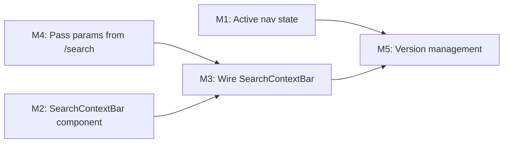

# Plan 109 — Providers Results Page UI Enhancements

| Field          | Value                                                                                      |
| -------------- | ------------------------------------------------------------------------------------------ |
| Plan ID        | 109                                                                                        |
| Target Release | next available patch after current origin/main version (v0.10.34); confirm at DevOps Stage 1 |
| Epic Alignment | Discovery UX Polish (supports Epic 2.2 City Discovery & Epic 2.1 Provider Trust)           |
| Related Issues | None                                                                                       |
| Classification | Feature                                                                                    |
| Pipeline       | Full                                                                                       |
| GitHub Issue   | https://github.com/abu-lina/uflow/issues/175                                              |
| Created        | 2026-04-27T14:00Z                                                                          |

## Changelog

| Date               | Agent   | Change                                      |
| ------------------ | ------- | ------------------------------------------- |
| 2026-04-27T14:00Z  | planner | Initial plan draft                          |
| 2026-04-27T14:35Z  | planner | Revision per critique F1–F4: clarified M1 CityEarlyAccessNavbar non-action, separated location (functional) from wer (display-only) in D2/M4, added category-label fallback AC, noted i18n key |
| 2026-04-27T15:05Z  | implementer | Implementation started; TDD-first execution begins for M1-M4 |
| 2026-04-27T18:40Z  | code-review | Implementation approved; all findings addressed | Code quality APPROVED. Handed off to QA. |
| 2026-04-27T18:50Z  | qa | QA testing phase complete; all automated gates pass (type-check, lint, 1131 tests). Manual/build testing deferred to UAT. Status: QA Complete. |
| 2026-04-27T19:15Z  | uat | UAT value delivery assessment complete. Implementation delivers stated business value: search context visible, quick-edit affordance functional, orientation preserved. All 6 ACs tested and verified. Status: UAT Approved. APPROVED FOR RELEASE with 3 deferred follow-ups (mobile rendering DF-1, browser flow DF-2, production build DF-3). Handing off to DevOps Stage 1. |
| 2026-04-27T20:40Z  | devops | Stage 1 complete. Version bumped to v0.10.38 (v0.10.35/36/37 already tagged on origin). Rebased onto origin/main; 3 conflicts resolved (CHANGELOG bookkeeping, package.json version, ProvidersPageHeader destructuring). Post-rebase: type-check pass, 1140 tests pass. Committed locally. Status: Committed for Release v0.10.38. |

---

## Value Statement and Business Objective

**As a** user who has just searched for a food category or service on the /search page,
**I want** the /providers results page to clearly reflect my search context (what I searched, where, how many people) and provide a quick path back to refine my criteria,
**so that** I feel oriented, trust the results are relevant, and can efficiently adjust my search without losing context.

---

## Decision Record

| # | Decision | Status | Rationale |
|---|----------|--------|-----------|
| D1 | Both `CityEarlyAccessNavbar` and `MobileFooterBar` receive active-state updates for `/providers` | [RESOLVED] | Both navbars render conditionally based on stage/auth. Both must mark the Explore/Search item active on `/providers` so the UX is consistent regardless of which navbar shows. |
| D2 | `/search` page passes `location` and `wer` (audience summary) as URL params to `/providers` | [RESOLVED] | `location` is a **functional** param — the /providers server component and API already read and filter by it (existing behavior). `wer` is **display-only** — a UI transport value shown in the context bar; the API route and service layer ignore it. URL params are the canonical source of truth on /providers (existing pattern). |
| D3 | New `SearchContextBar` component replaces `FigmaSearchBar` inside `ProvidersPageHeader` | [RESOLVED] | The existing FigmaSearchBar is an interactive search input with expand/collapse. The results page needs a read-only summary bar with a back-navigation affordance. A separate component is cleaner than overloading FigmaSearchBar with conditional logic. |
| D4 | `SectionSelector` tab row is hidden on /providers by removing the `onSectionChange` prop pass-through | [RESOLVED] | The SectionSelector already conditionally renders: `{onSectionChange && <SectionSelector .../>}`. Not passing the prop is the simplest, zero-risk approach. |
| D5 | Section icon in the search context bar uses the same icon mapping as `SectionSelector` (`SECTION_ICONS`) | [RESOLVED] | Reusing existing icon mapping ensures visual consistency. Extract the mapping to a shared constant if not already importable. |
| D6 | Filter icon in search context bar navigates back to `/search?section={currentSection}` | [RESOLVED] | Preserves section context so the user lands on the correct tab. Other search criteria (was, wo, wer, filters) are not round-tripped back — the user refines from section context. |
| D7 | `wer` URL param is display-only on /providers — not used for backend filtering | [RESOLVED] | The Wer audience filter is a future backend feature. For now, the param is a UI transport value shown in the context bar. The API route and service layer are unchanged. |

---

## Release Strategy

Standalone (no other known active plans for this version).

---

## Assumptions

1. The `/providers` page is mobile-first; all 4 changes are mobile-scoped (`sm:hidden` header, bottom nav). Desktop layout is out of scope.
2. The Wer audience summary is a display-only value — no backend query filtering by audience in this plan.
3. The `ExploreIcon` in both navbars visually represents "Search/Explore" — no icon change needed, only active-state logic.
4. The `SECTION_ICONS` mapping in `SectionSelector.tsx` can be extracted or re-imported for the new `SearchContextBar`.
5. i18n keys for "Everywhere" and section labels already exist.

---

## Milestones

### Milestone 1: Active Nav State on /providers

**Objective**: When the user is on `/providers`, the Explore/Search nav item in the bottom navbar should show its active visual state.

**Scope**:
- **`CityEarlyAccessNavbar`** (`src/components/shared/CityEarlyAccessNavbar.tsx`): The `isHomeActive` logic already includes `(pathname === '/providers' && !isAppLaunched)`. In Stage 3 (`isAppLaunched=true`), `CityEarlyAccessNavbar` is not rendered at all (`shouldShowCityEarlyAccessNavbar` returns `false`), so the `!isAppLaunched` guard is irrelevant for that path. **No code change needed for `CityEarlyAccessNavbar`.**
- **`MobileFooterBar`** (`src/components/common/MobileFooterBar.tsx`): This is the **primary M1 deliverable**. The active-state computation for the Home item currently uses `pathname === item.href` (i.e., `pathname === '/'`). This does NOT match `/providers`. Add `/providers` to the Home item's active-state condition (exact match: `pathname === '/providers'`) so the ExploreIcon shows as active on the results page. Detail pages (`/providers/:id`) are excluded by virtue of exact-match comparison.

**Acceptance Criteria**:
- AC1.1: On `/providers` (any query params), the Explore/Search icon in the bottom navbar is visually active (filled teal icon + bottom border for CityEarlyAccessNavbar, or filled icon for MobileFooterBar).
- AC1.2: On `/providers/:id` (detail page), the nav item is NOT active (existing excluded-page logic preserved).
- AC1.3: No regression to Home active state on `/` or other existing active-state rules.

**Files likely affected**:
- `src/components/common/MobileFooterBar.tsx` — active-state condition for Home item
- `src/components/shared/CityEarlyAccessNavbar.tsx` — verify/adjust `isHomeActive` logic

---

### Milestone 2: Search Context Bar Component

**Objective**: Create a new `SearchContextBar` component that displays the search context from the originating /search page as a read-only summary.

**Layout**: `[Section Icon] [Search term · Location · N people] [Filter/Back icon]`

**Behavior**:
- Section icon: Matches the current section (food → hamburger, ummah → home, business → store).
- Search term: Displays the `q` or category name from URL params. If no search term, shows a localized "All" or section-appropriate default label.
- Location: Displays the `location` URL param value, or localized "Everywhere" if absent/empty.
- Number of people: Displays the `wer` URL param summary (e.g., "2 Männer, 1 Kind"), or omitted entirely if absent.
- Filter/Back icon: A tappable icon (e.g., `SlidersHorizontal` from lucide) that navigates to `/search?section={currentSection}` so the user can edit search criteria.
- The entire bar (except the filter icon) is non-interactive — no expand/collapse, no inline editing.

**Acceptance Criteria**:
- AC2.1: `SearchContextBar` renders the section icon matching the active section.
- AC2.2: Search term, location, and people count are displayed from URL params.
- AC2.3: Missing optional params (location, wer) are gracefully handled (location defaults to "Everywhere", wer is hidden if absent).
- AC2.4: Filter icon navigates to `/search?section={section}`.
- AC2.5: Component is accessible — proper ARIA labels on the back-navigation button.
- AC2.6: When the URL contains a `category` UUID but no `q` param, the search term area displays the localized section default label (e.g., "Food", "Ummah", "Stores" via existing `sections.*` i18n keys).

**i18n note**: A new i18n key may be needed for a generic "no search term" fallback (e.g., `search.context.allResults`). Implementer should check whether the section label alone suffices or a dedicated key improves clarity.

**Files likely affected**:
- New: `src/features/search/components/SearchContextBar.tsx`
- Shared icon constant extracted from or co-located with `SectionSelector.tsx` (e.g., `src/features/search/constants/sectionIcons.tsx`)

---

### Milestone 3: Wire Search Context Bar into ProvidersPageHeader

**Objective**: Replace the `FigmaSearchBar` in `ProvidersPageHeader` with the new `SearchContextBar`, and hide the `SectionSelector` tab row.

**Scope**:
- `ProvidersPageHeader` currently renders `<FigmaSearchBar>` and conditionally `<SectionSelector>`.
- Replace `<FigmaSearchBar>` with `<SearchContextBar>` (passing section, query/category label, location, wer from URL params).
- Stop passing `onSectionChange` prop to suppress the `SectionSelector` tab row (D4).
- The `ProvidersPageHeader` interface will change: remove search-submission callbacks, add search-context props.

**Acceptance Criteria**:
- AC3.1: `/providers` page header shows `SearchContextBar` instead of `FigmaSearchBar`.
- AC3.2: `SectionSelector` tab row is not rendered below the search bar on `/providers`.
- AC3.3: The frosted-glass header styling is preserved.
- AC3.4: Safe-area padding and fixed positioning remain correct.

**Files likely affected**:
- `src/components/providers/ProvidersPageHeader.tsx` — swap components, update props interface
- `src/app/(public)/providers/ProvidersContent.tsx` — update props passed to `ProvidersPageHeader`

---

### Milestone 4: Pass Search Context Params from /search to /providers

**Objective**: Ensure the /search page passes `location` and `wer` params in the URL when navigating to /providers.

**Scope**:
- In `/search` page's `handleSearch()` function, add:
  - `location` param from `selectedWoCity` (if selected). **This is a functional param** — the `/providers` server component and API already read `location` and filter results by city. Passing it from `/search` activates city-scoped results on the providers page.
  - `wer` param from `werSelection.summary` (if user has interacted and has a selection). **This is display-only** — the API route and service layer ignore unknown params. It is read exclusively by `SearchContextBar` on the client.
- No backend or API route changes are needed. `location` is already supported end-to-end; `wer` is a new client-only param.

**Acceptance Criteria**:
- AC4.1: Navigating from /search with a city selected passes `&location=Berlin` (example) in the URL.
- AC4.2: Navigating from /search with a Wer selection passes `&wer=2%20M%C3%A4nner%2C%201%20Kind` (URL-encoded summary) in the URL.
- AC4.3: Navigating from /search with no city or wer selection omits those params (backward-compatible).
- AC4.4: Existing params (`section`, `category`/`q`, `filters`) are unchanged.

**Files likely affected**:
- `src/app/(public)/search/page.tsx` — `handleSearch()` function

---

### Milestone 5: Version Management

**Objective**: Update version artifacts to match the target release.

**Tasks**:
- Update `package.json` version
- Add CHANGELOG.md entry documenting the 4 UI changes
- Commit message references Plan 109

**Acceptance Criteria**:
- AC5.1: `package.json` version matches the target release.
- AC5.2: CHANGELOG.md entry documents: active nav state, search context bar, section icon, hidden tab row.
- AC5.3: Version is consistent across all version artifacts.

---

## Milestone Dependencies

**Sequencing rule**: M1 (nav active state) is independent and can proceed in parallel with M2+M4. M3 depends on both M2 (component exists) and M4 (params are available). M5 is the final gate.

---

## Testing Strategy

- **Unit tests**: SearchContextBar rendering (section icon, text display, missing params, filter button navigation). Nav active-state logic tests for both navbars on `/providers`.
- **Integration**: Verify ProvidersPageHeader renders SearchContextBar (not FigmaSearchBar) and hides SectionSelector.
- **Regression**: Existing FigmaSearchBar tests unaffected (component still used on other pages). Existing nav active-state tests for `/`, `/create`, `/saved`, `/profile` pass without changes.

_No specific test cases defined — QA agent's responsibility._

---

## No-Regression Notes

| Area | Risk | Mitigation |
|------|------|------------|
| FigmaSearchBar on other pages | SearchContextBar replaces it only in ProvidersPageHeader; FigmaSearchBar remains used elsewhere | FigmaSearchBar component is untouched; only the import in ProvidersPageHeader changes |
| SectionSelector on /search page | Hiding it on /providers must not affect /search | The conditional render is per-page via prop threading; /search page is unaffected |
| Nav active state for Home `/` | Adding `/providers` to active condition could break Home-only active state | Use additive condition: `pathname === '/' \|\| pathname === '/providers'`; detail pages (`/providers/:id`) remain excluded |
| Location param on /providers | Adding `location` param to URL could affect SSR query if not careful | The server component already reads `location` from searchParams — this is additive and consistent |
| Wer param on /providers | New URL param must not break existing routing or API | `wer` is read only by SearchContextBar (client component); server component and API route ignore unknown params |

---

## Risks

| # | Risk | Likelihood | Impact | Mitigation |
|---|------|------------|--------|------------|
| R1 | Category UUID in URL doesn't resolve to a human-readable label for display | Medium | Low | SearchContextBar can show the raw `q` param or fall back to section default label. Category name resolution is a nice-to-have, not blocking. |
| R2 | `wer` summary contains special characters that don't URL-encode cleanly | Low | Low | Standard `encodeURIComponent` / `URLSearchParams` handles this. |
| R3 | ProvidersPageHeader prop interface change breaks other consumers | Low | Medium | Verify ProvidersPageHeader is only used in ProvidersContent.tsx (single consumer). |

---

## Duration Estimates

| Phase          | Estimate  | Uncertainty Driver |
| -------------- | --------- | ------------------ |
| Analysis       | N/A       | Context gathered during planning |
| Planning       | 1h        | — |
| Implementation | 2–4h      | M2 (new component) is the main effort; M1/M3/M4 are small targeted edits |
| QA             | 1–2h      | Unit + integration test coverage |
| UAT            | 30min     | Visual verification on mobile viewport |
| DevOps         | 30min     | Standard patch release |

---

## Open Questions

_None — all questions resolved in Decision Record._
