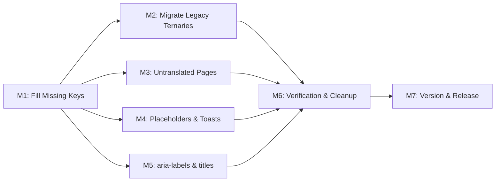

# Plan 111 — Comprehensive i18n Coverage Remediation

| Field          | Value |
|----------------|-------|
| Plan ID        | 111 |
| Target Release | Next available patch after current origin/main v0.10.40; confirm at DevOps Stage 1 |
| Epic Alignment | Multilingual UX Parity |
| Related Issues | Analysis 111-i18n-coverage-analysis.md; Plan 061 row 27 (admin i18n — absorbed); Plan 107 DF-2 (translation quality — NOT in scope) |
| Classification | Bugfix |
| Pipeline       | Full |
| GitHub Issue   | https://github.com/abu-lina/uflow/issues/183 |
| Created        | 2026-04-28T15:30Z |

## Changelog

| Date | Author | Summary |
|------|--------|---------|
| 2026-04-28T15:30Z | Planner | Initial plan created from Analysis 111 |
| 2026-04-28T10:24Z | Planner | Revised per Critique 111: C-1 M3/M4 ownership boundary, C-2 SC-3 wording, C-3 key-diff script definition, C-4 F8 verification gate, C-5 analysis cross-references |
| 2026-04-28T10:24Z | Implementer | Implementation started; Plan status set to In Progress; executing M1 |
| 2026-04-28T13:05Z | Code Reviewer | Code review re-pass completed; status set to Code Review Approved |
| 2026-04-28T14:00Z | UAT | UAT complete; all gates pass, value delivered; status set to UAT Approved |

## Value Statement and Business Objective

As a **multilingual UmmahFlow user** (Arabic, Turkish, Urdu, Pashto), I want **all UI text rendered in my chosen language**, so that **I can use the platform confidently without encountering raw translation keys, German-only strings, or English-only pages**.

**Business context**: UmmahFlow supports 6 locales (de, en, ar, tr, ur, ps). Analysis 111 found ~245 i18n violations causing broken text for non-DE/EN users on key pages including `/search`, `/providers`, `/forgot-password`, `/reset-password`, and `/create-quick`. This directly undermines the platform's mission to serve its multilingual Muslim community.

## Release Strategy

Release Strategy: Standalone (no other known plans targeting the next patch version after v0.10.40).

## Decision Record

| # | Decision | Status |
|---|----------|--------|
| D1 | EN translation (`en.ts`) is the canonical reference — all other locales must have key parity | [RESOLVED] Established by existing codebase convention; 725 keys in en.ts |
| D2 | `aria-label` i18n is in scope, not deferred | [RESOLVED] Accessibility is non-negotiable for a community platform; low marginal effort |
| D3 | Admin-only strings (e.g., "Admin Filter:", admin toasts) are in scope | [RESOLVED] Admin users may be non-English speakers; few strings, low effort |
| D4 | `create-quick` pages (Google/Instagram import) are in scope for full i18n | [RESOLVED] User-facing import flow; should work in all supported languages |
| D5 | Legacy `@/hooks/useLanguage` hook (en/de only) must be replaced with `@/providers/LanguageProvider` in all 3 remaining files | [RESOLVED] Legacy hook only supports 2 of 6 languages — blocks 4-language parity |
| D6 | Translation quality for non-DE/EN locales is NOT in scope | [RESOLVED] Covered by Plan 107 DF-2 (deferred to EOQ 2026). This plan only adds missing keys and wraps hardcoded strings |
| D7 | CI lint rule for future hardcoded string detection is deferred | [DEFERRED: Planner — follow-up plan after this ships — prevents scope creep; low user impact vs. shipping fixes now] |

## Assumptions

1. All 82 missing locale keys (F1) can be filled with existing DE/EN translations as reference for translator review — machine or human translation is acceptable for initial delivery.
2. The `t()` function in `LanguageProvider` handles missing keys gracefully (returns key string) — no risk of runtime exceptions from adding new `t()` calls.
3. Existing tests using `t()` mocking patterns will continue to work when new keys are added.
4. Of the ~15 keys referenced in code but missing from ALL locales (F8): 6 have confirmed inline `||` fallbacks (traced by Planner during analysis). The remaining ~9 (marked "Unknown" in Analysis F8, including `create.basics.descriptionLabel`, `create.location.validationError`, etc.) must be verified by the Implementer at the start of M1 — check each callsite for an inline `||` or `??` fallback before adding keys. If any key has no fallback, it must be treated as a visible raw-key bug and prioritized accordingly.

## Success Criteria

- **SC-1**: Zero raw translation key strings visible on any page for all 6 locales (verified by key-diff script returning 0 missing keys per locale).
- **SC-2**: Zero `language === 'de'` ternary patterns in production code (verified by grep).
- **SC-3**: Zero hardcoded user-visible text in `aria-label`, `placeholder`, `title`, visible JSX, or toast messages across all `src/` files listed in plan milestones (M6 grep verification is the authoritative gate for the full codebase).
- **SC-4**: All 6 locale files have identical key structures (verified by automated key-diff script).
- **SC-5**: No test regressions — all existing tests pass.

---

## Milestones

### M1 — Fill Missing Locale Keys (F1 + F8)

**Objective**: Add all missing translation keys to ar.ts, tr.ts, ur.ts, ps.ts so every locale has full key parity with en.ts. Also add ~15 missing keys to ALL locale files (including en.ts and de.ts) for keys referenced in code but absent everywhere.

**Scope**:
- 82 missing keys across ar/tr/ur/ps (enumerated in Analysis F1)
- ~15 keys missing from all locales (enumerated in Analysis F8) — verify each F8 callsite for inline fallbacks before adding keys (see Assumption #4; ~9 callsites are unconfirmed)
- Verify with automated key-diff script after changes (script defined in M6)

**Acceptance Criteria**:
- Key-diff script reports 0 missing keys for every locale
- All locale files export valid TypeScript (no syntax errors)
- `npm run type-check` passes

**Files touched**: `src/translations/{en,de,ar,tr,ur,ps}.ts`

**Estimated effort**: Small — mechanical key addition

---

### M2 — Migrate Legacy Ternary Pages (F2)

**Objective**: Replace all `language === 'de' ? 'German' : 'English'` ternaries in `forgot-password` and `reset-password` with `t()` calls. Switch from legacy `@/hooks/useLanguage` to `@/providers/LanguageProvider`.

**Scope**:
- `src/app/(public)/forgot-password/ForgotPasswordPageContent.tsx` (~30 ternaries → ~30 `t()` calls)
- `src/app/(public)/reset-password/ResetPasswordPageContent.tsx` (~20 ternaries → ~20 `t()` calls)
- Add corresponding new keys to all 6 locale files (namespace: `forgotPassword.*`, `resetPassword.*` or similar)
- Also migrate `src/hooks/useBookmarkWithAuth.ts` (the 3rd file importing the legacy hook)

**Acceptance Criteria**:
- Zero `language === 'de'` ternaries in these files
- Zero imports from `@/hooks/useLanguage` in production code
- All 6 locales render correct text on forgot-password and reset-password pages
- Existing tests pass (update mocks if needed)

**Files touched**:
- `src/app/(public)/forgot-password/ForgotPasswordPageContent.tsx`
- `src/app/(public)/reset-password/ResetPasswordPageContent.tsx`
- `src/hooks/useBookmarkWithAuth.ts`
- `src/translations/{en,de,ar,tr,ur,ps}.ts`

**Estimated effort**: Medium — requires extracting ~50 string literals into new keys across 6 locales

---

### M3 — i18n for Untranslated Pages (F3 + F7)

**Objective**: Add full i18n coverage to pages that currently have zero or near-zero translation usage.

**Scope**:
- `src/app/(public)/create-quick/page.tsx` — wrap all labels in `t()`
- `src/app/(public)/create-quick/review/page.tsx` — wrap ~25+ labels, placeholders, toasts in `t()`
- `src/app/(public)/signup/check-email/page.tsx` — wrap hardcoded German title
- `src/app/(public)/signup/SignupPageContent.tsx` — wrap hardcoded German titles + placeholders
- `src/app/(public)/create/social-category/page.tsx` — wrap hardcoded German title
- Add corresponding new keys to all 6 locale files

> **Milestone ownership**: M3 owns the **complete** i18n remediation of all files listed above — including their placeholders and toasts. M4 does **not** revisit these files. This resolves any ambiguity at milestone boundaries.

**Acceptance Criteria**:
- Zero hardcoded user-visible text in listed files
- All pages render correctly in all 6 locales
- Tests pass

**Files touched**:
- Listed page files
- `src/translations/{en,de,ar,tr,ur,ps}.ts`

**Estimated effort**: Medium — create-quick/review alone has ~25 strings

---

### M4 — Hardcoded Placeholders and Toast Messages (F5 + F6)

**Objective**: Wrap all hardcoded `placeholder` strings and `toast.error`/`toast.success` messages in `t()` calls.

**Scope**:
- ~36 hardcoded placeholders across provider forms, dashboard edit pages, admin components, and search bar (files fully remediated in M3 are excluded — see exclusions note below)
- ~35 hardcoded toast messages across providers, saved, login, city-selection, and all dashboard edit pages (files fully remediated in M3 are excluded)
- Add corresponding keys to all 6 locale files

> **Exclusions**: `SignupPageContent.tsx`, `create-quick/page.tsx`, and `create-quick/review/page.tsx` are fully remediated in M3. Do not re-visit these files in M4.
> **Reference**: See Analysis 111 findings F5 (placeholders) and F6 (toasts) for the exhaustive file and line inventory.

**Acceptance Criteria**:
- Zero hardcoded `placeholder="<visible text>"` in files within scope (excluding URL-format examples like `https://...`)
- Zero hardcoded `toast.error('English text')` or `toast.success('German text')` patterns
- All pages render correct locale text
- Tests pass

**Files touched** (non-exhaustive):
- `src/app/(public)/signup/SignupPageContent.tsx`
- `src/features/auth/components/SignupModal.tsx`
- `src/features/providers/ProviderCreateForm.tsx`
- `src/app/(dashboard)/dashboard/providers/[id]/edit/*.tsx`
- `src/app/(dashboard)/dashboard/community-services/[id]/edit/*.tsx`
- `src/app/(public)/providers/ProvidersContent.tsx`
- `src/app/(public)/saved/page.tsx`
- `src/app/(public)/login/LoginPageContent.tsx`
- `src/app/city-selection/page.tsx`
- `src/features/admin/components/RejectModal.tsx`
- `src/features/search/components/SearchBar.tsx`
- `src/components/providers/ProviderCreationForm.tsx`
- `src/translations/{en,de,ar,tr,ur,ps}.ts`

**Estimated effort**: Medium-Large — many files but each change is mechanical

---

### M5 — Hardcoded `aria-label` and `title` Strings (F4)

**Objective**: Wrap all hardcoded `aria-label` and `title` attributes in `t()` calls.

**Scope**:
- ~50 hardcoded `aria-label` values across layout, provider, search, community-service, UI, and shared components
- Hardcoded `title` attributes (e.g., "Adresse antippen zum Navigieren", "Barakah")
- Add corresponding keys to all 6 locale files (namespace: `aria.*` or embedded in existing component namespaces)

**Acceptance Criteria**:
- Zero hardcoded German or English `aria-label` strings in files within scope
- Zero hardcoded `title` attributes with translatable text
- Accessibility not degraded (all aria-labels still present and meaningful)
- Tests pass

**Files touched** (non-exhaustive):
- `src/components/layout/{PageHeader,MobileHeader,ScrollablePageHeader,Header}.tsx`
- `src/components/providers/{ProviderCardModal,ProviderDetailModal,ProviderDetailPage,ProviderCard,ProviderCreationForm,TagsMultiSelect,ProfileProviderDetailPage}.tsx`
- `src/components/ui/{PWAInstallPrompt,PushNotificationPrompt,LoadingSpinner,PageSliderIndicator}.tsx`
- `src/components/shared/{ExploreSection,CityEarlyAccessNavbar,UserNavigationTabs,MobileGreetingHeader}.tsx`
- `src/components/common/{MobileProfileScreen,ProfileActionBar}.tsx`
- `src/components/community-services/CommunityServiceDetailModal.tsx`
- `src/features/admin/components/AdminStatusFilter.tsx`
- `src/features/search/components/SectionSelector.tsx`
- `src/app/(public)/search/page.tsx`
- `src/app/(public)/create/basics/{offers,category,needs}/page.tsx`
- `src/app/(public)/create/media/{images,social}/page.tsx`
- `src/app/(public)/{privacy-policy,terms,impressum}/*Content.tsx`
- `src/translations/{en,de,ar,tr,ur,ps}.ts`

> **Reference**: See Analysis 111 finding F4 (aria-labels) for the exhaustive file and line inventory with exact line numbers.

**Estimated effort**: Medium — many files but each is a single-line `aria-label` replacement

---

### M6 — Verification and Cleanup

**Objective**: Run automated checks to confirm zero i18n gaps remain, and clean up the legacy `useLanguage` hook if no longer imported.

**Scope**:
- Run key-diff script and confirm all 6 locales have identical key structures. **Key-diff script**: the Implementer must create `scripts/check-i18n.mjs` — a short Node.js script that imports all 6 locale files and reports any key present in `en.ts` but absent from another locale. The analysis phase used a temporary equivalent (`check-i18n.mjs`); this plan makes it a permanent committed artifact. Commit it alongside the locale file changes from M1.
- Run `grep -rn 'language === ' src/ --include="*.tsx" | grep -v test` and confirm zero results (except data-field language switches like `name_en`/`name_de` which are not i18n violations)
- Run `grep -rn 'aria-label="[^{]' src/ --include="*.tsx" | grep -v test` and confirm all remaining hits are either intentionally untranslated (e.g., semantic HTML landmarks like `role="search"`) or out of scope
- Evaluate whether `src/hooks/useLanguage.ts` can be deleted (if all 3 imports were migrated in M2)
- `npm run type-check` passes
- `npm test` passes

**Acceptance Criteria**:
- All SC-1 through SC-5 verified
- Legacy hook deleted or documented as deprecated
- No test regressions

**Estimated effort**: Small — verification only

---

### M7 — Update Version and Release Artifacts

**Objective**: Bump version and update release artifacts.

**Tasks**:
1. Update `package.json` version to next available patch
2. Add CHANGELOG.md entry documenting Plan 111 deliverables
3. Commit with message referencing Plan 111

**Acceptance Criteria**:
- Version artifacts updated
- CHANGELOG reflects all i18n coverage changes
- Version matches confirmed release target

---

## Milestone Dependencies

**Sequencing rule**: M1 must complete first (it establishes the key foundation). M2–M5 can proceed in parallel after M1 since they touch different files. M6 is a gate that runs after all content milestones. M7 is final.

## Testing Strategy

- **Unit tests**: Verify that components using new `t()` keys render without errors in all 6 locales (spot-check, not exhaustive per-key tests). QA agent defines specific test cases.
- **Key-diff regression test**: Automated script confirming all locale files have identical key structure — can be added as a test or CI step.
- **Grep-based verification**: Automated grep checks for remaining hardcoded strings (SC-1 through SC-4).
- **Manual verification**: QA agent defines locale-switching smoke tests for high-impact pages (/search, /providers, /forgot-password, /reset-password, /create-quick).

## Duration Estimates

| Phase | Estimate | Uncertainty |
|-------|----------|-------------|
| Analysis | Complete | — |
| Planning | Complete | — |
| Implementation (M1–M5) | 1–2 days | Low — work is mechanical (add keys, wrap strings); volume is the main variable |
| QA | 0.5 day | Low — automated key-diff + grep checks cover most verification |
| UAT | 0.5 day | Medium — manual locale-switching smoke tests across many pages |
| DevOps | < 1 hour | Low — standard patch release |

**Key uncertainty**: The total number of new translation keys to add across all 6 locale files. Estimate ~100–150 new keys per locale file.

## Risks

| Risk | Likelihood | Impact | Mitigation |
|------|-----------|--------|------------|
| New `t()` keys are syntactically invalid TypeScript in locale files | Low | Build break | `npm run type-check` gate after each milestone |
| Existing tests break due to new `t()` calls not being mocked | Medium | Test failures | Update test mocks to include new keys; pattern already established in codebase |
| Non-DE/EN translations are low quality | Medium | Poor UX | Out of scope (Plan 107 DF-2). Initial delivery uses machine-translated or placeholder text; quality pass is a separate effort |
| Missed hardcoded strings not caught by analysis | Low | Incomplete fix | M6 verification step with comprehensive grep; plus QA smoke tests |

## Validation

- Implementer runs `npm run type-check` and `npm test` after each milestone
- M6 runs comprehensive grep-based checks against all SC criteria
- QA agent defines locale-switching smoke tests for final verification

## Rollback

Standard git revert. All changes are additive (new keys + wrapping existing strings in `t()`). No database migrations, no API changes, no breaking changes.

---

## Handoff Notes

- **For Implementer**: Start with M1 (key additions to locale files) since all other milestones depend on it. M2–M5 can be parallelized or done in sequence — each touches different file sets. Use the Analysis F1–F8 tables as your checklist.
- **For QA**: Key verification can be automated with the key-diff script pattern from analysis. Manual locale-switching tests needed for forgot-password, reset-password, and create-quick pages (newly translated).
- **Absorbs Plan 061 row 27**: The admin edit page hardcoded English strings are covered by M4 (dashboard toasts/placeholders) and M5 (aria-labels).
