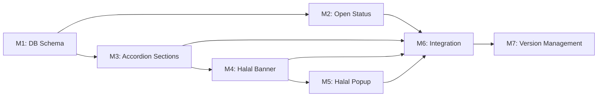

# Plan 113 — Provider Details Page: Full UI Enhancement (9 Features)

| Field          | Value                                                                  |
| -------------- | ---------------------------------------------------------------------- |
| Plan ID        | 113                                                                    |
| Target Release | v0.11.0 (minor bump — new schema + 9 user-facing features); confirm at DevOps Stage 1 |
| Epic Alignment | Provider Detail Experience — Figma-driven UI parity                    |
| Related Issues | None                                                                   |
| Classification | Feature                                                                |
| Pipeline       | Full                                                                   |
| GitHub Issue   | https://github.com/abu-lina/uflow/issues/187                           |
| Created        | 2026-04-28T14:00Z                                                      |
| Execution Status | Code Review Approved → Ready for DevOps Stage 1                          |

## Changelog

| Date              | Author  | Summary                                      |
| ----------------- | ------- | -------------------------------------------- |
| 2026-04-28T14:00Z | Planner | Initial plan creation (9-feature enhancement)|
| 2026-04-28T14:30Z | Planner | Revised per critique: F1 (In der Nähe → placeholder V1), F2 (semver → v0.11.0), F3 (Mehr erfahren → /halal), F4 (popup global scope clarified), F5 (JSONB defensive parsing) |
| 2026-04-28T21:52Z | Implementer | Execution started; TDD RED→GREEN for opening status utility and provider detail enhancement UI tests |
| 2026-04-28T23:15Z | UAT | UAT Complete — All 6 success criteria met, all 7 critical workflows validated, APPROVED FOR RELEASE (target: v0.11.0) |
| 2026-04-28T23:25Z | QA | QA Complete — Final validation confirms all gates passed: 1161 tests (0 failures), lint clean, type-check pass, UAT approved. Ready for DevOps Stage 1 |
| 2026-04-29T00:10Z | Code Reviewer | Code review approved for latest provider-details delta; aligned popup policy docs to first-10-opens behavior |

---

## Value Statement and Business Objective

**As a** user browsing provider/restaurant detail pages on UFlow,
**I want to** see comprehensive, well-structured information (open status, menu items, opening hours, trust signals, nearby options, values/amenities, feedback, certifications) with clear visual hierarchy and collapsible sections,
**so that** I can make informed decisions about engaging with a provider — increasing trust, reducing bounce rate, and aligning the product experience with the Figma design specification.

---

## Decision Record

| # | Decision | Status |
|---|----------|--------|
| D1 | Both mobile (`ProviderDetailPage.tsx`) and desktop (`ProviderDetailModal.tsx`) paths receive all 9 features | [RESOLVED] — Figma design applies to the full-page detail view; desktop modal receives equivalent sections. Prevents parity gaps (Analysis 076 root cause). |
| D2 | Reuse existing `ExpandSection` component for all accordion sections (#2–#7) | [RESOLVED] — Component already exists at `src/components/ui/ExpandSection.tsx` with controlled/uncontrolled modes, matches design pattern. |
| D3 | Opening hours stored as JSONB column `opening_hours` on `providers` table | [RESOLVED] — Structured JSONB enables open/closed status derivation at render time. No external service needed (Postgres-first philosophy). |
| D4 | Halal popup visibility tracked via localStorage view counter | [RESOLVED] — Session/auth-independent; popup shows for first 10 provider-detail opens. Key: `uf_halal_popup_view_count`. |
| D5 | Open status computed client-side from `opening_hours` JSONB + user's local timezone | [RESOLVED] — Avoids server time drift; all providers serve local audiences. Utility function `getOpenStatus()` derives status. |
| D6 | Features scoped to ALL providers (claimed + unclaimed) since these are read-only display enhancements | [RESOLVED] — No ownership filter needed; no data mutation; purely additive UI rendering. |
| D7 | Halal Trust Banner and Popup content are static (German locale) matching Figma node 277:876 | [RESOLVED] — Content is branded/editorial; i18n follow-up can be deferred. Static text matches Figma spec exactly. |
| D8 | Accordion sections default to collapsed except "Werte & Amenities" which defaults open for immediate value | [RESOLVED] — Reduces scroll fatigue; user can expand on demand. Matches mobile UX patterns. |
| D9 | "In der Nähe" (Feature #7) is a static placeholder for V1 — shows same-city providers, no distance calculation | [RESOLVED] — PostGIS availability unconfirmed; bounding-box/Haversine adds scope risk. V1 filters by `address_city` match only. Distance-based proximity deferred to follow-up plan. |
| D10 | Semver is minor bump (v0.11.0) not patch | [RESOLVED] — 9 new features + DB schema change constitutes new user-facing functionality. Patch would misrepresent the release scope. |
| D11 | "Mehr erfahren" link targets `/halal` (static info page) | [RESOLVED] — If route does not exist yet, implementer creates a minimal static page or links to `#` with `TODO` comment for follow-up content page. |
| D12 | Halal popup policy is globally counted (single localStorage key, not per-provider) | [RESOLVED] — Popup is shown for the first 10 provider page opens across all providers. Single key `uf_halal_popup_view_count` controls all instances. |

---

## Release Strategy

Release Strategy: Standalone (no other known active plans for this version).

---

## Success Criteria

1. Open status displays correctly beneath provider title with real-time open/closed derivation from DB data
2. All 6 accordion sections (Werte & Amenities, Angebote, Öffnungszeiten, Feedback, Nachweise, In der Nähe) expand/collapse using `ExpandSection`
3. Halal Trust Banner renders as a static section at page bottom matching Figma node 277:876
4. Halal Popup displays on the first 10 provider detail opens and stops appearing afterwards (localStorage counter)
5. Both mobile and desktop detail paths render all 9 features consistently
6. No regressions in existing provider detail functionality (image gallery, bookmarks, actions, trust badges)

---

## Assumptions

1. The `opening_hours` JSONB structure follows a day-of-week keyed format: `{ "monday": { "open": "11:00", "close": "22:00" }, ... }` with optional `null` for closed days. The `getOpenStatus()` utility MUST handle malformed/unexpected JSONB gracefully via defensive parsing — on parse failure, fall back to hidden state (same as `null` opening hours).
2. Feedback section (#5) is a **placeholder accordion** (no ratings/reviews system exists yet) — renders a "coming soon" or empty state
3. Nachweise section (#6) renders existing trust badges in accordion format (re-wraps `TrustBadgesSection`)
4. "In der Nähe" section (#7) is a **V1 placeholder** — shows other approved providers in the same `address_city` (simple DB filter, no distance calculation). If provider has no `address_city`, section shows empty state. Distance-based proximity (PostGIS/Haversine) deferred to follow-up plan.
5. The Figma file `mH4p6c8GExOuLn65WdSPMb` nodes are reference-only — implementer adapts to project conventions (Tailwind tokens, existing component patterns)

---

## Milestones

### M1: Database Schema — Opening Hours Column

**Objective**: Add `opening_hours JSONB` column to `providers` table to support structured schedule data.

**Deliverables**:
- Migration file in `supabase/migrations/` adding `opening_hours JSONB DEFAULT NULL` to `providers`
- Extend `Provider` TypeScript interface with `opening_hours?: OpeningHours | null`
- Define `OpeningHours` type in `src/types/` (day-of-week keyed object with `open`/`close` strings or `null` for closed)
- Extend provider service select queries to include `opening_hours`

**Acceptance Criteria**:
- Migration applies cleanly
- Existing providers unaffected (column is nullable, default `NULL`)
- TypeScript compiles without errors after interface extension

---

### M2: Open Status Component (Feature #1)

**Objective**: Display real-time open/closed status beneath provider title based on `opening_hours` data.

**Deliverables**:
- Utility function `getOpenStatus(openingHours, timezone?)` returning `{ isOpen: boolean; label: string; nextChange: string }` 
- `OpenStatusBadge` component rendering: "Geschlossen" (#c24040) | dot separator | "Öffnet um 11 Uhr morgen" (#7a7a7a) per Figma node 277:804
- Integrated into both `ProviderDetailPage.tsx` and `ProviderDetailModal.tsx` beneath the provider title
- Graceful fallback: hidden when `opening_hours` is `null`

**Acceptance Criteria**:
- Correctly shows "Geöffnet" (green) when current time falls within schedule
- Correctly shows "Geschlossen" (red #c24040) with next opening time when outside schedule
- Hidden entirely when no opening hours data exists
- Works across timezone boundaries

---

### M3: Accordion Sections (Features #2–#7)

**Objective**: Add 6 collapsible accordion sections to the provider detail page using `ExpandSection`.

**Deliverables**:

| # | Section | Content Source | Default State |
|---|---------|---------------|---------------|
| 2 | Werte & Amenities | Provider boolean flags (muslim_owned, has_prayer_space, etc.) + badges | Open |
| 3 | Angebote (Menu) | `provider.offers` array | Collapsed |
| 4 | Öffnungszeiten | `provider.opening_hours` JSONB (Mon–Sun schedule) | Collapsed |
| 5 | Feedback | Placeholder — "Noch keine Bewertungen" | Collapsed |
| 6 | Nachweise | Re-wraps TrustBadgesSection content in accordion | Collapsed |
| 7 | In der Nähe | Same-city providers (filter by `address_city` match) — V1 placeholder, no distance calc | Collapsed |

- All sections use `ExpandSection` component
- Rendered in both mobile (`ProviderDetailPage`) and desktop (`ProviderDetailModal`) paths
- Sections with no data render with appropriate empty state text (not hidden — user sees the section exists)
- Replace current hardcoded "Öffnungszeiten: Mo-Fr: Fajr bis Isha" static block with dynamic accordion

**Acceptance Criteria**:
- All 6 sections render in correct order
- Expand/collapse works with proper ARIA attributes (`aria-expanded`)
- Empty states display when data is missing
- Existing "offers" expand/collapse state (`expandedOffers`) migrated to ExpandSection pattern

---

### M4: Halal Trust Banner (Feature #8)

**Objective**: Static trust section at the bottom of the provider detail page matching Figma node 277:876.

**Deliverables**:
- `HalalTrustBanner` component in `src/features/providers/components/`
- Layout: teal circular Halal badge (128×128px) + headline "Restaurants auf Ummah Flow werden geprüft ob sie Halal sind" + body text + "Mehr erfahren" underlined link
- "Mehr erfahren" links to `/halal` (static info page). If route does not exist, create minimal placeholder page or use `href="/halal"` with TODO.
- Positioned below all accordion sections, above any footer/action bar
- Rendered identically on mobile and desktop paths

**Acceptance Criteria**:
- Visual match to Figma node 277:876
- Badge image renders at 128×128px in teal circular container
- "Mehr erfahren" link is accessible (keyboard navigable, has `href="/halal"`)
- Static content — no data dependency

---

### M5: Halal Popup (Feature #9)

**Objective**: Dismissible modal shown on first provider detail page visit with Halal trust messaging.

**Deliverables**:
- `HalalTrustPopup` component in `src/features/providers/components/`
- Content matches Feature #8 (Figma node 277:876) — badge + headline + body + link
- Dismiss behavior: close button or click outside
- Persistence: `localStorage.getItem('uf_halal_popup_view_count')` stores cumulative open count
- On eligible mount (`count < 10`): increment count and render popup
- Trigger: rendered in both mobile and desktop detail paths; shown on mount for first 10 opens

**Acceptance Criteria**:
- Popup appears for the first 10 provider detail page opens (any provider)
- After count reaches 10, popup no longer appears on any provider page (global localStorage key)
- Counter persists across page reload and navigation
- Accessible: focus trap, escape key dismisses, aria-modal="true"
- Content matches Halal Trust Banner (#8) visually

---

### M6: Integration, Polish & Regression

**Objective**: Final integration pass ensuring all 9 features work together without regressions.

**Deliverables**:
- Verify both `ProviderDetailPage.tsx` and `ProviderDetailModal.tsx` render all features
- Loading states for async data (nearby providers, opening hours)
- Responsive behavior (320px–1920px)
- Verify no interference with existing: image gallery, bookmarks, action bar, trust badges, community services section, admin buttons

**Acceptance Criteria**:
- All existing provider detail tests continue to pass
- No visual regressions on mobile or desktop
- Performance: detail page load time does not regress beyond 10% (bundle size monitored)

---

### M7: Version Management

**Objective**: Update release artifacts to match target version.

**Deliverables**:
- Update `package.json` version
- Add CHANGELOG.md entry documenting all 9 features
- Tag and release

**Acceptance Criteria**:
- Version artifacts consistent
- CHANGELOG reflects all shipped features

---

## Milestone Dependencies

**Sequencing rule**: M1 (schema) must complete first as M2 and M3 depend on the `opening_hours` field. M4 and M5 share content, so M4 (static banner) is built first and M5 (popup) reuses its internals. M6 is a final integration pass before M7 release.

---

## Baseline & Measurements

| Metric | Baseline Source | Success Threshold |
|--------|----------------|-------------------|
| Provider detail bundle size | Current `/providers/[provider_id]` route | ≤ +15 kB gzipped increase |
| Detail page LCP | Lighthouse local audit (pre-implementation) | No regression beyond 10% |
| Test count | Current test suite count (1086+) | Net positive (new tests added, none removed) |

**Measurement environment**: Local development (Lighthouse CLI) + CI bundle analysis.
**Deferral condition**: If bundle analysis tooling is unavailable, document deferred with owner = DevOps.

---

## Testing Strategy

- **Unit tests**: `getOpenStatus()` utility (all day/time combinations, timezone edge cases, null input); `HalalTrustBanner` render; `HalalTrustPopup` dismiss behavior + localStorage
- **Integration tests**: Accordion sections render with mock provider data; Open status shows/hides based on opening_hours presence
- **Component tests**: `ProviderDetailPage` and `ProviderDetailModal` render all 9 features with appropriate mock data
- **Regression**: Existing provider detail test suite must remain green

---

## Risks

| Risk | Likelihood | Impact | Mitigation |
|------|-----------|--------|------------|
| Opening hours data not populated for existing providers | High | Medium | Graceful fallback — features hidden when data is null; admin enrichment pipeline (Plan 065) can backfill |
| Bundle size increase from 6 new accordion sections | Medium | Low | ExpandSection already exists; new components are lightweight; lazy-load nearby providers query |
| Halal popup perceived as intrusive | Low | Medium | localStorage persistence ensures single show; easy to disable via feature flag if needed |
| Desktop modal height overflow with 6+ accordion sections | Medium | Medium | Sections are collapsed by default; scrollable content area already exists in modal |

---

## Duration Estimates

| Phase | Estimate | Uncertainty Driver |
|-------|----------|-------------------|
| Analysis | Complete (prior context sufficient) | — |
| Planning | 1 hour | — |
| Implementation | 3–5 days | Opening hours schema design; nearby providers query complexity; Figma pixel fidelity |
| QA | 1–2 days | 9 features across 2 render paths |
| UAT | 1 day | Visual verification against Figma |
| DevOps | 0.5 days | Standard migration + release |

**Key uncertainty**: Figma pixel fidelity and Halal badge asset availability (may need Figma export). Feature #7 (In der Nähe) risk reduced by scoping to city-match placeholder for V1.

---

## Figma Reference

| Node | Purpose | Used By |
|------|---------|---------|
| 277:782 | Full provider details card layout | All features — layout reference |
| 277:804 | Open status component (red "Geschlossen" + dot + gray time) | Feature #1 (M2) |
| 277:876 | Halal trust badge + headline + body (bottom section/popup) | Features #8 and #9 (M4, M5) |

File key: `mH4p6c8GExOuLn65WdSPMb`

---

## Out of Scope

- Ratings/reviews system (Feature #5 is placeholder only)
- Admin CRUD for opening hours (follow-up plan; enrichment pipeline handles backfill)
- i18n for Halal Trust content (German-only per Figma; i18n deferred)
- Distance-based proximity for "In der Nähe" (PostGIS/Haversine — deferred; V1 uses city-match only)
- Opening hours data population/import (separate enrichment concern)
- Opening hours DB-level CHECK constraint (deferred; `getOpenStatus()` handles malformed data defensively)
- `/halal` content page (minimal placeholder acceptable; full content page is a separate concern)
