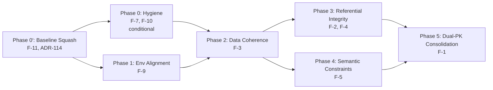

# Plan 114 — Database Schema Staged Refactor

| Field          | Value                                                                                  |
| -------------- | -------------------------------------------------------------------------------------- |
| Plan ID        | 114                                                                                    |
| Target Release | Next available patch after current origin/main v0.10.42; confirm at DevOps Stage 1. Each phase ships as its own patch release. |
| Epic Alignment | Technical Debt / Schema Integrity (no roadmap epic — infrastructure refactor)          |
| Related Issues | None                                                                                     |
| Classification | Refactor                                                                               |
| Pipeline       | Full                                                                                   |
| GitHub Issue   | https://github.com/abu-lina/uflow/issues/189                                          |
| Created        | 2026-04-29T21:00Z                                                                      |

## Changelog

| Date                | Agent   | Change                                              |
| ------------------- | ------- | --------------------------------------------------- |
| 2026-04-29T21:00Z   | planner | Plan created from Arch-114 (10 findings, 3 environments) |
| 2026-04-29T22:00Z   | critic  | APPROVED with 6 findings (0 CRITICAL, 2 HIGH, 3 MEDIUM, 1 LOW) |
| 2026-04-29T22:30Z   | planner | Revised per critique + user context (no active users, clean-slate priority). C-1: drop `barakah_effects` outright. C-2: add `ummah` to enum before CHECK constraints. C-3: add smoke test gate to Phase 5. C-4: remove interim bookmarks index. C-5: add `users.id` Supabase-internal check. Relaxed zero-downtime constraint. Compressed timeline. |
| 2026-04-29T23:20Z   | implementer | Phase 0 implementation started: schema hygiene migration drafted (redundant index drops, duplicate trigger removal, 2 composite indexes). |
| 2026-04-29T09:10Z   | architect | ADR-114 accepted (Migration Baseline Squash). F-11 HIGH finding: three environments have zero shared migration lineage. Prod has no migration tracking. Historical 81-file chain is a changelog, not a deployment mechanism. |
| 2026-04-29T09:20Z   | planner | **MAJOR REVISION**: Inserted Phase 0′ (Migration Baseline Squash) as mandatory prerequisite before all structural phases. Phase 0 (schema hygiene) absorbed into baseline or renumbered as first forward migration. Phase 1 (env alignment / F-9) partially absorbed into baseline creation. Added Decision Record 12–13. Updated dependency graph, duration estimates, and risks. Supersedes previous Phase 0 implementation approach. |
| 2026-04-29T10:00Z   | planner | Revised per Critique R2 findings: C-7 resolved (structural parity verification beyond counts), C-8 resolved (Phase 2 dependency updated to Phase 0′). Added explicit tooling context (MCP/CLI/VSC) across all phases. |
| 2026-04-29T12:30Z   | implementer | Phase 0′ execution started: linked CLI to prod, generated `001_baseline.sql` and scoped `002_seed.sql` from prod dump, archived historical chain, and added `003_phase0_schema_hygiene.sql` after confirming Phase 0 cleanup is not absorbed in baseline. |
| 2026-04-29T13:10Z   | code-reviewer | Code Review Approved: remediation verified (archive-aware script fallback, replication-role reset in seed, stale-path sweep closure in high-risk surfaces). |
| 2026-04-29T10:55Z   | qa | QA Testing Complete: all quality gates passed (lint, type-check, build, vitest). 1148 tests passed, 18 skipped. Migration files validated; archive-aware path resolution confirmed; replication role scoping verified. Approved for UAT. |
| 2026-04-29T11:00Z   | uat | UAT Approved: Phase 0-prime objective fully achieved. Deterministic baseline established; structural parity verified; archival complete; all deliverables on-target. **APPROVED FOR RELEASE** as v0.10.43. Ready for DevOps deployment. |
| 2026-04-30T00:15Z   | qa | Phase 3 QA Complete: All 8 validation gates PASSED. 1185 tests passing (0 failures, 18 skipped). Migration contract verified (4/4). Service-layer refactoring validated (5/5). Regression coverage confirmed (3/3). No stale column references. Type-check: 0 errors. Lint: 0 errors. Build: PWA generation complete (DF-4 exception). **APPROVED FOR UAT**. |
| 2026-04-30T00:30Z   | uat | Phase 3 UAT Complete: Value delivery verified. All acceptance criteria met (F-2 junctions + F-4 typed FKs with integrity enforcement). Zero scope drift. Risk profile acceptable. **APPROVED FOR RELEASE** as next patch after v0.10.42 (confirm version at DevOps Stage 1). Handoff to devops agent. |
| 2026-04-30T00:55Z   | devops | Phase 3 Stage 1: Local commit 64c3ceba (37 files, v0.11.5). Stage 2: pushed branch, tagged v0.11.5, published GitHub release. **RELEASED as v0.11.5**. PR: https://github.com/abu-lina/uflow/compare/main...session/114p3-referential-integrity |
| 2026-04-29T23:07Z   | implementer | **Phase 4 Implementation Complete**: Migration 006 with enum extension (ummah), backfill, normalization, violation audit, NOT NULL + CHECK constraints. Type unions updated. Behavioral + contract tests added. Version bumped to 0.11.6 (adjusted from 0.11.5 — version collision with Phase 3). |
| 2026-04-29T23:30Z   | code-reviewer | **Phase 4 Code Review**: APPROVED_WITH_COMMENTS. Behavioral tests verify runtime constraint enforcement. Migration defect (ON COMMIT DROP) fixed. No blocking findings. |
| 2026-04-30T10:05Z   | code-reviewer | **Phase 5 Code Review Re-review**: APPROVED_WITH_COMMENTS. Previous HIGH findings resolved (FK-safe PK cutover sequencing, badge admin auth column fix). Residual LOW note: pre-existing migration 005 replay blocker tracked separately. |
| 2026-04-29T23:31Z   | qa | **Phase 4 QA**: QA COMPLETE. All acceptance criteria met: enum extended, backfill + NOT NULL verified, constraints enforce correctly, type unions consistent, 1183/1201 tests pass, 0 failures. |
| 2026-04-29T23:32Z   | uat | **Phase 4 UAT**: APPROVED FOR RELEASE. Plan objective fully achieved. F-5 semantic constraints enforced at DB level. All predecessors passed. |
| 2026-04-30T00:00Z   | devops | **Phase 4 Stage 2**: Version bumped to 0.11.6 (collision with Phase 3 v0.11.5 resolved during rebase). Committed and pushing as v0.11.6. |
| 2026-04-30T11:20Z   | qa | **Phase 5 QA Complete**: All gates PASSED. Dev deployment applied (0061+007–010). C-3 smoke tests PASS (categories, users, community_services, providers + search_providers RPC). C-5 auth gate PASS (users.user_id PK confirmed, auth bridge intact). Regression audit PASS (0 stale id refs). Phase 4 migration renamed 0061 to resolve version collision. EXPLAIN ANALYZE deferred per plan. **APPROVED FOR UAT**. |

---

## Value Statement and Business Objective

**As a** UFlow developer and platform operator,
**I want to** systematically resolve 10 severity-ranked schema findings (1 CRITICAL, 3 HIGH, 3 MEDIUM, 3 LOW) identified in the cross-environment architecture review,
**So that** the database enforces referential integrity at the schema level (not application level), new providers are immediately visible in search filters, all three environments (local/dev/prod) run identical schemas, and developer cognitive load from dual-PK conventions and inconsistent patterns is eliminated — reducing ongoing bug surface and enabling confident schema evolution for future features.

### Operational Context

**The app has no active users.** The sole operator (owner) is building, feeding data, and manually reviewing every provider. This means:
- **Breaking changes are acceptable** — no zero-downtime constraint for user traffic
- **Legacy data preservation is not required** — deprecated columns/patterns can be dropped outright rather than gradually deprecated
- **Clean architecture is the highest priority** — no need to maintain backwards-compatible intermediate states
- **Phasing serves implementation quality**, not user-impact minimization

---

## Decision Record

1. **[RESOLVED]** Phased delivery over monolithic migration: Each phase ships independently with its own release tag. Rationale: Even without users, Supabase managed Postgres requires orderly migration sequencing. Smaller migrations are easier to verify, debug, and roll back. *(Revised: zero-downtime constraint removed — no active users.)*

2. **[RESOLVED]** Phase ordering follows risk/value priority, not finding number: F-9 (environment alignment) and F-3 (data coherence) before structural refactors (F-1). Rationale: F-9 addresses environment parity (a prerequisite for confident migrations) and F-3 cleans up the most incoherent data model. F-1 (dual-PK) is highest effort/risk and benefits from all preceding phases reducing the FK surface.

3. **[RESOLVED]** F-6 (schema cohesion / namespace separation) is explicitly deferred beyond this plan: At 29 tables, the naming convention (`provider_owner_*`, `enrichment_*`) provides adequate grouping. Reassess when table count exceeds 35. Rationale: YAGNI — Postgres schema separation adds complexity to RLS policies, search_path config, and Supabase client usage for marginal benefit at current scale.

4. **[RESOLVED]** F-8 (local migration gap) is a dev-hygiene action, not a planned milestone: The trigger exists on prod+dev; local requires `supabase db reset`. This is a pre-requisite step, not a release deliverable. Rationale: No code change or migration needed — purely local environment sync.

5. **[RESOLVED]** Boolean columns remain the filter data model (F-5): At <5,000 providers, booleans are the most query-efficient pattern. CHECK constraints are added for semantic correctness; EAV migration deferred until attribute count exceeds ~20. Rationale: Postgres-first philosophy; premature abstraction adds complexity without benefit at current scale.

6. **[RESOLVED]** F-1 (dual-PK) refactor promotes `<entity>_id` as sole PK: The FK graph already targets `<entity>_id` (26 references). Promoting it to PK and dropping vestigial `id` requires fewer FK alterations than the reverse. Rationale: Follow the existing convention rather than fighting it.

7. **[RESOLVED]** All migrations verified against three environments: Every phase requires `EXPLAIN ANALYZE` and schema verification on local, dev (via MCP), and prod (via MCP) before release. Rationale: Cross-environment drift (F-9) proved that local-only verification is insufficient.

8. **[RESOLVED]** `consent_logs` / `deletion_logs` resolution (F-9) requires user clarification before implementation: The planner cannot determine if `consent_logs` was intentionally excluded from prod or if `deletion_logs` was a manual prod-only addition. The Implementer must investigate migration history and prod admin audit logs before writing migrations. Rationale: GDPR-relevant table changes require explicit operator intent, not inference.

9. **[RESOLVED]** `barakah_effects TEXT[]` is dropped outright, not deprecated: With no active users and the owner reviewing every provider, there is no need for a gradual transition. The column is removed in Phase 2 along with all code paths that read/write it. Boolean columns become the sole input mechanism. Rationale: Clean architecture over legacy preservation. *(Added per Critique C-1.)*

10. **[RESOLVED]** Add `ummah` to `listing_type_enum` before Phase 4 CHECK constraints: The current enum (`food`, `business`) has no value for Ummah-section providers, which use `listing_type = NULL`. Section-scoped CHECK constraints require a non-NULL discriminator. Backfill existing Ummah providers to `listing_type = 'ummah'` before adding constraints. Rationale: Clean enum → clean constraints. *(Added per Critique C-2.)*

11. **[RESOLVED]** No zero-downtime constraint: The app has no active users. Breaking migrations, column drops, and schema restructuring can be applied directly without coordinated deploy windows or backwards-compatible intermediate states. Rationale: Owner context — clean architecture is the highest priority.

12. **[RESOLVED]** Migration Baseline Squash (ADR-114): Prod schema dump becomes `001_baseline.sql`; all 81 historical migration files are archived to `supabase/migrations/archive/`. Future migrations are forward-only from the baseline. Rationale: MCP-verified evidence shows three environments have zero shared migration lineage (prod: no tracking table, dev: 4 unrelated timestamp migrations, local: 81 numeric files requiring 6 patches to replay). Patching historical chain encodes past decisions as permanent constraints — the opposite of a schema refactor. See F-11 in Arch-114.

13. **[RESOLVED]** Phase 0 (schema hygiene) work is absorbed or renumbered: The existing migration `078_phase0_schema_hygiene.sql` (redundant index drops, duplicate trigger removal, composite indexes) is either absorbed into the baseline if applied to prod first, or renumbered as `002_phase0_schema_hygiene.sql` after the baseline. The 6 migration-chain patches (061, 0621, 0680, 069, 071, 075) become irrelevant once the historical chain is archived. Rationale: The baseline approach supersedes the patch-history approach entirely.

---

## Assumptions

1. Supabase managed Postgres allows `ALTER TABLE ... ADD/DROP CONSTRAINT`, `CREATE/DROP INDEX CONCURRENTLY`, and `ALTER TABLE ... DROP COLUMN` without superuser.
2. Application deploys can be coordinated with migration application (migration applied first, then app deploy with updated queries).
3. RLS policies that reference renamed/dropped columns will be identified and updated in the same migration.
4. The 34 RPC functions and 13+ triggers can be enumerated and audited for column references via `pg_get_functiondef()`.
5. Current test suite (1144+ tests) covers service layer queries adequately to catch column-rename regressions.
6. Prod schema DDL can be reconstructed via MCP `execute_sql` queries against `information_schema`, `pg_catalog`, `pg_indexes`, `pg_proc`, `pg_trigger`, etc. If full DDL reconstruction is not feasible via MCP, operator-level `pg_dump --schema-only` access is available.
7. Seed/reference data (categories, cities, badge_types, etc.) can be extracted from prod via MCP `execute_sql` SELECT queries.

**OPEN QUESTION [RESOLVED]**: F-9 requires user clarification on `consent_logs` vs `deletion_logs` intent. Tracked as Phase 1 pre-condition — Implementer investigates before writing migrations.

**OPEN QUESTION [RESOLVED]**: Whether historical migration chain or prod schema is authoritative → Resolved by ADR-114: prod schema is authoritative. Historical chain is archived.

---

## Release Strategy

Standalone (no other known non-closed plans targeting the same release version). Each phase ships as its own patch bump. Phases are independent releases, not a bundled release.

---

## Milestones

### Phase 0′ — Migration Baseline Squash (ADR-114 / F-11) ⬅ NEW PREREQUISITE

**Findings addressed**: F-11 (no shared migration lineage), F-8 (local migration gap), F-9 (partially — environment divergence discovered during baseline creation)

**Objective**: Replace the 81-file historical migration chain with a single prod-schema-derived baseline. Establish a shared starting point so all Plan 114 structural phases operate against the same known-good schema across local, dev, and prod.

**Rationale**: MCP-verified evidence shows the three environments have zero shared migration lineage. The historical chain is an archaeological artifact, not a deployment mechanism. All subsequent Plan 114 phases require a deterministic starting schema.

**Tooling**: The implementer executes all Phase 0′ work via MCP tools (`supabase-prod/execute_sql`, `supabase-dev/execute_sql`), Supabase CLI (`supabase db reset`, `supabase db push`), and VS Code workspace tools (file creation, terminal commands, grep/search). No manual Supabase Dashboard access is required.

**Tasks**:
1. **Capture prod schema DDL**: Use `supabase-prod/execute_sql` MCP tool to run introspection queries against prod (`rdtdtcfntopcxcigkqoq`). Extract the full `public` schema via `information_schema`, `pg_catalog`, `pg_indexes`, `pg_proc`, `pg_trigger`, `pg_type`, `pg_enum`, `pg_get_functiondef()`, `pg_get_constraintdef()`. Assemble DDL from query results.
2. **Capture prod seed data**: Use `supabase-prod/execute_sql` to SELECT rows from: `categories`, `badge_types`, `badge_system_config`, `cities`, `offers`, `needs`, `category_suggested_offers`, `category_suggested_needs`. These are configuration data, not user data.
3. **Assemble `001_baseline.sql`**: Combine the schema DDL into a single migration file via VS Code file creation. Order: enums → tables → constraints → indexes → functions → triggers → views/MVs → RLS policies.
4. **Assemble `002_seed.sql`**: Reference data INSERT statements from step 2, created as a workspace file.
5. **Archive historical migrations**: Use terminal `mv` commands to move all 81 files from `supabase/migrations/` to `supabase/migrations/archive/`. This includes the 6 patched files (061, 0621, 0680, 069, 071, 075) and the Phase 0 migration (078).
6. **Evaluate Phase 0 absorption**: Use `supabase-prod/execute_sql` to check whether prod still has the 10 redundant indexes, the duplicate trigger, and whether it lacks the 2 composite indexes. Compare against F-7/F-10 target state:
   - If prod already lacks the 10 redundant indexes → absorbed (no separate migration needed)
   - If prod has the duplicate `updated_at` trigger → create `003_phase0_schema_hygiene.sql` with remaining cleanup
   - If prod lacks the 2 composite indexes → include in Phase 0 forward migration
7. **Document F-9 observations**: During baseline extraction via MCP, note any prod-only or dev-only objects (e.g., `deletion_logs` on prod, `consent_logs` absence from prod) as reconciliation items for Phase 1.
8. **Validate local reset**: Run `supabase db reset` via terminal against the new baseline chain (`001_baseline.sql` + `002_seed.sql` + any forward migrations). Run structural parity verification (see AC#1 below).
9. **Structural parity verification**: Run the same introspection queries from step 1 against local (`psql` via terminal) and diff results against prod MCP output. Verify column-level parity (names, types, nullability, defaults), constraint definitions, function signatures (`pg_get_functiondef()` comparison), trigger names + attached functions, and index definitions. Document any acceptable deltas (e.g., `auth` schema differences managed by Supabase).
10. **Establish migration tracking strategy**: Document how forward migrations will be applied to prod. Options: `supabase-prod/apply_migration` MCP tool, `supabase db push` CLI, or direct `supabase-prod/execute_sql` for individual migrations. Goal: prod eventually has `supabase_migrations.schema_migrations` tracking.

**Acceptance Criteria**:
- `001_baseline.sql` produces structurally identical schema to prod when applied to a clean database — verified via **structural parity check** (not just counts): column names/types/nullability/defaults match, constraint definitions match, function signatures and bodies match (`pg_get_functiondef()`), trigger definitions match, index definitions match. Acceptable deltas documented (e.g., Supabase-managed `auth`/`storage`/`realtime` schemas). *(Revised per Critique C-7.)*
- `002_seed.sql` populates all reference data needed for application startup
- `supabase db reset` succeeds locally against the new baseline chain
- All 81 historical migrations are archived in `supabase/migrations/archive/`
- No historical migration files remain in `supabase/migrations/` root
- Phase 0 cleanup is either absorbed or exists as `003_phase0_schema_hygiene.sql`
- F-9 divergences (consent_logs/deletion_logs) are documented for Phase 1
- All verification performed via MCP tools + CLI (no manual Dashboard access required)

**Effort estimate**: ~4–8 hours (DDL extraction via MCP, assembly, local verification)

**Note on prior Phase 0 work**: The existing `078_phase0_schema_hygiene.sql` and the 6 migration-chain patches were necessary to unblock local validation at the time. That work validated the Phase 0 objectives (redundant indexes, duplicate triggers, composite indexes). The baseline squash supersedes the patching approach — the patches and migration 078 are archived with the rest of the historical chain.

---

### Phase 0 — Schema Hygiene (Quick Wins) ⬅ RENUMBERED: applies only if Phase 0′ reveals remaining cleanup

**Findings addressed**: F-7 (redundant indexes), F-10 (duplicate triggers)

**Objective**: Eliminate any remaining write overhead from redundant indexes and duplicate triggers that were NOT already absorbed into the baseline.

**Conditional**: This phase may be a no-op if Phase 0′ baseline already reflects all cleanup. The implementer evaluates after Phase 0′ by comparing prod schema against the F-7/F-10 target state.

**Tooling**: Verification via `supabase-prod/execute_sql` and `supabase-dev/execute_sql` MCP tools. Migration creation via VS Code file tools. Application via `supabase-prod/apply_migration` or `supabase-prod/execute_sql`. Local via `supabase db reset` CLI.

**Tasks** (execute only for items NOT absorbed into baseline):
1. If 10 redundant indexes still exist on prod (check via `supabase-prod/execute_sql` against `pg_indexes`) → create migration: DROP 10 redundant indexes (listed in F-7). Use `DROP INDEX IF EXISTS` for idempotency.
2. If duplicate trigger `update_providers_updated_at` still exists on prod (check via `supabase-prod/execute_sql` against `information_schema.triggers`) → create migration: DROP duplicate trigger.
3. If 2 composite indexes are missing on prod (check via `supabase-prod/execute_sql`) → create migration: ADD 2 composite indexes:
   - `providers(address_city, listing_type)`
   - `provider_badges(entity_id, entity_type, badge_type_id) INCLUDE (trust_level)`
4. Apply migration to prod via `supabase-prod/apply_migration` MCP tool (or `supabase-prod/execute_sql` if apply_migration not available). Verify on all environments via MCP.

**Acceptance Criteria**:
- Remaining redundant indexes removed (verified via `pg_indexes` count delta) — or documented as already absent in baseline
- Duplicate trigger removed (verified via `information_schema.triggers`) — or documented as already absent
- Composite indexes created (verified via `pg_indexes`) — or documented as already present
- Zero application behavior change (indexes are invisible to app code)

**Effort estimate**: ~1–2 hours (conditional on Phase 0′ findings; may be zero if fully absorbed)

---

### Phase 1 — Environment Alignment (F-9)

**Findings addressed**: F-9 (cross-environment schema divergence)

**Objective**: Achieve schema parity across local, dev, and prod for compliance-relevant tables. Resolve the `consent_logs` (missing on prod) and `deletion_logs` (prod-only) divergence.

**Dependencies**: Phase 0′ complete (baseline established; F-9 divergences documented during baseline creation)

**Pre-condition**: Phase 0′ documented the specific divergences. Implementer must determine operator intent:
- Whether `consent_logs` was intentionally excluded from prod (check migration application logs, `supabase_migrations.schema_migrations` table on prod)
- Whether `deletion_logs` was created via manual SQL on prod (check `admin_audit_logs` or Supabase dashboard history)
- User/operator decision: should both tables exist on all environments, or should one be deprecated?

**Tooling**: Investigation via `supabase-prod/execute_sql` and `supabase-dev/execute_sql` MCP tools. Migration creation via VS Code file tools. Application via MCP or CLI.

**Tasks**:
1. ~~Query prod `supabase_migrations.schema_migrations`~~ → Already verified: prod has NO migration tracking table (F-11). Migration history is unavailable. Investigation relies on the baseline DDL diff (captured in Phase 0′ via MCP) and operator knowledge.
2. Based on investigation, create one of:
   - (a) Migration to create `consent_logs` + `consent_type` enum on prod (if missing migration), OR
   - (b) Migration to create `deletion_logs` on local+dev (if prod-only table is the intended pattern), OR
   - (c) Migration to reconcile both (create both tables on all environments with proper FKs)
3. If `deletion_logs` is confirmed as a manual prod addition, create a retroactive migration file in `supabase/migrations/` to codify it.
4. Verify enum parity: `consent_type` should exist in the same environments as `consent_logs`.
5. Cross-environment verification via MCP.

**Acceptance Criteria**:
- All three environments have identical table inventory
- All three environments have identical enum inventory
- `deletion_logs` has a migration file in the repository (if retained)
- `consent_logs` + `consent_type` status is documented and consistent

**Effort estimate**: ~4–8 hours (investigation-heavy; migration itself is simple)

---

### Phase 2 — Data Coherence (F-3)

**Findings addressed**: F-3 (barakah_effects triple-source incoherence)

**Objective**: Eliminate the triple-source data model. Make boolean columns the single source of truth for filter state. **Drop `barakah_effects TEXT[]` entirely** from both `providers` and `community_services` — no gradual deprecation since there are no active users. *(Revised per Critique C-1: no INSERT trigger on a column being removed.)*

**Dependencies**: Phase 0′ complete (baseline guarantees badge sync trigger locally — prod state replicated). Phase 0 complete if applicable. Phase 1 complete (environment parity established). *(Revised per Critique C-8.)*

**Tooling**: Code path audit via VS Code grep/search. Application changes via file editing. Migration creation via file tools. Verification via `supabase-prod/execute_sql` and `supabase-dev/execute_sql` MCP tools + local `psql`/`supabase db reset`.

**Tasks**:
1. Audit all code paths that read or write `barakah_effects`:
   - Provider creation path (`src/services/providers.ts` or equivalent)
   - Any RPC functions referencing `barakah_effects`
   - UI components that display `barakah_effects` tags
   - Import scripts (JoinHalal, etc.)
2. Modify the creation path to set boolean columns directly from form data. Remove all `barakah_effects` writes.
3. Update or remove any UI components that read `barakah_effects` for display. Replace with boolean-derived tag display if needed.
4. Create a one-time backfill migration for any existing providers where `barakah_effects` contains values but corresponding booleans are `false` (handles drift since migration 067's original backfill).
5. Create migration to DROP `barakah_effects` column from `providers` and `community_services`. Drop associated GIN indexes if any exist.
6. Verify that the badge sync trigger (migration 076, confirmed on prod+dev) correctly propagates badge INSERT/DELETE to booleans for the 3 mapped keys. Document the 7+ unmapped boolean columns as a known gap (no badge keys exist for `no_pork`, `no_gambling`, `has_parking`, etc.).
7. Cross-environment verification of boolean state consistency.

**Acceptance Criteria**:
- `barakah_effects` column does not exist on `providers` or `community_services`
- No application code references `barakah_effects`
- New providers created via the form have boolean columns set correctly on INSERT
- Existing providers with `barakah_effects` values have matching boolean states (backfilled before column drop)
- Search filters return newly-created providers without manual intervention

**Effort estimate**: ~1–2 days (service layer changes + migration + backfill + testing)

---

### Phase 3 — Referential Integrity (F-2 + F-4)

**Findings addressed**: F-2 (UUID array columns → junction tables), F-4 (polymorphic FK → typed FKs)

**Objective**: Replace application-enforced integrity with database-enforced integrity for many-to-many relationships and polymorphic associations.

**Dependencies**: Phase 2 complete (boolean columns are the filter source of truth; `offers_ids`/`needs_ids` arrays are deprioritized)

**Sub-milestone 3A — Junction Tables (F-2)**:
1. Create `provider_offers` junction table (`provider_id UUID REFERENCES providers(<entity>_id), offer_id UUID REFERENCES offers(offer_id), PRIMARY KEY(provider_id, offer_id)`).
2. Create `provider_needs` junction table (same pattern).
3. Create migration to backfill junction tables from existing `providers.offers_ids` and `providers.needs_ids` arrays (and `community_services.*_ids`).
4. Create `community_service_offers` and `community_service_needs` junction tables (same pattern, if `community_services.*_ids` arrays exist).
5. Update application queries (`src/services/`) to JOIN via junction tables instead of `unnest(offers_ids)`.
6. After application migration is verified, create follow-up migration to DROP the array columns and their GIN indexes.

**Sub-milestone 3B — Typed FK Columns (F-4)**:
1. Add `provider_id UUID REFERENCES providers(<entity>_id)` and `community_service_id UUID REFERENCES community_services(community_service_id)` to `bookmarks`.
2. Add mutual exclusion CHECK: `CHECK (num_nonnulls(provider_id, community_service_id) = 1)`.
3. Backfill from `bookmarkable_id` + `bookmarkable_type`.
4. Repeat for `provider_badges` (add typed FK columns, mutual exclusion CHECK, backfill).
5. Update application queries.
6. After verification, DROP polymorphic columns (`bookmarkable_id`, `bookmarkable_type`, `entity_id`, `entity_type`).
7. DROP `entity_type` enum if no longer referenced.

**Acceptance Criteria**:
- Junction tables enforce FK constraints with ON DELETE CASCADE
- No UUID arrays remain as relationship storage
- `bookmarks` and `provider_badges` have typed FK columns with referential integrity
- Cascade deletes verified: deleting a provider cascades to junction rows and bookmark/badge rows
- Application queries updated and tested

**Effort estimate**: ~2–3 days (migration design + app code updates + testing)

---

### Phase 4 — Semantic Constraints (F-5)

**Findings addressed**: F-5 (boolean flag proliferation — section-scoped CHECK constraints)

**Objective**: Add database-level constraints that prevent semantically invalid boolean combinations (e.g., `no_alcohol = true` on a `business` provider). Requires extending `listing_type_enum` with `ummah` value first. *(Revised per Critique C-2: resolve NULL listing_type for Ummah providers before adding CHECK constraints.)*

**Dependencies**: Phase 2 complete (booleans are the confirmed data model)

**Tasks**:
1. **Extend `listing_type_enum`**: Add `'ummah'` value to the enum via `ALTER TYPE listing_type_enum ADD VALUE 'ummah'`.
2. **Backfill**: Set `listing_type = 'ummah'` for all providers that currently have `listing_type IS NULL` and are associated with Ummah-section categories (or have Ummah-specific boolean values like `accepts_donations = true`). Audit to ensure no provider legitimately should have `listing_type = NULL` after backfill.
3. **Add NOT NULL constraint**: After backfill, `ALTER TABLE providers ALTER COLUMN listing_type SET NOT NULL`. Every provider must belong to a section.
4. Define section-scoped CHECK constraints based on `listing_type`:
   - Food-only booleans (`no_alcohol`, `no_pork`, `halal_level`): `CHECK (listing_type = 'food' OR (no_alcohol = false AND no_pork = false AND halal_level IS NULL))`
   - Business-only booleans (`no_gambling`, `solidarity_pricing`): `CHECK (listing_type = 'business' OR (no_gambling = false AND solidarity_pricing = false))`
   - Ummah-only booleans (`accepts_donations`): `CHECK (listing_type = 'ummah' OR accepts_donations = false)`
5. Audit existing data for constraint violations before adding constraints. Fix violations in backfill.
6. Cross-environment verification.

**Acceptance Criteria**:
- `listing_type_enum` includes `food`, `business`, `ummah`
- No providers have `listing_type = NULL` (NOT NULL constraint enforced)
- CHECK constraints prevent invalid boolean/section combinations on INSERT and UPDATE
- Existing data passes all constraints
- Application code updated to use `'ummah'` enum value where appropriate

**Effort estimate**: ~4–8 hours (constraint design + data audit + migration)

---

### Phase 5 — Dual-PK Consolidation (F-1)

**Findings addressed**: F-1 (dual-PK anti-pattern on 6 tables)

**Objective**: Promote `<entity>_id` to be the sole PRIMARY KEY on all 6 affected tables, dropping the vestigial `id` column. This is the highest-effort, highest-risk refactor and depends on all preceding phases having reduced the column/FK surface.

**Dependencies**: All preceding phases complete. F-2 junction tables use `<entity>_id` FK targets. F-4 typed FK columns use `<entity>_id` FK targets.

**Tables in scope** (ordered by FK dependency count, ascending):
1. `offers` (PK: `offer_id`, drop `id`) — fewest inbound FKs
2. `needs` (PK: `need_id`, drop `id`) — fewest inbound FKs
3. `categories` (PK: `category_id`, drop `id`) — moderate FKs
4. `users` (PK: `user_id`, drop `id`) — special: `user_id → auth.users(id)` bridge
5. `community_services` (PK: `community_service_id`, drop `id`) — moderate FKs
6. `providers` (PK: `provider_id`, drop `id`) — most FKs (26+ references)

**Tasks per table**:
1. Audit all inbound FKs, RLS policies, RPC functions, triggers, and application code referencing `<table>.id`.
2. If any FK targets `id` (unexpected based on architecture review), remap it to `<entity>_id`.
3. Drop the `id` column's PK constraint.
4. Promote `<entity>_id` UNIQUE constraint to PRIMARY KEY.
5. Drop the `id` column.
6. Drop the now-redundant explicit index on `<entity>_id` (previously needed for UNIQUE; now covered by PK).
7. Update application code: any `.select('id, ...')` queries must be changed.
8. Update RLS policies and RPC functions that reference `id`.

**Risk mitigation**:
- Process tables one at a time, smallest-to-largest FK surface
- Each table is a separate migration file for granular rollback
- Pre-migration: `EXPLAIN ANALYZE` on top-10 queries per table
- Post-migration: `EXPLAIN ANALYZE` comparison (should be identical or better)
- **Runtime smoke test gate** *(added per Critique C-3)*: After each table migration on dev, execute ALL RPC functions and core application queries that reference the table. Verify zero runtime errors before promoting to prod. This catches missed `id` references that `EXPLAIN ANALYZE` alone would not surface.
- **`users.id` Supabase-internal check** *(added per Critique C-5)*: Before dropping `users.id`, verify via Supabase documentation and dev-environment testing that no Supabase-internal mechanism (Auth hooks, `.auth.getUser()`, dashboard features) references `public.users.id`. Test auth login/signup flow on dev after dropping `users.id` before promoting to prod.
- Application code search: `grep -r '\.id\b' src/services/ src/features/` to find all `id` references

**Acceptance Criteria**:
- All 6 tables have `<entity>_id` as sole PK
- No `id` column remains on any of the 6 tables
- All FKs, RLS policies, RPCs, triggers reference `<entity>_id`
- All application code updated (no `.select('id')` on affected tables)
- Runtime smoke test passed on dev for each table: all RPCs and core queries execute without errors *(C-3)*
- Auth login/signup verified on dev after `users.id` drop *(C-5)*
- Query performance parity verified via `EXPLAIN ANALYZE`

**Effort estimate**: ~2–4 days (highest risk; most cross-cutting changes — reduced from 3–5 days since no coordinated deploy needed)

---

## Milestone Dependencies

**Sequencing rule**: Phase 0′ is the mandatory prerequisite for everything. Phase 0 (conditional) and Phase 1 can run in parallel after Phase 0′. All other phases are sequential. Phase 5 cannot begin until Phases 3 and 4 are complete.

---

## Baseline & Measurements

| Metric | Where | Baseline | Target |
|--------|-------|----------|--------|
| Migration chain integrity | All environments | 3 independent chains (0 shared lineage) | 1 shared baseline + forward-only chain |
| `supabase db reset` determinism | Local | Requires 6 patches to replay 81 files | Replays baseline + forward migrations cleanly |
| Redundant index count | All environments | 10 (local) / varies (prod/dev) | 0 |
| Duplicate trigger count (`providers`) | Prod + dev | 2 updated_at triggers | 1 |
| Environment table parity | Local vs dev vs prod | 3 divergences (consent_logs, deletion_logs, badge trigger) | 0 |
| New provider search filter visibility | Prod | Invisible (booleans not set on creation) | Immediately visible |
| FK-enforced relationships | Schema-wide | 26 (arrays + polymorphic = 0 enforcement) | 26 + junction FKs + typed FKs |
| `providers` column count | All environments | 45 | 41 (drop `id`, `offers_ids`, `needs_ids`, `barakah_effects`) |
| Total index count (local) | Local DB | 159 | ~150 (−10 redundant, +2 composite, −GIN arrays after P3, −barakah GIN if exists) |

**Deferral condition**: If `EXPLAIN ANALYZE` shows any Phase 5 migration degrades query performance by >10%, defer that table's consolidation and file a follow-up investigation.

---

## Testing Strategy

**Expected test types**:
- **Unit tests**: Service layer functions that construct queries (column name changes in Phase 5)
- **Integration tests**: Supabase client queries against local DB with verified migration state
- **Migration tests**: Idempotency checks (`IF EXISTS` / `IF NOT EXISTS` guards), rollback verification
- **Constraint tests**: INSERT/UPDATE attempts that should violate new CHECK constraints (Phase 4)
- **Regression**: Full test suite (1144+) must pass after each phase

**Critical scenarios**:
- Provider creation sets boolean columns correctly without `barakah_effects` (Phase 2)
- No code references `barakah_effects` after Phase 2 (grep verification)
- Cascade delete propagates through junction tables (Phase 3)
- Cascade delete propagates through typed FK bookmarks/badges (Phase 3)
- Section-scoped CHECKs reject invalid combinations (Phase 4)
- `listing_type = 'ummah'` backfill covers all NULL providers (Phase 4)
- Application queries work with promoted PK columns (Phase 5)
- Auth login/signup works after `users.id` drop (Phase 5)

**Coverage expectation**: Each phase adds targeted tests for its changes; full suite remains green.

---

## Duration Estimates

| Phase | Estimate | Uncertainty Driver |
|-------|----------|--------------------|
| Phase 0′ — Baseline Squash | 4–8 hours | Medium uncertainty; DDL reconstruction from MCP queries vs pg_dump access; seed data extraction scope |
| Phase 0 — Hygiene (conditional) | 0–2 hours | Low uncertainty; may be fully absorbed into baseline |
| Phase 1 — Env Alignment | 4–8 hours | Medium uncertainty; requires operator clarification on consent_logs/deletion_logs |
| Phase 2 — Data Coherence | 1–2 days | Medium uncertainty; code path audit for `barakah_effects` references |
| Phase 3 — Referential Integrity | 2–3 days | Medium uncertainty; app code migration scope for array→junction |
| Phase 4 — Semantic Constraints | 4–8 hours | Low uncertainty; enum extension + additive CHECK constraints |
| Phase 5 — Dual-PK Consolidation | 2–4 days | **High uncertainty**; 26+ FK references, 34 RPCs, RLS policies, app code. Reduced from 3–5 days: no coordinated deploy needed, breaking changes OK. |
| **Total** | **~8–12 days** | Phase 0′ adds ~1 day upfront but reduces risk/rework downstream. Phase 5 remains the primary risk driver. |

**Key uncertainty drivers**: Phase 0′ depends on whether MCP `execute_sql` can reconstruct full DDL or if operator-level `pg_dump` access is needed. Phase 5 touches every table that references the 6 dual-PK tables. An Analyst pass on Phase 5 scope (auditing `pg_get_functiondef()` output for all 34 RPCs) would reduce uncertainty significantly.

---

## Risks

| Risk | Likelihood | Impact | Mitigation |
|------|-----------|--------|------------|
| Prod DDL cannot be fully reconstructed via MCP queries | Medium | MEDIUM — baseline incomplete | Use `information_schema` + `pg_catalog` introspection queries to reconstruct DDL systematically. Fall back to operator `pg_dump` if needed. |
| Baseline misses prod-only objects (ad-hoc indexes, functions) | Medium | MEDIUM — parity gap persists | Cross-verify index/trigger/function counts between baseline-derived local and MCP-queried prod. Document any deltas. |
| Dev tracking table has 4 entries that conflict with baseline | Low | LOW — dev needs reset | Clear `supabase_migrations.schema_migrations` on dev before applying new chain, or let baseline overwrite. |
| Phase 5 migration breaks RPC that references `id` | Medium | HIGH — runtime query failure | Pre-audit all 34 RPCs via `pg_get_functiondef()`; update in same migration. Runtime smoke test on dev before prod. |
| RLS policy references `id` column | Low | HIGH — permission bypass or denial | Enumerate all RLS policies per table before DROP |
| Supabase Auth internally references `public.users.id` | Low | HIGH — auth flow broken | Verify via Supabase docs + dev testing before prod. Test login/signup flow on dev after `users.id` drop *(C-5)* |
| Cascade delete removes unintended data (Phase 3) | Low | HIGH — data loss | Test cascades in local DB with known test data before prod |
| `consent_logs` investigation reveals GDPR gap | Medium | MEDIUM — compliance risk (no users yet, but needs resolution before launch) | Escalate to user/operator immediately if confirmed |
| Phase 5 degrades query performance | Low | MEDIUM — slower search | `EXPLAIN ANALYZE` before/after; defer table if >10% regression |
| Supabase doesn't support `ALTER TABLE ... DROP COLUMN` with active RLS | Low | MEDIUM — blocked migration | Test on dev first; fall back to column deprecation (rename, not drop) |

---

## Implementer Tooling (MANDATORY)

All environment interactions MUST use the following tools. No manual Supabase Dashboard access or direct SSH is required or expected:

| Environment | Tool | Usage |
|-------------|------|-------|
| **Prod** (`rdtdtcfntopcxcigkqoq`) | `supabase-prod/execute_sql` MCP | Schema introspection, data queries, migration application |
| **Dev** (`qrekonfhaenjdnjhwdum`) | `supabase-dev/execute_sql` MCP | Schema introspection, verification, testing |
| **Prod/Dev** | `supabase-prod/list_tables`, `supabase-dev/list_tables` MCP | Quick table enumeration |
| **Local** (`127.0.0.1:54322`) | Supabase CLI (`supabase db reset`, `supabase db push`) via terminal | Migration chain validation, local development |
| **Local** | `psql` via terminal | Direct queries for structural parity verification |
| **Files** | VS Code file tools (create, edit, grep, search) | Migration file assembly, code changes, audit |
| **Commands** | VS Code terminal | `git`, `npm`, build verification, quality gates |

**Key principle**: The implementer agent operates entirely through MCP tools and VS Code workspace tools. This ensures reproducibility, auditability, and eliminates manual operator intervention as a dependency.

---

## Architectural Constraints (from Arch-114, adjusted for no-users context)

- ~~All migrations MUST be backwards-compatible (zero-downtime)~~ → **Breaking migrations are acceptable** (no active users). Columns can be dropped outright; no need for additive-then-remove two-step patterns.
- Supabase managed Postgres — no superuser access
- RLS policies reference column names — any column rename/drop requires policy recreation
- 34 RPC functions + 13+ triggers reference specific columns — must be audited and updated in lockstep
- Application code uses Supabase client `.from('table').select('column')` — column changes require app code updates (can be done simultaneously, no coordinated deploy window needed)
- Cross-environment verification mandatory (local + dev via MCP + prod via MCP)
- **Supabase Auth integration**: `users.id` may be referenced by Supabase-internal mechanisms — verify before dropping *(C-5)*

---

## Validation & Handoff

- Each phase is a separate release with its own QA cycle
- Implementer hands off to QA after each phase milestone
- Phase 5 requires explicit `EXPLAIN ANALYZE` evidence before QA handoff
- DevOps verifies migration application on all three environments per phase

## Rollback Considerations

- Phase 0′: Fully reversible — restore archived migrations from `supabase/migrations/archive/`, remove baseline files. Prod schema is untouched (baseline is a local-only change).
- Phases 0, 1, 4: Fully reversible (re-add indexes, re-add triggers, drop CHECK constraints, revert enum)
- Phase 2: Column DROP is irreversible — but with no users and the owner reviewing all providers, the data in `barakah_effects` has been backfilled to booleans first. Git revert restores app code.
- Phase 3: Reversible only before array column DROP — once arrays are dropped, junction tables are the source of truth
- Phase 5: Reversible only before `id` column DROP — once dropped, `<entity>_id` is the permanent PK

**Note**: With no active users, rollback urgency is low. If a migration causes issues, the operator can investigate and fix at their pace without user impact.

---

## Version Management

**Final milestone per phase**: Update `package.json` version, add CHANGELOG.md entry, tag release.

Each phase ships as an independent patch release:
- Phase 0′: v0.10.XX (baseline squash — infrastructure, no schema change to prod)
- Phase 0: v0.10.XX (index cleanup — conditional, may be absorbed)
- Phase 1: v0.10.XX (environment alignment)
- Phase 2: v0.10.XX (data coherence fix)
- Phase 3: v0.10.XX (junction tables + typed FKs)
- Phase 4: v0.10.XX (CHECK constraints)
- Phase 5: v0.11.0 (dual-PK consolidation — minor bump due to breaking schema change)

Exact version numbers confirmed at DevOps Stage 1 per phase.
