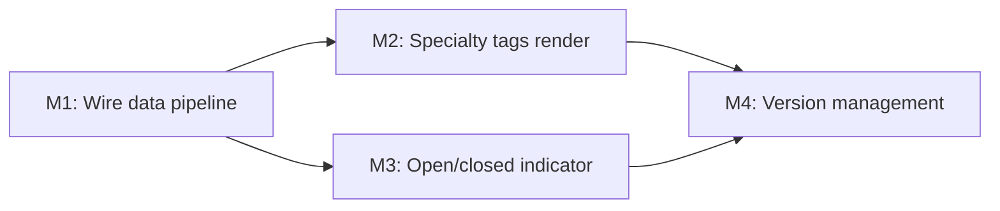

# Plan 115 — Provider Card: Specialty Tags + Open/Closed Status

| Field          | Value                                                                  |
| -------------- | ---------------------------------------------------------------------- |
| Plan ID        | 115                                                                    |
| Target Release | next available patch after v0.11.3 (current origin/main); confirm at DevOps Stage 1 |
| Epic Alignment | Food Discovery UX                                                      |
| Related Issues | None                                                                   |
| Classification | Feature                                                                |
| Pipeline       | Full                                                                   |
| GitHub Issue   | https://github.com/abu-lina/uflow/issues/195                           |
| Created        | 2026-04-29T18:00Z                                                      |

## Changelog

| Date             | Agent   | Event                        |
|------------------|---------|------------------------------|
| 2026-04-29T18:00Z | Planner | Plan created from analysis 115 |
| 2026-04-29T18:40Z | Implementer | Implementation started; TDD execution begins |
| 2026-04-30T08:45Z | Code Reviewer | Code Review Approved; ready for QA execution |
| 2026-05-02T07:55Z | QA | QA testing complete; all automated gates pass. Ready for UAT. Status: QA Complete |
| 2026-05-02T07:58Z | UAT | Value delivery validated; both features demonstrated in code. Status: UAT Approved. Ready for DevOps Stage 1. |
| 2026-05-02T10:00Z | Code Reviewer | Re-review approved after remediation. Status: Code Review Approved. Ready for QA execution. |
| 2026-05-02T10:10Z | QA | Re-test after CR remediation complete; all gates re-verified passing. Status: QA Complete. Ready for UAT. |
| 2026-05-02T10:15Z | UAT | Post-remediation UAT validation; CR findings fully resolved and re-tested. Status: UAT Approved. Ready for DevOps Stage 1. |

## Value Statement and Business Objective

**As a** user browsing food providers on UFlow,
**I want to** see what dishes each restaurant is known for and whether it's currently open,
**so that** I can quickly decide which restaurant to visit without needing to tap into each card.

**User feedback quote**: "vielleicht noch einbauen für was die bekannt sind, also Shawarma usw"

## Decision Record

| # | Decision | Status |
|---|----------|--------|
| D1 | Show `offers` (dish names from global vocabulary) as specialty tags, NOT `provider_menu_items` (too granular for card surface) | [RESOLVED] — offers are canonical short names (1–2 words); menu items include prices/descriptions better suited for detail view |
| D2 | Max 2 tags visible on card with `+N` overflow (matches existing badge truncation pattern) | [RESOLVED] — Typical food providers have 3–8 offers; 2 visible keeps card compact on mobile |
| D3 | Open/closed status only shown when `opening_hours` is populated (graceful empty state) | [RESOLVED] — Many imported providers lack opening hours; hiding is better than showing "Unknown" |
| D4 | Reuse existing `getOpenStatus()` utility (already tested, handles edge cases) | [RESOLVED] — Proven utility from Plan 113; no new time logic needed |
| D5 | Specialty tags use `name_de` always (German-first market) | [RESOLVED] — `name_en` is nullable and inconsistently populated; German is primary audience language |
| D6 | Both features apply to all sections (food, business, ummah), not just food | [RESOLVED] — Offers exist for business providers too; open status is universally useful. Tags only render when offers data exists |
| D7 | Open status on card is a compact inline indicator (dot + "Open"/"Closed"), not the full `OpenStatusLine` | [RESOLVED] — Card space is limited; detail view keeps the full "Open · closes at 22:00" format |

## Release Strategy

Release Strategy: Standalone (no other known plans for this version).

## Assumptions

1. The `select('*')` in `searchProviders()` already returns `opening_hours` JSONB from the database — no query change needed.
2. `offers` data is already batch-fetched and attached to providers in `searchProviders()` — no new DB query needed.
3. Food providers imported from JoinHalal have `offers_ids` populated (proven in analysis). Manually-created providers may have empty offers — graceful empty state handles this.
4. The `OpenStatusLine` component (used in provider detail) can inform the compact card indicator design, but the card uses a simpler inline version.

## Plan

### Milestone 1: Wire offers and opening_hours through the data pipeline

**Objective**: Ensure `offers` and `opening_hours` reach `ProviderCard` from all call sites.

**Tasks**:
1. Add `opening_hours` to `SearchResult` interface in `src/services/providers.ts`
2. Pass `opening_hours` in `transformProviderToSearchResult()` and `transformCommunityServiceToSearchResult()`
3. In `SearchResultsList.tsx` — add `offers: result.offers` and `opening_hours: result.originalProvider?.opening_hours` to the `searchResultToProvider()` mapping
4. Verify `ExploreSection` and `ProvidersList` call sites — if they use `getProviders()` (which doesn't fetch offers), add the offers batch-fetch or accept graceful empty state

**Acceptance Criteria**:
- `ProviderCard` receives `offers` array and `opening_hours` object when data exists
- No runtime errors when either field is null/undefined
- No additional database queries introduced (data already flows through `*` select)

### Milestone 2: Render specialty tags on ProviderCard

**Objective**: Display up to 2 dish/specialty names below the address on food provider cards.

**Tasks**:
1. In `ProviderCard`, add a specialty tags row between the address and badges sections
2. Render first 2 offers as dot-separated text (e.g., "Shawarma · Falafel") with `+N` indicator if more exist
3. Only render when `offers` array has at least 1 item
4. Use existing card typography patterns (e.g., `font-inter text-xs text-text-muted`)
5. Ensure text truncates gracefully if offer names are long

**Acceptance Criteria**:
- Cards with offers show up to 2 dish names in a single line below address
- Cards without offers show no extra whitespace/gap
- Truncation works correctly on narrow mobile (320px)
- Accessibility: offer tags are readable by screen readers

### Milestone 3: Render open/closed indicator on ProviderCard

**Objective**: Show a compact "Open" / "Closed" indicator when opening hours data exists.

**Tasks**:
1. Import and call `getOpenStatus()` in `ProviderCard` with the provider's `opening_hours`
2. If `status.visible === false`, render nothing (graceful empty state)
3. If visible, render a small dot (green/red) + "Open"/"Closed" text inline, below specialty tags
4. Use i18n keys from existing `providerDetail.openStatus.open` / `providerDetail.openStatus.closed`
5. Keep it minimal — no "closes at X" detail on the card (that belongs in detail view)

**Acceptance Criteria**:
- Open indicator shows green dot + "Open" when provider is currently open
- Closed indicator shows red dot + "Closed" when currently closed
- No indicator shown when `opening_hours` is null/undefined/empty
- Correct behavior across timezone scenarios (client-side computation)
- Doesn't break existing card layout or increase card height unnecessarily

### Milestone 4: Version Management

**Objective**: Update release artifacts.

**Tasks**:
1. Bump version in `package.json` to target release
2. Add CHANGELOG.md entry documenting both features
3. Commit with conventional commit message

**Acceptance Criteria**:
- `package.json` version matches release target
- CHANGELOG documents: specialty tags on cards, open/closed indicator
- Version matches roadmap after release

## Milestone Dependencies

**Sequencing rule**: M2 and M3 can proceed in parallel once M1 is complete. M4 is final.

## Testing Strategy

- **Unit tests**: Verify `ProviderCard` renders offers tags when present, hides when absent; verify open status dot appears/hides based on `getOpenStatus()` return
- **Integration tests**: Verify `SearchResultsList` passes offers and opening_hours through to cards
- **Visual regression**: Cards at various states (0 offers, 1 offer, 5 offers; open/closed/no-hours)
- **Accessibility**: Tags are aria-readable; color is not the only indicator for open/closed (text label accompanies dot)

## Risks

| Risk | Likelihood | Mitigation |
|------|-----------|------------|
| Most providers have empty `offers_ids` (manually created) | Medium | Graceful empty state — tags only appear when data exists. JoinHalal imports are well-populated |
| Most providers lack `opening_hours` | Medium | Graceful empty state — indicator only appears when data exists. No visual regression for cards without data |
| Card height increases causing scroll/layout shift | Low | Tags and open indicator use compact single-line design; conditional rendering prevents empty space |
| Performance: `getOpenStatus()` called per card in list | Low | Function is pure computation (no network); runs in <1ms per call |

## Duration Estimates

| Phase | Estimate | Notes |
|-------|----------|-------|
| Implementation | 2–4 hours | All utilities exist; wiring + render only |
| QA | 1–2 hours | Unit tests + visual verification |
| UAT | 30 min | Visual check on real food providers |
| DevOps | 30 min | Standard patch release |
| **Total** | **4–7 hours** | Low uncertainty — no DB changes, no new APIs |

## Validation

- Build passes (`npm run build`)
- All existing tests pass (`npm test`)
- New unit tests for card tag rendering and open status indicator
- Type check passes (`npm run type-check`)
- Visual inspection on mobile (320px–414px) and desktop

## Handoff Notes

- The implementer should reference `OpenStatusLine` component for the open/closed design pattern but create a simpler inline version for the card
- The existing badge/barakah_effects rendering pattern in `ProviderCard` (lines 440–510) is the template for how to conditionally render the new rows
- `SearchResultsList.searchResultToProvider()` at line 98 is the exact function that needs offers + opening_hours added
