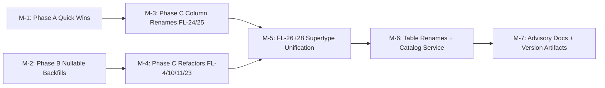

# Plan 116 — Field-Level Schema Remediation

| Field          | Value                                                                                  |
| -------------- | -------------------------------------------------------------------------------------- |
| Plan ID        | 116                                                                                    |
| Target Release | v0.12.0 (MINOR — significant schema refactor with breaking table/column/enum changes); confirm at DevOps Stage 1 |
| Epic Alignment | Schema Quality & Pre-Consumer Structural Integrity                                     |
| Related Issues | Architecture 118 (field-level schema review — 28 findings)                             |
| Classification | Refactor                                                                               |
| Pipeline       | Full                                                                                   |
| GitHub Issue   | https://github.com/abu-lina/uflow/issues/200                                          |
| Created        | 2026-05-01T20:00Z                                                                     |

## Changelog

| Date             | Agent   | Change                                              |
| ---------------- | ------- | --------------------------------------------------- |
| 2026-05-01T20:00Z | planner | Initial plan created from Architecture 118 (28 findings, 5 HIGH / 14 MEDIUM / 9 LOW) |
| 2026-05-01T21:30Z | planner | Revised per Critique 116 findings F-1 through F-6: M-5 estimate widened to ~100 files / 5–8 days with sub-milestones; `community_services_community_service_id_key` removed from M-1 FL-15; PG enum rename risk corrected (PG15+ supports RENAME VALUE); M-2 CS backfills marked conditional; semver bump recommended v0.12.0 |
| 2026-05-01T23:30Z | planner | **R2** — Revised per Architecture Findings 116 (AF-1 through AF-7, 1 CRITICAL / 3 HIGH / 2 MEDIUM / 1 LOW). Changes: (1) FL-1+FL-2 removed from M-1 (already exist in migration 006); (2) FL-3 `applicable_to` DROP added to M-1; (3) M-1 FL-17 trust_level range changed to require live audit (baseline says 0-100, not 0-10); (4) M-3 revised to DROP-only for all 3 section-scoped CHECKs — no re-creation (AF-3: checks move to extension tables in M-5); (5) M-5 Task 1 expanded with explicit DROP ordering for CHECK + index before RENAME VALUE (AF-1 CRITICAL); (6) M-5 `'business'` → `'store'` rename inventory expanded to 33 files + 5 schema objects + URL backward-compat mapping (AF-7); (7) Decision Record D-9 through D-11 added; (8) Assumption 4 corrected. |
| 2026-05-02T00:15Z | planner | **R3** — Revised per Critique 116 R2 findings G-1 through G-3: (1) M-5 Task 9 note added — badge sync trigger must be updated after column drops (G-1); (2) M-1 subtitle changed from "additive only" to "zero-downtime" (G-2); (3) M-5 acceptance criteria — RLS on extension tables required (G-3). |
| 2026-05-02T00:25Z | implementer | Execution started for M-1 (Phase A). Applying migration 079 for FL-15, FL-14, FL-17, FL-22, FL-18, and FL-3 with drift-safe `IF EXISTS`/catalog-guard patterns and live schema verification evidence. |

---

## Value Statement and Business Objective

**As a** UFlow operator and development team,  
**I want to** remediate all 28 field-level schema findings identified in Architecture 118 — fixing data integrity gaps, naming mismatches, nullable booleans, and the provider table monolith — before the first public consumer launch,  
**so that** the database schema is structurally sound, self-documenting, and ready to scale without accruing more technical debt during the growth phase.

---

## Decision Record

1. **[RESOLVED]** All 28 findings are in-scope for this plan, phased by risk and dependency order. Rationale: the pre-consumer window is the only time structural changes are zero-risk.
2. **[RESOLVED]** `listing_type = 'business'` renamed to `'store'` in the same migration as FL-26 supertype unification. Rationale: zero marginal cost since `listing_type_enum` is already being altered; UI already shows "Stores".
3. **[RESOLVED]** Extension tables (`food_providers`, `store_providers`, `ummah_providers`) created during FL-26. Rationale: pre-consumer = no data migration risk; establishes the schema pattern before any food/store/ummah-specific column additions.
4. **[RESOLVED]** `provider_menu_items` → `provider_menu`, `provider_service_offers` → `provider_catalog` — both renamed. Rationale: keeps `provider_*` convention; eliminates "offers" overloading; clean parallel pair.
5. **[RESOLVED]** FL-24/FL-25 column renames sequenced before FL-26 to avoid migrating columns twice.
6. **[RESOLVED]** Advisory findings (FL-6, FL-12, FL-16, FL-19, FL-20, FL-21) addressed as documentation comments or deferred. Rationale: zero user impact, YAGNI.
7. **[RESOLVED]** `community_services` merged into `providers` (FL-26). Rationale: 69% column overlap; pre-consumer window; eliminates 24 duplicate columns; badge/trust/search works natively across all entity types.
8. **[RESOLVED]** `provider_community_services` → `provider_engagements` as an open engagement graph (any provider type can engage with any other). Rationale: owner confirmed cross-type engagement is the intended model.
9. **[RESOLVED]** Section-scoped CHECK constraints (`food_only_ck`, `business_only_ck`, `ummah_only_ck`) DROP from `providers` supertype in M-3. Not recreated — structurally replaced by extension tables in M-5. Rationale: the supertype should not enforce type-specific column invariants; the 1:1 extension table design enforces this by column placement. (AF-3)
10. **[RESOLVED]** `ALTER TYPE RENAME VALUE` requires all dependent schema objects (CHECKs, partial indexes) to be DROPped BEFORE the rename, then recreated AFTER with the new label. Rationale: PostgreSQL re-parses expression text at evaluation time; stale enum labels cause runtime failures. (AF-1)
11. **[RESOLVED]** URL backward compatibility for `?section=business` → maps to `'store'` in `resolveSectionFromSearchParams()`. Rationale: bookmarked/shared URLs must continue working after rename. (AF-7)

---

## Release Strategy

Standalone — no other known plans target the same release version. This plan bundles all 28 FL-findings from Architecture 118 into a single coordinated release.

---

## Duration Estimates

| Phase          | Estimate   | Uncertainty Driver                                                        |
| -------------- | ---------- | ------------------------------------------------------------------------- |
| Planning       | 0.5 day    | Already complete (this document)                                          |
| Implementation | 10–15 days | M-5 supertype unification touches ~100 files (77 `community_service` refs + 33 `'business'` refs); M-5 Task 1 enum rename requires strict DROP ordering (AF-1); split into 3 sub-milestones (M-5a/b/c) |
| QA             | 2–3 days   | Regression testing across all 3 sections (food/store/ummah); migration rollback verification |
| UAT            | 1–2 days   | Manual browse through all 3 sections; admin CRUD; bookmark/filter verification |
| DevOps         | 0.5 day    | Standard migration deployment; `CREATE INDEX CONCURRENTLY` for Phase 1    |

**Total**: ~14–22 days. Primary uncertainty: M-5 app code change surface (~100 files across schema migration, service layer, and component layer) + enum rename dependency chain (AF-1).

---

## Assumptions

1. The pre-consumer window remains open — no public launch before this plan completes.
2. Production data volumes are small enough for online backfills (no multi-million-row tables requiring batched updates).
3. All `community_services` rows can be migrated to `providers` without data loss (69% column overlap already confirmed).
4. FL-3 (`applicable_to` removal): App code is clean (no `src/` references). Schema column + GIN index still exist — DROP added to M-1. (Corrected per AF-4/AF-6.)
5. FL-1 + FL-2 (bookmark/badge UNIQUE indexes): Already exist in migration 006 — excluded from this plan. (Corrected per AF-2.)

---

## Milestone Dependencies

Sequencing rule: M-1 and M-2 can run in parallel. M-3 must complete before M-5 (column renames done + all 3 section-scoped CHECKs dropped — prevents AF-1 CRITICAL breakage). M-5 is the critical path.

---

## Plan

### M-1: Phase A — Quick Wins (zero-downtime)

**Objective**: Fix data integrity gaps and add missing constraints with no app code changes.

**Tasks**:

1. **FL-15 (LOW)**: Drop 3 redundant UNIQUE constraints on PK columns:
   - `categories_category_id_key`, `providers_provider_id_key`, `users_user_id_key`
   - Note: `community_services_community_service_id_key` is NOT dropped here — migration 009 retained it for FK dependency safety, and the entire `community_services` table is dropped in M-5.

2. **FL-14 (MEDIUM)**: Add FK on `enrichment_candidates.run_id → enrichment_run_logs.id ON DELETE SET NULL`.

3. **FL-17 + FL-22 (LOW)**: Add CHECK constraints:
   - `cities.trust_level`: **Implementer MUST audit live values first** (`SELECT MIN(trust_level), MAX(trust_level) FROM cities;`). Baseline comment says 0-100. Set CHECK range to match actual semantics (likely `CHECK (trust_level >= 0 AND trust_level <= 100)`).
   - `provider_menu_items.price_currency`, `provider_service_offers.price_currency`, `community_projects.price_currency`: `CHECK (price_currency IN ('EUR'))`

4. **FL-18 (LOW)**: Backfill `waitlist.is_provider` NULLs → `false`, then `SET NOT NULL DEFAULT false`.

5. **FL-3 (HIGH)**: Drop dead column and index from `categories`:
   - `ALTER TABLE categories DROP COLUMN applicable_to;`
   - `DROP INDEX IF EXISTS idx_categories_applicable_to;`
   - App code is already clean (zero `src/` references). This is the schema-side completion of FL-3.

**Acceptance Criteria**:
- `\d categories` shows no `applicable_to` column.
- `\d cities`, `\d waitlist` show new constraints.
- FL-1 + FL-2 NOT in scope (already exist in migration 006 — verified by Architecture Findings 116 AF-2).
- Zero downtime during migration.

---

### M-2: Phase B — Nullable Boolean Backfills

**Objective**: Eliminate three-valued boolean logic across 4 tables.

**Tasks**:

1. **FL-7 (MEDIUM)**: Backfill `providers.review_status` NULLs → `'pending'`, then `SET NOT NULL`.
   - Same for `community_services.review_status` (**conditional**: skip CS backfill if M-5 ships in the same release — table is dropped there).

2. **FL-8 (MEDIUM)**: Backfill `community_services.is_verified` NULLs → `false`, then `SET NOT NULL`.
   - **Conditional**: skip if M-5 ships in the same release — table is dropped there.

3. **FL-13 (MEDIUM)**: Backfill `providers.show_address` and `community_services.show_address` NULLs → `true`, then `SET NOT NULL`.
   - **Conditional**: `community_services.show_address` backfill skipped if M-5 ships in the same release.

4. **FL-5 (MEDIUM)**: Backfill `categories.applicable_section` NULLs → `'all'`, then `SET NOT NULL DEFAULT 'all'`.

5. **FL-9 (MEDIUM)**: Audit live `admin_audit_logs.action` values, then add CHECK constraint with the confirmed value set.

**Acceptance Criteria**:
- `SELECT count(*) FROM providers WHERE review_status IS NULL` = 0.
- `SELECT count(*) FROM categories WHERE applicable_section IS NULL` = 0.
- All affected columns show `NOT NULL` in `information_schema.columns`.

---

### M-3: Phase C.1 — Column Renames (FL-24, FL-25)

**Objective**: Align column names with owner intent before the supertype unification in M-5.

**Dependencies**: None (can start after M-1 or in parallel).

**Tasks**:

1. **FL-24**: Rename `providers.solidarity_pricing` → `economic_solidarity`.
   - Migration: `ALTER TABLE providers RENAME COLUMN solidarity_pricing TO economic_solidarity;`
   - App code: rename in `filterKeys.ts`, `sectionFilters.ts`, `providerService.ts`, `providers.ts`, `ProviderDetailSections.tsx`, `sectionBadges.ts`, all tests (~8 files).

2. **FL-25**: Rename `providers.accepts_donations` → `makes_donations`.
   - Migration: `ALTER TABLE providers RENAME COLUMN accepts_donations TO makes_donations;`
   - App code: rename in same ~8 files as FL-24. The German filter key `spenden` in `filterKeys.ts` keeps its value (correct intent).

3. **Drop ALL three section-scoped CHECK constraints** (AF-3 / Decision D-9):
   - `DROP CONSTRAINT providers_listing_type_food_only_ck;`
   - `DROP CONSTRAINT providers_listing_type_business_only_ck;`
   - `DROP CONSTRAINT providers_listing_type_ummah_only_ck;`
   - These are NOT recreated on `providers`. The extension table design in M-5 structurally replaces them: type-specific columns live exclusively on `food_providers`, `store_providers`, `ummah_providers` — column placement IS the constraint.
   - Rationale: the supertype should not enforce type-specific column invariants. Recreating any CHECK here would reference `'business'::listing_type_enum` which breaks when M-5 renames it to `'store'` (AF-1 CRITICAL). Clean drop avoids the cross-milestone conflict entirely.

**Acceptance Criteria**:
- `\d providers` shows `economic_solidarity` and `makes_donations` columns; old names absent.
- All three section-scoped CHECK constraints (`food_only_ck`, `business_only_ck`, `ummah_only_ck`) no longer exist on `providers`.
- `npm run type-check` passes.
- All filter/badge/detail tests pass.

---

### M-4: Phase C.2 — Schema Refactors (FL-4, FL-10, FL-11, FL-23)

**Objective**: Fix FK conflicts, migrate text-to-enum, and unify the badge attribute registry.

**Dependencies**: M-2 (backfills complete).

**Tasks**:

1. **FL-4 (HIGH)**: Resolve NOT NULL + ON DELETE SET NULL conflict on `needs.category_id` and `offers.category_id`.
   - Owner decision required: either change FK to `ON DELETE RESTRICT` (if needs/offers MUST have a category) or make `category_id` nullable (if they can be uncategorised).
   - Implementer to propose based on current data patterns and creation flow logic.

2. **FL-11 (MEDIUM)**: Change `providers.category_id` FK to `ON DELETE SET NULL` (requires making `category_id` nullable if not already). Enables safe category deletion/merge.

3. **FL-10 (MEDIUM)**: Create `task_status_enum` type (`pending`, `in_progress`, `completed`, `cancelled`) and migrate `provider_outreach_tasks.task_status` from TEXT+CHECK to the enum.

4. **FL-23 (HIGH)**: Unify badge attribute registry.
   - Add 3 columns to `badge_types`: `attribute_category TEXT NOT NULL DEFAULT 'trust' CHECK ('trust','amenity')`, `provider_column_name TEXT`, `is_filterable BOOLEAN NOT NULL DEFAULT false`.
   - INSERT rows for all 12 attributes (trust + amenity), mapping each to its boolean column.
   - Rewrite `sync_provider_badge_to_boolean()` trigger to be data-driven (lookup `provider_column_name` from `badge_types`, use `EXECUTE format('%I', v_col_name)`).
   - Update `providerService.ts` creation path to route all attribute tags through badge-key lookup.

**Acceptance Criteria**:
- `needs`/`offers` FK conflict resolved (no logical contradiction in schema).
- `provider_outreach_tasks.task_status` uses enum type.
- `SELECT * FROM badge_types WHERE provider_column_name IS NOT NULL` returns all 12 attribute mappings.
- Adding a new boolean attribute requires only 1 INSERT + 1 ALTER TABLE — no trigger rewrite.
- All existing badge tests pass.

---

### M-5: FL-26 + FL-28 Part 1 — Supertype Unification + Enum Rename

**Objective**: Merge `community_services` into `providers`; add `'ummah'` and rename `'business'` → `'store'` in `listing_type_enum`; create 1:1 extension tables; simplify bookmarks.

**Scope**: ~100+ files affected (77 referencing `community_service` + 31 referencing `'business'` string literal + shared files). This is the critical-path milestone.

**Pre-implementation task**: Run file-count audit (`grep -rl 'community_service' src/ && grep -rl "'business'" src/`) and produce a per-directory changelist to sequence sub-milestones.

**Sub-milestones** (implementer may adjust boundaries):
- **M-5a — Schema migration**: SQL migration file(s) covering enum changes, extension tables, data migration, table drops. Estimated 1–2 days.
- **M-5b — Service layer**: Rewrite `communityServices.ts`, `providerService.ts`, bookmark service, type definitions (~30 files). Estimated 2–3 days.
- **M-5c — Component layer**: Update all CS components under `features/community-services/`, section selectors, filter configs, translation keys (~40 files). Estimated 2–3 days.

**Dependencies**: M-3 complete (column renames done + all 3 section-scoped CHECKs dropped — avoids migrating old column names and avoids AF-1 CHECK breakage).

**This is the critical path milestone. Estimated 5–8 days implementation.**

**Tasks**:

1. **Enum rename — STRICT ORDERING REQUIRED** (AF-1 CRITICAL):
   The M-5a migration MUST execute these steps in this exact order within a single transaction:
   - (a) `DROP INDEX idx_providers_business_muslim_owned;` — partial index predicate references `'business'::listing_type_enum`
   - (b) Verify all three section-scoped CHECKs were dropped in M-3. If any survive (defensive), DROP them now.
   - (c) `DROP CONSTRAINT categories_applicable_section_check;`
   - (d) `ALTER TYPE listing_type_enum RENAME VALUE 'business' TO 'store';`
   - (e) `UPDATE categories SET applicable_section = 'store' WHERE applicable_section = 'business';`
   - (f) `ALTER TABLE categories ADD CONSTRAINT categories_applicable_section_check CHECK (applicable_section IN ('food', 'store', 'ummah', 'all'));`
   - (g) `CREATE INDEX idx_providers_store_muslim_owned ON providers USING btree (listing_type, muslim_owned) WHERE listing_type = 'store'::listing_type_enum;`
   - Note: `ADD VALUE 'ummah'` was already done in migration 0061 — skip if enum value already exists (idempotent guard).

2. **Extension tables**: Create `food_providers`, `store_providers`, `ummah_providers` with 1:1 FK to `providers(provider_id) ON DELETE CASCADE`.

3. **Community services migration**: INSERT `community_services` rows into `providers` with `listing_type = 'ummah'`; populate `ummah_providers` extension rows.

4. **Food/store extension migration**: Populate `food_providers` (halal_level, no_alcohol, no_pork) and `store_providers` (no_gambling) from existing `providers` columns.

5. **community_projects FK rename**: `community_service_id` → `provider_id`.

6. **provider_community_services → provider_engagements**: Rename table + columns (`provider_id` → `initiating_provider_id`, `community_service_id` → `engaged_provider_id`). Add `engagement_type TEXT CHECK ('endorsement','financial','supply_chain','community_referral')`.

7. **Junction table merge**: Migrate `community_service_offers` → `provider_offers`, `community_service_needs` → `provider_needs`. DROP both CS junction tables.

8. **Bookmarks simplification**: Merge `bookmarks.community_service_id` into `provider_id` column. DROP `community_service_id`.

9. **Drop type-exclusive columns from `providers`**: Remove `halal_level`, `no_alcohol`, `no_pork`, `no_gambling` (now in extension tables).
   - **Badge trigger dependency (G-1)**: After dropping these columns, `sync_provider_badge_to_boolean()` (rewritten in M-4 FL-23) will fail — it references `providers.halal_level`, `providers.no_alcohol`, etc. via `badge_types.provider_column_name`. Update `badge_types.provider_column_name` to point at the extension tables and rewrite the trigger to target `food_providers`/`store_providers` instead of `providers`.

10. **Drop `community_services` table**.

11. **App code — TypeScript `'business'` → `'store'` rename** (AF-7 inventory — 33 unique files confirmed):
   - **Schema objects** (5 items, handled in Task 1 above): `providers_listing_type_business_only_ck`, `providers_listing_type_food_only_ck`, `providers_listing_type_ummah_only_ck`, `idx_providers_business_muslim_owned`, `categories_applicable_section_check`.
   - **App code** (33 files): Rename all `'business'` → `'store'` in `Section` type, service functions, filter configs, `sectionFilters.ts`, `filterKeys.ts`, and all files that match `grep -rl "'business'" src/`.
   - **Translation keys** (6 files): `sectionBusiness` → `sectionStore` in `de.ts`, `en.ts`, `ar.ts`, `ps.ts`, `tr.ts`, `ur.ts`.
   - **URL backward compatibility** (AF-7): Add fallback mapping in `resolveSectionFromSearchParams()` — `if (sectionParam === 'business') return 'store';`. Ensures bookmarked/shared `?section=business` URLs continue working.
   - **NOT in scope** (explicitly excluded): PWA manifest `"business"` (W3C category, not UFlow section), `"onlineBusiness"` translation key (unrelated concept), code comments containing `'business'`.

12. **App code — Services**: Rewrite `communityServices.ts` / `communityServices.server.ts` to query `providers WHERE listing_type = 'ummah'`. Rewrite `providerService.ts` table union from 4 options to 2. Rewrite bookmark service to remove `community_service_id` branch.

13. **App code — Components**: Update all CS components (`features/community-services/`) for column name changes (`community_service_name` → `provider_name`, etc.).

14. **App code — `applicable_section`**: Handled in Task 1(e)(f) above (schema). App code references to `'business'` in `applicable_section` comparisons included in the 33-file rename scope.

**Acceptance Criteria**:
- `SELECT DISTINCT listing_type FROM providers` returns `food`, `store`, `ummah`.
- `community_services` table does not exist.
- `SELECT count(*) FROM food_providers` equals count of food providers. Same for store/ummah.
- `SELECT * FROM provider_engagements LIMIT 5` returns rows with `engagement_type`.
- `bookmarks` has only `provider_id` FK (no `community_service_id`).
- `npm run type-check` passes with zero `'business'` string literals in source.
- All 3 sections (food/store/ummah) browsable in search UI.
- `?section=business` URL redirects/maps to store section (backward compat).
- `idx_providers_store_muslim_owned` exists; `idx_providers_business_muslim_owned` does not.
- No section-scoped CHECKs exist on `providers` supertype; `\d food_providers`, `\d store_providers`, `\d ummah_providers` show type-specific columns.
- All extension tables have RLS enabled matching the `providers` table policy pattern (G-3).
- `sync_provider_badge_to_boolean()` trigger targets extension tables, not `providers`, for type-specific columns (G-1).

---

### M-6: FL-28 Parts 2+3 — Table Renames + Store Catalog Service

**Objective**: Rename catalog tables and build the missing store catalog app service.

**Dependencies**: M-5 complete.

**Tasks**:

1. **FL-28 part 2**: Rename tables via migration:
   - `provider_menu_items` → `provider_menu`
   - `provider_service_offers` → `provider_catalog` (now `provider_catalog` after `'business'` → `'store'` in M-5)
   - Update RLS policies, FK constraint names, `search_provider_items` RPC body to reference new table names.

2. **FL-28 part 2 — app code**: Rename `src/services/provider-catalog.ts` → `src/services/provider-menu.ts`. Update all import references.

3. **FL-28 part 3**: Build `src/services/provider-catalog.ts` (new file for store catalog) mirroring the `provider-menu.ts` pattern — CRUD operations for `provider_catalog` table.

4. **FL-27 (opportunistic)**: Update `src/services/category-suggestions.ts` to call existing RPCs (`get_suggested_offers_for_category`, `get_suggested_needs_for_category`) instead of two-hop queries.

**Acceptance Criteria**:
- `\dt provider_menu` and `\dt provider_catalog` exist; old table names absent.
- `search_provider_items` RPC references `provider_menu` and `provider_catalog` in its body.
- `provider-menu.ts` service functions work for food menu items.
- `provider-catalog.ts` service functions work for store catalog items.
- `category-suggestions.ts` uses RPC calls (single query per suggestion fetch).

---

### M-7: Advisory Documentation + Version Artifacts

**Objective**: Address advisory-only findings and finalize release.

**Tasks**:

1. **FL-6 (advisory)**: Document that `providers.listing_type` has no DEFAULT by design — app-layer validation required on all INSERT paths. Add SQL comment.

2. **FL-12 (advisory)**: Add SQL comment on `deletion_logs.user_id` documenting intentional absence of FK (user row deleted before log written).

3. **FL-16 (advisory)**: Document that `category_suggested_offers/needs` surrogate PK is retained for now. Composite PK migration deferred (YAGNI at current scale).

4. **FL-19 (advisory)**: Document that `email_confirmation_tokens.type` uses TEXT+CHECK rather than enum. Deferred (low-frequency auth utility table).

5. **FL-20 (advisory)**: Document that `community_services.community_service_view_count` is absorbed into `ummah_providers` during M-5. After migration, decide whether to move to `provider_stats` MV or keep denormalized.

6. **FL-21 (advisory)**: Add SQL comment on `provider_owner_outreach.dispatch_after` documenting the 24h cool-down business rule.

7. **Version artifacts**: Update `package.json` version, add CHANGELOG entry documenting all 28 FL-findings resolved, update README if needed.

**Acceptance Criteria**:
- SQL comments added for FL-6, FL-12, FL-21.
- CHANGELOG entry covers the full scope of this plan.
- `package.json` version matches target release.

---

## Testing Strategy

- **Unit tests**: Per-milestone — migration correctness (schema introspection), service function behavior, TypeScript type compilation.
- **Integration tests**: Badge sync trigger with data-driven lookup, bookmark CRUD after simplification, provider search across all 3 sections.
- **Regression tests**: All existing provider/CS/bookmark/badge tests must pass after each milestone.
- **Migration rollback**: Each migration must be reversible. Test rollback path for M-5 (the largest migration).
- **Coverage focus**: FL-3 column drop verification (no `applicable_to` in schema), FL-26 data migration completeness (row counts before/after), FL-28 `search_provider_items` RPC returning results from both `provider_menu` and `provider_catalog`, M-5 Task 1 enum rename (verify no broken CHECKs/indexes via `\d providers` + `\di idx_providers_store_muslim_owned`).

---

## Risks

| Risk | Likelihood | Impact | Mitigation |
|------|-----------|--------|------------|
| FL-26 app code surface larger than estimated (~100+ files) | High | Schedule slip | M-5 split into sub-milestones (M-5a/b/c); pre-implementation file audit; implementer can split into sub-PRs |
| `community_services` has rows with no matching category in `categories` | Low | FK violation during migration | Pre-migration data audit query required |
| Postgres enum RENAME VALUE breaks dependent CHECK constraints and partial indexes | N/A — resolved (AF-1) | N/A | Explicit DROP ordering mandated in M-5 Task 1 (Decision D-10). M-3 drops all 3 section-scoped CHECKs beforehand (Decision D-9). Partial index `idx_providers_business_muslim_owned` DROPped before RENAME. |
| `cities.trust_level` range mismatch (plan vs baseline) | Medium | Migration failure if existing values exceed CHECK range | Live data audit required before adding CHECK (AF-5). Implementer runs `SELECT MIN, MAX FROM cities` first. |
| Pre-consumer window closes before plan completes | Medium | Higher migration risk | M-1/M-2/M-3 can ship independently as patch releases if timeline is tight |

---

## Rollback Considerations

- M-1 through M-4: Each is independently reversible (DROP INDEX, DROP CONSTRAINT, ALTER COLUMN DROP NOT NULL, RENAME COLUMN back).
- M-5: Largest rollback surface — requires keeping `community_services` table intact until migration is verified. Recommend: run M-5 migration on a staging fork first; verify row counts; only then apply to prod.
- M-6: Table renames are trivially reversible (`ALTER TABLE ... RENAME TO` back).

---

## Validation

- `npm run type-check` — zero errors at each milestone boundary.
- `npm test` — all existing tests pass at each milestone boundary.
- `EXPLAIN ANALYZE` on `search_provider_items` RPC after M-6 to confirm performance with new table names.
- Manual browse: food section, store section, ummah section — provider cards, detail pages, filters, bookmarks all functional.

---

## OPEN QUESTIONS

All resolved — no open questions remain at handoff. See Decision Record above.
