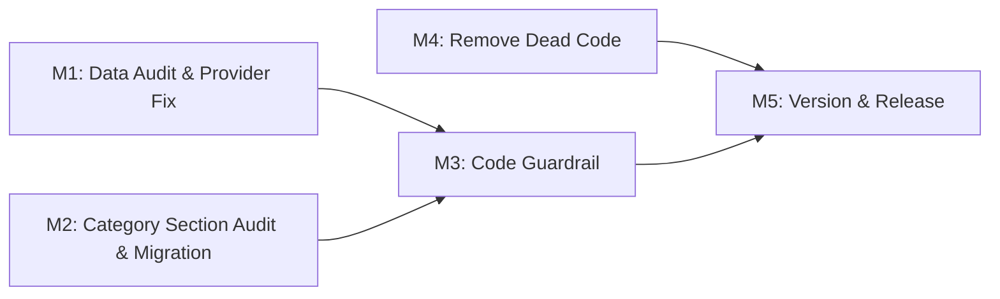

# Plan 119 — Category Filter Shows Wrong Section Categories

| Field          | Value                                                                  |
| -------------- | ---------------------------------------------------------------------- |
| Plan ID        | 119                                                                    |
| Target Release | Next available patch after v0.12.0; confirm at DevOps Stage 1          |
| Epic Alignment | Data Integrity & Search Accuracy                                       |
| Related Issues | None                                                                   |
| Classification | Bugfix                                                                 |
| Pipeline       | Abbreviated (Analyst → Planner → Implementer → Code Reviewer → QA → DevOps) |
| GitHub Issue   | https://github.com/abu-lina/uflow/issues/202                          |
| Created        | 2026-05-02T00:00Z                                                      |

## Changelog

| Date                | Agent   | Action                                           |
| ------------------- | ------- | ------------------------------------------------ |
| 2026-05-02T00:00Z   | Planner | Created from analysis doc 119. Status: Active.   |
| 2026-05-02T00:40Z   | Implementer | Implementation started. Plan status set to In Progress. |
| 2026-05-02T00:46Z   | Implementer | Implementation complete. Ready for Code Review. |
| 2026-05-02T01:05Z   | Code Reviewer | Re-review complete. Plan status set to Code Review Approved. |
| 2026-05-02T01:20Z   | QA | QA testing complete. Plan status set to QA Complete. |
| 2026-05-02T01:25Z   | UAT | Value delivery validation complete. Plan status set to UAT Approved. |

## Value Statement and Business Objective

**As a** user browsing the UFlow Food section,
**I want to** see only categories that are relevant to the Food section,
**so that** I can trust the platform's category accuracy and navigate efficiently to the services I need.

**Business Impact**: Users browsing the Food tab see "Gesundheit & Sport" (Health & Sports) — a store-only category — which degrades trust in category filtering and creates a confusing browsing experience. This is a data integrity bug with a missing code guardrail.

## Release Strategy

Release Strategy: Standalone (no other known plans for this version).

## Decision Record

| # | Decision | Status | Rationale |
|---|----------|--------|-----------|
| D1 | Fix applies to `fetchCategoriesBySection()` in `src/services/categories.ts` only — `getCategoriesForSection()` already has the correct filter | [RESOLVED] | Analysis F2 confirms `getCategoriesForSection` already uses `.in('applicable_section', [section, 'all'])`. Only the gallery path is broken. |
| D2 | Section type mapping: app `'store'` → DB `'business'` must be handled in the guardrail filter | [RESOLVED] | DB CHECK constraint uses `'business'`, app uses `'store'`. Mapping is required at query time. |
| D3 | Provider "Natureweg" data fix: correct the `listing_type` or `category_id` — NOT both | [RESOLVED] | Natureweg is a health food store incorrectly classified as `listing_type='food'` with category "Gesundheit & Sport". The correct fix depends on what Natureweg actually is. Implementer should verify with a quick data audit and correct the mismatched field. |
| D4 | Legacy categories with `applicable_section='all'` that should be section-specific must be audited | [RESOLVED] | Migration 080_m2 backfilled all NULLs to `'all'`. Some categories (e.g., "Gesundheit & Sport") should be `'business'` not `'all'`. Implementer audits and creates a migration for corrections. |
| D5 | Dead code `CategoryFilter.tsx` should be removed | [RESOLVED] | Zero imports in entire codebase confirmed by analysis. Removal reduces maintenance surface. |
| D6 | Scope: unclaimed and claimed providers both affected | [RESOLVED] | The data integrity issue and missing guardrail affect all providers regardless of ownership status. The code fix is at the query level, not provider-specific. |

## Assumptions

1. The `applicable_section` column and CHECK constraint are already in production (migration 080_m2)
2. No other service functions besides `fetchCategoriesBySection()` have the missing guardrail (analysis confirmed `getCategoriesForSection` is correct)
3. The number of providers with mismatched `listing_type` / `category_id` is small (only "Natureweg" was identified; implementer will audit)

## Plan

### Milestone 1 — Data Audit & Provider Fix

**Objective**: Identify and correct all providers with mismatched `listing_type` / `category_id` combinations.

**Tasks**:
1. Query the database to identify all providers where `listing_type` does not match the category's `applicable_section` (accounting for `'all'` being valid for any section, and `'store'` → `'business'` mapping)
2. For each mismatch, determine the correct value (fix `listing_type` or `category_id`) based on the provider's actual business type
3. Apply the data corrections — if only "Natureweg" is affected, a targeted fix is sufficient; if multiple providers are affected, create a migration script
4. Document findings (number of mismatches, corrections applied)

**Acceptance Criteria**:
- All providers have consistent `listing_type` / `category_id` combinations
- No provider with `listing_type='food'` references a non-food category (and vice versa)
- Audit results documented in implementation notes

### Milestone 2 — Category `applicable_section` Audit & Migration

**Objective**: Correct legacy categories that were backfilled to `applicable_section='all'` but should be section-specific.

**Tasks**:
1. Query all categories where `applicable_section = 'all'` and determine which should be scoped to a specific section (`'food'`, `'business'`, `'ummah'`)
2. Create a new Supabase migration in `supabase/migrations/` to update `applicable_section` for incorrectly scoped categories (e.g., "Gesundheit & Sport" → `'business'`)
3. Ensure categories that genuinely span all sections remain as `'all'`

**Acceptance Criteria**:
- "Gesundheit & Sport" has `applicable_section = 'business'` (not `'all'`)
- All legacy categories reviewed and correctly scoped
- Migration is idempotent and safe for re-runs

### Milestone 3 — Add `applicable_section` Guardrail to `fetchCategoriesBySection`

**Objective**: Prevent categories from appearing under the wrong section even if provider data is inconsistent.

**Tasks**:
1. Modify `fetchCategoriesBySection()` in `src/services/categories.ts` to add an `applicable_section` filter in the second query step (category fetch by IDs)
2. Handle section type mapping: app section `'store'` must map to DB value `'business'` before querying
3. Include `'all'` in the filter to retain categories that span all sections
4. Verify no valid categories are accidentally hidden by the new filter

**Acceptance Criteria**:
- `fetchCategoriesBySection('food')` returns only categories with `applicable_section IN ('food', 'all')`
- `fetchCategoriesBySection('store')` queries with `applicable_section IN ('business', 'all')`
- `fetchCategoriesBySection('ummah')` queries with `applicable_section IN ('ummah', 'all')`
- "Gesundheit & Sport" no longer appears under the Food section

**Dependencies**: Milestone 2 (correct `applicable_section` values must be in place for the guardrail to be meaningful)

### Milestone 4 — Remove Dead Code `CategoryFilter.tsx`

**Objective**: Remove the unused `CategoryFilter` component to reduce maintenance surface.

**Tasks**:
1. Confirm `src/components/providers/CategoryFilter.tsx` still has zero imports
2. Delete the file
3. Remove any related test files if they exist

**Acceptance Criteria**:
- `CategoryFilter.tsx` deleted
- No broken imports or build errors
- Build and type-check pass

### Milestone 5 — Update Version and Release Artifacts

**Objective**: Update version artifacts to match the target release version.

**Tasks**:
1. Update `package.json` version to the target patch version (confirmed at DevOps Stage 1)
2. Add CHANGELOG entry documenting: category section filter guardrail, data integrity fix, dead code removal
3. Commit all changes

**Acceptance Criteria**:
- `package.json` version matches target release
- CHANGELOG reflects all plan deliverables
- Version is consistent across all artifacts

## Milestone Dependencies

Sequencing rule: Milestones 1, 2, and 4 can proceed in parallel. Milestone 3 depends on M1 and M2 being complete so the guardrail can be validated against correct data. Milestone 5 is final.

## Testing Strategy

- **Unit tests**: Test `fetchCategoriesBySection()` with mock data covering each section type to verify the guardrail filter works correctly
- **Integration**: Verify category gallery displays only section-appropriate categories
- **Regression**: Ensure no valid categories are hidden by the new filter; verify all three sections (food, store, ummah) return expected categories
- **Build verification**: Type-check and build pass after dead code removal

## Risks

| Risk | Likelihood | Impact | Mitigation |
|------|-----------|--------|------------|
| More providers than expected have mismatched data | Low | Medium | Milestone 1 audit will quantify; migration script if needed |
| Guardrail filter accidentally hides valid categories | Low | High | Include `'all'` in filter; test each section explicitly |
| Legacy categories incorrectly re-scoped | Low | Medium | Conservative audit — only change categories with clear single-section intent |

## Duration Estimates

| Phase          | Estimate   | Uncertainty Drivers                                        |
| -------------- | ---------- | ---------------------------------------------------------- |
| Analysis       | Complete   | —                                                          |
| Planning       | Complete   | —                                                          |
| Implementation | 1–2 hours  | Data audit scope (number of mismatched providers unknown)  |
| Code Review    | 30 min     | Small change surface                                       |
| QA             | 30 min     | Focused on category display per section                    |
| DevOps         | 30 min     | Standard patch deployment                                  |

## Validation & Rollback

**Validation**: After deployment to UAT, verify:
1. Food section does NOT show "Gesundheit & Sport"
2. Each section shows only its own categories plus `'all'` categories
3. Category gallery renders correctly with no missing categories

**Rollback**: If the guardrail filter causes unexpected category hiding:
1. Revert the `fetchCategoriesBySection` change (single file)
2. Data migrations are additive (correcting `applicable_section` values) and do not need rollback

## Handoff Notes

- **To Implementer**: Start with Milestone 1 (data audit) to quantify the scope. The data audit query from the analysis doc's Remaining Gaps section can be run against UAT. Milestones 1, 2, and 4 are parallelizable.
- **Section mapping reminder**: App uses `'store'`, DB uses `'business'` — this mapping is critical in both the code guardrail (M3) and the data audit queries (M1, M2).
- **To QA**: Focus on visual verification — browse each section tab and confirm only relevant categories appear in the gallery.
