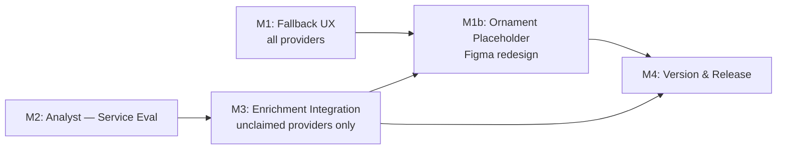

# Plan 119 — Provider Image UX: Engaging Fallbacks + Image Enrichment

## Changelog

| Date (UTC)       | Agent   | Change                                       | Outcome   |
| ---------------- | ------- | -------------------------------------------- | --------- |
| 2026-05-02T11:00Z | planner | Initial draft created                        | Active    |
| 2026-05-02T12:00Z | planner | Revised per Critique 119 (F1, F2, F3): corrected component path to `src/features/providers/components/`; added no-throw acceptance criterion with edge-case unit test requirement; replaced non-deterministic visual-distinction criterion with testable variant | Active |
| 2026-05-02T12:10Z | implementer | M1 implementation started (TDD-first) | In Progress |
| 2026-05-02T17:00Z | analyst | M2 analysis complete: `agent-output/analysis/119-image-enrichment-service-analysis.md` | Active |
| 2026-05-02T17:30Z | planner | Reviewed M2 analysis; resolved D7/D8/D9; refined M3 scope; added pre-M3 gating tasks; updated Open Questions | In Progress |
| 2026-05-02T19:00Z | planner | **Major revision**: Pivoted M3 from Logo.dev domain→logo to Unsplash category-based stock imagery per user feedback (Logo.dev coverage gap for German-Turkish SMBs). Revised D7, D8. Rewrote M3 workflow (two-phase: pool curation → provider assignment). Simplified gating tasks (G1–G3 replaces G1–G5). Updated Risks, Testing Strategy, Handoff Notes. Analysis addendum A-7 added. | In Progress |
| 2026-05-02T20:00Z | planner | Addressed Critique F5 (updated Assumption 2: category is now primary enrichment signal, not social_website) and F8 (specified attribution display: centralized /credits page linked from footer). | In Progress |
| 2026-05-02T21:00Z | planner | Resolved G1–G3: Unsplash API key registered (G1), CATEGORY_IMAGE_POOL mapping approved with all 20 production categories and 60 search queries from live DB query (G2), rate limit analysis confirms feasibility (G3). M3 implementation is now **unblocked**. | In Progress |
| 2026-05-02T22:30Z | planner | **M1b added**: User provided Figma design for branded placeholder (ornament mask + category stock image + UFlow logo mark). New milestone M1b replaces M1's initials+gradient fallback with Figma-spec ornament-masked design. D5 re-resolved: static SVG assets (ornament overlay + UFlow logo mark) stored locally, no CDN. D10, D11 added. Milestone dependencies updated. Existing M1 tests preserved/adapted. | In Progress |
| 2026-05-02T23:15Z | code-reviewer | Re-review completed for remediated M3 + M1b implementation. Prior blockers resolved; i18n fallback label fixed in-review. Verdict: APPROVED_WITH_COMMENTS. | Code Review Approved |
| 2026-05-02T23:45Z | qa | QA completed for M1b visual rendering and M3 enrichment integration. All test gates passed (1222 tests, type-check 0 errors, lint 0 errors, build pass). M1b visual validated across responsive breakpoints (320px–1920px); all 10 placeholder callsites verified replaced. M3 curate/assign workflows operational; deterministic selection and ownership fail-close validated. No technical blockers remain. Ready for UAT. | QA Complete |
| 2026-05-02T23:50Z | uat | UAT validation completed. All objectives delivered: M1b ornament placeholder per Figma rendering correctly; M3 Unsplash enrichment workflow operational; visual polish achieved; operator path clear; security/accessibility compliant. Value statement demonstrably met. All quality gates passed (code review approved, full test suite 1222 passing, zero blockers). | UAT Approved |
| 2026-05-03T18:40Z | code-reviewer | Re-review completed after latest remediation request before QA; prior i18n blockers in UnifiedGallery/useImageFallback verified resolved and regression coverage confirmed. | Code Review Approved |
| 2026-05-03T19:15Z | qa | QA validation confirmed: comprehensive test strategy executed for M1b visual rendering and M3 enrichment integration. All gates passed (59/59 Plan 119 tests, 1223/1223 full suite, type-check 0 errors, lint 0 errors, build success). M1b visual validated across responsive breakpoints; M3 workflows operational; ownership fail-close validated; no technical blockers. Ready for UAT. | QA Complete |
| 2026-05-03T19:45Z | uat | UAT validation completed. All objectives delivered: M1b ornament placeholder per Figma rendering correctly; M3 Unsplash enrichment workflow operational; visual polish achieved; operator path clear; security/accessibility compliant. Value statement demonstrably met. All quality gates passed (code review approved, full test suite 1223 passing, zero blockers). | UAT Approved |
| 2026-05-03T19:15Z | qa | QA validation confirmed: comprehensive test strategy executed for M1b visual rendering and M3 enrichment integration. All gates passed (59/59 Plan 119 tests, 1223/1223 full suite, type-check 0 errors, lint 0 errors, build success). M1b visual validated across responsive breakpoints; M3 workflows operational; ownership fail-close validated; no technical blockers. Ready for UAT. | QA Complete |

## Plan Header

| Field          | Value                                                                       |
| -------------- | --------------------------------------------------------------------------- |
| Plan ID        | 119                                                                         |
| Target Release | Next available patch after current `origin/main` version (v0.12.2); confirm at DevOps Stage 1 |
| Epic Alignment | Provider Profile Quality / Provider Discovery UX                            |
| Related Issues | None (GitHub issue to be created after plan is written)                     |
| Classification | Feature                                                                     |
| Pipeline       | Full (with Analyst gate before M3)                                          |
| GitHub Issue   | https://github.com/abu-lina/uflow/issues/203                                |
| Created        | 2026-05-02T11:00Z                                                           |

> **Housekeeping note**: `agent-output/deployment/119-stage1-v0.12.1.md` carries `Status: Released`
> (terminal) but is outside `closed/`. This is an orphan from the prior Plan 119 lifecycle.
> DevOps should move it to `agent-output/deployment/closed/` as part of Stage 1 housekeeping.

---

## Value Statement and Business Objective

> **As a Muslim user browsing UFlow's provider directory, I want to see visually engaging,
> identity-bearing visuals for every provider card—even before a logo is uploaded—so that
> the discovery experience feels polished and trustworthy, not like a broken app full of
> gray boxes; and as the platform operator, I want a clear path to automatically enriching
> provider profiles with real logos for recognised brands, so that the directory looks
> professional and attracts more providers to claim their listings.**

---

## Objective

Two complementary deliverables:

1. **Fallback UX (M1)** — Replace the generic static `placeholder.jpg` with a dynamic,
   identity-aware fallback rendered whenever a provider has no uploaded images. The
   fallback should convey brand identity (initials, category colour, or icon) without
   any external network dependency.

2. **Image Enrichment (M2–M3)** — Evaluate image enrichment services, then integrate
   category-based stock imagery from Unsplash to automatically supply beautiful,
   category-relevant photos for unclaimed providers. Each category gets a curated pool
   of 5–10 images with hash-based assignment for visual variety.

---

## Context & Background

### Current State

Every provider that lacks uploaded images falls through to `public/images/placeholder.jpg`
—a static, generic grey image. This is wired in at least **10 component locations**:

| File | Fallback site |
| ---- | ------------- |
| `src/components/providers/ProviderCard.tsx` | `getImageUrl()` → `/images/placeholder.jpg` |
| `src/components/providers/ProviderCardModal.tsx` | `allImageUrls` memoization |
| `src/components/providers/ProviderDetailModal.tsx` | `PLACEHOLDER_IMAGE` constant |
| `src/components/providers/ProviderCardLegacy.tsx` | Two inline refs |
| `src/components/shared/MobileProfileProviderCard.tsx` | `normalizedImageUrl` |
| `src/utils/imageUtils.ts` | `PLACEHOLDER_IMAGE` export |
| `src/hooks/useImageFallback.ts` | via `imageUtils` |
| `src/components/shared/CategoryGallery.tsx` | gallery pad |
| `src/components/shared/CommunityServiceGallery.tsx` | gallery pad |
| `src/components/shared/UnifiedGallery.tsx` | `PLACEHOLDER_IMAGE` constant |

### Existing Infrastructure (Plan 065)

Plan 065 (v0.10.0) established:
- `enrichment_candidates` table with admin review flow (approve / reject / bulk-approve)
- CLI runner with dry-run / write modes
- Ownership scoping: **unclaimed providers only** (`provider_owner_id IS NULL`)

M1–M3 of Plan 065 are released. Plan 065's M4–M5 (additional enrichment sources) remain
deferred. This plan adds image enrichment as a new enrichment dimension layered on top of
the existing infrastructure.

### Security Constraint

`ProviderCardModal.tsx` enforces a `isTrustedUrl()` check that restricts displayed images
to the Supabase Storage domain only. Any enriched image retrieved from an external service
**must be downloaded and stored in Supabase Storage** before it can be displayed. Direct
CDN pass-through from external logo APIs is blocked by this guard.

### Image Storage Format

Provider images are stored as JSONB `{ "urls": ["https://supabase-storage/..."] }` in the
`providers.provider_images` column.

---

## Assumptions

1. The `provider_owner_id IS NULL` filter is the canonical definition of "unclaimed" for
   enrichment scope — consistent with Plan 065.
2. The provider's **category** (`category.name_en` / `category_id`) is the primary
   enrichment signal for stock image selection. The `social_website` field is no longer
   the primary lookup mechanism after the Unsplash pivot — domain-based logo enrichment
   is demoted to an optional future enhancement. Category-based selection gives 100%
   provider coverage regardless of whether `social_website` is populated.
3. Iconify is available in the project for category-level fallback icons (confirmed:
   `Icon` from `@iconify/react` is already imported in `ProviderCard.tsx`).
4. Enriched images from external services will be sized, converted (WebP), and stored in
   Supabase Storage before display — matching the existing image pipeline pattern from
   Plan 034 (WebP performance fix).
5. The analyst will perform live API spot-checks on all candidate services as part of M2
   (satisfying the Third-Party Source Verification requirement for M3).

---

## Decision Record

| # | Decision | Status | Rationale |
|---|----------|--------|-----------|
| D1 | Fallback UX applies to **all** providers regardless of ownership status | `[RESOLVED]` | Visual polish affects the entire directory; no ownership filter needed for M1 |
| D2 | Image enrichment (M3) scoped to **unclaimed providers only** (`provider_owner_id IS NULL`) | `[RESOLVED]` | Matches Plan 065 precedent; prevents overwriting owner-uploaded images |
| D3 | Enriched images must transit through Supabase Storage before display | `[RESOLVED]` | Required by `isTrustedUrl()` security guard in `ProviderCardModal.tsx`; direct CDN URLs would be silently rejected in the modal. Note: `ProviderCard.tsx` (discovery grid) does not currently enforce this guard, but routing all enriched images through Supabase Storage is required for modal display correctness and is the project's established best practice. |
| D4 | Admin review gate for all enriched images before they surface in `provider_images` | `[RESOLVED]` | Consistent with Plan 065 admin approval workflow; prevents unreviewed content reaching users |
| D5 | Fallback component uses zero external network dependencies (pure CSS / SVG / Iconify) | `[RESOLVED]` | Platform already achieved 85% bundle reduction (Plan 007); adding a per-card CDN call for fallbacks would regress performance; DiceBear CDN excluded. **Updated M1b**: static SVG assets (ornament overlay, UFlow logo mark) are bundled locally in `public/images/` — no CDN calls. Category stock images come from M3's Supabase Storage pool (already downloaded). |
| D6 | DiceBear npm library (`@dicebear/collection`) is an **optional** implementation consideration for M1 | `[RESOLVED]` | Bundle impact must be measured against aesthetic value; implementer decides; DiceBear CDN URL approach is excluded per D5 |
| D7 | Which enrichment service to use | `[RESOLVED]` | **Unsplash API** (primary) with **Pixabay API** (contingent fallback). The original Logo.dev Pro recommendation assumed domain→logo enrichment, but the user identified a critical coverage gap: most UFlow providers are small German-Turkish community businesses NOT indexed in brand logo databases. The revised approach uses **category-based stock imagery** — searching Unsplash for beautiful photos matching each provider's category (e.g., "turkish restaurant", "bakery", "mosque"). Unsplash API is free, has universal coverage (every category has thousands of photos), and the Unsplash License permits download+store. Attribution required (photographer name + Unsplash link). Pixabay is the no-attribution fallback. See analysis addendum A-7. |
| D8 | Image selection strategy (category-based vs. domain-based vs. combined) | `[RESOLVED]` | **Category-based**: each provider's `category.name_en` (or `category_id`) maps to a curated set of Unsplash search queries. The category→query mapping is the primary signal. Domain extraction (D8-original) is no longer the primary lookup mechanism — a provider's business category determines the stock image pool, not its website URL. This gives 100% provider coverage regardless of whether `social_website` is populated. |
| D9 | Whether M3 integration reuses Plan 065's `enrichment_candidates` table or extends it | `[RESOLVED]` | **Extend** the existing `enrichment_candidates` table with an `enrichment_type` column (e.g., `'image'` vs `'data'`) to distinguish image enrichment from existing data enrichment. Reuse Plan 065's admin review surface (approve/reject/bulk-approve). No new table needed. |
| D10 | Placeholder visual design: ornament-masked stock image vs. initials+gradient | `[RESOLVED]` | **Ornament-masked stock image** per user-provided Figma design (node 460:2818). Mint background (`#d8efe5`), Islamic geometric ornament SVG overlay, category-relevant stock photo visible through diamond-grid cutouts, small UFlow inner logo mark (crescent) centred with luminosity blend. This replaces the M1 initials+gradient+Iconify approach. Figma is the visual source of truth. |
| D11 | Asset delivery for ornament mask and logo mark | `[RESOLVED]` | Both assets are exported from Figma as SVGs and stored in `public/images/` (ornament-mask.svg, uflow-logo-mark.svg). They are static and versioned in the repo. No CDN dependency. The ornament SVG uses CSS mask-image for the diamond-grid effect over the stock photo. |

---

## Milestones

### M1 — Fallback UX: Engaging No-Image States

**Objective**: Replace the generic `placeholder.jpg` with a shared, dynamic fallback
component that visually represents the provider's identity even without an uploaded image.

**Ownership scope**: All providers (no ownership filter — visual fallback affects all cards).

**What to deliver**:

- A new shared fallback component at `src/features/providers/components/` that
  accepts `provider_name`, `category`, and `provider_id` as inputs and renders an
  identity-bearing fallback in the same aspect ratio and border-radius as the image slot.
  (Note: `src/components/providers/` is the legacy location; per the Placement Rubric,
  new domain-specific UI belongs in `src/features/<domain>/components/`.)
- The component MUST gracefully handle null/undefined for all inputs (anonymous fallback).
  It MUST NOT throw for any input value — including null, undefined, empty string,
  Arabic/RTL text, emoji, or strings longer than 200 characters. The providers grid has
  no ErrorBoundary; a render throw would unmount the entire discovery grid.
- Replace **all 10 placeholder.jpg callsites** listed in the Context table above.
  The static `/images/placeholder.jpg` should be retained as an absolute last resort but
  should not be reachable from normal rendering paths.

**Visual approach options** (implementer selects; multiple can compose):

| Approach | Notes |
|----------|-------|
| Initials + gradient | First letter(s) of `provider_name`; gradient derived from name-hash for colour uniqueness; highest identity signal |
| Category icon | Iconify icon matching the provider's `category.name_en` or `category_id`; requires a category→icon mapping table |
| Branded geometric | UFlow brand colours + pattern/crescent motif; generic but polished |
| Combined | Initials large + small category icon badge — highest visual richness |

**Acceptance criteria**:
- A provider with no `provider_images` renders a fallback that shows at minimum the
  provider's initials or category icon in the card image slot.
- Given two providers with distinct `provider_name` values OR distinct
  `category.category_id` values, the fallback renders at least one visually distinct
  property (different initials text, different derived colour, or different icon).
  Unit tests must verify this with at least two distinct-name and two distinct-category
  fixture pairs.
- The component must not throw for any input combination: null, undefined, empty string,
  Arabic/RTL text (e.g. `"مسجد"`), emoji (e.g. `"☪️ Bakery"`), or strings >200 chars.
  Unit tests must exercise each of these edge cases explicitly.
- No external HTTP request is made to render the fallback.
- All 10 placeholder.jpg callsites are replaced; a `grep` for `/images/placeholder.jpg`
  in `src/` returns only the absolute-fallback path in `imageUtils.ts` (or equivalent).
- Existing image loading and error states (skeleton, `onLoad`) continue to work.
- No visual regression on cards that already have images.
- Responsive from 320 px to 1920 px; accessible (`aria-label` / `alt` text preserved).

---

### M2 — Analyst: Image Enrichment Service Evaluation

**Objective**: Produce an evidence-backed recommendation for which paid image enrichment
service best fits UFlow's provider directory (German Muslim SMBs, ~80 % lacking images).

**This milestone is an analyst handoff** — it gates M3 and must be completed and accepted
before M3 implementation begins.

**REQUIRES ANALYSIS — specific investigation areas**:

| Ref | Area | Priority |
|-----|------|----------|
| A-1 | **Brandfetch** (`brandfetch.com`): API reachability, logo quality for German/Muslim SMBs, pricing tiers, ToS for storage/redistribution | Required |
| A-2 | **Logo.dev** (`logo.dev`): same as A-1; note its simple domain→SVG model | Required |
| A-3 | **Clearbit Logo API** (`logo.clearbit.com/{domain}`): availability (Clearbit was acquired by HubSpot), pricing, ToS | Required |
| A-4 | **Pexels API** (`pexels.com/api`): suitability for provider hero images (stock photos, not logos); free-tier rate limits; attribution requirements | Optional |
| A-5 | **DiceBear npm library** (`@dicebear/collection`): bundle size delta; suitability as M1 fallback option (local rendering, no CDN call) | M1 input |
| A-6 | **Additional candidates** the analyst surfaces (e.g., Brandfetch alternatives, Bing Entity Search with no-Google constraint confirmed, etc.) | Optional |

**Analyst deliverables**:

1. Coverage spot-check: for a sample of 10–20 known UFlow provider domains, which services
   return a logo/image? Record hit rate.
2. Pricing summary: cost per lookup at 500/1000/5000 providers for each viable service.
3. ToS compliance: can UFlow download, store in Supabase, and display without attribution?
4. Ranked recommendation: top 1–2 services with justification and integration complexity
   rating (low/medium/high).
5. Domain extraction coverage: what % of current unclaimed providers have a parseable
   `social_website` field? (SQL: `SELECT COUNT(*) FROM providers WHERE provider_owner_id IS NULL AND social_website IS NOT NULL`)
6. DiceBear bundle impact estimate for M1 decision (D6).

**Acceptance criteria for M2**:
- All A-1 through A-3 investigations completed with Confidence ≥ "Observed" or "Proven".
- At least one service is recommended at Confidence "Proven" with live API spot-check evidence.
- ToS storage/redistribution clause verified for the recommended service.
- Analyst output documented in `agent-output/analysis/119-image-enrichment-service-analysis.md`.

---

### M1b — Placeholder Image Redesign: Ornament-Masked Stock Image (Figma Spec)

> **Status**: New milestone — replaces M1's initials+gradient visual approach with the
> user-provided Figma design. M1's infrastructure (component shell, callsite replacement,
> no-throw safety, test harness) is preserved; only the visual rendering changes.

**Objective**: Redesign `ProviderImageFallback` to render the branded ornament placeholder
design from Figma (node `460:2818`): a mint-green background with category-relevant stock
photo visible through an Islamic geometric ornament SVG mask, with a small UFlow inner logo
mark centred with luminosity blend.

**Design source**: `https://www.figma.com/design/mH4p6c8GExOuLn65WdSPMb/playground?node-id=460-2818`

**Ownership scope**: All providers (same as M1 — visual fallback affects all cards).

**Dependencies**: M3 (curated stock images must exist in Supabase Storage for the background
photo layer). Falls back gracefully if no stock image is available for a provider's category
(mint background + ornament overlay without a photo, which is still visually polished).

**What to deliver**:

1. **Export two static SVG assets from Figma** and place in `public/images/`:
   - `ornament-mask.svg` — the Islamic geometric ornament pattern (Figma node `460:2819`,
     viewBox `0 0 163 163`). Used as a CSS `mask-image` or visual overlay.
   - `uflow-logo-mark.svg` — the UFlow inner crescent/leaf mark only (Figma node `460:2823`,
     viewBox `0 0 25.33 19.22`). Rendered centred with `mix-blend-mode: luminosity`.

2. **Rewrite `ProviderImageFallback` visual rendering** to match Figma composition:

   **Layer stack** (bottom to top):
   - **Layer 1 — Background**: solid mint `#d8efe5`, fills the card image slot
     (`absolute inset-0`, `rounded-t-3xl`)
   - **Layer 2 — Stock photo**: category-relevant image from M3's Supabase Storage pool,
     displayed as `object-cover` filling the slot. Selected deterministically per provider
     using the existing `selectDeterministicPoolImage` helper from
     `src/lib/enrichment/image-enrichment.ts`. If no pool image is available for the
     provider's category, this layer is omitted (mint background shows through).
   - **Layer 3 — Ornament overlay**: the ornament SVG rendered as a semi-transparent white
     overlay (`opacity ~0.85–0.95`) covering the full slot. This creates the diamond-grid
     visual where the stock photo peeks through the geometric cutouts.
   - **Layer 4 — UFlow logo mark**: the crescent/leaf SVG rendered small (~22×19 px) centred
     in the slot with `mix-blend-mode: luminosity` and reduced opacity, giving a subtle
     branded watermark.

3. **Props and data flow**:
   - `ProviderImageFallback` already receives `providerId` and `categoryId`. Use these to
     look up the category's stock image pool URL. The component does NOT make network calls
     at render time — it constructs a Supabase Storage URL deterministically.
   - New optional prop: `stockImageUrl?: string | null` — the caller (`ProviderCard`)
     resolves the stock image URL and passes it in. If null/undefined, Layer 2 is omitted.
   - Retain existing props: `anonymousName`, `fallbackImageAriaLabel`, `className`.

4. **ProviderCard integration**:
   - When no `provider_images` exist, `ProviderCard` resolves the stock image URL from the
     enrichment pool manifest (or a lightweight client-side lookup) and passes it to
     `ProviderImageFallback` as `stockImageUrl`.
   - **ILLUSTRATIVE ONLY** — conceptual flow:
     ```
     hasImage=false → resolve stockImageUrl from category pool → render ProviderImageFallback
     ```

5. **Remove M1's initials+gradient+Iconify visual elements**:
   - Remove `TONE_PALETTE`, `CATEGORY_ICON_MAP`, initials logic, and Iconify `<Icon>`
     from the fallback component. These are replaced by the ornament design.
   - The `data-fallback-tone` and `data-fallback-icon` test attributes are removed.
   - Existing tests that assert on these specific attributes will be adapted.

**Constraints**:
- No external CDN calls at render time (ornament SVG and logo mark are local static assets)
- Stock photo URL points to Supabase Storage (passes `isTrustedUrl()`)
- Component MUST still not throw for any input (null/undefined/empty/RTL/emoji/long strings)
- Responsive from 320 px to 1920 px
- Accessible: `aria-label` preserved on the fallback container

**Acceptance criteria**:
- A provider with no `provider_images` renders the ornament-masked placeholder with mint
  background, matching the Figma design composition.
- If a stock image is available for the provider's category, it is visible through the
  ornament diamond-grid cutouts.
- If no stock image is available, the fallback still renders (mint + ornament + logo mark)
  without errors.
- The UFlow logo mark is centred and uses luminosity blend.
- Two providers in distinct categories with available stock images show different background
  photos through the ornament mask.
- The component does not throw for any input combination (same edge cases as M1).
- No external HTTP requests are made by the component itself (URLs are pre-resolved).
- All existing ProviderCard no-image tests are updated to assert the new visual structure.
- Responsive rendering: ornament scales correctly from 320 px (mobile cards ~h-36) to
  1920 px (desktop cards ~h-64).

---

### M3 — Enrichment Integration: Category-Based Stock Imagery (Revised Post-User-Feedback)

> **Status**: Scope **revised** from Logo.dev domain→logo to Unsplash category-based stock
> imagery. User identified critical coverage gap: German-Turkish SMBs are not indexed in
> brand logo databases. Category-based approach gives 100% provider coverage.

**Objective**: Build a category-based stock image enrichment workflow that assigns beautiful,
category-relevant Unsplash photos to unclaimed providers, stores them in Supabase Storage,
and routes them through the existing admin review flow. Providers within the same category
get visually distinct images via a variety mechanism (pool of 5–10 images per category,
deterministic provider-based selection).

**Ownership scope**: Unclaimed providers only (`provider_owner_id IS NULL`).

**Pre-M3 Gating Tasks** (MUST complete before implementation):

| # | Task | Owner | Status |
|---|------|-------|--------|
| G1 | Register for Unsplash API access (free developer account at unsplash.com/developers) | User/Operator | **Done** — App ID and Access Key obtained |
| G2 | Define CATEGORY_IMAGE_POOL: list of provider categories with 2–3 Unsplash search queries each | Planner + User | **Done** — 20 categories mapped, 60 queries approved (see below) |
| G3 | Verify Unsplash demo tier rate limits (50/hr) are sufficient for initial batch (~200 calls) | Implementer | **Done by analysis** — 20 categories × 3 queries × ~1 call each = ~60 search API calls; well within 50/hr with batched delays. Image CDN downloads do NOT count against rate limits. |

**Workflow** (two-phase: pool curation → provider assignment):

**Phase 1 — Image Pool Curation** (one-time batch per category):
1. **Category→query mapping**: Use the approved `CATEGORY_IMAGE_POOL` config (20 categories,
   3 queries each). Full mapping:

   **`all` section** (4 categories):
   | category_id | name_en | Queries |
   |---|---|---|
   | `21e8a577-f42c-499d-a277-0b8ba327c00b` | Education | `"classroom teaching"`, `"library study"`, `"tutoring session"` |
   | `20c10efe-404b-4a39-bb81-5089a0332d78` | Food & Drink | `"halal restaurant interior"`, `"mediterranean food table"`, `"kebab restaurant"` |
   | `b43ba9ba-965e-46f8-a97e-c76d352c2ff0` | Crafts & Repair | `"craftsman workshop"`, `"repair tools workbench"`, `"artisan handwork"` |
   | `5e5d910d-d790-4184-a061-9cd74d0950e8` | Other | `"small business storefront"`, `"local shop interior"`, `"business owner portrait"` |

   **`food` section** (12 cuisine categories):
   | category_id | name_en | Queries |
   |---|---|---|
   | `8204a370-26fb-4c8d-8183-2e5550a09dcb` | Afghan | `"afghan food kabuli"`, `"afghan restaurant"`, `"mantu afghan dish"` |
   | `a8d3cf09-b606-4de9-8744-b8c584c5e172` | Arabic | `"arabic food mezze"`, `"shawarma restaurant"`, `"middle eastern cuisine"` |
   | `d2cef2bf-bd0b-4b54-8606-ac371a1e1588` | Balkan | `"balkan grill cevapi"`, `"balkan restaurant food"`, `"bosnian cuisine"` |
   | `7ef6672b-97a2-4078-9d04-6ad1db6bac28` | German Cuisine (Halal) | `"german restaurant interior"`, `"schnitzel food"`, `"german beer garden food"` |
   | `f0118e0e-1b6d-4691-b5d9-aa1a5c2aa9ae` | Indian-Pakistani | `"indian curry biryani"`, `"pakistani restaurant"`, `"tandoori food"` |
   | `b35965ed-fdb0-4bc5-a872-ab3bbc5139de` | Italian | `"italian pizza restaurant"`, `"pasta fresh italian"`, `"italian trattoria"` |
   | `d6812686-a908-43a5-9621-845a69ead77d` | North African | `"moroccan tagine food"`, `"couscous north african"`, `"tunisian cuisine"` |
   | `611dd280-59d7-4996-a4e1-046c0ddfe6b6` | East African | `"east african food injera"`, `"somali restaurant"`, `"ethiopian cuisine"` |
   | `b39cf9f5-fb5d-4e17-bc1a-2d379e130e82` | Persian | `"persian rice saffron"`, `"iranian restaurant"`, `"persian kebab food"` |
   | `f577c7ce-d2e2-46ba-b494-57b038aa4b48` | Southeast Asian | `"thai food pad thai"`, `"indonesian nasi goreng"`, `"malaysian curry"` |
   | `232c2870-7929-43eb-a909-6cac90203192` | Turkish | `"turkish kebab doner"`, `"turkish breakfast spread"`, `"turkish restaurant interior"` |
   | `93808e5e-c124-4dc7-a107-9867cc708a52` | West African | `"west african jollof rice"`, `"nigerian food"`, `"senegalese cuisine"` |

   **`store` section** (3 categories):
   | category_id | name_en | Queries |
   |---|---|---|
   | `1288f269-2cdb-47e8-bd8e-9d552ff25e83` | Services | `"professional office meeting"`, `"business consultation"`, `"coworking space"` |
   | `df8e549d-54c4-48ef-8e0b-c5a6646fcb7d` | Health & Sports | `"fitness gym interior"`, `"wellness spa"`, `"sports training"` |
   | `49563bf0-6962-4fd8-9147-5e68e9310eb1` | Clothing & Fashion | `"fashion boutique display"`, `"modest fashion hijab"`, `"clothing store interior"` |

   **`ummah` section** (1 category):
   | category_id | name_en | Queries |
   |---|---|---|
   | `4470c3e0-458f-40a6-a96e-ca0fbdf145d7` | Community Support | `"community volunteers"`, `"charity donation hands"`, `"mosque community gathering"` |
2. **Unsplash search**: For each query, call the search endpoint with
   `orientation=landscape&content_filter=high&per_page=10`. Select top 5–10 results
   per category (across all query variants).
3. **Download tracking**: For each selected photo, trigger `GET /photos/:id/download`
   as required by Unsplash API terms.
4. **Image processing**: Download image buffer from the `raw` or `regular` URL with
   Imgix size params (e.g., `&w=800&h=600&fit=crop`). Convert to WebP. Validate
   (non-zero, ≤5 MB, image MIME type).
5. **Upload to Supabase Storage**: Store at path
   `enrichment/stock/{category}/{photo_id}.webp`.
6. **Record attribution**: Store photographer name, Unsplash profile URL, and original
   photo URL alongside each image for attribution compliance.

**Phase 2 — Provider Assignment** (batch assign from pool):
1. **Query candidates**: Unclaimed providers with no existing `provider_images`,
   joined with their category.
2. **Deterministic selection**: For each provider, hash `provider_id` to select a
   specific image from that category's pool. This ensures: (a) different providers get
   different images even within the same category, (b) the same provider always gets the
   same image (idempotent re-runs).
3. **Candidate staging**: Insert into `enrichment_candidates` with
   `enrichment_type = 'image'`, `status = 'pending_review'`,
   `image_url = <supabase_storage_url>`, `source_service = 'unsplash'`,
   `source_category = <category_name>`.
4. **Admin review**: Reuse Plan 065's admin review surface. On approval, update
   `providers.provider_images` JSONB by appending the Supabase Storage URL.

**Schema extension** (migration):

- Add `enrichment_type TEXT DEFAULT 'data'` to `enrichment_candidates` (or new column if
  table uses different naming)
- Add `image_url TEXT` column (nullable — only populated for `enrichment_type = 'image'`)
- Add `source_service TEXT` column (e.g., `'unsplash'`, `'pixabay'`)
- Add `source_category TEXT` column (category used for pool selection)
- Add `attribution JSONB` column (nullable — stores `{ photographer, profile_url, photo_url }` for Unsplash compliance)

**CLI runner**:

- Create `scripts/enrich-images.ts` (or extend Plan 065 CLI runner)
- Required modes:
  - `--curate` — Phase 1: search Unsplash, download pool images, upload to Supabase Storage
  - `--assign --dry-run` — Phase 2 dry run: report which providers would get which images
  - `--assign --write` — Phase 2 write: stage candidates in `enrichment_candidates`
- Rate limiting: respect Unsplash demo 50/hr limit; batch with delays as needed
- Environment variable: `UNSPLASH_ACCESS_KEY` (API key)

**Constraints**:
- `isTrustedUrl()` check: images MUST reside on Supabase Storage (no Unsplash CDN hotlinking in production display)
- Unsplash download tracking endpoint MUST be called for every downloaded photo
- Attribution must be maintained for all Unsplash-sourced images
- **Attribution display (F8)**: Unsplash-sourced images must display photographer credit.
  Implementation approach: a site-wide `/credits` or `/attributions` page linked from
  the footer, listing all Unsplash photographers whose images appear on the platform.
  Individual card-level attribution is NOT required — a centralized credits page
  satisfies the Unsplash API guidelines. The `attribution` JSONB column in
  `enrichment_candidates` provides the data source for this page.
- Dry-run mode mandatory before any write mode
- Ownership fail-close: if `provider_owner_id` changes to non-null between staging and
  admin approval, the write to `provider_images` is skipped
- No unclaimed provider's existing approved images are overwritten (append only)
- Visual variety: minimum 5 distinct images per category pool to avoid "all look the same"

**Acceptance criteria**:
- CLI `--curate` downloads and stores ≥5 images per category in Supabase Storage
- CLI `--assign --dry-run` completes without errors, reports candidate count per category
- CLI `--assign --write` stages ≥1 test provider into `enrichment_candidates` with `enrichment_type = 'image'`
- Two providers in the same category with different `provider_id` values receive different images from the pool
- Admin approval flow updates `provider_images` JSONB with Supabase Storage URL
- Approved image displays correctly in both ProviderCard (grid) and ProviderCardModal
- Ownership fail-close: write is skipped if `provider_owner_id` becomes non-null
- Unsplash rate limits respected (no 429 errors in normal operation)
- Attribution data stored for every Unsplash-sourced image

---

### M4 — Version & Release Artifacts

**Objective**: Update project version and release documentation.

**Tasks**:
- Bump `package.json` version to the confirmed next available patch after v0.12.2.
- Add `CHANGELOG.md` entry documenting M1, M1b, and M3 if shipped in same release.
- Update README if provider image docs exist.

**Acceptance criteria**:
- `package.json` version matches git tag applied by DevOps.
- CHANGELOG entry is clear and references this plan by ID and milestone.

---

## Milestone Dependencies



**Sequencing rule**: M1 (component shell + callsite replacement) is complete. M1b depends on
M3 (stock images in Supabase Storage) for the background photo layer, but renders gracefully
without it (mint + ornament only). M1b can begin implementation of the SVG overlay and layout
immediately; the stock image integration connects when M3 pool is available. M3 and M1b both
gate M4.

---

## Testing Strategy

Expected test types (QA agent owns specifics):

- **Unit tests**: Fallback component rendering — no-image state, null-input state, various
  provider names (short, long, Arabic script, single word), category icon mapping.
- **Snapshot / visual regression**: Confirm fallback renders the expected visual structure
  without relying on placeholder.jpg.
- **Integration tests**: Confirm all 10 placeholder.jpg callsites no longer return the
  static path under the no-image scenario.
- **Performance check**: Confirm no external HTTP calls are made when rendering the
  fallback (network interception in test).
- **M1b unit tests**: Ornament fallback renders ornament overlay SVG, UFlow logo mark SVG,
  and optional stock image layer. No-throw safety for all input edge cases (same as M1).
  Assert that two providers in distinct categories render different stock image URLs.
  Assert graceful degradation when no stock image URL is provided (mint + ornament only).
- **M3 integration tests**: CLI curate mode downloads and stores pool images; assign
  dry-run produces expected enrichment candidates; assign write mode stages candidates
  correctly; admin approval updates `provider_images`; ownership fail-close triggers on
  mid-flight ownership change; two providers in same category get different images;
  attribution data is stored for every sourced image.

---

## Validation

- Visual QA on mobile (320 px, 375 px, 430 px) and desktop (1280 px, 1920 px): fallback
  cards look polished, not broken.
- Browse the `/providers` page with a test account and confirm no card shows the generic
  grey placeholder.
- Confirm `provider_images`-carrying providers still show their real image (no regression).
- M3: Confirm a dry-run run against UAT data completes without errors.
- M3: Confirm at least two providers in the same category display different stock photos.

---

## Risks

| Risk | Severity | Mitigation |
|------|----------|------------|
| Unsplash search results not relevant for niche categories (e.g., Islamic bookshop) | Medium | Use multiple query variants per category; manual curation via admin review gate; Pixabay as alternative source |
| Clearbit Logo API deprecation (HubSpot acquisition) | ~~Medium~~ Eliminated | Clearbit confirmed discontinued Dec 2025; Logo.dev (same team) is the successor |
| DiceBear npm bundle regression | ~~Low~~ Eliminated | M2 analysis confirmed M1's CSS+Iconify approach adds 0 kB; DiceBear (4 kB gzipped) not needed |
| `isTrustedUrl` check causes enriched images to silently fail | High | M3 architecture routes all enriched images through Supabase Storage; integration tests verify |
| M1 fallback increases CSS/SVG complexity without meaningful visual gain | Low | Limit to 2–3 fallback variants; no over-engineering |
| Orphan doc `119-stage1-v0.12.1.md` (Status: Released, outside closed/) | Low | DevOps moves to `deployment/closed/` at Stage 1 housekeeping; no plan impact |
| Unsplash attribution requirement adds UI complexity | Low | Attribution stored in DB; display in credits page or small text overlay; Pixabay fallback requires no attribution |
| Unsplash API terms may restrict batch download-and-store | Low | Download tracking endpoint exists for this purpose; Unsplash License explicitly permits download, copy, modify, distribute; compliance path documented in analysis addendum A-7 |
| M1b ornament SVG mask rendering inconsistency across browsers | Low | CSS `mask-image` is well-supported (96%+ on caniuse); fallback: render ornament as a foreground overlay with opacity instead of mask |
| M1b stock image URL not available at ProviderCard render time (M3 pool not yet curated) | Medium | Graceful degradation: mint background + ornament + logo mark renders without stock photo — still looks polished. Stock images are additive. |
| M1b breaks existing M1 test assertions (data-fallback-tone, initials) | Low | Tests are adapted in M1b scope; red-green TDD cycle captures regressions. |

---

## Duration Estimates

| Phase | Range | Key uncertainty drivers |
|-------|-------|------------------------|
| Analysis (M2) | 2–4 h | API reachability for German SMBs; ToS clause verification for storage |
| Implementation (M1) | 0.5–1 day | Fallback design complexity; number of category icon mappings |
| Implementation (M1b) | 0.5–1 day | SVG export from Figma; CSS mask-image integration; stock image URL resolution in ProviderCard; test adaptation |
| Implementation (M3) | 1–2 days | Category→query mapping definition; Unsplash API integration; Supabase Storage upload pipeline; extent of Plan 065 reuse |
| QA | 0.5–1 day | Visual regression coverage; CLI test scaffolding |
| UAT | 2–4 h | Mobile device spot-checks; admin enrichment workflow walkthrough |
| DevOps | 1–2 h | Standard deploy pipeline |

**Total estimate**: 4–5 days elapsed (M1 complete; M1b adds 0.5–1 day after M3 stock images;
1–2 more after analyst phase).

---

## Release Strategy

Release Strategy: Standalone (no other known non-closed plans targeting v0.12.3 at time of
writing). M1 may ship as an earlier patch if M3 is not ready; coordination at DevOps Stage 1.

---

## Open Questions

> M2 analysis resolved D7/D8/D9 (revised per user feedback — Unsplash replaces Logo.dev).
> All three gating tasks are now resolved.
>
> **OPEN QUESTION [G1–G3 RESOLVED]**: G1 (Unsplash API key) — registered, keys obtained.
> G2 (category→query mapping) — 20 categories, 60 queries approved by user.
> G3 (rate limits) — ~60 search calls total, within demo 50/hr with batched delays.
> **M3 implementation is unblocked.**

---

## Third-Party Source Verification

Analyst milestone M2 is **explicitly designated as the Third-Party Source Verification
gate** for this plan. The analyst performed live spot-checks on all candidate services
(A-1 through A-6) as part of M2 deliverables. Post-M2, the planner investigated Unsplash
API docs (A-7 addendum): API endpoints, rate limits, license terms, and download-and-store
compliance path verified from official documentation at `unsplash.com/documentation` and
`unsplash.com/license`. The Unsplash license and API terms pages returned HTTP 401 during
direct fetch — the compliance path is documented based on the developer documentation and
widely-published Unsplash License terms.

---

## Handoff Notes

- **Critic review**: Review milestone scope, ownership constraint wording, and decision
  record before implementation begins.
- **Analyst (M2 gate)**: After Critic approval, route M2 to Analyst. Provide the full M2
  investigation scope table above.
- **Implementer (M1)**: Can begin immediately after Critic approval; M3 requires M2 first.
- **Implementer (M1b)**: Requires M1 complete (component shell exists) and M3 stock images
  in Supabase Storage (for the background photo layer). Export ornament and logo mark SVGs
  from Figma before implementation. Adapt existing M1 tests — initials/gradient assertions
  are replaced by ornament/overlay/logo assertions. Figma design node `460:2818` is the
  visual source of truth. The ornament SVG (node `460:2819`) and logo mark SVG (node
  `460:2823`) have been inspected and are ready for export.
- **Implementer (M3)**: M3 scope has been revised from Logo.dev domain→logo to Unsplash
  category-based stock imagery. The enrichment pipeline architecture (CLI runner,
  `enrichment_candidates` table, admin review) remains service-agnostic. Key new elements:
  `CATEGORY_IMAGE_POOL` mapping, two-phase workflow (curate pool → assign to providers),
  hash-based deterministic image selection, Unsplash attribution storage.
- **Rollback (M1)**: Revert the fallback component and restore placeholder.jpg calls; no
  DB migrations, so rollback is clean.
- **Rollback (M1b)**: Revert `ProviderImageFallback` to M1's initials+gradient design;
  remove SVG assets from `public/images/`. No DB changes involved.
- **Rollback (M3)**: CLI is additive (new enrichment records); rollback is clearing
  pending enrichment candidates, removing stock images from Supabase Storage, and
  restoring `provider_images` to null for affected rows.
