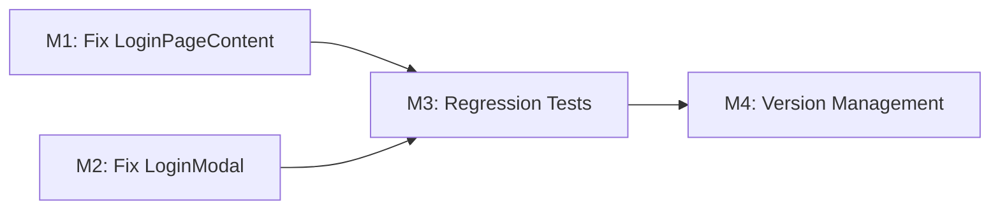

# Plan 123 — Bugfix: Navbar Auth State Not Updating Reactively Post-Login

| Field          | Value                                                                  |
| -------------- | ---------------------------------------------------------------------- |
| Plan ID        | 123                                                                    |
| Target Release | v0.12.7 (next patch after v0.12.6; confirmed available by tag pre-flight) |
| Epic Alignment | Core UX — Auth State Reactivity                                        |
| Related Issues | None (UAT user report — no GitHub issue yet)                           |
| Classification | Bugfix                                                                 |
| Pipeline       | Abbreviated                                                            |
| GitHub Issue   | (populated after creation)                                             |
| Created        | 2026-05-04T07:55Z                                                      |

| Date | Author | Summary |
|------|--------|---------|
| 2026-05-04T07:55Z | Planner | Initial plan created from analysis 123-navbar-auth-state-rca.md |
| 2026-05-04T08:10Z | Planner | Revised per Critic F1/F2/F3/F5: removed M3 (isLoading guard no-op), clarified M2 UX intent, added M1 UX note, pinned version to v0.12.7 |
| 2026-05-04T08:15Z | Planner | Revised per Critic F6/F7: marked D3 as SUPERSEDED by D6; updated Testing Strategy scenario #2 to remove stale ProfileContent reference |
| 2026-05-04T08:25Z | Implementer | Implementation started: plan status set to In Progress; entering TDD cycle for M1/M2/M3 |
| 2026-05-04T10:05Z | Code Reviewer | Code review approved; plan status updated to Code Review Approved and handed off to QA |
| 2026-05-04T10:35Z | QA | All validation gates passed (lint, type-check, test suite, build); QA Complete verdict issued; plan ready for UAT |
| 2026-05-04T10:40Z | UAT | Value statement delivery confirmed; all predecessor gates passed; approved for release; plan status updated to UAT Approved |

---

## Value Statement and Business Objective

**As a** user logging into UmmahFlow on mobile (PWA),  
**I want** the navbar profile icon to switch to the logged-in state immediately after login,  
**so that** I know my login succeeded and can access my profile without closing/reopening the app.

---

## Release Strategy

Standalone (no other known plans for v0.12.7).

---

## Decision Record

| # | Decision | Status |
|---|----------|--------|
| D1 | Fix approach: Option A — remove premature `router.push` from `handleSubmit`; let `useEffect([user])` be sole navigation trigger | [RESOLVED] Minimal, lowest-risk fix that directly addresses the L1-proven root cause |
| D2 | Also fix `LoginModal.tsx` (desktop) which has the same race condition pattern | [RESOLVED] Same code pattern = same bug on desktop; must fix both entry points |
| D3 | Add `isLoading` guard to `ProfileContent` redirect | [SUPERSEDED by D6] Originally planned as a defensive secondary fix; removed after Critic proved `isLoading` is already `false` during the race. See D6. |
| D4 | Cookie mismatch (F3) and `AuthSyncer` (W5) are OUT OF SCOPE | [RESOLVED] Not the primary cause; fixing them is a larger architectural effort (Option C); tracked for future plan |
| D5 | No changes to `AuthProvider` context or Supabase client singleton | [RESOLVED] Auth context code works correctly; the bug is in consumers (login form + profile guard) |
| D6 | M3 (ProfileContent `isLoading` guard) removed | [RESOLVED] `isLoading` from `useAuth()` is already used as `loading` in the existing guard (`!loading && !effectiveUser`) and is already `false` by the time the race condition fires — it was cleared in `initializeAuth()` on first app mount. M1 eliminates the premature navigation, making `ProfileContent` never render with stale auth state. The guard is therefore unnecessary. |
| D7 | LoginModal post-login UX: user stays on current page after login via modal | [RESOLVED] Desktop modal usage implies the user was doing something on the page (e.g., viewing a provider). Navigating away would be disruptive. Header re-renders reactively via `useAuth()` confirming login visually. If navigation to profile is needed, user can click the profile icon. |

---

## Assumptions

1. The `useEffect([user])` in `LoginPageContent` fires reliably once `onAuthStateChange(SIGNED_IN)` propagates to React state. This is proven by the fact that page reload fixes the issue (the same mechanism with `getSession` → `setUser`).
2. Removing `router.push` from `handleSubmit` does not create a functional UX gap — the `useEffect([user])` path provides the same redirect. A brief loading state (50–100ms) may be visible between form submission and the redirect firing; this is acceptable and preferable to the current redirect loop.
3. The same race condition exists in `LoginModal.tsx` (confirmed by code inspection — same pattern at line ~60).
4. No change to `ProfileContent`'s redirect guard is required. With M1 in place, `ProfileContent` will never render with stale auth state because navigation only fires after `user` is non-null in React context.

---

## Milestones

### Milestone 1: Fix Primary Race Condition in `LoginPageContent`

**Objective**: Remove the premature `router.push('/profile')` from `handleSubmit`. Let the existing `useEffect([user])` be the sole post-login navigation mechanism.

**Files affected**:
- `src/app/(public)/login/LoginPageContent.tsx`

**What to change**:
- In `handleSubmit`: When `signInWithEmailConfirmation` returns `data` without error, do NOT call `router.push`. Instead, let the function complete (the `finally` block sets `isLoading = false`). The existing `useEffect([user])` (already present at ~line 52) will detect `user` becoming non-null and navigate to `/profile` or `returnUrl`.
- Retain the `returnUrl` logic — move it into the `useEffect([user])` handler (which already handles `searchParams.get('returnUrl')`).

**Acceptance criteria**:
- After form submission, navigation to `/profile` occurs only after `user` is non-null in React context
- No `router.push` or `router.replace` call exists inside `handleSubmit` success path
- The `useEffect([user])` handler navigates to `returnUrl` if present, else `/profile`
- Existing error handling paths remain unchanged
- A loading/submitting indicator may display briefly between form submit and navigation; this is expected and acceptable (eliminates the redirect loop, which is a far worse UX)

---

### Milestone 2: Fix Same Race Condition in `LoginModal`

**Objective**: Apply the same fix pattern to the desktop `LoginModal` component.

**Files affected**:
- `src/features/auth/components/LoginModal.tsx`

**What to change**:
- In `handleSubmit`: When `data` is returned, call `onClose()` to dismiss the modal. Do NOT call `router.push('/profile')`.
- `Header.tsx` already reads from `useAuth()` — once `onAuthStateChange(SIGNED_IN)` fires, `user` becomes non-null and the Header re-renders with the authenticated profile UI. No additional wiring is needed.

**Accepted UX intent** (Decision D7): The user stays on the current page after modal login. The navbar updates reactively. If the user wants to visit their profile, they click the profile icon. This is the correct behaviour for a modal — do not navigate away from the user's current context.

**Acceptance criteria**:
- After successful login via modal, the modal closes and the desktop Header/navbar switches to the authenticated state within the same render cycle
- No `router.push` call of any kind in the modal's `handleSubmit` success path
- User remains on the page they were on when they opened the modal
- `onClose()` is called exactly once on success (as it was before)

---

### Milestone 3: Regression Tests

**Objective**: Add focused logic tests for the pre-fix and post-fix behavior following the Client-State Precedence Regression Pattern.

**Files affected**:
- `src/__tests__/` (new or updated test file)

**What to test**:
- `[pre-fix FAILS]`: Verify that calling `router.push` from `handleSubmit` before auth state propagation causes a redirect loop (mock scenario)
- `[post-fix PASSES]`: Verify that navigation occurs only via `useEffect([user])` after user state is committed to React context
- `[post-fix PASSES]`: Verify that `LoginModal.handleSubmit` does not call `router.push` after success
- Integration: mock `signInWithPassword` → verify no premature navigation → set user in context → verify navigation fires

**Acceptance criteria**:
- Tests pass with the fix applied
- Tests document the exact pre-fix failure mode
- Coverage for both `LoginPageContent` and `LoginModal` paths

---

### Milestone 4: Version Management

**Objective**: Update release artifacts to match the target version.

**Tasks**:
- Update `package.json` version to next patch (confirmed at DevOps Stage 1)
- Add CHANGELOG entry documenting the bugfix
- Commit message references Plan 123

**Acceptance criteria**:
- Version in `package.json` matches the target release
- CHANGELOG documents: "Fixed navbar profile icon not updating reactively after login"
- No other version artifacts need updating for this bugfix

---

## State-Machine Coverage (Mandatory per Instructions)

The navbar profile icon has two render states:
1. **Logged-out**: `user = null` → ProfileIcon links to `/login`
2. **Logged-in**: `user != null` → ProfileIcon links to `/profile`

**Both states are affected by this fix**:
- Logged-out → Logged-in transition: Fixed (was broken by race condition)
- Logged-in → Logged-out transition: Confirmed NOT broken (sign-out sets `user = null` synchronously in `AuthProvider.signOut()`)

---

## Milestone Dependencies

Sequencing: M1 and M2 can be implemented in parallel. M3 (tests) depends on both. M4 is final.

---

## Testing Strategy

**Test types**: Unit tests (Vitest + React Testing Library)

**Coverage expectations**:
- Client-state precedence regression tests per copilot-instructions requirement
- Mock `supabase.auth.signInWithPassword` and `onAuthStateChange` subscription
- Verify navigation timing relative to auth state commit
- No E2E tests required for this fix (race condition is testable at unit level with mocked timing)

**Critical scenarios**:
1. Login success → navigation fires ONLY after `user` is non-null
2. Login success → no premature `router.push` before user is committed to React context
3. Login with `returnUrl` → redirects to correct URL after auth commits
4. Sign-out → navbar reverts to logged-out state (confirm no regression)

---

## Duration Estimates

| Phase | Estimate | Uncertainty |
|-------|----------|-------------|
| Implementation (M1-M2) | 1 hour | Low — changes are minimal: two file edits, ~5 lines removed |
| Tests (M3) | 1-2 hours | Low — test patterns established in existing test suite |
| Code Review | 30 min | Low — small changeset |
| QA/UAT | 1 hour | Medium — requires UAT deployment and manual PWA test |
| DevOps (M4) | 30 min | Low — standard version bump |

**Total**: 3-5 hours implementation to deployment-ready

---

## Risks

| # | Risk | Likelihood | Impact | Mitigation |
|---|------|-----------|--------|------------|
| R1 | `useEffect([user])` fires too late — perceived login delay | Low | Medium | The async propagation is typically <100ms; users see the button's loading state during this window. This is preferable to the current redirect loop. |
| R2 | Desktop users may expect to land on `/profile` after modal login | Low | Low | Decision D7 explicitly chooses stay-on-page. Profile icon in Header becomes immediately clickable. If product requires auto-navigation, a `useEffect([user])` can be added to `LoginModal` later without risk. |

---

## Validation

- `npm run type-check` passes
- `npm test` passes (including new regression tests)
- `npm run lint` passes
- Manual UAT test: login on mobile PWA → navbar updates without reload

---

## Rollback

If the fix introduces regressions:
- Revert the commit (single atomic commit for M1-M3)
- The previous behavior (redirect loop → reload to fix) is the fallback — annoying but functional

---

## Out of Scope

- Cookie/localStorage architecture mismatch (F3/W1/W5) — tracked for future architectural plan
- `AuthSyncer` cookie name fix — requires coordinated server + client changes
- Migration to `createBrowserClient` from `@supabase/ssr` (Option C) — future work
- Magic link / OAuth callback auth flows — different code paths, not affected by this bug
