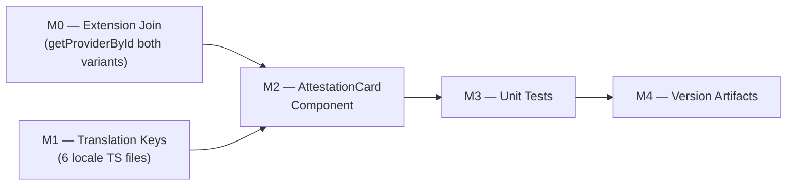

# Plan 126 — Nachweise Attestation Display

| Field          | Value                                                                         |
| -------------- | ----------------------------------------------------------------------------- |
| Plan ID        | 126                                                                           |
| Target Release | v0.12.13 (bumped from v0.12.12 at DevOps Stage 2 — v0.12.12 was claimed by Plan 129) |
| Epic Alignment | Provider Trust & Halal Transparency                                           |
| Classification | Feature                                                                       |
| Pipeline       | Full                                                                          |
| Related Issues | https://github.com/abu-lina/uflow/issues/219                                  |
| GitHub Issue   | https://github.com/abu-lina/uflow/issues/219                                  |
| Created        | 2026-05-12T10:00Z                                                             |

## Changelog

| Date                | Author  | Status    | Note                                                                                                   |
| ------------------- | ------- | --------- | ------------------------------------------------------------------------------------------------------- |
| 2026-05-12T10:00Z   | planner | Active    | Plan created from issue #219; worker session S126                                                       |
| 2026-05-12T12:45Z   | planner | Active    | Revised per Critic F-1/F-2/F-3/F-4: added M0 extension join milestone; 3 minor additions; D9 added     |
| 2026-05-12T12:48Z   | implementer | In Progress | Implementation started after Critic APPROVED; executing M0→M1→M2→M3→M4 in dependency order         |
| 2026-05-12T15:05Z   | code-reviewer | Code Review Approved | Review complete: APPROVED_WITH_COMMENTS (1 medium non-blocking UX finding)                    |
| 2026-05-12T13:10Z   | qa | QA Complete | Tests executed: 1254/1254 pass, type-check/lint pass, coverage verified, gates satisfied      |
| 2026-05-12T13:15Z   | uat | UAT Approved | Value statement delivered; 6 scenarios verified; attestation card fully functional; APPROVED FOR RELEASE |

---

## Value Statement and Business Objective

> As a **Muslim community user browsing a provider's detail page**, I want to see a **clear Islamic attestation card in the Nachweise (Attestation) section** showing which halal compliance commitments the provider has declared (`no_alcohol`, `no_pork`, `no_gambling`), so that **I can instantly trust the provider meets my requirements at a glance** — without needing to decode badge lists or read long descriptions.

### North-Star Metric

A user landing on a food/store provider's detail page can identify the provider's three halal commitment booleans within 3 seconds, with no interaction required, in all 6 supported languages.

---

## Assumptions

1. ~~The three booleans (`no_alcohol`, `no_pork`, `no_gambling`) are already populated in the `Provider` object returned to `ProviderDetailSections`.~~ **CORRECTED (Critic F-1)**: Migration `083_m5a_supertype_unification.sql` (applied 2026-05-01) dropped these columns from the `providers` table and moved them to extension tables: `no_alcohol` + `no_pork` → `food_providers`; `no_gambling` → `store_providers`. Both `getProviderById()` functions (client and server) use `SELECT * FROM providers` with no join to extension tables. As a result, the booleans are **always `undefined`** at runtime until M0 (extension join) is implemented. `buildAmenityLabels()` references to `provider.no_alcohol` and `provider.no_pork` are currently dead code paths.
2. Attestation should only render for `listing_type === 'food' | 'store'` providers. Ummah providers (mosques, services) have no extension table rows, so the booleans will always be `undefined`.
3. The i18n system is a **custom TypeScript translation model** (`src/translations/*.ts` + `useLanguage()` hook), **not** `next-intl`. Translation keys are string-literal paths resolved at runtime via `t('key.path')`.
4. The attestation card is a **display-only** component — it reads values but never mutates them.
5. No database schema change is needed. The extension tables (`food_providers`, `store_providers`) already exist. M0 adds a query-layer join only.
6. The attestation card will be placed **inside** the existing `providerDetail.sections.proofs` ExpandSection (Nachweise), above the existing `TrustBadgesSection`.
7. Fixing the missing `providerDetail.amenities.noGambling` key (pre-existing gap in the amenities section) is **out of scope** — it is a separate display layer and a different fix. See Risk R5 for the side-effect interaction.

---

## Out of Scope

1. **Adding or editing provider attestation values** — this plan is read-only display only; editing booleans is a separate provider management feature.
2. **Fixing the missing `no_gambling` in `buildAmenityLabels()`** — the amenities section is a different UI layer; tracked as a pre-existing gap, not part of this plan.
3. **Badge creation or verification workflows** — `TrustBadgesSection` is unchanged.
4. **Ummah-category providers** — no extension table join, no booleans, no card rendered.
5. **RTL layout adjustments** — existing Tailwind utility classes already handle RTL for Arabic/Urdu/Pashtu; no extra RTL work required.

---

## Decision Record

| # | Decision | Status | Rationale |
|---|---|---|---|
| D1 | Use `providerDetail.attestation.*` as the new translation namespace | [RESOLVED] | Semantic clarity — the attestation card is a formal declaration display, distinct from the informal amenity label list. Avoids coupling two different UI surfaces to the same keys. |
| D2 | Use existing custom TS translation files (`src/translations/*.ts`) | [RESOLVED] | The project does NOT use `next-intl`. Translations are plain TypeScript objects under `src/translations/`; each locale is a `.ts` file. |
| D3 | Render card only for `listing_type === 'food' \| 'store'` AND at least one boolean is `true` | [RESOLVED] | Prevents showing an empty or meaningless attestation for providers without extension columns. `undefined` booleans should not count as declared. |
| D4 | Component placed in `src/features/providers/components/AttestationCard.tsx` | [RESOLVED] | Consistent with existing `HalalTrustBanner.tsx` and `HalalTrustPopup.tsx` in the same directory. The `features/providers` domain owns all provider-detail UI. |
| D5 | `AttestationCard` is a client component (`'use client'`) | [RESOLVED] | It consumes `useLanguage()` which is a React context hook; server components cannot use hooks. Data is passed as props from the parent client component (`ProviderDetailSections`), so no extra fetch is needed. |
| D6 | No database migration required | [RESOLVED] | The three booleans already exist on the `Provider` TypeScript interface and are sourced from existing M-5 extension tables. No new columns, no index changes. |
| D7 | `noGambling` amenity translation key gap is a pre-existing issue, out of scope | [RESOLVED] | Tracked separately. The amenities section and attestation section are independent. Fixing amenities would change existing behavior in a different ExpandSection; this plan's scope is Nachweise only. |
| D8 | Target users: all Muslim community users browsing food/store provider detail pages | [RESOLVED] | The feature applies to any logged-in or anonymous user viewing a food or store provider detail page. No role restrictions. |
| D9 | M0 (extension join) is in-scope for this plan, not deferred | [RESOLVED] | Without the extension join, the `AttestationCard` would never render in production (booleans always `undefined`). Adding M0 is the minimal viable fix and keeps the feature self-contained. The alternative (separate plan) would leave a silent non-rendering feature in production. |

---

## Release Strategy

Standalone (no other known plans targeting v0.12.11 at time of writing). If another plan is assigned to v0.12.11 before DevOps Stage 1, a bundled release note must be added by the Planner updating that plan.

---

## Milestone Dependencies



**Sequencing rule**: M0 (extension join) and M1 (translation keys) are independent and may be implemented in parallel. M2 (component) requires both M0 and M1 to be complete — M0 so booleans are populated, M1 so translation keys exist. M3 (tests) must pass before M4 (version bump). M4 is the final commit gate.

---

## Milestones

### M0 — Extension Table Join in `getProviderById()` (both variants)

**Objective**: Populate `no_alcohol`, `no_pork`, and `no_gambling` on the `Provider` object returned by `getProviderById()` by joining the `food_providers` and `store_providers` extension tables.

**Context**: Migration `083_m5a_supertype_unification.sql` dropped these columns from the `providers` table and moved them to extension tables. Without this join, all three booleans are `undefined` at runtime, rendering the `AttestationCard` permanently invisible.

**Files to update**:
- `src/services/providers.ts` — client-side `getProviderById()` (L379)
- `src/services/providers.server.ts` — server-side `getProviderById()` (L22)

**Query approach** (ILLUSTRATIVE ONLY — implementer decides final form):
```
// ILLUSTRATIVE ONLY
// After fetching the main provider row, fetch extension data in parallel:
const [food, store] = await Promise.all([
  supabase.from('food_providers').select('no_alcohol, no_pork, halal_level').eq('provider_id', id).maybeSingle(),
  supabase.from('store_providers').select('no_gambling').eq('provider_id', id).maybeSingle(),
]);
// Merge onto returned object:
return { ...data, ...food.data, ...store.data, offers_ids, needs_ids, offers, needs, badges };
```

**Important side effect**: Fixing this join will also make `buildAmenityLabels()` display `no_alcohol` and `no_pork` in the amenities section for food providers — where it was previously silently suppressed. This is a **welcome side effect** (surfaces correct data), but the Implementer must be aware that the amenities section behavior changes too. The `no_gambling` amenity key is still absent from `buildAmenityLabels()` (out of scope per D7/Out of Scope item 2).

**Acceptance Criteria**:
- `getProviderById()` in `src/services/providers.ts` returns `no_alcohol`, `no_pork`, `no_gambling` populated from extension tables for food/store providers respectively
- `getProviderById()` in `src/services/providers.server.ts` returns the same extension columns
- For ummah providers (no row in `food_providers` or `store_providers`), the values are `undefined` (or `null` — consistent with `maybeSingle()` returning no row)
- Both functions return `null` for providers not found (existing behavior unchanged)
- `npm run type-check` passes without new TypeScript errors
- `npm run lint` passes
- Existing provider service tests still pass (`npm test`)

---

### M1 — Translation Keys (6 locale TypeScript files)

**Objective**: Add the `attestation` sub-object under `providerDetail` in every locale translation file.

**Files to update** (one per locale):
- `src/translations/de.ts`
- `src/translations/en.ts`
- `src/translations/ar.ts`
- `src/translations/tr.ts`
- `src/translations/ur.ts`
- `src/translations/ps.ts`

**Required keys** (under `providerDetail.attestation`):

| Key | Purpose | Example value (de) |
|---|---|---|
| `title` | Section heading inside the attestation card | `"Erklärte Verpflichtungen"` |
| `subtitle` | Short explanatory sentence | `"Diese Angaben wurden vom Anbieter erklärt."` |
| `noAlcohol` | Label for the no-alcohol commitment | `"Kein Alkohol"` |
| `noPork` | Label for the no-pork commitment | `"Kein Schweinefleisch"` |
| `noGambling` | Label for the no-gambling commitment | `"Kein Glücksspiel"` |

**Note**: The `noGambling` key does not currently exist anywhere in translations. `noAlcohol` and `noPork` exist under `providerDetail.amenities.*` but new `attestation.*` keys must be added separately for semantic independence.

**Acceptance Criteria**:
- All 6 locale `.ts` files compile without TypeScript errors after the addition
- The `TranslationKeys` type (inferred from `en.ts` in `src/translations/index.ts`) includes the new `providerDetail.attestation` shape
- Each locale has all 5 keys above; translations are culturally appropriate (RTL-correct for `ar`, `ur`, `ps`)
- No other existing translation key is modified

---

### M2 — AttestationCard Component

**Objective**: Implement the attestation display card and integrate it into the Nachweise section.

**New file**: `src/features/providers/components/AttestationCard.tsx`

**Component contract** (ILLUSTRATIVE ONLY — implementer decides the final API):
```
// ILLUSTRATIVE ONLY
interface AttestationCardProps {
  listingType: Provider['listing_type'];
  noAlcohol:  Provider['no_alcohol'];
  noPork:     Provider['no_pork'];
  noGambling: Provider['no_gambling'];
}
```

**Rendering rules**:
1. If `listingType` is not `'food'` or `'store'` → return `null` (no render)
2. If all three booleans are falsy or `undefined` → return `null` (nothing declared)
3. Otherwise → render a card with:
   - A heading using `t('providerDetail.attestation.title')`
   - A subtitle using `t('providerDetail.attestation.subtitle')`
   - A visually distinct item for each `true` boolean, with a confirmation icon and the respective label key
   - Accessibility: semantic list markup, ARIA labels, keyboard navigable (passive display — no focusable elements unless a link is present)

**Integration point** in `ProviderDetailSections.tsx`:
- Inside the `<ExpandSection title={t('providerDetail.sections.proofs')}>` block
- Position: rendered **above** `TrustBadgesSection`, always evaluated before the badges empty-state guard
- Props are destructured from the existing `provider` prop already available in scope

**Design guidance**:
- Visually consistent with the existing HalalTrustBanner style (teal/green palette, `font-inter-tight`, rounded card)
- Each true commitment shows a filled check/circle icon + label
- Use Tailwind utility classes only (no new CSS files)
- Loading/empty state: the component returns `null` when hidden (parent does not show a spinner for this card)

**Acceptance Criteria**:
- `AttestationCard` renders correctly for a food provider with all three booleans `true`
- `AttestationCard` renders correctly showing only declared items when a subset is `true`
- `AttestationCard` returns `null` when `listingType === 'ummah'`
- `AttestationCard` returns `null` when `listingType === 'food'` but all booleans are falsy
- TypeScript compiles without errors (`npm run type-check` passes)
- `npm run lint` passes with no new warnings
- The Nachweise section (`providerDetail.sections.proofs`) still renders the `TrustBadgesSection` beneath the attestation card

---

### M3 — Unit Tests

**Objective**: Provide test coverage for all rendering branches of `AttestationCard`.

**New file**: `src/features/providers/components/__tests__/AttestationCard.test.tsx`

**Test framework**: Vitest + React Testing Library (existing project setup)

**Required branch coverage**:

| Test case | Expected outcome |
|---|---|
| `listing_type = 'food'`, all three `true` | All three labels rendered |
| `listing_type = 'food'`, only `no_alcohol = true` | Only alcohol label rendered; pork/gambling absent |
| `listing_type = 'food'`, only `no_pork = true` | Only pork label rendered |
| `listing_type = 'food'`, only `no_gambling = true` | Only gambling label rendered |
| `listing_type = 'store'`, `no_alcohol = true` | Card renders (store is a valid type) |
| `listing_type = 'food'`, all three `false` | Component renders nothing (`null`) |
| `listing_type = 'food'`, all three `undefined` | Component renders nothing (`null`) |
| `listing_type = 'ummah'`, `no_alcohol = true` | Component renders nothing (`null`) |
| `listing_type = undefined`, `no_alcohol = true` | Component renders nothing (`null`) |
| Translation key correctness | At least one test asserts on rendered text from the mocked `t()` function |

**Mocking approach**: `useLanguage` should be mocked via `vi.mock('@/providers/LanguageProvider')` (or wherever the hook is exported) to return a predictable `t(key)` stub returning the key itself, so tests are not locale-dependent.

> **Note (Critic F-2)**: The test cases in the table above are **unit test acceptance criteria for the Implementer**, specifying which rendering branches must be covered by the Vitest test suite. They are not QA test procedures. QA owns visual, RTL, and cross-device validation (see Testing Strategy section).

**Acceptance Criteria**:
- All test cases above pass
- `npm test` exits with code 0
- No snapshot tests (prefer explicit assertions on rendered content)
- Test file follows existing naming convention in `__tests__/`

---

### M4 — Version and Release Artifacts

**Objective**: Bump the version to `v0.12.11` and document the feature in the CHANGELOG.

**Files to update**:
- `package.json` — `"version"` field from `"0.12.10"` to `"0.12.11"`
- `CHANGELOG.md` — prepend a new `[0.12.11]` section under `## [Unreleased]` (or as the latest entry)

**CHANGELOG entry must include**:
- Feature description referencing Plan 126 and issue #219
- Component introduced: `AttestationCard` in Nachweise section
- Locales updated: all 6

**Acceptance Criteria**:
- `package.json` version is `"0.12.11"`
- CHANGELOG entry matches the version bump
- `git tag` is NOT created by Implementer — that is DevOps' responsibility

---

## Testing Strategy

**Scope**: Unit tests only for this plan. No integration or E2E tests required for a pure display component with no async data fetching.

**Test pyramid position**: All tests in M3 are at the component unit level. The `AttestationCard` has no side effects, no API calls, and no state mutations — making it ideal for fast, deterministic unit tests.

**Coverage expectations**:
- All rendering branches (9 test cases above) must be explicitly covered
- Translation key paths must be verified (at least one test asserts rendered text)
- The `listing_type` guard (null return for non-food/store) must be verified

**What QA owns**: Browser visual validation, RTL layout correctness for Arabic/Urdu/Pashtu, cross-device responsive check. These are not expressible as unit tests and are delegated to QA phase.

---

## Baseline & Measurements

This plan introduces a purely additive display component with no async operations. No performance baseline measurement is required. The component returns `null` for the majority of providers (ummah type) so render cost is negligible. No bundle size budget is triggered by a single small client component.

---

## Duration Estimates

| Phase | Estimate | Uncertainty Driver |
|---|---|---|
| Planner | 0.5h | Done |
| Critic | 0.5h | Done (revision cycle included) |
| Implementer | 3–4h | M0 extension join (parallel fetch, both service variants); i18n translation content quality for 5 non-de locales |
| Code Review | 1h | Low |
| QA | 1–2h | RTL visual check for ar/ur/ps locales; manual provider detail page test; verify amenities side-effect |
| UAT | 0.5–1h | Requires a food/store provider with at least one boolean `true` in the UAT environment |
| DevOps | 0.5h | Low — version bump + tag only |
| Total | 7–10h | — |

---

## Risks

| # | Risk | Likelihood | Impact | Mitigation |
|---|---|---|---|---|
| R1 | RTL translation quality for `ar`, `ur`, `ps` | Medium | Medium | Request native-speaker review for at minimum the Arabic translation before QA closes. Mark as a known risk in QA handoff. |
| R2 | Attestation card visual conflict with existing HalalTrustBanner | Low | Low | The attestation card is in the Nachweise section; HalalTrustBanner appears in a different section. They do not overlap. |
| R3 | TypeScript type error if `TranslationKeys` derived from `en.ts` doesn't accept the new `attestation` sub-object | Low | Medium | M1 includes a TypeScript compile check. Failing compile blocks M2. |
| R4 | `maybeSingle()` extension table queries add two extra DB round-trips per provider detail load | Low | Low | These are keyed by primary key (provider_id), so response time is sub-millisecond. Run in parallel with existing badge/offer/need fetches. No caching change required. |
| R5 | M0 side effect: `buildAmenityLabels()` will now display `no_alcohol` + `no_pork` in the amenities section (previously dead code). `no_gambling` still missing from amenities. | Medium | Low | Welcome side effect for no_alcohol/no_pork — correct data surfaces. The no_gambling amenity gap remains; tracked as a follow-up item (see F-3 note below). QA must verify the amenities side-effect visually. |

---

## Handoff Notes

### For Implementer
- **Start with M0** — implement the extension table join in both `getProviderById()` functions before touching any UI code. Without M0, the `AttestationCard` will never render.
- M0 and M1 (translation keys) are independent and can be done in either order, but both must be complete before M2.
- The M0 join uses `maybeSingle()` on extension tables — ummah providers have no row in these tables, so the result will be `null`, which should merge cleanly (null-spread into undefined fields).
- **M0 side effect**: After the join, `buildAmenityLabels()` will start populating `no_alcohol` and `no_pork` in the amenities section. This is intentional and correct. Verify this does not break the amenities section rendering.
- Use `vi.mock` for `useLanguage` in tests — do not attempt to render a full `LanguageProvider` context tree in unit tests.
- The `listing_type` guard in the component is the most critical logic path — ensure it is the first check before any key lookups.
- **Version re-verification (Critic F-4)**: Before starting M4 (version bump), run `git fetch origin --tags && git tag --list "v*" | sort -V | tail -3` and `git show origin/main:package.json | grep '"version"'` to confirm v0.12.11 is still available. If it is taken, use the next available patch.

### For QA
- A food provider with `no_alcohol = true`, `no_pork = true`, `no_gambling = true` is needed in UAT data.
- Test with a provider where only 1 of the 3 booleans is `true` to verify selective display.
- Test with an ummah-type provider (mosque) to verify the card does NOT appear.
- Visually check RTL display for Arabic locale.

### Rollback
No database changes or migrations — full rollback is a git revert of: M0 service query changes, M2 component file, integration change in `ProviderDetailSections.tsx`, M1 translation key additions, and M3 test file. No migration to undo.

### Follow-up Required (Critic F-3)
A follow-up issue should be filed for the `no_gambling` amenity gap. After M0 lands, `no_alcohol` and `no_pork` will appear correctly in the amenities section, but `no_gambling` will remain absent. The follow-up should: (1) add `[provider.no_gambling, 'providerDetail.amenities.noGambling']` to `buildAmenityLabels()`, (2) add the `noGambling` key to all 6 locale translation files under `providerDetail.amenities.*`. This is tracked as Risk R5.

---

## Open Questions

All decisions are RESOLVED. No open questions remain at handoff.

---

## Critic Findings Resolution Log

| Finding | Severity | Resolution |
|---|---|---|
| F-1 (Data flow gap) | CRITICAL | RESOLVED — Added M0 milestone; corrected Assumption #1; updated Milestone Dependencies, Duration Estimates, Risks, Implementer Handoff |
| F-2 (M3 test case clarification) | LOW | RESOLVED — Added clarifying note in M3 that test cases are Implementer unit test AC, not QA procedures |
| F-3 (no_gambling amenity gap) | MEDIUM | RESOLVED — Added Risk R5; added Follow-up Required note in Handoff Notes |
| F-4 (version re-verification) | MEDIUM | RESOLVED — Added version re-verification command to Implementer handoff notes |
