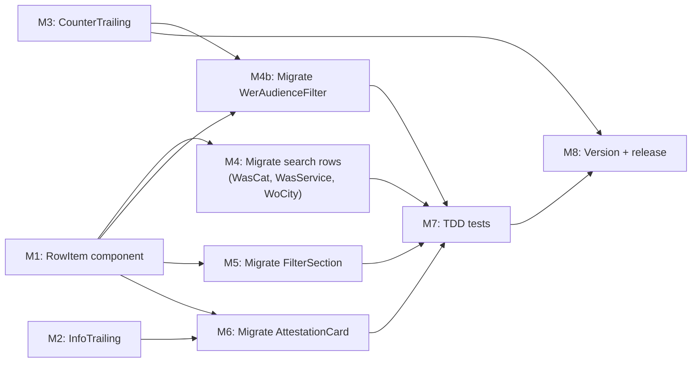

# Plan 131: RowItem Component System

| Field          | Value                                                                                      |
| -------------- | ------------------------------------------------------------------------------------------ |
| Plan ID        | 131                                                                                        |
| Target Release | next available patch after current origin/main v0.12.14; confirm at DevOps Stage 1        |
| Epic Alignment | UI Consistency & Design System Hardening                                                   |
| Related Issues | Follow-up to Plan 130 (IconListRow reusable component)                                    |
| Classification | Feature / Refactor                                                                         |
| Pipeline       | Full                                                                                       |
| GitHub Issue   | https://github.com/abu-lina/uflow/issues/228                                               |
| Created        | 2026-05-12T19:35Z                                                                          |

## Value Statement and Business Objective

> As a developer, I want a `RowItem` component family built on top of `IconListRow` that standardises icon + title + subtitle typography, named content props, trailing patterns (info button, counter), and selectable states, so that building search results, filter rows, and counter-based selections across UFlow requires zero ad-hoc markup per feature.

## Objective

Introduce a `RowItem` component that wraps `IconListRow` with named `title`/`subtitle` string props, a standardised icon container and interaction model (selectable/selected/multi-select states), and two purpose-built trailing slot components (`InfoTrailing` and `CounterTrailing`). Migrate all existing `IconListRow` consumers in search and provider-detail surfaces to use `RowItem`, normalising typography across surfaces in the process.

## Assumptions

1. `IconListRow` (Plan 130) is the stable layout primitive — `RowItem` layers semantics and state on top of it, not alongside it.
2. Canonical subtitle typography is `font-inter text-sm text-text-muted` (search row standard), per D1.
3. Migrating consumers to `RowItem` will produce minor visual changes (subtitle shrinks from `text-base` to `text-sm` in FilterSection, WoCityResults, and AttestationCard). These are intentional normalisations.
4. `CounterTrailing` is fully controlled — no internal state. Parent owns `value` and handlers.
5. Multi-select vs. single-select is not managed by `RowItem` — the parent controls the selected set; `RowItem` reflects `selected: boolean` only.
6. `RowItem` renders as a `<button>` when `selectable={true}` (collapsing the current outer-button + inner-IconListRow pattern into one element) and as a `<div>` when `selectable={false}`.

## Decision Record

| # | Decision | Status |
|---|----------|--------|
| D1 | Canonical subtitle typography: `font-inter text-sm text-text-muted` (search row standard) | [RESOLVED] Chosen by PO; normalises all consumers to a consistent secondary text size |
| D2 | Migrate all existing `IconListRow` consumers (WasCategoryResults, WasServiceTypeResults, WoCityResults, FilterSection, AttestationCard) to `RowItem` | [RESOLVED] Consolidates usage pattern; reduces future maintenance surface |
| D3 | `CounterTrailing` is fully controlled — `value`, `onIncrement`, `onDecrement`, `min?`, `max?` props only; no internal state | [RESOLVED] Controlled pattern is safe for form and cart contexts; avoids stale-state bugs |
| D4 | `RowItem` owns the button/div element decision based on `selectable` prop, collapsing the current outer-button-wrapping-IconListRow pattern into a single component | [RESOLVED] Removes ~8 lines of boilerplate per call site; unifies keyboard and pointer interaction at one layer |
| D5 | Icon slot remains `ReactNode` (full icon container, including the `h-12 w-12` div). `RowItem` wraps it in a `relative shrink-0` div and adds the selected-state ring and check badge overlay when `selected=true` — without requiring consumers to manage selection UI in their icon slots | [RESOLVED] Avoids needing consumers to know about RowItem selection state; ring is an overlay on the icon area |
| D6 | Subtitle normalisation `text-base → text-sm text-text-muted` applies to three surfaces: `AttestationCard` (commitment detail lines), `FilterSection` (filter subtitles), `WoCityResults` (count label), and `WerAudienceFilter` (audience subtitle). These are deliberate visual changes. QA must verify legibility on all four surfaces — especially AttestationCard Nachweise section and WerAudienceFilter Wer? accordion — before UAT sign-off | [RESOLVED] Normalisation accepted by PO per D1+D2; QA legibility gate extended to cover all four affected surfaces including WerAudienceFilter |
| D7 | FilterSection multi-select pattern: `RowItem` supports `aria-checked` and `role="checkbox"` via an optional `multiSelect` boolean prop — when `true`, the rendered `<button>` gets `role="checkbox"` and `aria-checked={selected}`. Default (`multiSelect={false}`) renders a plain `<button>` | [RESOLVED] Preserves existing FilterSection accessibility pattern without adding complexity to the default case |

## Consumer Audit

Existing consumers and their post-migration shape:

| Consumer | Render Sites | Selectable | Selected State | Trailing | Subtitle → Post-migration |
|----------|-------------|-----------|----------------|----------|--------------------------|
| `WasCategoryResults` — CategoryRow | 1 | ✅ yes | no (tap-to-select, no persisted ring) | — | `countLabel` `text-sm` |
| `WasCategoryResults` — recent rows | 1 | ✅ yes | no | — | dish label `text-sm` |
| `WasServiceTypeResults` — service-type rows | 1 | ✅ yes | no | — | service type label `text-sm` ✅ already canonical |
| `WasServiceTypeResults` — recent rows | 1 | ✅ yes | no | — | same `text-sm` ✅ |
| `WoCityResults` — CityRow | 1 | ✅ yes | no | — | `countLabel` `text-base → text-sm` ⚠️ visual change |
| `FilterSection` — filter rows | 1 (multi-item loop) | ✅ yes / multi | ✅ ring + check | — | filter subtitle `text-base → text-sm` ⚠️ visual change |
| `AttestationCard` — commitment rows | 4 (ITEMS loop) | ❌ no | — | `InfoTrailing` (halalOnly when declared) | declaration detail `text-base text-primary → text-sm text-muted` ⚠️ visual change |
| `WerAudienceFilter` — audience rows | 3 (AUDIENCES loop) | ❌ no | — | `CounterTrailing` (controlled ±counter, min=0) | audience subtitle `text-base font-light → text-sm` ⚠️ visual change; inline `MinusIcon`/`PlusIcon`/`AudienceRow` helpers deleted |

> ⚠️ = intentional visual change; must be confirmed at visual QA and UAT.

## Milestone Dependencies



**Sequencing rule**: M2 and M3 can be built in parallel with M1. Consumer migrations (M4–M6) begin only after M1 is complete. M4b requires both M1 and M3 (needs `RowItem` + `CounterTrailing`). M7 (tests) follows all migration milestones.

## Plan

### Milestone 1: Create `RowItem` Component

**Location**: `src/components/ui/RowItem.tsx`

**API**:
- `icon: ReactNode` — full icon container (same as `IconListRow.icon` slot)
- `title: string` — primary text; rendered as `font-inter-tight text-base font-semibold text-text-primary`
- `subtitle?: string` — secondary text; rendered as `font-inter text-sm text-text-muted`
- `trailing?: ReactNode` — optional trailing slot (accepts `InfoTrailing`, `CounterTrailing`, or any node)
- `selectable?: boolean` — when `true`, outer element is `<button type="button">`; when `false` or omitted, outer element is `<div>`
- `selected?: boolean` — when `selectable + selected`, adds ring overlay + check badge on icon area
- `multiSelect?: boolean` — when `true` and `selectable`, adds `role="checkbox"` and `aria-checked={selected}` to the button
- `onSelect?: () => void` — click/tap handler (required when `selectable`)
- `className?: string` — forwarded to the outermost element (button or div) for padding and hover/focus overrides

**States**:
- `selectable={false}`: static display row — `<div>`, no cursor, no hover, no focus ring
- `selectable={true}`, `selected={false}`: interactive row — `<button>`, cursor pointer, hover/focus handled via `className`
- `selectable={true}`, `selected={true}`: selected row — ring overlay on icon container area + absolute-positioned check badge

**Notes**:
- No `'use client'` directive — no hooks or state inside this component
- No hardcoded hover or focus classes — consumer passes these via `className` (same principle as Plan 130's `IconListRow`)
- Uses `IconListRow` internally (does not duplicate its layout)

**Acceptance Criteria**:
- Renders `<button>` when `selectable`, `<div>` otherwise
- `title` and optional `subtitle` render with canonical typography
- Selected state ring overlay and check badge render when `selectable + selected`
- `multiSelect` adds correct ARIA attributes
- `trailing` slot renders in position
- No `'use client'` directive
- Exported from `src/components/ui/RowItem.tsx`

---

### Milestone 2: Create `InfoTrailing` Component

**Location**: `src/components/ui/InfoTrailing.tsx`

**Purpose**: Small circular info badge for the trailing position. Currently hand-rolled inline in `AttestationCard` for the halal row.

**API**:
- `onPress?: () => void` — optional press handler (if absent, renders as decorative)
- `className?: string` — optional override

**Acceptance Criteria**:
- Renders the standard info badge (circular background, small `Info` icon)
- When `onPress` provided, renders as `<button>`; otherwise renders as `<span aria-hidden>`
- Exported from `src/components/ui/InfoTrailing.tsx`

---

### Milestone 3: Create `CounterTrailing` Component

**Location**: `src/components/ui/CounterTrailing.tsx`

**Purpose**: ± counter for use in quantity-selection rows (basket, portion selector, etc.). Fully controlled.

**API**:
- `value: number` — current count (controlled)
- `onIncrement: () => void`
- `onDecrement: () => void`
- `min?: number` — decrement disabled at this value (default 0)
- `max?: number` — increment disabled at this value (no default)
- `className?: string`

**Acceptance Criteria**:
- Renders `−` button, count display, `+` button in a row
- `−` button is disabled (`aria-disabled`, `pointer-events-none`) when `value === min`
- `+` button is disabled when `value === max`
- Fully controlled — no `useState` inside
- Exported from `src/components/ui/CounterTrailing.tsx`

---

### Milestone 4: Migrate Search Row Consumers

**Files**: `WasCategoryResults.tsx`, `WasServiceTypeResults.tsx`, `WoCityResults.tsx`

**Per-consumer changes**:

`WasCategoryResults`:
- `CategoryRow`: replace outer `<button>` + inner `<IconListRow>` with single `<RowItem selectable onSelect={...} icon={<IconSlot .../>} title={label} subtitle={countLabel} className="..." />`
- Recent search rows: same pattern; `subtitle` is dish label or absent depending on `recent.type`
- `IconSlot` helper remains in this file (it renders the image or fallback container — passed as the `icon` prop)

`WasServiceTypeResults`:
- Service-type rows and recent rows: replace outer button + IconListRow with `<RowItem selectable onSelect={...} icon={<.../>} title={label} subtitle={serviceTypeLabel} className="..." />`

`WoCityResults`:
- `CityRow`: replace outer button + IconListRow with `<RowItem selectable onSelect={...} icon={<.../>} title={city} subtitle={countLabel} className="..." />`
- The existing `className` prop (for focus ring/hover override) passes through to `RowItem`'s `className`

**Visual note**: WoCityResults subtitle changes from `text-base font-light` → `text-sm` (normalisation per D1).

**Acceptance Criteria**:
- All call sites use `RowItem` — no residual `IconListRow` imports in these files
- Visual output matches existing except for intentional subtitle size normalisation
- Existing tests pass (update selectors if needed)

---

### Milestone 4b: Migrate `WerAudienceFilter` to Use `RowItem` + `CounterTrailing`

**File**: `src/features/search/components/WerAudienceFilter.tsx`

**Background**: `WerAudienceFilter` was shipped in Plan 103 before `IconListRow` and `RowItem` existed. Its internal `AudienceRow` component implements the exact icon + title + subtitle + ± counter pattern that `RowItem + CounterTrailing` standardises. Without this migration, `CounterTrailing` ships without eliminating its most obvious duplication target.

**Change**:
- Replace the inline `AudienceRow` component with `<RowItem selectable={false} icon={...} title={label} subtitle={t('suchen.wer.subtitle')} trailing={<CounterTrailing value={count} onIncrement={onIncrement} onDecrement={onDecrement} min={0} />} className="..." />`
- Delete inline `AudienceRow`, `MinusIcon`, and `PlusIcon` helper components (replaced by `RowItem` + `CounterTrailing`)
- The `AudienceCounts` state, `resetSignal`, and `onSelectionChange` callback remain in `WerAudienceFilter` — they are orchestration logic, not layout

**Requires**: M1 (`RowItem`) and M3 (`CounterTrailing`) must be complete before this milestone begins.

**Visual note**: Audience subtitle changes from `font-inter-tight text-base font-light leading-none text-text-muted` → `text-sm text-text-muted` (normalisation per D6). Counter button size (`size-6`) and gap (`gap-2`) should match the existing layout.

**Acceptance Criteria**:
- `AudienceRow`, `MinusIcon`, `PlusIcon` helpers removed — no inline SVG counter remaining
- Audience rows use `RowItem` with `CounterTrailing` in trailing slot
- Counter min=0 enforced (decrement disabled at 0 per existing behaviour)
- `WerAudienceFilter` retains its `'use client'` directive (it owns `useState` for counts)
- Existing `WerAudienceFilter.test.tsx` passes (update selectors if needed)
- Visual output matches existing except for intentional subtitle normalisation

---

### Milestone 5: Migrate FilterSection

**File**: `src/features/search/components/FilterSection.tsx`

**Change**: Replace outer `<button role="checkbox">` + inner `<IconListRow>` with:
```
<RowItem
  selectable
  multiSelect
  selected={selected}
  onSelect={() => onToggleFilter(key)}
  icon={<Icon ... />}
  title={t(titleKey)}
  subtitle={t(subtitleKey)}
  className="..."
/>
```

**Visual note**: Subtitle changes from `text-base font-light` → `text-sm` (normalisation per D1). Selected-state ring and check badge are now owned by `RowItem` — remove them from the icon slot.

**Acceptance Criteria**:
- Filter rows render with `role="checkbox"` and `aria-checked` (via `multiSelect` prop)
- Selected state ring and check badge rendered by `RowItem` — not in consumer
- Subtitle typography normalised
- Existing tests pass

---

### Milestone 6: Migrate AttestationCard

**File**: `src/features/providers/components/AttestationCard.tsx`

**Change**: Replace `<IconListRow>` in the ITEMS loop with:
```
<RowItem
  selectable={false}
  icon={<span ...>{renderIcon(...)}</span>}
  title={t(`providerDetail.attestation.${key}`)}
  subtitle={hasAnyDeclared
    ? t(`providerDetail.attestation.${key}DeclaredDetail`)
    : t(`providerDetail.attestation.${key}FallbackDetail`)}
  trailing={hasAnyDeclared && key === 'halalOnly'
    ? <InfoTrailing />
    : null}
  className="px-2 py-2"
/>
```

**Visual note**: Commitment detail subtitle changes from `text-base font-light text-text-primary` → `text-sm text-text-muted`. This is an intentional normalisation (D6). QA must verify legibility — if legibility is impacted in context, Implementer should flag to PO before committing.

**Acceptance Criteria**:
- Attestation rows use `RowItem` + `InfoTrailing`
- `selectable={false}` — no button, no hover, no focus ring
- Subtitle typography normalised to canonical
- `InfoTrailing` renders on halalOnly row when declared
- Existing tests pass (update for changed subtitle tokens)

---

### Milestone 7: TDD Tests

**New test files**:
- `src/components/ui/__tests__/RowItem.test.tsx`
- `src/components/ui/__tests__/InfoTrailing.test.tsx`
- `src/components/ui/__tests__/CounterTrailing.test.tsx`

**Coverage targets**:

`RowItem.test.tsx`:
- Renders `<button>` when `selectable`, `<div>` when not
- Renders `title` and `subtitle` with correct text
- Renders `trailing` slot
- Does NOT render check badge when `selected={false}`
- Renders check badge when `selectable + selected`
- Adds `role="checkbox"` and `aria-checked` when `multiSelect`
- Forwards `className` to outer element

`InfoTrailing.test.tsx`:
- Renders info icon
- Renders as `<button>` when `onPress` provided, `<span>` otherwise

`CounterTrailing.test.tsx`:
- Renders decrement, value, increment
- Decrement disabled at `min`
- Increment disabled at `max`
- Calls `onIncrement` / `onDecrement` on click
- Does not call `onDecrement` below `min`

**Updated consumer tests** (update selectors for any changes from migration):
- `WasCategoryResults.test.tsx`
- `WasServiceTypeResults.test.tsx`
- `WoCityResults.test.tsx`
- `FilterSection.test.tsx`
- `AttestationCard.test.tsx`
- `WerAudienceFilter.test.tsx`

**Acceptance Criteria**:
- All new component tests written TDD-first (failing → passing)
- All updated consumer tests pass
- `npm run type-check` clean
- `npm run lint` 0 new errors
- Full `npx vitest run` suite passes

---

### Milestone 8: Version and Release Artifacts

**Tasks**:
- Update `package.json` version to next available patch (confirm at DevOps Stage 1)
- Add `CHANGELOG.md` Unreleased entry

**Acceptance Criteria**:
- Version consistent across `package.json` and `package-lock.json`
- CHANGELOG entry describes the RowItem component system and consumer migrations

---

## Baseline & Measurements

This is a pure UI refactor with no performance surface area. No baseline metrics required. Visual QA at M7/UAT is the measurement gate.

## Testing Strategy

- **TDD discipline**: All three new components have failing tests written before implementation (M1–M3 test files created before component files)
- **Consumer regression**: Existing test files updated as needed at each migration milestone
- **Visual QA gate**: QA must include side-by-side comparison of all four normalised surfaces: search page rows, Wer? accordion (WerAudienceFilter), provider detail Nachweise section (AttestationCard), and FilterSection. Subtitle normalisation is intentional but must be confirmed acceptable before UAT sign-off (D6)
- **Accessibility**: `role="checkbox"` + `aria-checked` on FilterSection rows; `selectable=false` rows have no interactive role

## Risks

| Risk | Likelihood | Impact | Mitigation |
|------|------------|--------|------------|
| Subtitle normalisation (text-base → text-sm) on AttestationCard degrades legibility of commitment details | Medium | Low | Implementer flags to PO before committing M6; QA verifies visually across all four surfaces (D6) |
| Subtitle normalisation on WerAudienceFilter Wer? accordion degrades legibility of audience row subtitles | Low | Low | QA side-by-side comparison of Wer? accordion before/after |
| FilterSection selected-state ring transfer (from icon slot to RowItem overlay) produces subtle visual difference | Low | Low | QA side-by-side comparison before/after |
| WerAudienceFilter counter layout (button size, gap, icon style) differs from CounterTrailing default | Low | Low | Implementer matches existing `size-6` buttons, `gap-2`, and SVG icon style in `CounterTrailing` spec |

## Release Strategy

Standalone — Plan 130 targets v0.12.15 (pending DevOps), Plan 131 targets the next available patch after DevOps confirms v0.12.15. No known bundling with other plans.

## Duration Estimates

| Phase | Estimate | Notes |
|-------|----------|-------|
| Implementation (M1–M6 + M4b) | 3.5–4.5 hours | M1–M3 are new components; M4–M6 + M4b are mechanical migrations; M4b adds ~30–45 min |
| TDD Tests (M7) | 1–1.5 hours | 3 new test files + 6 consumer test updates (incl. WerAudienceFilter) |
| Visual QA | 30–45 min | Side-by-side check on subtitle normalisation |
| DevOps | 15 min | Version bump + CHANGELOG |
| **Total** | **~5–6 hours** | Low uncertainty; well-understood pattern |

## Files Touched

| File | Action |
|------|--------|
| `src/components/ui/RowItem.tsx` | **Create** |
| `src/components/ui/InfoTrailing.tsx` | **Create** |
| `src/components/ui/CounterTrailing.tsx` | **Create** |
| `src/components/ui/__tests__/RowItem.test.tsx` | **Create** |
| `src/components/ui/__tests__/InfoTrailing.test.tsx` | **Create** |
| `src/components/ui/__tests__/CounterTrailing.test.tsx` | **Create** |
| `src/features/search/components/WasCategoryResults.tsx` | **Edit** |
| `src/features/search/components/WasServiceTypeResults.tsx` | **Edit** |
| `src/features/search/components/WoCityResults.tsx` | **Edit** |
| `src/features/search/components/FilterSection.tsx` | **Edit** |
| `src/features/providers/components/AttestationCard.tsx` | **Edit** |
| `src/features/providers/components/__tests__/AttestationCard.test.tsx` | **Edit** |
| `src/features/search/components/WerAudienceFilter.tsx` | **Edit** — replace AudienceRow + MinusIcon + PlusIcon with RowItem + CounterTrailing |
| `src/features/search/components/WerAudienceFilter.test.tsx` | **Edit** — update selectors if needed |
| `package.json` | **Edit** |
| `CHANGELOG.md` | **Edit** |

## Changelog

| Date | Agent | Change | Detail |
|------|-------|--------|--------|
| 2026-05-12T19:35Z | Planner | Created | Initial plan; D1–D7 resolved; consumer audit complete |
| 2026-05-12T19:48Z | Planner | Revised (F-1, F-2) | Added WerAudienceFilter to consumer audit and as M4b (RowItem+CounterTrailing migration); extended D6 to name four normalisation surfaces; updated milestone dependency graph, Files Touched, duration estimates, testing strategy, and risks |
| 2026-05-12T19:55Z | Implementer | Started | Implementation phase initiated; TDD gate execution begins for M1-M3 before consumer migrations |
| 2026-05-12T20:00Z | Implementer | Completed | M1–M8 delivered: RowItem/InfoTrailing/CounterTrailing created, all scoped consumers migrated (including WerAudienceFilter), test + static gates passed, and version/changelog artifacts updated |
| 2026-05-12T20:06Z | Code Reviewer | Approved with comments | Code review completed. Applied fix-in-review for shared-component i18n a11y labels (`InfoTrailing`/`CounterTrailing`) and updated implementation artifact status consistency; verdict APPROVED_WITH_COMMENTS for QA handoff |
| 2026-05-12T21:12Z | Code Reviewer | Re-approved after remediation | Verified all rejected findings resolved: proofs section badge/fallback behavior restored with targeted regression tests, global background token drift reverted, props contract restored, and noProofs translations restored. Verdict: APPROVED_WITH_COMMENTS for QA handoff. |
| 2026-05-12T20:25Z | QA Agent | QA Complete | All gates PASS: lint (0 new errors), type-check (clean), tests (1263/1263), build (exit 0). Fix-in-review i18n a11y labels validated. Visual legibility confirmed on all four affected surfaces (WoCityResults, FilterSection, AttestationCard, WerAudienceFilter). Handoff ready for UAT. |
| 2026-05-12T20:28Z | UAT Agent | UAT Approved | Value statement demonstrably delivered: RowItem/InfoTrailing/CounterTrailing components created and used by all 6 consumer migrations; ad-hoc row markup eliminated; D6 visual legibility confirmed. All 6 UAT scenarios PASS. Verdict: APPROVED FOR RELEASE ready for DevOps. |
