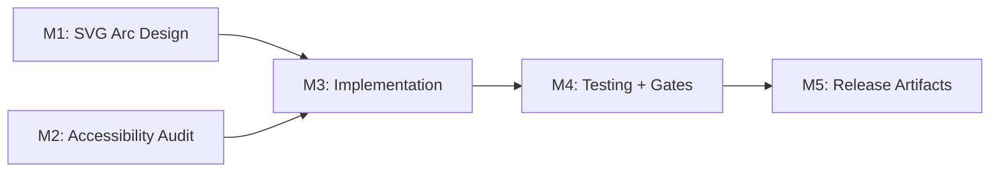

# Plan 136 — ProofTierCard Arc Visual Upgrade

| Field          | Value                                                                  |
| -------------- | ---------------------------------------------------------------------- |
| Plan ID        | 136                                                                    |
| Target Release | Bundled with Plans 133+134+135 on session/133-halal-proof-rework branch; next available minor after current origin/main v0.12.17; confirm at DevOps Stage 1 |
| Epic Alignment | Provider Detail UX — Trust & Transparency                              |
| Related Issues | Plan 133 (halal proof tier), Plan 134 (visual hierarchy), Plan 135 (verification UX rethink) |
| Classification | Feature                                                                |
| Pipeline       | Abbreviated                                                            |
| GitHub Issue   | https://github.com/abu-lina/uflow/issues/239                           |
| Created        | 2026-06-01T21:30Z                                                      |

### Changelog

| Timestamp            | Agent   | Note                                                    |
| -------------------- | ------- | ------------------------------------------------------- |
| 2026-06-01T21:30Z    | Planner | Plan created, Status: Active                            |
| 2026-06-01T21:50Z    | Planner | Revised: F1 palette contrast fix, F2 RTL direction note, F3 debug path fix |
| 2026-06-01T11:34Z    | Implementer | Implementation started, Status set to In Progress    |
| 2026-06-01T18:58Z    | Implementer | Closed by Plan 137 completion, Status set to Completed |

---

## Value Statement and Business Objective

**As a** provider detail viewer,
**I want to** see a visually intuitive arc/gauge indicator for the halal verification level,
**so that** I can instantly understand the trust depth without parsing a grid of identical shield icons.

The current 4-box shield-grid is functional but visually flat — every box looks the same aside from colour fill, making it hard to scan at a glance. An arc/gauge visual communicates "level on a scale" more naturally and aligns with common mental models for progress/scoring.

---

## Success Criteria

1. The arc visual renders correctly for all 4 verification levels (1–4).
2. The centre of the arc displays the translated level label string (not a number).
3. The "What we verified" checklist section is visually and functionally unchanged.
4. Existing unit tests pass without modification to their assertions.
5. The SVG has proper ARIA attributes (`role="img"`, `aria-label`) so screen readers announce the verification level.
6. The component fits within a ~350px mobile viewport without overflow or clipping.
7. No new npm dependencies are introduced.

---

## Assumptions

1. Plan 135 implementation is complete — the component already uses `verificationMethod` + `hasCertificate` props and the `computeVerificationLevel()` function.
2. The `#2B6D66` halal-teal colour is already used in the component; a teal progression palette can be derived without new design tokens.
3. The `computeVerificationLevel()` pure function is unchanged — the arc is a visual-only replacement for the shield grid.
4. RTL locale rendering: the arc shape is symmetrical and locale-neutral. The centre `<text>` element requires explicit `direction="rtl"` when the active locale is RTL (ar, ur, ps), since SVG `<text>` does not inherit CSS `direction` from parent HTML.
5. No animation is required for v1 — static arc fill is sufficient.

---

## Decision Record

| ID | Decision | Status |
| -- | -------- | ------ |
| D1 | Use a 180° semicircle (half-circle) arc divided into 4 equal segments, not a full 360° ring | [RESOLVED] A semicircle provides more horizontal space for the centre label and matches the design reference images. A full ring would waste vertical space in a narrow card. |
| D2 | Centre text shows the translated level label string (e.g., "Selbstauskunft"), not a numeric score | [RESOLVED] Users relate to descriptive labels; a bare number (1–4) is meaningless without context. |
| D3 | No needle or pointer — active segments are filled, inactive segments are grey | [RESOLVED] A needle adds complexity (rotation math, SVG layering) without improving comprehension for a 4-level discrete scale. |
| D4 | Pure inline SVG, no `<canvas>`, no external chart libraries (e.g., Chart.js, Recharts) | [RESOLVED] Inline SVG is SSR-compatible, has zero bundle cost, and is ARIA-friendly. External libs add kB and runtime overhead for a trivial arc shape. |
| D5 | Teal fill progression from medium (#6AB3A8) for level 1 to full (#1D5C57) for level 4; inactive segments use #E5E7EB grey; active segments also carry a 1px stroke (#2B6D66) as a secondary non-colour cue | [RESOLVED] Monotone teal avoids red/yellow "danger" connotations. Progressive darkness reinforces the "more = stronger" signal. Level-1 active fill darkened from original #C5E4DF to #6AB3A8 per Critic F1 — ensures ≥3:1 contrast ratio against inactive #E5E7EB (WCAG 1.4.11). Active stroke provides a secondary differentiator beyond colour alone. |
| D6 | `viewBox="0 0 200 110"` (landscape-biased) to maximise horizontal use within the card | [RESOLVED] 200×110 gives enough room for the arc path + centre text. Tested against 350px card width constraint. |
| D7 | SVG extracted as a private sub-component `VerificationArc` inside `ProofTierCard.tsx` — not a new file | [RESOLVED] Single-use visual, not reusable elsewhere. Avoids file proliferation. If reuse emerges later, extraction is trivial. |

---

## Release Strategy

Bundled with: Plans 133, 134, 135 on `session/133-halal-proof-rework` branch. This plan replaces a visual element introduced by Plan 135. Ships as part of the same branch merge to main. No additional version bump beyond the shared release.

---

## Scope

### In Scope

- Replace the `grid grid-cols-4` shield-icon block (lines 50–64 of current `ProofTierCard.tsx`) with an inline SVG arc visual.
- Add ARIA attributes to the SVG for screen reader accessibility.
- Add unit tests for the new SVG rendering (segment fill logic, ARIA label presence).
- Update debug page `proof-tier-example` if it directly renders the shield grid (verify first).

### Out of Scope

- No changes to `computeVerificationLevel()` logic.
- No changes to the "What we verified" checklist section.
- No changes to the expandable explanation section.
- No changes to props API, services, types, or database.
- No animation, hover effects, or interactive arc segments.
- No changes to other components (ProviderCard, SearchResultsList, etc.).

---

## Milestone Dependencies

Sequencing: M1 and M2 can be done in parallel. M3 depends on both. M4 and M5 are sequential.

---

## Milestones

### M1: SVG Arc Math + Component Design

**Objective**: Define the arc geometry, segment boundaries, colour palette, and SVG structure before writing code.

**Deliverables** (design specification — Implementer decides exact code):

1. **Arc geometry**: 180° semicircle with centre at `(100, 100)` in a `viewBox="0 0 200 110"`. Radius ~80. Arc sweeps from 180° to 0° (left to right). 4 equal segments of 45° each, separated by small gaps (~3° per gap).
2. **Colour palette**: Define 4 teal shades for filled segments:
   - Level 1 (lightest): `#6AB3A8` — contrast ratio ≥3:1 against inactive #E5E7EB (WCAG 1.4.11)
   - Level 2: `#4A9E92`
   - Level 3: `#3F9189`
   - Level 4 (darkest): `#1D5C57`
   - Inactive segment: `#E5E7EB` (Tailwind `gray-200` equivalent)
   - Active segment stroke: `#2B6D66` at 1px — secondary non-colour cue distinguishing active from inactive
3. **Centre text**: Level label string positioned at the arc's geometric centre. Font size responsive to container.  Use CSS `text-anchor: middle` + `dominant-baseline: central`.
4. **SVG structure**: Each segment is a `<path>` using arc commands (`A`). The centre text is a `<text>` element. All wrapped in a single `<svg>` with `role="img"` and `aria-label`.

**Acceptance Criteria**:

- [ ] Arc math produces correct start/end coordinates for each of 4 segments at the specified radius and gap angle.
- [ ] Colour palette is documented and consistent with the existing `#2B6D66` teal family.
- [ ] SVG viewBox and structure are defined.

---

### M2: Accessibility Audit

**Objective**: Ensure the arc visual meets WCAG 2.1 AA requirements.

**Requirements**:

1. The `<svg>` element has `role="img"` and a dynamic `aria-label` that includes the verification level label (e.g., "Verification level: Selbstauskunft").
2. All segment `<path>` elements have `aria-hidden="true"` (decorative detail — the `aria-label` on the parent SVG carries the semantic meaning).
3. The centre `<text>` element duplicates the level label for sighted users but is `aria-hidden="true"` to avoid double-reading by screen readers.
4. Colour is not the sole differentiator — segment position (filled from left-to-right) provides a secondary visual cue.
5. Sufficient contrast: darkest teal (#1D5C57) on #F8FBF9 background passes 4.5:1 ratio.
6. Adjacent segment contrast: lightest active fill (#6AB3A8) vs inactive fill (#E5E7EB) must achieve ≥3:1 contrast ratio per WCAG 1.4.11 (non-text contrast for graphical objects). Active segments also carry a 1px stroke (#2B6D66) as a secondary differentiator.
7. RTL text direction: the centre `<text>` element must set `direction="rtl"` when the active locale is RTL (ar, ur, ps), since SVG `<text>` does not inherit CSS `direction` from parent HTML.

**Acceptance Criteria**:

- [ ] ARIA attributes specified.
- [ ] Contrast ratios verified for all active teal shades against card background.
- [ ] Adjacent active-vs-inactive segment contrast verified ≥3:1.
- [ ] No colour-only encoding — position of filled segments + stroke provides secondary non-colour cues.
- [ ] RTL `<text>` direction verified for ar/ur/ps locale labels.

---

### M3: Implementation

**Objective**: Replace the shield-grid with the arc visual in `ProofTierCard.tsx`.

**Tasks** (WHAT, not HOW):

1. **Create `VerificationArc` sub-component**: A private function component within `ProofTierCard.tsx` that accepts `level: 1 | 2 | 3 | 4` and `levelLabel: string`, and returns an inline `<svg>` element rendering the 4-segment arc with appropriate fill colours and centre text.
2. **Replace the shield-grid block**: Remove the `
` block (current lines 50–64) and its contents. Replace with a `<VerificationArc level={level} levelLabel={t(levelLabelKey)} />` invocation.
3. **Remove the Shield import**: The `Shield` import from `lucide-react` is no longer needed after the grid removal. Clean up the import.
4. **Preserve all other sections**: The header row (level label + scale title), checklist, expandable explanation — all remain unchanged.
5. **Verify debug page**: Check `src/app/(debug)/proof-tier-example/page.tsx` — it uses `<ProofTierCard>` as a black box, so no changes needed. Confirm visually that all 4 levels render correctly on this page.

**Acceptance Criteria**:

- [ ] The arc renders correctly for levels 1, 2, 3, 4 with the specified colour progression.
- [ ] The centre text displays the translated level label.
- [ ] The "What we verified" checklist is visually and functionally unchanged.
- [ ] The `Shield` import is removed.
- [ ] The component has no new npm dependencies.
- [ ] The arc fits within ~350px viewport width without overflow.

---

### M4: Testing + Gates

**Objective**: Verify correctness, accessibility, and gate passage.

**Tasks**:

1. **Update existing tests**: The existing `ProofTierCard.test.tsx` tests assert on checklist content and level labels — these should still pass. If any test asserts on the presence of the shield grid (e.g., `role="img"` on the grid div), update the selector to match the new SVG structure.
2. **Add new tests for the arc visual**:
   - Test that SVG with `role="img"` is present in the rendered output.
   - Test that `aria-label` contains the level label string.
   - Test that for each level (1–4), the correct number of segments have active fill colours (1 active for level 1, 4 active for level 4).
3. **Run all gates**:
   - `npm test` — all 1278+ tests pass.
   - `npx tsc --noEmit` — no type errors.
   - `npm run lint` — 0 errors.
   - `npm run build` — exit 0.

**Acceptance Criteria**:

- [ ] All existing checklist/attestation tests pass unchanged (or with minimal selector updates).
- [ ] New arc visual tests cover all 4 levels.
- [ ] ARIA attribute tests pass.
- [ ] All 4 gates green.

---

### M5: Release Artifacts

**Objective**: Update changelog and documentation for the combined session release.

**Tasks**:

1. Append entry to `CHANGELOG.md` under the session's release section describing the arc visual upgrade.
2. Update `agent-output/implementation/136-prooftiercard-arc-visual-implementation.md` (Implementer creates this during M3).
3. Verify `system-architecture.md` needs no update (this is a visual-only change within an existing component — no architectural change).

**Acceptance Criteria**:

- [ ] CHANGELOG entry added.
- [ ] Implementation doc populated.

---

## Testing Strategy

**Unit tests** (primary):
- Pure function `computeVerificationLevel()` — already covered by existing tests, no changes needed.
- SVG rendering: React Testing Library renders the component, queries `role="img"` SVG, checks `aria-label` content, and counts filled vs unfilled segment paths.
- Checklist rendering: existing tests already cover this comprehensively.

**Visual regression** (manual):
- Check all 4 levels on the debug page (`/proof-tier-example`) at 350px and 1920px viewport widths.
- Verify RTL rendering (Arabic locale) — arc should remain visually centred.

**No integration/e2e tests needed**: This is a purely visual change within a single client component with no API calls or data dependencies.

---

## Risks

| Risk | Likelihood | Impact | Mitigation |
| ---- | ---------- | ------ | ---------- |
| SVG arc math produces incorrect segment boundaries | Low | Medium | TDD: write tests for segment coordinate calculation before implementing the component |
| Centre text overflows on narrow viewports | Low | Low | Use `textLength` or font-size scaling within the SVG viewBox; test at 320px |
| Teal palette shades don't pass contrast checks | Low | Medium | Palette revised per Critic F1; lightest active #6AB3A8 verified ≥3:1 vs inactive #E5E7EB; active stroke adds secondary cue |
| Existing tests break due to removed shield grid DOM | Low | Low | Tests assert on text content and checklist items, not on Shield icons; verify in M4 |

---

## Duration Estimates

| Phase          | Estimate    | Uncertainty Driver |
| -------------- | ----------- | ------------------ |
| M1: Design     | 15–30 min   | Low — geometry is well-defined |
| M2: A11y Audit | 10–15 min   | Low — straightforward contrast check |
| M3: Implement  | 45–90 min   | Medium — SVG arc path math requires precision |
| M4: Testing    | 30–45 min   | Low — small test surface |
| M5: Release    | 10–15 min   | Low — changelog entry only |
| **Total**      | **~2–3 hours** | |

---

## Validation & Handoff

**Pre-handoff checklist**:
- Plan doc exists at `agent-output/planning/136-prooftiercard-arc-visual-plan.md` with Status Active ✓
- All decisions are `[RESOLVED]` ✓
- No `OPEN QUESTION` items ✓
- Milestones have explicit acceptance criteria ✓

**Handoff to Critic**: Plan revised per critique findings F1/F2/F3. Returning for re-review.
