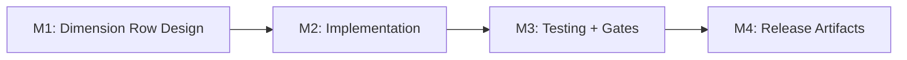

# Plan 137 — ProofTierCard Verification Matrix Visual

| Field          | Value                                                                                                                                                           |
| -------------- | --------------------------------------------------------------------------------------------------------------------------------------------------------------- |
| Plan ID        | 137                                                                                                                                                             |
| Target Release | Bundled with Plans 133+134+135+136 on session/133-halal-proof-rework branch; next available minor after current origin/main v0.12.17; confirm at DevOps Stage 1 |
| Epic Alignment | Provider Detail UX — Trust & Transparency                                                                                                                       |
| Related Issues | Plan 136 (arc visual, predecessor), Plan 135 (verification model), Plan 133 (halal proof tier)                                                                  |
| Classification | Feature                                                                                                                                                         |
| Pipeline       | Abbreviated                                                                                                                                                     |
| GitHub Issue   | https://github.com/abu-lina/uflow/issues/240                                                                                                                    |
| Created        | 2026-06-01T22:00Z                                                                                                                                               |

### Changelog

| Timestamp         | Agent       | Note                                        |
| ----------------- | ----------- | ------------------------------------------- |
| 2026-06-01T22:00Z | Planner     | Plan created, Status: Active                |
| 2026-06-01T18:27Z | Critic      | APPROVED with 5 LOW findings (F1–F5)        |
| 2026-06-01T18:35Z | Planner     | Revised: addressed F1–F5 per critique       |
| 2026-06-01T18:40Z | Implementer | Implementation started, Status: In Progress |

---

## Value Statement and Business Objective

**As a** provider detail viewer,
**I want to** see verification presented as two explicit dimensions (check method + certificate evidence) alongside a combined level gauge,
**so that** I understand both the overall trust depth AND the specific factors that contribute to it, rather than guessing what "level 3" means.

The current arc gauge (Plan 136) shows a 1–4 combined level but hides the underlying truth model. Users see segments fill up but cannot tell whether the provider had an on-site visit, a certificate, or both. Making the two dimensions visible below the gauge transforms an opaque score into a transparent, educational trust signal.

**Why both dimension rows and the checklist?** The dimension rows serve as a _compact status summary_ — at a glance, users see which two factors (check method + certificate) were met. The "What we verified" checklist below provides _detailed evidence_ — the specific steps performed (menu review, on-site visit, owner confirmation). Both sections convey related data in complementary formats: summary vs. evidence trail.

---

## Success Criteria

1. The semicircle gauge remains as the quick-scan overall level indicator (4 segments).
2. Two new dimension rows appear below the gauge showing:
   - **Check method**: "Online" or "On-site" with a visual status indicator.
   - **Certificate**: "On file" or "Not provided" with a visual status indicator.
3. The existing "What we verified" checklist section remains unchanged.
4. Dimension rows are fully localized across all 6 locales (en, de, ar, tr, ur, ps).
5. Existing unit tests pass (with selector adjustments if needed).
6. New tests cover dimension row rendering for all 4 level combinations.
7. No new npm dependencies.
8. The component fits within ~350px mobile viewport without overflow.

---

## Assumptions

1. Plan 136 implementation is complete — the arc gauge is already rendering in `ProofTierCard.tsx`.
2. The props API (`verificationMethod`, `hasCertificate`) is unchanged — this is a visual-only addition.
3. `computeVerificationLevel()` remains untouched.
4. The dimension rows are pure derivatives of existing props — no new data fetching required.
5. Translation keys can be added to the existing `providerDetail.proofTier` namespace.

---

## Decision Record

| ID  | Decision                                                                                                                | Status                                                                                                                                                                                                                                                        |
| --- | ----------------------------------------------------------------------------------------------------------------------- | ------------------------------------------------------------------------------------------------------------------------------------------------------------------------------------------------------------------------------------------------------------- |
| D1  | Keep the semicircle gauge as the primary visual — add dimension rows below it, do not replace it                        | [RESOLVED] The gauge provides at-a-glance level recognition. The dimension rows add transparency. Both serve different cognitive purposes. Removing the gauge would lose the "instant scan" benefit.                                                          |
| D2  | Use two small inline rows with icon + label + status chip pattern, not a 2×2 grid/matrix table                          | [RESOLVED] Inline rows match the existing checklist layout style. A table/matrix would introduce a new visual pattern inconsistent with the card.                                                                                                             |
| D3  | Dimension row status uses text chips ("Online" / "On-site", "On file" / "Not provided"), not checkmarks or colored dots | [RESOLVED] Text is unambiguous across cultures and accessible. Colored dots alone fail WCAG non-text contrast requirements without supplementary text.                                                                                                        |
| D4  | Place dimension rows between the gauge and the "What we verified" checklist                                             | [RESOLVED] This creates a natural reading flow: overall level → contributing factors → detailed evidence.                                                                                                                                                     |
| D5  | Plan 136 is a predecessor — its deliverables are complete and remain intact; this plan extends them                     | [RESOLVED] Plan 136 delivered the arc gauge successfully. This plan adds dimension rows on top without modifying the arc. Plan 136 should be closed as "Completed" (not "Superseded") since its code and implementation artifact remain valid and unmodified. |

---

## Release Strategy

Bundled with: Plans 133, 134, 135, 136 on `session/133-halal-proof-rework` branch. This plan adds dimension rows to the gauge implemented by Plan 136. Ships as part of the same branch merge to main. No additional version bump beyond the shared release.

---

## Scope

### In Scope

- Add two dimension rows (check method + certificate status) below the `VerificationArc` SVG in `ProofTierCard.tsx`.
- Add translation keys for dimension labels and status values across all 6 locales.
- Add unit tests for dimension row rendering per level combination.
- Update the debug page if needed to verify the new layout visually.

### Out of Scope

- No changes to `computeVerificationLevel()` logic.
- No changes to the `VerificationArc` SVG component.
- No changes to the "What we verified" checklist section.
- No changes to the expandable explanation section.
- No changes to props API, services, types, or database.
- No changes to other components (ProviderCard, SearchResultsList, etc.).

---

## Milestone Dependencies

Sequencing: Linear — each milestone depends on the previous.

---

## Milestones

### M1: Dimension Row Design + Translation Keys

**Objective**: Define the dimension row layout, labels, and status values.

**Deliverables**:

1. **Layout**: Two rows stacked vertically between the `VerificationArc` and the "What we verified" checklist. Each row contains:
   - A small icon (lucide `Globe` for check method, `FileCheck` for certificate) — `h-4 w-4`, teal color.
   - A dimension label (e.g., "Check method", "Certificate").
   - A status chip showing the current value (e.g., "On-site", "On file").

2. **Status chip styling**: Rounded pill (`rounded-full px-2 py-0.5 text-xs font-medium`). Active state: `bg-[#E3F2EF] text-[#1D5C57]`. Neutral state: `bg-gray-100 text-content`.

   **Chip state mapping**:

   | Status Value                    | Chip State         | Rationale                                |
   | ------------------------------- | ------------------ | ---------------------------------------- |
   | `statusOnsite` (On-site)        | **Active** (teal)  | Higher-effort verification method        |
   | `statusOnline` (Online)         | **Neutral** (gray) | Baseline verification method             |
   | `statusCertOnFile` (On file)    | **Active** (teal)  | Certificate provided — stronger evidence |
   | `statusCertNone` (Not provided) | **Neutral** (gray) | No certificate — baseline state          |

3. **Translation keys** (added to `providerDetail.proofTier` namespace):

| Key                    | EN           | DE              |
| ---------------------- | ------------ | --------------- |
| `dimensionCheckMethod` | Check method | Prüfmethode     |
| `dimensionCertificate` | Certificate  | Zertifikat      |
| `statusOnline`         | Online       | Online          |
| `statusOnsite`         | On-site      | Vor-Ort         |
| `statusCertOnFile`     | On file      | Vorhanden       |
| `statusCertNone`       | Not provided | Nicht vorhanden |

4. **AR/TR/UR/PS translations**: Implementer to add consistent translations for all 6 locales.

**Acceptance Criteria**:

- [ ] Layout specification defined.
- [ ] Translation key names and values documented.
- [ ] Consistent with existing card visual language (rounded borders, teal palette, small text).

---

### M2: Implementation

**Objective**: Add dimension rows to `ProofTierCard.tsx` and translation files.

**Tasks** (WHAT, not HOW):

1. **Add dimension rows**: Insert two rows between the `VerificationArc` invocation and the "What we verified" checklist `
`. Each row derives its status from existing component variables (`onsiteVerified`, `certOnFile`).
2. **Add translation keys**: Add the 6 new keys to all 6 locale files (`en.ts`, `de.ts`, `ar.ts`, `tr.ts`, `ur.ts`, `ps.ts`).
3. **Preserve all existing sections**: Gauge, checklist, expandable explanation — all remain unchanged.
4. **Verify debug page**: Check `src/app/(debug)/proof-tier-example/page.tsx` renders correctly with the new rows for all 4 level combinations.

**Acceptance Criteria**:

- [ ] Dimension rows render for all 4 level combinations with correct status values.
- [ ] Correct icon + label + status chip for each dimension.
- [ ] Active status chip uses teal styling; neutral uses gray.
- [ ] Layout fits within ~350px viewport without overflow.
- [ ] No new npm dependencies. Note: `Globe` is already imported elsewhere; `FileCheck` is a new lucide-react import (tree-shaken, negligible bundle impact).

---

### M3: Testing + Gates

**Objective**: Verify correctness, accessibility, and gate passage.

**Tasks**:

1. **Add new tests**: Test that for each of the 4 level combinations, the correct dimension status text appears in the rendered output.
2. **Verify existing tests**: All existing ProofTierCard and ProviderDetailSections tests pass.
3. **Run all gates**:
   - `npm test` — all tests pass.
   - `npx tsc --noEmit` — no type errors.
   - `npm run lint` — 0 errors.
   - `npm run build` — exit 0.

**Acceptance Criteria**:

- [ ] New dimension row tests cover all 4 combinations.
- [ ] All existing tests pass unchanged (or with minimal selector updates).
- [ ] All 4 gates green.

---

### M4: Release Artifacts

**Objective**: Update changelog and documentation.

**Tasks**:

1. Append entry to `CHANGELOG.md` under the session's release section.
2. Create `agent-output/implementation/137-prooftiercard-verification-matrix-implementation.md`.
3. Close Plan 136 document (Status → Completed, move to `agent-output/planning/closed/`).

**Acceptance Criteria**:

- [ ] CHANGELOG entry added.
- [ ] Implementation doc populated.
- [ ] Plan 136 closed as Completed (predecessor — its deliverables remain intact).

---

## Testing Strategy

**Unit tests** (primary):

- Dimension row rendering: React Testing Library renders the component for each of the 4 prop combinations and asserts on the presence of status text (e.g., "Online", "On-site", "On file", "Not provided").
- Existing checklist and arc tests remain unchanged.

**Visual regression** (manual):

- Check all 4 levels on the debug page (`/proof-tier-example`) at 350px and 1920px viewport widths.

**No integration/e2e tests needed**: This is a visual-only addition within a single client component.

---

## Risks

| Risk                                            | Likelihood | Impact | Mitigation                                                           |
| ----------------------------------------------- | ---------- | ------ | -------------------------------------------------------------------- |
| Dimension rows make the card too tall on mobile | Low        | Medium | Compact chip styling; test at 320px; rows are single-line            |
| Translation quality for 4 non-primary locales   | Low        | Low    | Short single-word values; straightforward to translate               |
| Existing test regressions due new DOM elements  | Low        | Low    | Tests assert on text content, not structure; minimal impact expected |

---

## Duration Estimates

| Phase         | Estimate       | Uncertainty Driver                         |
| ------------- | -------------- | ------------------------------------------ |
| M1: Design    | 10–15 min      | Low — layout is well-defined               |
| M2: Implement | 30–60 min      | Low — small addition to existing component |
| M3: Testing   | 20–30 min      | Low — small test surface                   |
| M4: Release   | 10–15 min      | Low — changelog + doc only                 |
| **Total**     | **~1–2 hours** |                                            |

---

## Validation & Handoff

**Pre-handoff checklist**:

- Plan doc exists at `agent-output/planning/137-prooftiercard-verification-matrix-plan.md` with Status Active ✓
- All decisions are `[RESOLVED]` ✓
- No `OPEN QUESTION` items ✓
- Milestones have explicit acceptance criteria ✓

**Handoff to Critic**: Plan ready for review. Gate: critique verdict must be APPROVED before implementation.
