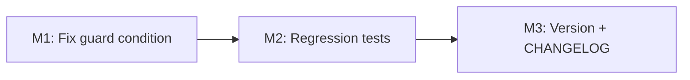

# Plan 202 — Fix "Weitere Standorte" Guard Condition

## Plan Header

| Field          | Value |
|----------------|-------|
| Plan ID        | 202 |
| Target Release | next available patch after current `origin/main` version (`0.15.4`); confirm at DevOps Stage 1 |
| Epic Alignment | UI polish / provider detail correctness |
| Related Issues | https://github.com/abu-lina/uflow/issues/291 |
| Classification | Bugfix |
| Pipeline       | Abbreviated |
| GitHub Issue   | https://github.com/abu-lina/uflow/issues/291 |
| Created        | 2026-08-05T08:00Z |

## Changelog

| Date | Author | Change |
|------|--------|--------|
| 2026-08-05T08:00Z | Planner | Initial plan from analysis 202 |
| 2026-08-05T09:00Z | Implementer | Status set to In Progress; implementation started |
| 2026-08-05T10:00Z | Code Reviewer | APPROVED_WITH_COMMENTS; status updated to Code Review Approved |
| 2026-08-05T07:57Z | Implementer | Addressed review findings (i18n keying for further locations and location fallback); ready for re-review |
| 2026-08-05T07:59Z | QA | Testing complete — 14/14 tests pass, type-check passes, i18n keys verified in all 6 locales; Status: QA Complete |
| 2026-08-05T08:00Z | DevOps | Stage 1 committed locally; version confirmed v0.15.5; Status: Committed |

---

## Value Statement and Business Objective

As a user browsing a provider's detail page, I want the "Weitere Standorte" (Further Locations) accordion to only appear when a provider has more than one location, so that single-location providers do not show a misleading "Further Locations" section that contains only the current location.

**North-star metric**: Zero single-location providers render the "Weitere Standorte" accordion. Verifiable via UAT on provider `33084ad8-72a0-42d2-b6ef-ff5065709d5d`.

---

## Release Strategy

Standalone (no other known plans for v0.15.5 at time of writing).

---

## Objective

Fix the guard expression at line 287 of `ProviderDetailSections.tsx` from `> 0` to `> 1` so the section renders only when the `locations` array has at least two entries.

---

## Analysis Reference

`agent-output/analysis/202-weitere-standorte-analysis.md` — all 5 investigation goals resolved at L1 Proven. No open questions or gaps.

---

## Assumptions

1. `locations` is the full provider locations array (primary + additional). Neither caller pre-filters it before passing to `ProviderDetailSections`.
2. The fix is self-contained in `ProviderDetailSections.tsx`. No caller changes are required.
3. A provider with `undefined` or `[]` locations must remain hidden — the existing `?.length ?? 0` defensive pattern satisfies this.
4. No database schema changes required.

---

## Decision Record

| # | Decision | Status |
|---|----------|--------|
| D1 | Fix at the section component (`ProviderDetailSections`), not the callers | `[RESOLVED]` — component owns its own render condition (SRP; callers should not filter for display logic) |
| D2 | Guard threshold: `> 1` (not `>= 2`) | `[RESOLVED]` — idiomatic, equivalent, and matches the plain-English intent |
| D3 | No callers (`ProviderDetailPage`, `ProviderDetailModal`) need changes | `[RESOLVED]` — grep-confirmed single render site; fix propagates automatically |
| D4 | Regression tests in existing test file, not a new file | `[RESOLVED]` — `ProviderDetailSections.test.tsx` already exists and is the appropriate home |
| D5 | Target v0.15.5 as next patch; confirm at DevOps Stage 1 | `[RESOLVED]` — git tag `v0.15.4` is latest; no collision detected |

---

## State-Machine Coverage (Conditional Render)

The `locations?.length` guard has four branches. Full enumeration:

| `locations` value | `length` | Current `> 0` | Fixed `> 1` | Status |
|-------------------|----------|----------------|-------------|--------|
| `undefined` | 0 | `false` (hidden) | `false` (hidden) | Confirmed unaffected |
| `[]` (empty array) | 0 | `false` (hidden) | `false` (hidden) | Confirmed unaffected |
| 1 element (primary only) | 1 | `true` (shown ❌) | `false` (hidden ✅) | **This fix** |
| 2+ elements | ≥2 | `true` (shown ✅) | `true` (shown ✅) | Confirmed unaffected |

Only the `length === 1` branch is being fixed. The remaining branches are confirmed unaffected by inspection.

---

## Milestone Dependencies

M2 must follow M1 so the pre-fix / post-fix test assertions are grounded in the actual change. M3 is purely additive and follows M2.

---

## Plan Milestones

### M1 — Fix Guard Condition

**Objective**: Change the single guard expression so the "Weitere Standorte" section only renders when `locations.length > 1`.

**File**: `src/features/providers/components/ProviderDetailSections.tsx`  
**Location**: The JSX conditional wrapping `
` (currently at line 287)

**Change description**: The expression `(locations?.length ?? 0) > 0` must become `(locations?.length ?? 0) > 1`. No other lines in this file require modification.

**Acceptance criteria**:
- The guard expression reads `> 1`
- `tsc --noEmit` exits 0
- No other lines in the file are modified

---

### M2 — Regression Tests

**Objective**: Add two focused tests that make the pre-fix and post-fix behaviour explicit in the test suite.

**File**: `src/__tests__/features/providers/ProviderDetailSections.test.tsx` (append new describe block, no existing tests removed)

**Tests required**:

1. **`[BUG-202 pre-fix FAILS] single-location provider: "Weitere Standorte" must NOT render`**  
   — Render `ProviderDetailSections` with `locations` containing exactly 1 `Location` object (the primary). Assert that no element with text "Weitere Standorte" is present in the DOM.

2. **`[BUG-202 post-fix PASSES] multi-location provider: "Weitere Standorte" must render`**  
   — Render `ProviderDetailSections` with `locations` containing exactly 2 `Location` objects. Assert that an element with text "Weitere Standorte" is present in the DOM.

**Naming convention**: Follow the existing `[pre-fix FAILS]` / `[post-fix PASSES]` naming pattern already used in this file.

**Acceptance criteria**:
- Both tests exist and pass (green) with the M1 fix applied
- `npm test -- --reporter=verbose` shows both tests passing
- The test describe block is labelled `BUG-202 Weitere Standorte guard`

---

### M3 — Version and Release Artifacts

**Objective**: Bump version to the confirmed v0.15.5 and document this fix in CHANGELOG.

**Files**:
- `package.json` — update `"version"` field to confirmed DevOps Stage 1 value
- `CHANGELOG.md` — add entry for this patch under the new version heading

**Acceptance criteria**:
- `package.json` version matches the DevOps Stage 1 confirmed version
- `CHANGELOG.md` entry references Plan 202, describes the guard condition fix, and names the affected file

---

## Testing Strategy

**Scope**: Unit tests only. This is a pure conditional render change; no database interaction, no API calls, no network.

**Expected test types**:
- Unit: 2 regression tests in `ProviderDetailSections.test.tsx`

**Critical scenarios** (high level):
- Single-location provider renders without the "Weitere Standorte" section
- Multi-location provider renders with the "Weitere Standorte" section
- `undefined` / empty-array `locations` prop — existing component resilience confirmed, no test addition required

**Coverage note**: No e2e tests required; the unit tests directly exercise the exact conditional branch. UAT validation against the UAT URL is the human verification gate.

---

## Validation & Verification

1. `tsc --noEmit` — must exit 0
2. `npm test` — all existing tests pass + 2 new regression tests pass
3. UAT: Navigate to `/providers/33084ad8-72a0-42d2-b6ef-ff5065709d5d` on UAT — confirm "Weitere Standorte" section is absent

---

## Rollback Considerations

Single-line change. Rollback = revert the single character. No migration, no data change, no API contract change.

---

## Duration Estimates

| Phase | Estimate | Uncertainty |
|-------|----------|-------------|
| Analysis | Complete | — |
| Planning | ~0.5h | Low |
| Implementation | ~0.5h | Low (1 char + 2 tests) |
| Code Review | ~0.25h | Low |
| QA | ~0.5h | Low |
| DevOps | ~0.5h | Low |
| **Total** | **~2.25h** | Low overall |

Uncertainty driver: None — scope is fully bounded by L1 Proven analysis.

---

## Risks

| Risk | Severity | Mitigation |
|------|----------|------------|
| Secondary UX: section shows primary location alongside additional ones | Low | Out of scope for this fix; separate ticket if needed |
| Version collision at DevOps Stage 1 | Low | Pre-flight showed no collision; DevOps confirms before bumping |

---

## Open Questions

None.
