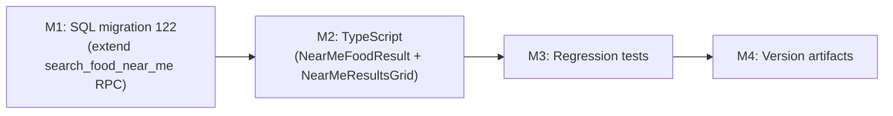

# Plan 204 — Fix Category Badge "Unnamed" on Near-Me Provider Cards

| Field          | Value                                                                                                  |
| -------------- | ------------------------------------------------------------------------------------------------------ |
| Plan ID        | 204                                                                                                    |
| Target Release | next available patch after current `origin/main` version (`v0.15.7`); confirm at DevOps Stage 1       |
| Epic Alignment | Near-Me Food Search — Plan 196 follow-up bug                                                           |
| Related Issues | https://github.com/abu-lina/uflow/issues/302                                                          |
| Classification | Bugfix                                                                                                 |
| Pipeline       | Abbreviated (Bugfix): Planner → ③ Critic → ⑤ Implementer → ⑥ QA → ⑦ DevOps                         |
| GitHub Issue   | https://github.com/abu-lina/uflow/issues/302                                                          |
| Created        | 2026-08-09T00:00Z                                                                                      |

## Changelog

| Date (UTC)       | Agent   | Change                                                                                          |
| ---------------- | ------- | ----------------------------------------------------------------------------------------------- |
| 2026-08-09T00:00Z | Planner | Plan created from Analysis 204; inheriting ID/UUID/Origin from analysis doc                    |
| 2026-08-09T19:20Z | Implementer | Status set to In Progress; implementation started (NO-MEMORY MODE)                        |
| 2026-08-09T19:40Z | Code Reviewer | Code review approved; ready for QA execution                                            |

---

## Value Statement and Business Objective

> As a user browsing food providers near my location, I want to see each restaurant's actual cuisine/category name on its card, so that I can quickly distinguish the type of food on offer and make an informed choice — rather than seeing "unnamed" on every result.

The Near Me feature targets users at peak buying intent (geo-located, on the go). Showing "unnamed" as the category on every card erodes trust, degrades discoverability, and is inconsistent with every other path in the app where category names display correctly.

---

## Objective

Repair the category badge on `ProviderCard` for near-me results so that the correct locale category name (e.g. "Türkisch", "Arabisch", "Italian") is displayed, matching the behaviour of the standard search path.

---

## Root Cause (Inherited from Analysis 204)

Three-layer gap introduced when Plan 196 shipped the `search_food_near_me` RPC:

1. **SQL**: `search_food_near_me` (migration 120) does not join `public.categories`; no category data is returned by the RPC
2. **Type**: `NearMeFoodResult` has no `category` or `category_id` field
3. **Component**: `NearMeResultsGrid` passes `category_id={null}` and no `category` prop to `ProviderCard`, causing `getCategoryName()` to always return `t('search.unnamed')`

---

## Assumptions

1. The `categories` table join on `p.category_id` is a simple LEFT JOIN — no multi-category fanout per provider (one provider → one category_id, nullable)
2. Migration 121 (`121_plan_199_chatbot_open_now.sql`) is the last applied migration; migration 122 is available
3. The `category_images` JSONB column exists on `categories` (confirmed: used throughout standard search path)
4. No RLS changes are needed — `search_food_near_me` is already `SECURITY INVOKER` and `categories` is publicly readable to `anon`
5. The reproduction URL (`?near_lat=...&near_lon=...&near_radius=5`) represents the full failure scenario; no `?category=` param is involved

---

## Decision Record

| # | Decision | Status |
| - | -------- | ------ |
| D1 | Fix at all three layers (SQL + type + component) rather than a client-only workaround that re-fetches categories separately | `[RESOLVED]` — A client-side workaround would add an extra Supabase query per near-me page render and diverge from the standard data contract. Fixing at the RPC ensures the data is fetched once, collocated with the provider row, and costs no extra round-trip. |
| D2 | Include `category_images` in the RPC extension alongside `name_de`/`name_en` | `[RESOLVED]` — Same LEFT JOIN, zero extra cost. Omitting it would leave near-me cards without stock fallback imagery for providers that have no `provider_images` but do have `category_images` configured — a silent visual gap beyond the stated bug. |
| D3 | Use migration 122 as an additive `CREATE OR REPLACE FUNCTION` — do not modify migration 120 | `[RESOLVED]` — Maintaining immutability of shipped migrations is a project convention; migration 122 replaces the function definition additively. |
| D4 | Do NOT introduce a shared base type between `NearMeFoodResult` and `SearchResult`/`Provider` in this plan | `[RESOLVED]` — YAGNI. The type convergence is a valid architectural improvement but is a separate concern with wider refactor scope. Deferred to a future refactor plan (owner: Planner; no target version set). |
| D5 | The fix applies to all viewports (mobile + desktop); do not add mobile-specific handling | `[RESOLVED]` — The category badge is unconditionally rendered on all breakpoints. The "mobile only" qualifier in the bug report was observer bias, not a technical constraint. |
| D6 | Do not alter `useNearMeSearch` hook interface or `nearMeSearch.results` return type directly; update the service layer type `NearMeFoodResult` instead | `[RESOLVED]` — The hook is a thin React Query wrapper; the type fix belongs in the service layer where the RPC result is typed. The hook infers the type from the service function's return type automatically. |

---

## Release Strategy

Standalone — no other known active plans targeting the same next-patch slot (Plans 201 and 198 are post-deploy open-action docs, not new features). If another plan reaches DevOps Stage 1 targeting the same patch simultaneously, standard coordination applies.

---

## Milestone Dependencies



M2 depends on M1's schema additions being reflected in the type. M3 verifies M2's prop-forwarding. M4 records the release.

---

## Plan

### M1 — SQL: Extend `search_food_near_me` to return category data

**File**: `supabase/migrations/122_plan_204_near_me_category.sql`

**Objective**: Replace the `search_food_near_me` function definition with an extended version that LEFT JOINs `public.categories` and includes `category_id`, `category_name_de`, `category_name_en`, and `category_images` in the returned columns.

**Acceptance criteria**:
- Migration file created at `supabase/migrations/122_plan_204_near_me_category.sql`
- `RETURNS TABLE` declaration includes four new columns: `category_id UUID`, `category_name_de TEXT`, `category_name_en TEXT`, `category_images JSONB`
- `FROM` clause includes `LEFT JOIN public.categories c ON c.category_id = p.category_id`
- `SELECT` clause maps the four new columns
- `DROP FUNCTION IF EXISTS` or `CREATE OR REPLACE FUNCTION` pattern used (consistent with migration 120)
- All existing columns and WHERE/ORDER/LIMIT clauses are preserved unchanged
- `GRANT` and `REVOKE` statements retained
- Migration is wrapped in `BEGIN; ... COMMIT;`

**Notes**:
- The LEFT JOIN (not INNER JOIN) is important because `category_id` on `providers` is nullable in theory, and using INNER JOIN could silently drop providers with null `category_id`
- The function name, signature, and RLS grants must remain identical to migration 120 so it is a drop-in replacement

---

### M2 — TypeScript: Update `NearMeFoodResult` and `NearMeResultsGrid`

**Files**:
- `src/services/providers.ts` — `NearMeFoodResult` interface
- `src/features/search/components/NearMeResultsGrid.tsx` — `ProviderCard` prop forwarding

**Objective**:

1. **Type extension** (`NearMeFoodResult`): Add `category_id`, `category_name_de`, `category_name_en`, `category_images` fields — nullable strings/JSONB, mirroring the new RPC columns

2. **Prop forwarding** (`NearMeResultsGrid`): Map the new `NearMeFoodResult` fields to the `ProviderCard` props:
   - `category_id={result.category_id ?? null}`
   - `category={{ name_de: result.category_name_de ?? undefined, name_en: result.category_name_en ?? undefined, category_images: result.category_images ?? null }}`

**ILLUSTRATIVE ONLY** — shape of the `category` prop ProviderCard expects:
```
{ name_de?: string | null; name_en?: string | null; category_images?: Record<string,unknown> | null }
```
The exact interface is already defined on the `Provider` type in `src/services/providers.ts`; consult it rather than recreating the shape.

**Acceptance criteria**:
- `NearMeFoodResult` compiles without TypeScript errors after the four new fields are added
- `NearMeResultsGrid` compiles without TypeScript errors after the prop mapping is updated
- `ProviderCard` no longer receives `category_id={null}` or an absent `category` prop for near-me results
- `npm run type-check` passes

---

### M3 — Tests: Regression coverage for category propagation

**File**: `src/features/search/components/NearMeResultsGrid.test.tsx`

**Objective**: Add at least one focused test that verifies the `category` prop reaches `ProviderCard` with the correct values, and one test that verifies the `category_id` prop is forwarded.

**Testing strategy notes** (high-level only — QA defines exact test cases):
- The existing `ProviderCard` mock captures only `provider_name` and `distanceKm`; the mock must be extended to also capture and expose `category` and `category_id` for assertion
- One test with a result that has category data → assert correct name appears in the rendered mock output
- One test with a result that has `category_name_de = null` / `category_name_en = null` → assert fallback behaviour (no crash, no "unnamed" in rendered output if the mock exposes the prop)
- The `NearMeFoodResult` fixture in the test file must include the four new fields

**Acceptance criteria**:
- `npm test` passes with the new tests
- No existing test is broken
- The test names make the regression context legible (e.g., "forwards category name to ProviderCard for near-me results")

---

### M4 — Version Artifacts

**Files**: `package.json`, `CHANGELOG.md`

**Objective**: Bump the patch version and document the fix.

**Acceptance criteria**:
- `package.json` version incremented to the next patch after `v0.15.7` (confirm exact version at DevOps Stage 1)
- `CHANGELOG.md` entry added describing the fix, affected files, and the root-cause layers addressed
- DevOps Stage 1 confirms version is available (no collision with concurrent plans)

---

## Testing Strategy

Unit tests (Vitest) cover the component-level prop-forwarding contract. No new integration tests or E2E tests are required for this fix because:
1. The fix is purely additive at the data transport and type layer
2. The RPC change is exercised by unit tests via the mocked `ProviderCard` capturing category props
3. UAT manual verification (near-me mode on mobile → each card shows correct category name) is the final acceptance gate

QA defines specific test cases in `agent-output/qa/`.

---

## Validation Steps

1. `npm run type-check` — zero new TypeScript errors
2. `npm test` — all existing tests pass; new regression tests pass
3. **UAT manual validation**: Navigate to `https://uat.ummahflow.com/providers?near_lat=48.79715464344648&near_lon=9.176673559780046&near_radius=5` on a mobile viewport; each provider card must show the actual category name (e.g. "Türkisch") instead of "unnamed" / "Unbenannt"
4. **Locale check**: Repeat UAT validation with DE and EN locale set; both should resolve the correct locale category name
5. **Standard path non-regression**: Navigate to `/providers` without near-me params; category badges on standard results must be unaffected

---

## Scope Exclusions

| Item | Rationale |
| ---- | --------- |
| Shared base type between `NearMeFoodResult` and `SearchResult` | Architectural refactor; deferred (Decision D4) |
| Adding a `category` filter capability to the near-me path | Out of scope for this bugfix; near-me results are proximity-sorted, not category-filtered |
| `find_nearby_food_providers` (detail page RPC) | Not affected; already joins categories for the detail page's own display |

---

## Risks

| Risk | Likelihood | Severity | Mitigation |
| ---- | ---------- | -------- | ---------- |
| `category_id` is null for some food providers — LEFT JOIN returns null category columns | Low | Low | `getCategoryName()` already handles null `category` gracefully; no change in behaviour for null-category providers |
| Migration 122 conflicts with a concurrent migration on main | Very low | Medium | `git pull origin main` before committing; migration number verified at implementation time |
| TypeScript shape mismatch between new `NearMeFoodResult` fields and `ProviderCard`'s `category` prop type | Low | Blocked by `type-check` gate | `npm run type-check` must pass before handoff to QA |

---

## Duration Estimates

| Phase    | Range   | Uncertainty Driver |
| -------- | ------- | ------------------ |
| Analysis | Done    | Completed (Analysis 204) |
| Planning | Done    | This document |
| Implementation | 1–2h | Small scope: 1 SQL file + 2 TS files + 1 test file; no API surface changes |
| QA       | 0.5–1h | UAT device check is the main variable |
| DevOps   | 0.5h   | Standard patch release |

Total estimate: 2–4 hours.

---

## Handoff Notes

- The SQL migration must be written as `CREATE OR REPLACE FUNCTION` within a `BEGIN/COMMIT` block, consistent with migration 120's style
- The LEFT JOIN on categories must use `c.category_id = p.category_id` (not a name-based join)
- The test fixture in `NearMeResultsGrid.test.tsx` must be updated to include the four new `NearMeFoodResult` fields, or existing tests that use the fixture will fail TypeScript compilation
- Do not apply the migration to production directly; Supabase migration is applied via the standard DevOps Stage 1 `supabase db push` flow
- **Known limitation (not a regression)**: `selectedCategoryLabel` in `ProvidersContent.tsx` (mobile fixed header) will still not resolve a category name when near-me mode is active, even after this fix. The header correctly shows the section label when `categoryLabel` is null. QA should not flag this as a regression.
- **M3 null-null case**: A provider result with `category_name_de = null` AND `category_name_en = null` will still display `t('search.unnamed')` — this is the correct fallback for a provider with no category name configured. The regression test should focus on providers that have valid category name data.

## Rollback Plan

If the fix introduces a regression:
- Revert the SQL change with `CREATE OR REPLACE FUNCTION` restoring the original 8-column signature
- Revert `NearMeFoodResult`, `NearMeResultsGrid`, and the new test file
- No data migration required; purely additive schema extension

---

## Open Questions

None. Root cause is fully proven (Analysis 204, L1 across all three layers). No open questions remain.
