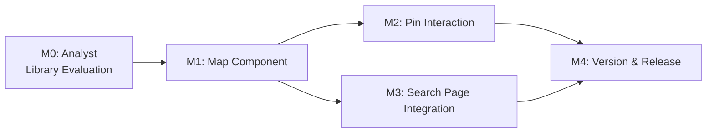

# Plan 208 — Mobile Search: Interactive Map View with Restaurant Pins

| Field          | Value                                                                                         |
| -------------- | --------------------------------------------------------------------------------------------- |
| Plan ID        | 208                                                                                           |
| Target Release | next available minor after current origin/main version (v0.15.9); confirm at DevOps Stage 1   |
| Epic Alignment | Mobile-first restaurant discovery                                                             |
| Related Issues | None                                                                                          |
| Classification | Feature                                                                                       |
| Pipeline       | Full                                                                                          |
| GitHub Issue   | https://github.com/abu-lina/uflow/issues/306                                                 |
| Created        | 2026-08-15T14:00Z                                                                             |

## Changelog

| Date               | Agent   | Change                                         |
| ------------------- | ------- | ---------------------------------------------- |
| 2026-08-15T14:00Z  | planner | Plan created                                   |
| 2026-08-15T16:00Z  | planner | Revised: resolved D1 (react-leaflet), clarified D7 (direct query), added OSM tile policy compliance to M1, added error boundary fallback to M3 — per Critique F1–F4 |
| 2026-08-15T16:25Z  | code-reviewer | Status updated to Code Review Approved after Round 2 re-review |
| 2026-08-15T17:18Z  | uat | Status updated to UAT Approved; all value delivery gates pass |
| 2026-08-15T17:25Z  | devops | Status updated to Committed for Release v0.15.10; moving to closed/ |

---

## Value Statement and Business Objective

**As a** mobile user opening the Search screen,
**I want to** see an interactive map with pins for every restaurant instead of category tiles,
**so that** I can visually discover nearby restaurants by location and tap a pin to see its details — making the discovery experience spatial and intuitive on mobile.

---

## Assumptions

1. **Geo data availability**: The `locations` table already stores `location_latitude` / `location_longitude` for providers. The `search_food_near_me` RPC (migration 120/122) returns these coordinates. Providers without coordinates will simply not appear as pins.
2. **Mobile detection**: The existing `useIsMobile()` hook (`src/hooks/useIsMobile.ts`, breakpoint 768px) is the correct gate for showing map vs. category view.
3. **Food section only (initial scope)**: The map view replaces category tiles on the Search page for the **food** section only. Ummah and Stores sections retain their current behaviour.
4. **No Google Maps**: Explicitly excluded per user requirement.
5. **Detail page route exists**: `/providers/[provider_id]` (server component with SSR) is the existing detail page. Pin tap navigates there via `router.push()`.
6. **No user geolocation required for initial load**: The map defaults to a sensible center (e.g., city with most providers, or Germany center) and shows all approved food providers with coordinates. User geolocation ("near me") is an enhancement, not a prerequisite.
7. **Client component**: The map widget will be a `'use client'` component with dynamic import (`next/dynamic` with `ssr: false`) because map libraries depend on `window`/DOM.

---

## Decision Record

| # | Decision | Status | Rationale |
|---|----------|--------|-----------|
| D1 | Map library: react-leaflet v4.2.1 + leaflet v1.9.4 + OSM raster tiles | [RESOLVED] | Analysis 208 evaluated three candidates. react-leaflet wins on bundle size (~48 kB gzip vs ~280 kB MapLibre), zero tile cost, no telemetry, BSD-2-Clause license, and ecosystem alignment (UFlow already uses OSM). Mapbox GL JS disqualified (proprietary license, mandatory telemetry). See ADR-208 in `agent-output/analysis/208-map-library-analysis.md`. |
| D2 | Map scope: food section only | [RESOLVED] | YAGNI — user request is "restaurant" pins only. Ummah/Stores have no spatial discovery expectation. Extend later if validated. |
| D3 | Mobile-only map; desktop retains categories | [RESOLVED] | User request specifies "on mobile". Desktop keeps existing category UX. Mobile breakpoint via `useIsMobile()` hook (768px). |
| D4 | No clustering in v1 | [RESOLVED] | YAGNI — current provider count is small enough (low hundreds in Germany) that pin overlap is manageable. Add clustering as a follow-up if providers exceed ~500 in a viewport. |
| D5 | Pin tap → full detail page navigation | [RESOLVED] | Pin taps navigate to `/providers/[provider_id]` (existing SSR route). No inline popup/card on the map — keeps scope minimal and reuses existing detail page. |
| D6 | Default map center: Germany (51.1657°N, 10.4515°E), zoom ~6 | [RESOLVED] | Platform is Germany-focused. Sensible default center until user geo or city filter is applied. |
| D7 | Data source: direct Supabase client query for all geocoded food providers | [RESOLVED] | The `search_food_near_me` RPC requires `p_lat`/`p_lon`/`p_radius_km` (proximity search) and is not appropriate for the map's initial "show all providers" load. Instead, use a direct Supabase client query: `locations` joined with `providers`, filtered by `listing_type = 'food'`, `review_status = 'approved'`, and `location_latitude IS NOT NULL`. The `search_food_near_me` RPC remains available if near-me mode is activated later. |

---

## Release Strategy

Standalone — no other known active plans targeting the same release version. Plan 198 (open actions), 201 (open actions), and 203 (open actions) are post-deploy follow-ups for earlier releases and do not compete.

**Stall alert**: Plan 184 (sections-deactivation) has UAT verdict `APPROVED FOR RELEASE` with no deployment doc found. This is a separate release and does not block Plan 208, but should be routed to @DevOps to avoid version drift.

---

## Milestones

### M0: Analyst — Map Library Evaluation (REQUIRES ANALYSIS)

**Objective**: Evaluate and recommend a map library for the project. This is a technical unknown — the Analyst must produce a structured comparison.

**Scope of evaluation**:
- **Candidates**: react-leaflet + OpenStreetMap tiles, MapLibre GL JS (+ Maptiler/Stadia tiles), Mapbox GL JS (free tier)
- **Criteria**: Bundle size (gzipped), tile hosting cost at scale, TypeScript support quality, Next.js 15 App Router compatibility (dynamic import / SSR: false), mobile touch performance, license terms, community/maintenance health
- **Deliverable**: Analysis doc `agent-output/analysis/208-map-library-analysis.md` with recommendation + ADR draft

**Acceptance**: ADR with clear recommendation; Planner updates D1 to `[RESOLVED]`.

---

### M1: Map Component — Client-Side Interactive Map

**Objective**: Create a reusable map component that renders an interactive map with provider pins.

**Location**: `src/features/search/components/SearchMap.tsx` (new file)

**Behaviour**:
- Renders a full-viewport-height interactive map (below the section selector tabs, above the fixed bottom bar)
- Loads all approved food providers with non-null coordinates
- Displays one pin per provider at its primary location coordinates
- Default center: Germany (~51.17°N, 10.45°E), zoom level ~6
- Mobile touch gestures: pan, pinch-to-zoom
- Dynamic import with `ssr: false` to avoid server-side rendering of DOM-dependent map library

**Data source**: Direct Supabase client query — `locations` joined with `providers`, filtered by `listing_type = 'food'`, `review_status = 'approved'`, `location_latitude IS NOT NULL`. Returns `{ provider_id, provider_name, location_latitude, location_longitude }` (and optionally `provider_images` for pin customization). NOT the `search_food_near_me` RPC (which requires lat/lon/radius params for proximity search).

**OSM tile policy compliance** (per https://operations.osmfoundation.org/policies/tiles/):
- Tile URL: `https://tile.openstreetmap.org/{z}/{x}/{y}.png` (or `tile.openstreetmap.de` for German labels)
- Attribution: Visible `© OpenStreetMap contributors` on the map (Leaflet supports this via `attribution` prop on `TileLayer`)
- Referrer: UFlow's Nginx config uses `strict-origin-when-cross-origin` — compliant (sends origin, does not strip)
- Caching: Honour server cache headers (browser default is compliant)
- No bulk download or prefetch

**Acceptance**:
- Map renders on mobile viewport with pins for all geocoded food providers
- Map is not rendered server-side (no hydration errors)
- Loading state shown while data fetches
- Empty state if no providers have coordinates
- OSM attribution text visible on the map
- Tile URL uses HTTPS

---

### M2: Pin Interaction — Tap to Navigate to Detail Page

**Objective**: When a user taps a map pin, navigate to the provider's detail page.

**Behaviour**:
- Pin click/tap calls `router.push('/providers/{provider_id}')`
- Back navigation from detail page returns to the search page with map state intact (standard browser history)
- Pin should show provider name on hover/tap (tooltip or small label) — implementation detail for Implementer

**Acceptance**:
- Tapping a pin navigates to `/providers/[provider_id]`
- The correct provider detail page loads
- Browser back returns to the map view

---

### M3: Search Page Integration — Conditional Map/Category Rendering

**Objective**: On mobile, replace the category accordion/tiles with the map view when on the Search page (food section).

**Location**: Modify `src/app/(public)/search/page.tsx`

**Behaviour**:
- When `useIsMobile()` returns `true` AND `selectedSection === 'food'`:
  - Render `<SearchMap>` instead of the Was/Wo/Wer/Filter accordion stack
  - The section selector tabs remain visible above the map
  - The fixed bottom bar is hidden (or repurposed — Implementer discretion)
- When desktop or non-food section: existing behaviour unchanged

**Error boundary / fallback** (Critique F2): If the map component fails to render (network error, tile server unreachable, Canvas/WebGL unavailable), fall back gracefully to the existing category accordion view rather than showing a blank screen. Wrap the dynamically imported `<SearchMap>` in a React error boundary.

**Acceptance**:
- Mobile + food section → map view renders
- Mobile + ummah/store section → existing accordion view renders
- Desktop + any section → existing accordion view renders
- No regressions in existing search flow
- If map fails to load → category accordion view renders (error boundary fallback)

---

### M4: Update Version and Release Artifacts

**Objective**: Bump version, update CHANGELOG, and prepare for release.

**Tasks**:
- Update `package.json` version to match target release
- Add CHANGELOG entry documenting map view feature
- Commit message: `feat(208): mobile search map view with restaurant pins`

**Acceptance**:
- Version artifacts are consistent with the confirmed target release
- CHANGELOG reflects the map view feature and any new dependency added

---

## Milestone Dependencies

**Sequencing rule**: M0 (library selection) must complete before implementation begins. M2 and M3 can proceed in parallel after M1.

---

## Testing Strategy

- **Unit tests**: Map component renders without errors; pin data mapping; conditional rendering logic (mobile vs desktop, food vs other sections)
- **Integration tests**: Pin click triggers correct navigation; search page renders map on mobile viewport
- **Visual/manual testing**: Map renders correctly on mobile Safari/Chrome; touch gestures work; pins are positioned accurately
- **Regression**: Existing search flow (desktop, non-food sections) unchanged

_Specific test cases are QA's responsibility._

---

## Risks

| Risk | Likelihood | Impact | Mitigation |
|------|-----------|--------|------------|
| Chosen map library has large bundle size impact | Medium | Medium | Analyst evaluates gzipped sizes; dynamic import ensures map JS only loads on mobile search page |
| Tile hosting costs at scale | Low (current DAU < 5000) | Low | OSM tiles are free; Maptiler/Stadia have generous free tiers; revisit if DAU grows |
| Providers without coordinates don't appear on map | Known | Low | Acceptable — enrichment pipeline already populates coordinates for most providers. Show a note if a significant percentage lacks coordinates |
| Map library incompatibility with Next.js 15 App Router | Low | High | Analyst phase validates this before implementation; dynamic import with SSR: false is the standard pattern |

---

## Duration Estimates

| Phase          | Estimate     | Uncertainty Driver                                     |
| -------------- | ------------ | ------------------------------------------------------ |
| Analysis       | 0.5–1 day    | Library evaluation scope is bounded (3 candidates)     |
| Planning       | 0.5 day      | This document                                          |
| Implementation | 1–2 days     | Depends on library choice; dynamic import complexity    |
| QA             | 0.5 day      | Focused scope — one new component, conditional render   |
| UAT            | 0.5 day      | Manual mobile validation required                      |
| DevOps         | 0.5 day      | Standard release pipeline                              |
| **Total**      | **3–5 days** |                                                        |

---

## Out of Scope

- Turn-by-turn directions or routing
- Pin clustering algorithms
- Geofencing or push notifications based on location
- Desktop map view
- Map view for Ummah or Stores sections
- Custom map styling/theming beyond default tiles
- User location tracking or "near me" auto-center (existing near-me feature in `useNearMeSearch` is separate)
