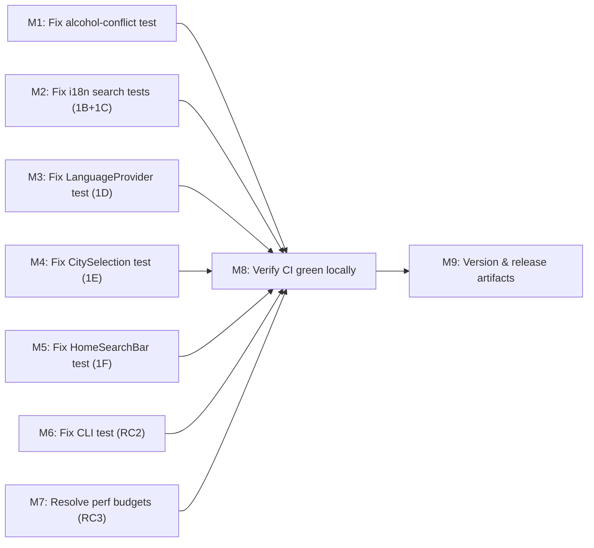

# Plan 210 — CI Pipeline Failure Fix

| Field          | Value                                                                      |
| -------------- | -------------------------------------------------------------------------- |
| Plan ID        | 210                                                                        |
| Target Release | next available patch after current origin/main (v0.15.11); confirm at DevOps Stage 1 |
| Epic Alignment | CI / Quality Gate Health                                                   |
| Related Issues | None (GitHub issue created after plan)                                     |
| Classification | Bugfix                                                                     |
| Pipeline       | Abbreviated (Bugfix): Planner → Critic → Implementer → Code Reviewer → QA → DevOps |
| GitHub Issue   | https://github.com/abu-lina/uflow/issues/311                               |
| Created        | 2026-08-15T22:00Z                                                          |

## Changelog

| Date            | Agent   | Action                                                         |
| --------------- | ------- | -------------------------------------------------------------- || 2026-08-16T00:05Z | QA      | QA COMPLETE; all gates pass (231 tests, type-check, build, perf, lint, standalone-build); approved for UAT || 2026-08-15T23:50Z | Code Reviewer | Code review APPROVED; no blocking findings; handoff to QA |
| 2026-08-15T23:00Z | Planner | M1 revised: delete test file (not rewrite) — `checkHalalAttestation` is dead import, gate was removed |
| 2026-08-15T22:45Z | Implementer | Implementation started on branch `fix/plan-210-ci-failures` |
| 2026-08-15      | Analyst | RCA complete — 4 root causes identified; RC4 already resolved  |
| 2026-08-15T22:30Z | Critic  | APPROVED — 4 LOW findings (L1 note added to Handoff Notes); no blockers |
| 2026-08-15T22:00Z | Planner | Plan drafted from analysis 210                               |

---

## Value Statement and Business Objective

> As a developer on the UFlow team, I want the CI pipeline to pass on every PR and push to `main`, so that the merge gate is trustworthy, regressions are caught before they reach production, and the team has confidence when shipping.

The CI pipeline has been red on **every run since June 22, 2026 — 55+ days and 30+ runs** across multiple branches. During this period, code has been merged and features shipped with zero CI gate enforcement. The UAT deploy pipeline also failed twice on Aug 15 (since resolved via PR #309). This plan delivers a fully green CI pipeline with documented rationale for any threshold adjustments.

---

## Decision Record

| # | Decision | Status |
|---|----------|--------|
| 1 | Inherit ID 210 from analysis (single work chain) | [RESOLVED] — Document lifecycle requires downstream docs inherit the originating analysis ID |
| 2 | Fix the 6 stale test files rather than delete them | [RESOLVED] — Tests cover real behavior that still exists (review routes, search UI, city selection); the implementations changed but the coverage value remains. Update to match current behavior. |
| 3 | Delete `alcohol-conflict.test.ts` — all 6 tests cover gate behavior removed by Plan 194 | [RESOLVED] — Plan 194 (commit `99570d41`) removed the `checkMenuForAlcohol` call block but only added a dead import for `checkHalalAttestation` (never wired into function body). All 6 tests are stale: 4 assert on nonexistent gate behavior, 2 pass vacuously. Deleting the file is correct; re-adding gate tests belongs to a future plan that actually wires the halal check. |
| 4 | Fix CLI test by separating stdout/stderr rather than upgrading CI Node.js version | [RESOLVED] — Node.js 22 upgrade affects the full test suite and is a separate initiative. The immediate fix is to make CLI test assertions resilient to npm/node warning output in stderr (check stdout independently). A Node.js upgrade plan should be filed separately. |
| 5 | Investigate bundle composition before raising performance budget thresholds | [RESOLVED] — Providers pages should not carry Leaflet weight since the map is on `/search`. Implementer must run bundle analysis first; raise thresholds only if the weight is structurally unavoidable, and must document the rationale in `budgets.json`. |
| 6 | RC4 (UAT SSR failure) is out of scope — already resolved by PR #309 | [RESOLVED] — No action required. |
| 7 | Branch protection enforcement gap is out of scope for this plan | [RESOLVED: Deferred — owner: user, target: process improvement backlog] — The code fix alone cannot enforce the merge gate; this requires a GitHub Settings change which the user must apply. Flagged as OPEN QUESTION below. |
| 8 | Target release is a standalone patch — no bundling with other active plans | [RESOLVED] — Release bundling check confirms no other active plan targets the same patch version. Plan 082 targets a legacy v0.10.x patch and is stale. |

---

## Context & Scope

**In scope:**
- All 7 failing test files (17 failing tests, 2 failing CI jobs)
- Performance budget configuration (`scripts/perf/budgets.json`)
- Version artifacts (CHANGELOG, package.json)

**Out of scope:**
- Node.js version upgrade in CI (separate initiative)
- Branch protection rule configuration (manual action by user in GitHub Settings)
- Any refactoring of the production source files — this plan touches only test files and config

**Analysis reference**: `agent-output/analysis/210-ci-failures-analysis.md`

---

## Milestone Dependencies



M1–M7 are independent of each other and can be worked in parallel by one implementer. M8 gates M9.

---

## Plan

### Milestone 1 — Remove stale `alcohol-conflict.test.ts` (RC1-A)

**Files**: `src/__tests__/api/admin/review-provider/alcohol-conflict.test.ts`

**Objective**: Delete the entire test file. All 6 tests cover gate behavior that was intentionally removed from the route.

**Background**: Plan 193 added `checkMenuForAlcohol` call + tests. Plan 194 (commit `99570d41`) removed the entire alcohol-check block from the PATCH handler AND swapped the import to `checkHalalAttestation` — but **never wired `checkHalalAttestation` into the function body**. The import on line 7 of `route.ts` is dead code. The route currently approves providers without any attestation gate. All 4 "failing" tests assert on gate behavior (409 response, logger.warn, blocked update) that no longer exists. The 2 "passing" tests (`bypasses check when rejecting/needs_revision`) pass vacuously — they assert `not.toHaveBeenCalled()` on a function that is never called regardless.

**What the Implementer must do**:
1. Delete `src/__tests__/api/admin/review-provider/alcohol-conflict.test.ts`
2. Confirm no other test file imports from or references this file

**Scope guard**: The dead import (`checkHalalAttestation`) in `route.ts` line 7 is out of scope for this plan. Lint will flag it separately. Do NOT modify the production route file.

**Acceptance criteria**:
- The file is deleted
- `npx vitest run` no longer reports failures from this file
- No other tests reference or depend on this file

---

### Milestone 2 — Fix i18n search tests (RC1-B, RC1-C)

**Files**:
- `src/__tests__/app/(public)/search/page-meal-search.test.tsx` (7 failing tests)
- `src/app/(public)/search/page.test.tsx` (1 failing test)

**Objective**: Update tests that query elements by hardcoded German label `'Angebote suchen'` to work with the i18n layer introduced by Plan 208.

**Background**: Plan 208 replaced `aria-label="Angebote suchen"` (hardcoded) with `aria-label={t('searchPlaceholder')}` (translated). Tests break because the translation mock either doesn't return the expected text or the label now comes from a different translation key.

**What the Implementer must do**:
1. Inspect the existing `vi.mock('next-intl', ...)` or `vi.mock('@/providers/LanguageProvider', ...)` setup in both test files
2. Determine what translation key is used for the search input's `aria-label` in `src/app/(public)/search/page.tsx`
3. Choose one of two approaches:
   - **Approach A** (preferred if not too invasive): Ensure the i18n mock in each test file returns `'Angebote suchen'` for the applicable translation key so existing `getByRole('searchbox', { name: 'Angebote suchen' })` calls work unchanged
   - **Approach B**: Change the test queries to find elements by a stable attribute instead of translated text (e.g., `placeholder` attribute, `data-testid`, or role without name)
4. Apply the same approach consistently to both test files
5. Re-run both test files to confirm all previously failing tests pass

**Acceptance criteria**:
- All 8 previously failing tests (7+1) now pass
- Approach is documented in a one-line comment if non-obvious
- No other tests in these files regress

---

### Milestone 3 — Fix `RootPageContent.layout-regression.test.tsx` (RC1-D)

**File**: `src/__tests__/components/RootPageContent.layout-regression.test.tsx`

**Objective**: Provide the `LanguageProvider` context that `RootPageContent` now requires.

**Background**: Plan 208 made `RootPageContent` use `useLanguage()` internally. The test renders `<RootPageContent />` without wrapping it in a `LanguageProvider`, causing the hook to throw.

**What the Implementer must do**:
1. Read `src/providers/LanguageProvider.tsx` to understand its interface and whether it can be mocked
2. Add one of:
   - `vi.mock('@/providers/LanguageProvider', () => ({ useLanguage: () => ({ ... }), LanguageProvider: ({ children }) => children }))` at the top of the test file
   - Or wrap the `render(<RootPageContent />)` call with the actual `LanguageProvider` if it has no external dependencies
3. Confirm the test's single case passes after the change

**Acceptance criteria**:
- The 1 failing test now passes
- No other tests in the file regress
- The fix is minimal (the test itself doesn't change beyond the mock/wrapper)

---

### Milestone 4 — Fix `city-selection/page.test.tsx` (RC1-E)

**File**: `src/app/city-selection/page.test.tsx`

**Objective**: Fix the CTA test to match current component behaviour.

**Background**: The component now uses `window.location.href = '/'` (not `router.push('/')`) for navigation after city selection, and the CTA button text is a translated string (`t('waitlist.citySelection.discoverButton')`), not `'Show city'`. Both assumptions in the test are stale.

**What the Implementer must do**:
1. Read `src/app/city-selection/CitySelectionClient.tsx` to find:
   - The current CTA button aria-label or button text
   - The exact navigation method used (confirmed: `window.location.href = '/'`)
2. Update the test to:
   - Mock `window.location` (via `Object.defineProperty` or `vi.spyOn`) to capture navigation
   - Fix the button query to find the CTA by its actual current accessible name
3. Confirm the 1 failing test now passes

**Acceptance criteria**:
- The 1 failing test now passes
- The `mockPush` approach is removed or left in place only for legitimate `router.push` usage

---

### Milestone 5 — Fix `HomeSearchBar.test.tsx` (RC1-F)

**File**: `src/__tests__/features/search/HomeSearchBar.test.tsx`

**Objective**: Fix the `className` test to query the element that actually receives the `className` prop.

**Background**: The component renders `className` on the outer `<div>` wrapper, but the test finds the inner `<div role="search">` (which does not have the prop) and checks its `className`. The query target is wrong.

**What the Implementer must do**:
1. Read `src/features/search/components/HomeSearchBar.tsx` to confirm the DOM structure and which element receives `className`
2. Update the `accepts an optional className prop` test case to query the correct element:
   - Use `container.firstChild` (from `render`'s return value), or
   - Use a data-testid on the outer wrapper (add `data-testid="home-search-bar-root"` to the component and query by it)
   - Prefer the data-testid approach if the outer wrapper has no other stable query handle
3. Confirm the 1 failing test passes

**Note**: If adding `data-testid` to the component is required, this is the **only** allowed production file change in this plan. Keep it minimal.

**Acceptance criteria**:
- The 1 failing test now passes
- If a `data-testid` was added, it is on the outer wrapper only and does not affect any other tests

---

### Milestone 6 — Fix CLI test output assertions (RC2)

**File**: `src/__tests__/scripts/import-muslimbusiness-cli.test.ts`

**Objective**: Make the CLI test assertions resilient to npm and Node.js warning output in stderr.

**Background**: `npx tsx` now emits Node.js deprecation warnings and npm exec warnings to stderr before the script output. Tests that check `result.stderr || result.stdout` match against the warning text first, failing containment checks for the actual script output.

**What the Implementer must do**:
1. Run the script manually to determine which output channel (stdout vs stderr) the actual script messages go to:
   ```bash
   npx tsx scripts/import-muslimbusiness.ts --dry-run --limit 3 2>/dev/null  # stdout only
   npx tsx scripts/import-muslimbusiness.ts --dry-run --limit 3 1>/dev/null  # stderr only
   ```
2. Update the `runImport` helper or the assertions in both failing test cases to:
   - Check `result.stdout` (not `result.stderr || result.stdout`) for script-level output
   - Check `result.stderr` separately only for error/warning messages from the script itself (not from npx/node runtime)
   - Filter known npm/node prefix strings (e.g., `npm warn exec`, `⚠️ Node.js`) before asserting if the script mixes them into the same channel
3. Confirm both previously failing tests pass without changing what they validate (dry-run mode is printed, limit is accepted/rejected correctly)

**Acceptance criteria**:
- Both 2 failing tests now pass
- The tests do not assert on npm/node warning text (these are outside the script's control)
- The fix does not mask genuine script failures

---

### Milestone 7 — Resolve performance budget violations (RC3)

**Files**: `scripts/perf/budgets.json` (and potentially shared Next.js config if tree-shaking fix is found)

**Objective**: Restore the perf budget CI step to green. Either fix the bundle composition so providers routes don't carry Leaflet weight, or raise the thresholds with documented rationale.

**Background**: After Plan 208 (Leaflet map on `/search`), the CI reports:
- `/providers`: 364 kB, limit 350 kB (+4%)
- `/providers/[provider_id]`: 283 kB, limit 270 kB (+4.8%)

The map uses `next/dynamic` with `ssr: false`, so it should not affect providers pages. The budget overrun suggests a shared chunk is carrying Leaflet-related code.

**What the Implementer must do**:
1. Run a production Next.js build with bundle analysis:
   ```bash
   ANALYZE=true npm run build
   ```
   (If `ANALYZE` is not wired in `next.config.js`, use `@next/bundle-analyzer` or inspect `.next/BUILD_OUTPUT.txt` for the providers routes first-load JS.)
2. Determine what increased the providers route bundle:
   - If Leaflet or its deps appear in a shared chunk that providers routes load: apply a `next/dynamic` boundary or move the import to prevent it from landing in the shared chunk
   - If the weight comes from a different dependency introduced by Plan 208 (e.g., map utilities, icon sets): apply the same treatment
   - If no Leaflet-related code is in the providers bundle (e.g., the increase is from another Plan 208 change): identify the actual source
3. After investigation, choose one path:
   - **Path A (preferred)**: Fix the tree-shaking / chunk assignment so providers routes return within current thresholds
   - **Path B (fallback)**: Update `budgets.json` thresholds with documented comment explaining the accepted weight increase
4. If Path B is chosen, record the rationale in `budgets.json` (e.g., in the `description` field for the affected routes) and update the `description` in the plan changelog

**Acceptance criteria**:
- `npm run perf:check-budgets` exits with code 0 after a fresh `npm run build`
- If thresholds were raised: new values are ≤ observed sizes + 5 kB headroom; a comment documents the reason

---

### Milestone 8 — Verify CI green locally

**What the Implementer must do**:
1. Run all tests: `npm test` — confirm **0 failures** (currently 17 failing)
2. Run `npm run build` followed by `npm run perf:check-budgets` — confirm ✅ pass
3. Run `npm run type-check` — confirm clean (must not introduce new errors)
4. Run `npm run lint` — no new lint errors introduced by test file changes

**Acceptance criteria**:
- `npm test` result: `Test Files: 0 failed`
- `npm run perf:check-budgets` result: `✅ All performance budgets pass!`
- `npm run type-check` result: clean

---

### Milestone 9 — Version and release artifacts

**Objective**: Bump patch version and update CHANGELOG.

**What the Implementer must do**:
1. Confirm exact target version with DevOps (next available after v0.15.11; expected v0.15.12)
2. Update `package.json` `"version"` field
3. Add CHANGELOG entry describing:
   - Fix: CI pipeline restored — 17 stale tests fixed across 7 test files
   - Fix: Performance budget resolved for `/providers` and `/providers/[provider_id]`
   - Fix: CLI test assertions made resilient to npm/node runtime warnings

**Acceptance criteria**:
- `package.json` version matches target patch
- CHANGELOG has entry for this patch

---

## Testing Strategy

This plan modifies **only test files and configuration** — no production logic changes (exception: a possible `data-testid` on `HomeSearchBar` outer wrapper, Milestone 5).

Expected test types:
- **Unit tests (7 files)**: The failing tests themselves become the regression verification. Each milestone's acceptance criteria requires the previously failing tests to pass and no existing passing tests to regress.
- **Perf budget check**: Treated as a CI gate test — `npm run perf:check-budgets` exit code is the acceptance signal.

No new test files are created by this plan. The work is entirely about syncing existing tests with current implementation reality.

---

## Risks

| Risk | Likelihood | Mitigation |
|------|-----------|------------|
| `checkHalalAttestation` has a complex return shape that's hard to mock correctly | Medium | Read `halal-gate.ts` and `halal-gate.test.ts` before writing the mock |
| i18n mock approach differs between test files, requiring different fixes | Low | Check each file's existing mock setup before assuming Approach A works |
| Bundle analysis shows the perf increase is from a non-obvious source | Medium | Document findings in plan changelog before choosing Path A or B; fallback to Path B if fix takes >2h |
| `window.location` assignment is hard to intercept in jsdom | Low | Use `Object.defineProperty(window, 'location', ...)` or `vi.stubGlobal('location', ...)` |
| Node.js warnings are written to same channel as script errors | Low | Confirmed via manual test run (Milestone 6 step 1) before committing the fix |

---

## Duration Estimates

| Phase     | Estimate    | Uncertainty drivers                                       |
| --------- | ----------- | --------------------------------------------------------- |
| Analysis  | Complete    | All root causes L1 Proven                                 |
| Planning  | Complete    | This document                                             |
| Implementation | 3–5h   | M7 bundle analysis is the wildcard; test fixes are mechanical |
| Code Review | 0.5–1h  | Test-only changes, low complexity                         |
| QA        | 0.5h       | Run test suite + budget check — automated                 |
| DevOps    | 0.5h       | Standard patch commit + push                              |
| **Total** | **~5–7.5h**| Bundle investigation is the main variable                 |

---

## Release Strategy

Standalone (no other known plans targeting this patch version). Next available patch after v0.15.11.

---

## Baseline & Measurements

| Metric | Current (Failing) | Target |
|--------|-------------------|--------|
| Failing tests | 17 (7 files) | 0 |
| Perf budget violations | 2 (providers, providers-detail) | 0 |
| CI Pipeline pass rate | 0% (55+ days) | 100% on this fix PR |

---

## Open Questions

**OPEN QUESTION 1**: Is the CI Pipeline configured as a required status check in GitHub branch protection for `main`? If not, PRs can (and have been) merged with a red CI. The user must check: **Settings → Branches → main branch protection rule → "Require status checks to pass before merging"** and ensure `CI Pipeline / CI Summary` is listed. This plan's code fix alone does not prevent future merges with a red CI if protection is not enforced.

**OPEN QUESTION 2**: Should the Node.js version in CI (`ci.yml`, line `NODE_VERSION: '20'`) be upgraded to 22 (LTS) in a follow-up plan? Node 20 reaches end-of-life April 2026 and is already emitting deprecation warnings. This is out of scope here but should be tracked.

Before handoff to @Critic: Both questions are informational/process gaps that do not block this fix. The code fix proceeds regardless. User does not need to answer these before implementation.

---

## Handoff Notes for Implementer

- All 7 failing test files are confirmed reproducible on `main` (`git log` tip: `515c37bd`)
- **M1 scope guard**: Plan 194 (commit `99570d41`) removed the alcohol-check call AND only added a dead import for `checkHalalAttestation` (never wired into route body). Delete the entire test file — all 6 tests are stale. Do NOT modify `route.ts` (the dead import is a lint issue, not a test issue)
- `checkMenuForAlcohol` in `enrichment-gate.ts` is still called by `src/app/api/admin/enrichment/alcohol-conflicts/route.ts` — do **not** remove or deprecate it
- The production route at `src/app/api/admin/review-provider/route.ts` should **not** be touched — the implementation is correct; the test was stale
- `CitySelectionClient.tsx` should **not** be touched — use `window.location` mock in the test
- If any milestone requires reading additional source files not listed, that is expected and fine — the analysis has mapped the failure to specific files
- Run `npx vitest run <file>` per-milestone to validate each change before running the full suite
