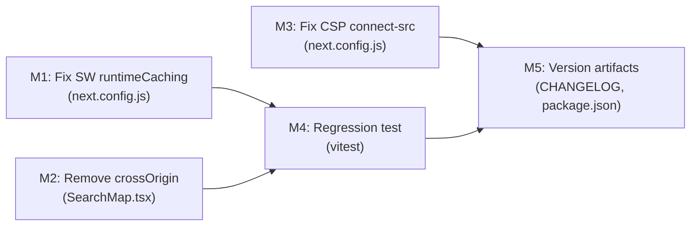

# Plan 211 — Map Tiles Not Rendering on iPhone (Plan 208 Regression Fix)

## Changelog

| Date              | Agent   | Change                                                           |
| ----------------- | ------- | ---------------------------------------------------------------- |
| 2026-08-16T00:30Z | planner | Plan created from analysis 211; root cause confirmed             |
| 2026-08-16T01:20Z | implementer | Status → In Progress; implementation started                 |
| 2026-08-16T02:10Z | code-reviewer | Status → Code Review Approved; review verdict APPROVED     |
| 2026-08-16T03:00Z | devops        | Status → Committed for Release v0.15.13; Stage 1 local commit |

---

## Plan Header

| Field          | Value                                                                                          |
| -------------- | ---------------------------------------------------------------------------------------------- |
| Plan ID        | 211                                                                                            |
| Target Release | next available patch after current `origin/main` version (0.15.12); confirm at DevOps Stage 1 |
| Epic Alignment | Mobile Map — Plan 208 regression fix                                                           |
| Related Issues | https://github.com/abu-lina/uflow/issues/313                                                  |
| Classification | Bugfix                                                                                         |
| Pipeline       | Abbreviated (Analysis → Plan → Implement → Code Review → QA → DevOps)                         |
| GitHub Issue   | https://github.com/abu-lina/uflow/issues/313                                                  |
| Created        | 2026-08-16T00:30Z                                                                              |

---

## Release Strategy

**Standalone** — no other open plans in `agent-output/planning/` target v0.15.13. All other active plans target v0.14.x or earlier minor versions. This hotfix ships independently.

---

## Value Statement and Business Objective

As a UFlow user on iPhone, I want the search map to display streets and buildings when I zoom in, so that I can navigate to food providers using the visual map context I expect from a map feature.

The current regression (Plan 208) ships a fully functional pin-rendering map on desktop and Android but a blank grey map on iOS Safari — making the map view effectively unusable for iPhone users, who represent the primary mobile segment for UFlow in Germany.

---

## Objective

Fix map tile rendering on iPhone/iOS Safari by:

1. Preventing the PWA Service Worker from intercepting OSM tile requests  
2. Removing the unnecessary `crossOrigin: 'anonymous'` attribute from the tile layer  
3. Correcting the CSP `connect-src` domain (defense-in-depth)

No library change, no Supabase change, no routing change. The fix is isolated to two files: `next.config.js` (SW cache config + CSP) and `SearchMap.tsx` (tile layer options).

---

## Root Cause (from Analysis 211)

**Primary (L2 Observed)**: The PWA `runtimeCaching` regex `^https:\/\/.*\.(?:png|jpg|jpeg|svg|gif)$` matches all OSM tile URLs (`https://tile.openstreetmap.de/{z}/{x}/{y}.png`). The SW intercepts every tile fetch and handles it via CacheFirst with a 100-entry limit. On iOS Safari, concurrent cache evictions during rapid tile loading cause the CacheFirst handler to fail silently, returning no response to the `` element — the tile stays grey.

**Contributing (L1 Proven)**: `crossOrigin: 'anonymous'` upgrades tile loads from simple `no-cors` image requests to CORS-mode fetches. This is only needed for canvas readback (`toDataURL`, `getImageData`), which does not exist in this codebase. The CORS mode amplifies the SW interaction failure on WebKit.

**Prior art**: Same bug class as Plan 046 (Iconify CDN intercepted by SW). The fix follows the same principle documented in `next.config.js` comments: "Without a registered route, Workbox does NOT intercept these requests at all."

**Analysis artifact**: `agent-output/analysis/211-map-tiles-iphone-analysis.md`

---

## Assumptions

1. The tile server (`tile.openstreetmap.de`) is functional — **confirmed by POC**: HTTP 200 at zoom 14–20, CORS headers present, iOS Safari UA accepted.
2. No canvas readback from the map exists — **confirmed by grep**: zero matches for `toDataURL`, `getImageData`, `html2canvas`, `leaflet-image` in `src/`.
3. Dependencies are not installed in this worktree (npm ls returns empty). Type-check and lint are run via CI or a fully hydrated checkout.
4. CSS filter (`grayscale + brightness + contrast` on `.leaflet-tile-pane`) may cause a secondary visual issue on iOS; QA will test with filter intact after primary fix. If still broken, filter removal is in scope.

---

## Decision Record

| # | Decision | Status | Rationale |
|---|----------|--------|-----------|
| D1 | Narrow SW `.png` pattern rather than adding per-domain exclusion route | [RESOLVED] | Narrowing the Supabase-scoped regex is the correct fix — it eliminates the root cause rather than adding a per-domain workaround. A per-domain route (Option B from analysis R1) would need updating every time a new tile server is used. |
| D2 | Remove `crossOrigin: 'anonymous'` entirely | [RESOLVED] | No canvas readback exists; the attribute has no benefit and adds CORS complexity. Removing it eliminates one of the two contributing factors independently. |
| D3 | Replace `tile.openstreetmap.org` with `tile.openstreetmap.de` in CSP connect-src | [RESOLVED] | The app uses `.de`, not `.org`. This is a correctness fix and defense-in-depth. Low risk, zero functional change today. |
| D4 | Keep CSS grayscale filter — test on device before deciding | [RESOLVED] | Filter is a design decision from Plan 208. Remove only if on-device QA shows it causes a separate rendering failure after the primary fix is applied. |
| D5 | No library upgrade (react-leaflet, leaflet) | [RESOLVED] | Library versions are current; the bug is in configuration, not library code. An upgrade would add risk without addressing the root cause. |
| D6 | On-device iPhone UAT is mandatory — not waivable | [RESOLVED] | Plan 208 UAT failure was caused by document-only sign-off. This plan requires verified on-device testing before QA PASS. |
| D7 | Regression test must demonstrate pre-fix failure, post-fix pass | [RESOLVED] | Following the Client-State Precedence Regression Pattern from copilot-instructions: make the bug visible in test naming (pre-fix FAILS / post-fix PASSES). |

---

## Milestone Dependencies



**Sequencing rule**: M1, M2, M3 are independent and can be committed together. M4 must cover M1 + M2 changes. M5 closes the plan.

---

## Plan Milestones

### M1 — Narrow SW runtimeCaching Pattern (`next.config.js`)

**Objective**: Prevent the CacheFirst SW route from intercepting OSM tile URLs.

**What to change**: In `next.config.js` inside `workboxOptions.runtimeCaching`, replace the broad cross-origin image pattern:

```
current:  /^https:\/\/.*\.(?:png|jpg|jpeg|svg|gif)$/
replace:  /^https:\/\/[^/]*\.supabase\.co\/.*\.(?:png|jpg|jpeg|svg|gif)(\?.*)?$/
```

The replacement scope-limits the pattern to Supabase storage hostnames only (the original design intent). Tile URLs (`tile.openstreetmap.de`) no longer match; the SW passes them through to the browser natively.

**Files**: `next.config.js` — one line change in `runtimeCaching[0].urlPattern`.

**Acceptance criteria**:
- New regex does NOT match `https://tile.openstreetmap.de/14/8529/5509.png` (verify by inspection)
- New regex DOES match `https://abc.supabase.co/storage/v1/object/public/photo.png` (verify by inspection)
- `npm run type-check` exits 0
- `npm run lint` 0 new errors

---

### M2 — Remove `crossOrigin` from TileLayer (`SearchMap.tsx`)

**Objective**: Eliminate the unnecessary CORS mode from tile image loads.

**What to change**: In `src/features/search/components/SearchMap.tsx`, remove the `crossOrigin: 'anonymous'` option from the `L.tileLayer()` call. The options object becomes `{ attribution: '...' }` only.

**Justification**: No canvas readback exists in the codebase. The option has zero benefit and forces CORS-mode fetch on every tile image, amplifying the WebKit SW interaction failure.

**Files**: `src/features/search/components/SearchMap.tsx` — remove one property from the options object.

**Acceptance criteria**:
- `crossOrigin` property absent from `L.tileLayer()` call
- `npm run type-check` exits 0
- `npm run lint` 0 new errors

---

### M3 — Fix CSP `connect-src` Domain (`next.config.js`)

**Objective**: Correct the tile server domain in the Content Security Policy.

**What to change**: In `next.config.js` `buildCsp()`, in the `connect-src` array:
- Remove `'https://tile.openstreetmap.org'` (unused)
- Add `'https://tile.openstreetmap.de'` (actual)

**Files**: `next.config.js` — one line swap in the `connect-src` array.

**Acceptance criteria**:
- `connect-src` contains `tile.openstreetmap.de`
- `connect-src` does NOT contain `tile.openstreetmap.org` (unless it's needed for something else — Implementer to verify by grep before removing)
- `npm run type-check` exits 0

---

### M4 — Regression Test

**Objective**: Write a focused unit test that documents the pre-fix failure mechanism and verifies the post-fix behaviour.

**Test file**: Create `src/__tests__/regression/plan211-map-tiles-iphone.test.ts`

**What to test** (unit-level logic, not browser rendering):

1. **SW pattern regression**: Assert the old regex matches a tile URL (documents the bug) and the new regex does NOT (documents the fix).  
   - `[pre-fix FAILS] broad SW pattern intercepts tile.openstreetmap.de URLs`  
   - `[post-fix PASSES] Supabase-scoped SW pattern does not intercept tile.openstreetmap.de URLs`  
   - `[post-fix PASSES] Supabase-scoped SW pattern still matches Supabase storage PNG URLs`

2. **crossOrigin absence**: Assert that SearchMap's tile layer is instantiated without `crossOrigin` option by inspecting the `L.tileLayer` call signature via mock. (**ILLUSTRATIVE ONLY** — exact approach is implementer's decision; a simpler grep-based assertion may suffice at test-level.)

**Note**: On-device rendering verification (the actual visual fix) is a QA responsibility, not a unit test responsibility. The unit tests document the configuration change.

**Acceptance criteria**:
- All tests in the new file pass
- Pre-fix test named `[pre-fix FAILS]` fails when the old regex is used (demonstrates regression)
- Post-fix tests named `[post-fix PASSES]` pass with the new configuration
- `npx vitest run src/__tests__/regression/plan211-map-tiles-iphone.test.ts` exits 0

---

### M5 — Version Artifacts

**Objective**: Record the fix in CHANGELOG and bump version to the next available patch.

**What to change**:
- `CHANGELOG.md` — add entry under the new version: "Fix: Map tiles not rendering on iPhone (Plan 211). Narrowed SW runtimeCaching image pattern to Supabase storage only; removed unnecessary crossOrigin from tile layer; corrected CSP connect-src to tile.openstreetmap.de."
- `package.json` — bump version from 0.15.12 → 0.15.13 (confirm no tag collision at DevOps Stage 1)

**Acceptance criteria**:
- CHANGELOG has an entry for the new version
- `package.json` version is incremented by one patch
- Version matches the git tag created at DevOps Stage 2

---

## Out of Scope

- Changes to react-leaflet or leaflet library versions
- Changes to OSM tile server or tile URL structure
- CSS filter removal (handled only if QA finds a secondary issue on device after M1+M2)
- New map features or UX changes
- Audit of other cross-origin resources potentially caught by the old SW pattern (W3 from analysis — deferred to a future plan)

---

## Testing Strategy

**Unit tests** (M4): SW regex behaviour, presence/absence of `crossOrigin` in tile layer config. These cover the configuration change with full precision.

**On-device QA** (mandatory): On an actual iPhone with Safari, verify:
1. Initial map load — tiles visible at default zoom (Germany overview)
2. Zoom in to zoom 17–19 — tiles remain visible (streets, buildings)
3. Pan rapidly — tiles load during pan without going grey
4. Near-me toggle — geolocation + tiles at zoom 14
5. Pin tap → provider detail navigation still works
6. Hard refresh (close + reopen Safari tab) — tiles load fresh from server, not SW cache

**UAT sign-off**: Must be on-device. Document-only UAT is not acceptable for this plan (W2 from analysis).

---

## Baseline & Measurements

No performance targets apply. The fix is a rendering correctness regression. Success threshold:
- **100% of tiles visible** on iPhone Safari after fix (zero grey fill)
- Measurement: visual inspection on device during QA

Baseline: Current state = 100% grey fill on iPhone, 0% tiles visible when zoomed in.

---

## Risks

| Risk | Likelihood | Mitigation |
|------|-----------|------------|
| Supabase-scoped SW regex too narrow (misses edge case) | Low | Regex verified against both match and non-match cases in unit test. QA tests provider images (Supabase) still load. |
| CSS filter causes secondary iOS rendering issue after primary fix | Medium | QA explicitly tests with filter intact. Analysis F6 notes this as L3 Inferred — may or may not manifest. |
| SW cache stale from previous deployment | Medium | UAT tester must clear Safari cache / service worker on device before testing. DevOps to note in deployment instructions. |
| tile.openstreetmap.de has usage policy against production apps | Low | Policy page reviewed; server is public OSM tile server. Attribution present in code. No API key required. |

---

## Duration Estimates

| Phase       | Estimate    | Uncertainty Driver                                             |
| ----------- | ----------- | -------------------------------------------------------------- |
| Analysis    | Complete    | Done — `agent-output/analysis/211-map-tiles-iphone-analysis.md` |
| Planning    | Complete    | This document                                                  |
| Critique    | ~15–30 min  | Low risk; 3-file change                                        |
| Implementation | ~30–45 min | 3-file change + 1 test file; very focused scope             |
| Code Review | ~20–30 min  | Low complexity                                                 |
| QA          | ~30–60 min  | On-device iPhone required — main uncertainty driver            |
| UAT         | ~20–30 min  | On-device; 5 scenarios                                         |
| DevOps      | ~20–30 min  | Patch version bump, CHANGELOG, deploy to UAT                   |
| **Total**   | **~3–4 hrs** | Main uncertainty: device availability for on-device QA         |

---

## Validation (Pre-Handoff Checklist)

- [x] Root cause identified in analysis (L2 Observed; L1 requires on-device)
- [x] All 7 decisions marked RESOLVED — no OPEN items
- [x] Milestone dependency graph present
- [x] Baseline & Measurements section present
- [x] Duration Estimates section present
- [x] Decision Record complete (no OPEN decisions)
- [x] Release bundling check: Standalone — no other plans target v0.15.13
- [x] Version pre-flight: latest tag v0.15.12, `origin/main` = 0.15.12 → target v0.15.13
- [x] GitHub issue duplicate check: no existing [Plan 211] issues
- [x] Worker session: no .next-id modification; ID 211 inherited from analysis

---

## Handoff Notes

**For Implementer (after Critic approval)**:
- This is a 3-file change + 1 new test file. Total diff should be under 20 lines of production code.
- Commit M1 + M2 + M3 together in a single focused commit; M4 and M5 can be a second commit.
- Before removing `tile.openstreetmap.org` from CSP, grep `src/` to confirm nothing else references that domain.
- Pre-QA gates: `npm run type-check` (0 errors), `npm run lint` (0 new errors), `npx vitest run src/__tests__/regression/plan211-map-tiles-iphone.test.ts` (all pass).

**For QA**:
- On-device iPhone is required. Browser DevTools simulation is not sufficient.
- Clear Safari cache and SW registration before testing.
- Test scenarios in Testing Strategy section above.
- If tiles still grey after fix: test with CSS filter removed (override in browser DevTools) to isolate F6.

**For DevOps**:
- Instruct UAT deployer to hard-refresh service worker on UAT environment after deploy (visit UAT in incognito + force SW update).

**Rollback**: `git revert` the fix commit. No DB changes, no migrations, no Supabase changes.
