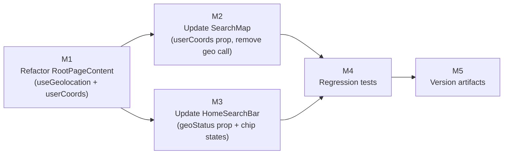

# Plan 212 — Near Me Map Viewport Fix (iPhone SE PWA)

## Plan Header

| Field          | Value                                                                              |
| -------------- | ---------------------------------------------------------------------------------- |
| Plan ID        | 212                                                                                |
| Target Release | next available patch after v0.15.13 on origin/main; confirm at DevOps Stage 1     |
| Epic Alignment | Mobile UX — Near Me discovery (Plan 196 follow-on)                                |
| Related Issues | None (GitHub issue created post-plan — see below)                                 |
| Classification | Bugfix                                                                             |
| Pipeline       | Abbreviated (Analyst → Planner → Critic → Implementer → Code Reviewer → QA → DevOps) |
| GitHub Issue   | https://github.com/abu-lina/uflow/issues/316                                       |
| Created        | 2026-08-16T00:30Z                                                                  |

## Changelog

| Date (UTC)        | Agent   | Change                                       |
| ----------------- | ------- | -------------------------------------------- |
| 2026-08-16T00:30Z | planner | Plan created from analysis 212 (L1 root cause confirmed) |
| 2026-08-16T11:54Z | planner | Revision per critique 212: toggle-off (M1+M3), userCoords optional (M2), animate-pulse spec (M3), Test 5 (M4) |
| 2026-08-16T12:15Z | implementer | Implementation started; executing TDD gate for M1-M4 |
| 2026-08-16T14:20Z | code-reviewer | Re-review approved with comments; resolved prior HIGH/MEDIUM findings |
| 2026-08-16T14:30Z | qa | QA Complete: 20/20 Plan 212 tests + 1883/1883 full suite pass. Deferred: on-device iPhone SE validation (UAT 2026-08-17 EOD) |
| 2026-08-16T14:35Z | uat | UAT Complete: value statement delivery confirmed by code + test evidence. Release approved pending DF-3 (on-device validation, UAT owner, 2026-08-17 EOD) |

---

## Value Statement and Business Objective

> As a mobile user on iPhone SE running UFlow as a PWA, I want the map to
> pan and zoom to my actual location when I tap "Near Me", so that I can
> immediately see halal restaurants and services within walking or driving
> distance — without manually zooming in from the Germany centroid.

**Current behaviour**: Chip turns active (green), map stays at Germany centroid
zoom 6. User has no feedback that something went wrong and no obvious recovery
path.

**Target behaviour**: Chip turns active, map pans/zooms to the user's location
(zoom 14, ≈ 1 km radius visible) within 10 seconds. If location cannot be
obtained within 10 seconds the chip reverts to inactive and a brief denied/
unavailable message is surfaced.

---

## Background

Analysis 212 (`agent-output/analysis/212-near-me-pwa-analysis.md`) identified
two structural defects in the home-page Near Me flow (Path A):

1. **F1** [L1 Proven] — `SearchMap.useEffect([isNearMe])` calls
   `navigator.geolocation.getCurrentPosition()` with **no `PositionOptions`**
   argument. Default `timeout = Infinity`. On iOS WKWebView, indoor GPS
   acquisition can take 10–60 s; the callback silently never fires.

2. **F2** [L1 Proven] — `HomeSearchBar` fires `onNearMeChange(true)` on chip
   click with no geolocation guard. The chip activates synchronously before
   any location data is available, producing the decoupled visual state.

**Not a Plan 211 regression.** L1 confirmed — Plan 211 touched only SW tile
caching, `crossOrigin`, and CSP. The viewport bug pre-dates Plan 211 and was
masked because tiles were grey.

---

## Decision Record

| # | Decision | Status |
|---|----------|--------|
| D1 | **Fix scope: eliminate duplicate geolocation call in `SearchMap`, lift to `RootPageContent` via `useGeolocation` hook** | [RESOLVED] Minimum fix (add options only) leaves F2 (chip-before-location de-sync) unaddressed. Full fix eliminates DRY violation, aligns Path A with Path B's pattern, and gives users proper loading/denied feedback. Scope is still ≤4 files, ≤1 day. |
| D2 | **Pass `userCoords: { lat, lon } \| null` prop to `SearchMap` instead of `isNearMe` boolean** | [RESOLVED] Removes geolocation logic from `SearchMap` entirely. `SearchMap` becomes a pure display component: "if `userCoords` is non-null, pan there." Simpler to test. `isNearMe` prop removed from `SearchMapProps`. |
| D3 | **`HomeSearchBar` chip reflects geolocation lifecycle state** | [RESOLVED] Pass `geoStatus: GeolocationStatus` as a prop to `HomeSearchBar`. Chip shows loading spinner while `prompting`, shows denied state on `denied`/`timeout`, shows active when `granted`. Requires no routing or URL-param changes. |
| D4 | **`useGeolocation` options: `timeout: 10000`, `maximumAge: 5 * 60 * 1000`, `enableHighAccuracy: false`** | [RESOLVED] Matches existing `useGeolocation.ts` contract — no new values. If the 10 s timeout proves too short on iPhone SE, QA flags this for a follow-up increase (same contact point as Plan 211's on-device gate). |
| D5 | **`/search` page `SearchMap` out of scope** | [RESOLVED] The `/search` page's `SearchMap` has no near-me toggle — no near-me pan is expected there. Gap noted in analysis (Open Question 1); no action in this plan. |
| D6 | **`useNearMeToggle` stale-deps lint issue out of scope** | [RESOLVED] F5 from analysis — affects Path B (`/providers`) only, and Path B doesn't use `SearchMap`. Defer to a dedicated cleanup plan. Owner: engineering backlog. Target: unspecified. |
| D7 | **Target release: next patch after v0.15.13** | [RESOLVED] Latest git tag is `v0.15.13` (origin/main also `0.15.13`). Next available patch is `v0.15.14`. Exact version confirmed at DevOps Stage 1. |

---

## Assumptions

1. `useGeolocation` hook is already tested and stable — no changes needed to it.
2. `HomeSearchBar` is used only in `RootPageContent.tsx` (grep confirms single consumer). Changing its props does not affect other call sites.
3. The iOS Safari PWA geolocation permission state is "not determined" (first visit) or "granted" on the test device. Plan does not address "permanently denied" — that state is already handled by the `denied` status path in `useGeolocation`.
4. Node modules are not present in this worktree; test run evidence will be provided by Implementer using the canonical checkout or after `npm install`.

---

## Milestone Dependencies

**Sequencing rule**: M1 establishes the new data flow; M2 and M3 are
independent consumers of it and can proceed in parallel after M1. M4 requires
M2 and M3 to have their contracts finalized before asserting behaviour.

---

## Milestones

### M1 — Refactor `RootPageContent` to own geolocation via `useGeolocation` hook

**Objective**: Replace the plain `useState(false)` `isNearMe` with a
`useGeolocation`-backed flow. When the chip is tapped, call
`geolocation.requestLocation()`. Pass `userCoords` (non-null only when
`geolocation.status === 'granted'`) and `geoStatus` as derived values down to
child components.

**Files**: `src/components/shared/RootPageContent.tsx`

**Acceptance criteria**:
- `isNearMe` boolean state replaced by `geoStatus` and derived `userCoords`
- Tapping "Near Me" when `geoStatus === 'idle'` calls `geolocation.requestLocation()`
  rather than immediately setting a boolean
- `userCoords` is `null` while `geoStatus` is `idle` / `prompting` / `denied`
  / `timeout`; non-null only when `geoStatus === 'granted'`
- Tapping "Near Me" when `geoStatus === 'granted'` calls `geolocation.reset()`
  — `status` → `idle`, `coords` → null, `userCoords` → null, chip returns to
  neutral. Map retains its current position; it does NOT fly back to the
  Germany centroid on deactivation.
- Existing `isOpenNow` state and `onOpenNowChange` flow untouched
- No search-params, routing, or API call changes

---

### M2 — Update `SearchMap` — accept `userCoords` prop, remove internal geolocation call

**Objective**: `SearchMap` becomes a pure display component. It receives
`userCoords: { lat: number; lon: number } | null` instead of `isNearMe:
boolean`. When `userCoords` becomes non-null, call `mapRef.current?.setView()`.
Remove the `navigator.geolocation.getCurrentPosition()` call entirely.

**Files**: `src/features/search/components/SearchMap.tsx`

**Acceptance criteria**:
- `SearchMapProps.isNearMe` prop removed; replaced with
  `userCoords?: { lat: number; lon: number } | null` (optional, default `null`)
- `useEffect([userCoords])` calls `mapRef.current?.setView([lat, lon], 14)`
  when `userCoords` is non-null
- No `navigator.geolocation` call exists anywhere in `SearchMap.tsx`
- `sessionStorage` save/restore of map view and pin rendering remain unchanged
- `/search/page.tsx` usage (`<SearchMap pins={mapPins} />`) continues to
  compile without change (no `userCoords` prop needed — defaults to `null`)
- `RootPageContent.tsx` usage updated to pass `userCoords={userCoords}`

---

### M3 — Update `HomeSearchBar` to reflect geolocation lifecycle

**Objective**: The chip must show a loading state while `geoStatus ===
'prompting'` and a denied state when `geoStatus === 'denied' | 'timeout'`.
The chip should not appear "active/green" until `geoStatus === 'granted'`.

**Files**: `src/features/search/components/HomeSearchBar.tsx`

**Acceptance criteria**:
- `HomeSearchBarProps` gains `geoStatus?: GeolocationStatus` (optional,
  defaults to `'idle'` for backward compatibility)
- Near Me chip visual states:
  - `idle` → neutral/inactive (current default appearance)
  - `prompting` → neutral with `animate-pulse` opacity on the chip text/icon
    via Tailwind (no new component, no new animation dependency)
  - `granted` → active/green (current "on" appearance) — only this state
    shows green
  - `denied` / `timeout` → neutral with brief inline text indicating
    unavailability (`suchen.nearMe.permissionDenied` i18n key already exists
    in all 6 locales)
  - `unavailable` → same as `denied`
- Tapping Near Me when `geoStatus === 'granted'` calls `geolocation.reset()`
  via `onNearMeChange` path in `RootPageContent`, returning chip to `idle`
  state (neutral, no pulse, no green)
- `onNearMeChange` callback retained for backward compat; `onClick` behaviour
  remains the same for the user (tap = request location OR deactivate),
  chip visual state is now driven by `geoStatus` rather than the boolean alone
- `onOpenNowChange` and Open Now chip: **no change**
- `RootPageContent.tsx` updated to pass `geoStatus={geolocation.status}`

---

### M4 — Regression tests

**Objective**: Two test gaps from analysis F4 and F6 must be closed.

**Files**:
- `src/features/search/components/SearchMap.test.tsx` — extend existing suite
- `src/__tests__/regression/plan212-near-me-viewport.test.ts` — new regression
  guard

**Acceptance criteria**:

Test 1 — `[pre-fix FAILS / post-fix PASSES] SearchMap pans to userCoords when
provided`:
- Render `<SearchMap pins={[]} userCoords={{ lat: 52.52, lon: 13.405 }} />`
- Assert Leaflet mock's `mapInstance.setView` was called with `[52.52, 13.405]`
  and zoom `14`

Test 2 — `[pre-fix FAILS / post-fix PASSES] SearchMap does not call
getCurrentPosition internally`:
- Import `SearchMap.tsx` source as text (as Plan 211 regression tests do)
- Assert `searchMap` source does NOT contain `getCurrentPosition`

Test 3 — `HomeSearchBar chip is not green/active while geoStatus=prompting`:
- Render `<HomeSearchBar geoStatus="prompting" .../>` and assert chip does NOT
  have the active/green class

Test 4 — `HomeSearchBar chip is green/active only when geoStatus=granted`:
- Render with `geoStatus="granted"` and assert chip HAS the active class
- Render with `geoStatus="idle"`, `"denied"`, `"timeout"` and assert chip
  does NOT have the active class

Test 5 — `[pre-fix FAILS / post-fix PASSES] RootPageContent Near Me chip tap
calls requestLocation, not setIsNearMe`:
- Render a shallow wrapper of `RootPageContent` with a mocked `useGeolocation`
  (following the `useNearMeToggle.test.tsx` pattern: mock `navigator.geolocation`,
  `renderHook` or render + `act(() => fireEvent.click(nearMeChip))`)
- Assert `requestLocation` was called once on chip tap when `geoStatus === 'idle'`
- Assert `reset` was called once on chip tap when `geoStatus === 'granted'`
- Assert `requestLocation` was NOT called a second time on the deactivation tap

All 5 tests must pass under `vitest run`.

---

### M5 — Version artifacts

**Objective**: Version files and CHANGELOG reflect this patch release.

**Files**: `CHANGELOG.md`, `package.json`, `package-lock.json`

**Acceptance criteria**:
- `package.json` version bumped to `0.15.14` (confirm exact version at
  DevOps Stage 1 — next available patch after `0.15.13`)
- `CHANGELOG.md` has a `0.15.14` entry describing the Near Me viewport fix
- `package-lock.json` version field aligned (no full reinstall required —
  version field update only)

---

## Testing Strategy

This is a client-side React/hook bugfix with two testable dimensions:

1. **Unit** — `SearchMap.test.tsx` extended with prop-driven `setView` assertion.
   Existing Leaflet mock infrastructure is sufficient (no new mocks needed).

2. **Regression guard** — `plan212-near-me-viewport.test.ts` (source-text
   assertions, same pattern as `plan211-map-tiles-iphone.test.ts`) guards
   against reintroducing `getCurrentPosition` inside `SearchMap`.

3. **Hook tests** — `useGeolocation.test.ts` already covers the
   `requestLocation()` → `granted` flow. No new hook tests required unless
   the Implementer introduces new state branches.

4. **`HomeSearchBar` chip state** — new `geoStatus` prop tests (M4 Test 3/4).
   Existing `NearMeOpenNowFilters.test.tsx` pattern provides the reference.

**On-device QA gate** (mandatory, same as Plan 211):
- iPhone SE (or SE-equivalent small screen) in Safari PWA standalone mode
- UAT environment: https://uat.ummahflow.com
- Verify: tap "Near Me" → map pans to actual device location within 10 s
- Verify: chip shows loading while GPS acquires; shows green when acquired
- Verify: if permission denied, chip returns to neutral with denied indicator

QA should also verify Plan 211 regression did not re-appear (grey tiles).

---

## Baseline & Measurements

| Metric | Baseline | Target | Measurement |
|--------|----------|--------|-------------|
| Time to viewport pan (iPhone SE, indoor, PWA) | Never (callback never fires) | ≤ 10 s from chip tap to map pan | On-device QA stopwatch |
| Chip visual state accuracy | Chip shows green before location obtained (incorrect) | Chip shows green only after `status=granted` | Visual inspection + unit test assertion |

**Allowed deferral**: On-device timing measurement is blocked until QA deploys
to UAT. Defer to QA phase.

---

## Risks

| Risk | Likelihood | Impact | Mitigation |
|------|-----------|--------|------------|
| iOS GPS first-fix >10 s (timeout fires before location) | Medium | Medium — chip reverts to neutral, user must retry | QA to validate; if reproduced consistently, increase timeout to 20 s in a follow-up micro-fix |
| `HomeSearchBar` prop change breaks an undiscovered consumer | Low | Low — single consumer confirmed by grep | Implementer to run `grep -r "HomeSearchBar" src/` before commit |
| Removing `isNearMe` from `SearchMapProps` breaks type at `/search/page.tsx` | Low | Low — `/search/page.tsx` never passed `isNearMe` | TypeScript compile confirms; accounted for in M2 acceptance criteria |
| Session memory (iOS `sessionStorage`) persists previous non-near-me position | Low | Low — user gets their last manual position until they tap Near Me | No change to session-storage logic needed; acceptable UX |

---

## Duration Estimates

| Phase | Estimate | Uncertainty drivers |
|-------|----------|---------------------|
| Analysis | Complete (this plan) | — |
| Planning | Complete (this plan) | — |
| Implementation | 0.5–1 day | Simple prop-threading refactor; no DB, no API changes |
| Code Review | 0.5 day | Straightforward; main review surface is chip state machine |
| QA | 0.5–1 day | Blocked by UAT deploy; on-device iPhone SE required |
| DevOps | 0.5 day | Standard patch pipeline (Plan 211 as reference) |
| **Total** | **2–3.5 days** | Dominated by QA scheduling and on-device access |

---

## Release Strategy

**Standalone** — no other known open plans targeting `v0.15.14` at time of
writing. This plan ships independently as a patch.

If another plan is merged to `origin/main` before this one reaches DevOps
Stage 1, the Implementer must rebase and confirm the version number.

---

## Handoff Notes

- **Analysis artifact**: `agent-output/analysis/212-near-me-pwa-analysis.md`
- **Regression test pattern**: Follow `src/__tests__/regression/plan211-map-tiles-iphone.test.ts`
  (source-as-text assertions) for the `getCurrentPosition` guard test.
- **Chip state i18n key**: `suchen.nearMe.permissionDenied` already exists in
  all 6 locales — no new translation keys needed for the denied state.
- **Plan 211 on-device gate deferred**: QA should revalidate tiles render
  (Plan 211) alongside the near-me viewport (this plan) in the same UAT session.
- **`useNearMeToggle` stale-deps** (F5 from analysis): Deferred, not in scope.
  Engineering backlog, no owner yet.

## Rollback

No DB migrations, no API changes, no feature flags. Rollback = revert the
branch. Previous behaviour (grey chip, no pan) is restored immediately.
